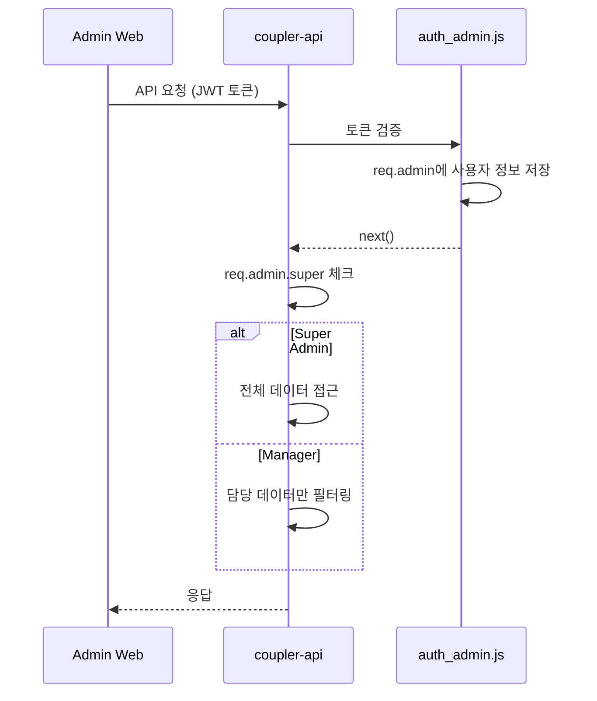

# 관리자 권한 시스템

관리자 권한 레벨 및 접근 제어 아키텍처를 정리한 문서이다.

## 권한 레벨

| 레벨 | super 값 | 명칭 | 설명 |
|------|----------|------|------|
| Super Admin | > 0 | 슈퍼 어드민 | 모든 기능 접근 가능 |
| Manager | = 0 | 일반 매니저/파트너 | 제한된 기능만 접근 |

## 권한별 기능 비교

| 기능 | Super Admin | Manager |
|------|-------------|---------|
| 전체 회원 조회 | O | X (담당분만) |
| 매니저 관리 | O | X |
| 설정 관리 | O | X |
| 통계 조회 | O | X |
| 미팅/라운지 관리 | O | X |
| 회원 삭제 | O | X |
| 무료키 지급 | O | 담당자만 |
| 심사 처리 | O | 담당자만 |

## Super Admin 전용 메뉴

```
├── 회원관리
│   └── 심사거절 (manager: true)
├── 미팅관리 (전체, manager: true)
│   ├── 미팅 리스트
│   ├── 미팅 채팅
│   ├── 미팅 후기
│   └── 미팅 신고/벌점
├── 라운지관리 (전체, manager: true)
│   ├── 라운지 리스트
│   ├── 라운지 댓글
│   └── 라운지 신고/벌점
├── 통계 (전체, manager: true)
│   ├── 로그인 통계
│   ├── 가입 통계
│   └── 시간대별 통계
├── 설정 (전체, manager: true)
│   ├── 앱 버전 관리
│   ├── 설정값 관리
│   ├── 약관 관리
│   └── 공지사항
└── 매니저관리 (전체, manager: true)
    ├── 매니저 추가
    ├── 매니저 편집
    └── 매니저 삭제
```

## 권한 검증 흐름



## 데이터 필터링

### API 서버 (coupler-api)

```javascript
// Super Admin: 0 (필터 없음)
// Manager: req.admin.id (자신의 담당분만)
const manager_id = req.admin.super < 1 ? req.admin.id : 0;

// 쿼리에 적용
WHERE manager_id = ${manager_id} OR ${manager_id} = 0
```

### 웹 프론트엔드 (coupler-admin-web)

```javascript
// store.js
get isSuper() {
  return rootStore.getMe?.super > 0;
}

// page-route.jsx
const getFilteredRouteList = (isSuper) => {
  routes.filter(route => {
    if (!isSuper && route.manager) return false;
    return true;
  });
};
```

## 권한 검증 코드

### Super Admin 전용 작업

```javascript
// controller/admin/manager.js
if (req.admin.super < 1) {
  return common.response_error(res, res.__('forbidden'));
}
```

### Super Admin + 담당자

```javascript
// controller/admin/member.js
if (req.admin.super < 1 && isChargeManager < 1) {
  return common.response_error(res, res.__('forbidden'));
}
```

## JWT 토큰 구조

```javascript
// controller/admin/auth.js
const payload = {
  id: user.id,           // 관리자 ID
  user_id: user.user_id, // 로그인 ID
  user_name: user.nickname,
  super: user.super,     // 권한 레벨
};
```

## 근거 (코드 기준)

- 토큰 생성: `coupler-api/controller/admin/auth.js`
- 토큰 검증: `coupler-api/middleware/auth_admin.js`
- 권한 체크: `coupler-api/controller/admin/manager.js`
- 데이터 필터: `coupler-api/controller/admin/member.js`
- 프론트 권한: `coupler-admin-web/src/mobx/store.js`
- 메뉴 필터: `coupler-admin-web/src/config/page-route.jsx`
