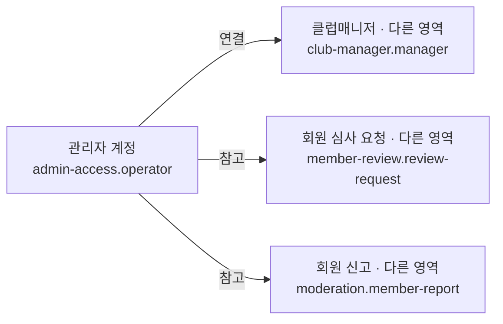
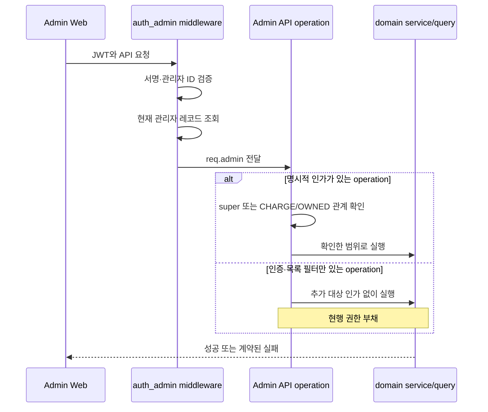

# 관리자 권한 시스템

## 문서 역할

- 역할: `설명`
- 문서 종류: `architecture`
- 충돌 시 우선 문서: [보안/접근통제 정책](../policy/security-access-control-policy.md)
- 기준 성격: `as-is`

## 목적

- 관리자 계정, 역할 표시, Admin route 필터와 API 인가가 현재 어떤 경계로 연결되는지 설명한다.
- 역할별 허용 기능과 데이터 범위의 규범은 [보안/접근통제 정책](../policy/security-access-control-policy.md)을
  단일 기준으로 사용한다.

## 범위

- 관리자 인증 식별자와 역할 값
- 관리자 계정과 클럽매니저 계정의 연결
- Admin Web의 표시 제어와 API 서버 인가 경계
- 기능군별 권한 매트릭스와 세부 도메인 행위 규칙은 이 문서에서 정의하지 않는다.

## 상위 규범 문서

- 역할, 데이터 범위, 기능군별 최대 권한: [보안/접근통제 정책](../policy/security-access-control-policy.md)
- 회원 심사 상태와 행위: [회원 심사 단일 정책](../policy/member-review-policy.md)
- 매칭 대상과 예약 소유 범위: [매칭 운영 정책](../policy/matching-ops-policy.md)
- 권한 실패 응답: [API 에러 계약 정책](../policy/api-error-contract-policy.md)

## 논리 데이터 모델

- 도메인 ID: `admin-access`

### 먼저 보는 그림

이 그림은 데이터가 어디에 속하고 무엇을 참고하는지 먼저 보여준다.
정확한 이름과 조건은 아래 상세 표를 따른다.

```mermaid
flowchart LR
    entity_admin_dash_access_dot_operator["관리자 계정<br/>admin-access.operator"]
    entity_club_dash_manager_dot_manager["클럽매니저 · 다른 영역<br/>club-manager.manager"]
    entity_member_dash_review_dot_review_dash_request["회원 심사 요청 · 다른 영역<br/>member-review.review-request"]
    entity_moderation_dot_member_dash_report["회원 신고 · 다른 영역<br/>moderation.member-report"]
    entity_admin_dash_access_dot_operator -->|"연결"| entity_club_dash_manager_dot_manager
    entity_admin_dash_access_dot_operator -->|"참고"| entity_member_dash_review_dot_review_dash_request
    entity_admin_dash_access_dot_operator -->|"참고"| entity_moderation_dot_member_dash_report
```

꼭 지킬 규칙:

- Super Admin 전용 작업은 일반 클럽매니저 권한으로 수행할 수 없다
- 일반 클럽매니저는 정책이 허용한 담당·소유 데이터 범위를 벗어날 수 없다
- 비밀번호와 토큰 원문을 로그나 공개 문서에 남기지 않는다

<!-- markdownlint-disable MD046 -->

??? info "정확한 값과 조건 보기"

    ### 논리 엔티티

    | 논리 ID | 표시명 | 생명주기 역할 | 엔티티 형태 | 기록 역할 | 책임 | 최고 데이터 분류 | 생명주기 |
    | --- | --- | --- | --- | --- | --- | --- | --- |
    | `admin-access.operator` | 관리자 계정 | root | entity | state | 관리자 인증 식별자, 역할 값과 현재 접근 상태 | 민감 | 퇴사·권한 회수 뒤 로그인은 차단하고 업무 이력의 행위자 참조는 보존 |

    ### 관계

    | 출발 논리 ID | 관계 역할 | 관계 유형 | 도착 논리 ID | 카디널리티 | 소유·삭제 규칙 |
    | --- | --- | --- | --- | --- | --- |
    | `admin-access.operator` | `manager-account` | associates | `club-manager.manager` | 1:1 | 일반 클럽매니저 역할은 유효한 클럽매니저 운영 계정 연결을 요구 |
    | `admin-access.operator` | `review-requests` | references | `member-review.review-request` | N:M | 심사 처리 권한과 담당 범위 안에서만 접근 |
    | `admin-access.operator` | `member-reports` | references | `moderation.member-report` | N:M | 신고 처리 권한과 처리 사유를 별도 감사 근거로 남김 |

    ### 불변조건

    | 규칙 ID | 관련 논리 ID | 불변조건 | 기준 문서 |
    | --- | --- | --- | --- |
    | `ADMIN-ACCESS-INV-001` | `admin-access.operator` | Super Admin 전용 작업은 일반 클럽매니저 권한으로 수행할 수 없다 | [보안/접근통제 정책](../policy/security-access-control-policy.md) |
    | `ADMIN-ACCESS-INV-002` | `admin-access.operator` | 일반 클럽매니저는 정책이 허용한 담당·소유 데이터 범위를 벗어날 수 없다 | [보안/접근통제 정책](../policy/security-access-control-policy.md) |
    | `ADMIN-ACCESS-INV-003` | `admin-access.operator` | 비밀번호와 토큰 원문을 로그나 공개 문서에 남기지 않는다 | [데이터 거버넌스 정책](../policy/data-governance-policy.md) |

<!-- markdownlint-enable MD046 -->

## 현재 역할 표현

| 현재 저장 표현 | 정책 역할 | 설명 |
| --- | --- | --- |
| `super > 0` | `SUPER_ADMIN` | Admin 기능군의 전역 범위를 사용할 수 있는 관리자 |
| `super = 0`과 유효한 매니저 연결 | `CLUB_MANAGER` | 담당·소유 범위로 제한되는 일반 클럽매니저 |
| 그 외 | 미정의 | 서버에서 거부해야 하는 상태 |

- Admin 로그인 JWT에는 현재 UI 표시를 위한 `super` 값이 포함된다.
- `coupler-api/middleware/auth_admin.ts`는 JWT의 `id`, `user_id`를 검증한 뒤 현재 관리자 레코드를 다시
  조회해 `req.admin`을 구성한다. 이 middleware는 `club-manager.manager` 연결과 기능별 권한까지 판정하지
  않는다. API 인가는 JWT에 저장된 과거 `super` 값이 아니라 현재 관리자 레코드와 필요한 도메인 관계를
  사용해야 한다.
- `coupler-admin-web/src/mobx/store.ts`의 `isSuper`는 메뉴와 버튼 표시용 값이며 서버 인가를 대체하지 않는다.

## 현재 요청 처리 흐름

```mermaid
sequenceDiagram
    participant Admin as Admin Web
    participant Auth as auth_admin middleware
    participant Operation as Admin API operation
    participant Data as domain service/query

    Admin->>Auth: JWT와 API 요청
    Auth->>Auth: 서명·관리자 ID 검증
    Auth->>Auth: 현재 관리자 레코드 조회
    Auth->>Operation: req.admin 전달
    alt 명시적 인가가 있는 operation
        Operation->>Operation: super 또는 CHARGE/OWNED 관계 확인
        Operation->>Data: 확인한 범위로 실행
    else 인증·목록 필터만 있는 operation
        Operation->>Data: 추가 대상 인가 없이 실행
        Note over Operation,Data: 현행 권한 부채
    end
    Data-->>Admin: 성공 또는 계약된 실패
```

- 현재 회원·결제·매칭 목록의 일부는 `admin.id`를 전담 배정 또는 생성 계정 필터로 전달하고, N:N 행사
  operation은 호스트 소유 관계를 확인한다.
- 공유매니저 선택 화면이 호출하는 현재 `manager/all`은 선택에 필요한 `id`, `nickname` 전용 DTO가 아니라
  관리자 전체 DTO를 사용해 `user_id`, `password`, `password_raw`, 로그인 메타데이터까지 응답한다.
- 회원 저장은 Super Admin 또는 현재 `CHARGE` 배정을, 회원 차단·삭제는 Super Admin을 확인하고 N:N 일부
  operation은 호스트 소유 관계를 확인한다. 다만 회원 저장 payload의 전담·공유 배정 행위를 분리해 제한하지
  않는 등 모든 상세·변경·삭제 operation에 같은 수준의 검사가 적용된 상태는 아니다.
- 모든 operation이 따라야 할 목표 계약은 [보안/접근통제 정책](../policy/security-access-control-policy.md)에
  두며, 현행 누락은 이 문서의 `현행 불일치 추적`에서 연결한 기술부채로 관리한다.

## Admin Web 표시 구조

- `coupler-admin-web/src/config/page-route.tsx`의 현재 `manager: true`는 일반 클럽매니저에게 숨기는 표시
  metadata다. 이름과 달리 “매니저에게 허용”을 뜻하지 않는다.
- sidebar 필터와 route redirect는 사용성 보호 수단이다. 상위 메뉴의 metadata가 하위 component route와
  직접 URL에 자동 상속된다고 가정하지 않는다.
- 기능군별 표시 기대값은 [보안/접근통제 정책](../policy/security-access-control-policy.md)의 권한 매트릭스를
  따른다. 표시와 API의 불일치는 서버 거부를 우선하고 구현 부채로 추적한다.

## 현행 불일치 추적

- Admin route metadata 상속, 서버 operation별 인가, 일반 클럽매니저의 `ASSIGNED`·`OWNED` 재검증을 포함한
  현행 불일치는 [기술 부채 정리](../technical-debt/technical-debt.md)의
  `관리자 권한 서버 인가·표시 계약 미정렬`에서 추적한다.
- 이 문서의 구현 설명을 권한 허용 근거로 사용하지 않는다. 정책과 코드가 다르면 정책을 기준으로 요청을
  차단하고 차이를 같은 부채 항목에 추가한다.

## 관련 문서

- [보안/접근통제 정책](../policy/security-access-control-policy.md)
- [클럽매니저 시스템](club-manager-system.md)
- [회원 심사 단일 정책](../policy/member-review-policy.md)
- [매칭 운영 정책](../policy/matching-ops-policy.md)
- [API 에러 계약 정책](../policy/api-error-contract-policy.md)
- [데이터 거버넌스 정책](../policy/data-governance-policy.md)
- [기술 부채 정리](../technical-debt/technical-debt.md)
