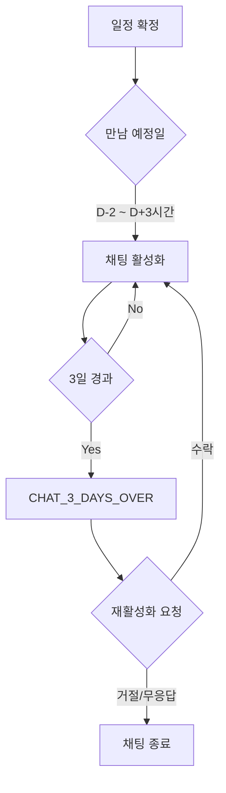

# 채팅 시스템

3종류의 채팅 시스템 아키텍처를 정리한 문서이다.

## 채팅 종류

| 종류 | 테이블 | 참여자 | 설명 |
|------|--------|--------|------|
| 큐레이터 채팅 | t_concierge | 관리자 ↔ 회원 | 1:1 고객 상담 |
| 매칭 채팅 | t_match_chat | 남성 ↔ 여성 | 1:1 매칭 채팅 |
| 미팅 채팅 | t_meeting_chat | 4명 (남2, 여2) | 2:2 그룹 채팅 |

## 메시지 타입 (MSG_TYPE)

| 값 | 상수 | 의미 |
|----|------|------|
| 0 | NORMAL | 일반 메시지 |
| 1 | SCHEDULE | 일정 변경 알림 |
| 2 | VOICE_CALL | 보이스 콜 |
| 3 | WRITE_REVIEW | 후기 작성 |
| 4 | REACTIVATE | 재활성화 요청 |
| 5 | SEND_MY_CONTRACT | 연락처 전달 |
| 6 | ACCEPT_CONTRACT | 연락처 수락 |
| 7 | DIRECT_MEET | 직진만남 신청 |
| 8 | DIRECT_ACCEPT | 직진만남 수락 |
| 9 | DIRECT_SUCCESS | 직진만남 알림 |
| 10 | CANCEL | 만남 취소 |
| 11 | CONTRACT_SENT | 연락처 전달 + 호감 |
| 12 | USER_LEAVE | 채팅방 나가기 |
| 13 | REACTIVATE_DESC | 재활성화 상세 |
| 14 | REACTIVATE_SUCCESS | 재활성화 수락 |
| 15 | CANCELED | 만남 취소 안내 |

## 큐레이터 채팅

### API

| 메서드 | 엔드포인트 | 설명 |
|--------|----------|------|
| GET | `/chat/chatList` | 통합 채팅 목록 |
| GET | `/chat/list` | 큐레이터 채팅 리스트 |
| POST | `/chat/send` | 메시지 전송 |

### 특징

- 관리자와 회원 간 1:1 채팅
- 읽음/안읽음 상태 추적
- 송신자 구분 (Y: 관리자, N: 회원)

## 매칭 채팅

### API

| 메서드 | 엔드포인트 | 설명 |
|--------|----------|------|
| POST | `/match/chat` | 3일 채팅 활성화 |
| GET | `/match/chat/detail` | 채팅방 상세 |
| GET | `/match/chat/list` | 메시지 목록 |
| POST | `/match/chat/send` | 메시지 전송 |
| POST | `/match/chat/leave` | 채팅방 나가기 |
| POST | `/match/chat/changeSchedule` | 일정 변경 |
| POST | `/match/chat/reactivate` | 재활성화 요청 |
| POST | `/match/chat/acceptReactivate` | 재활성화 수락 |
| POST | `/match/chat/blameUser` | 회원 신고 |

### 채팅 활성화 조건

### 특징

- 만남 예정 시간 기준 -48시간 ~ +3시간 활성화
- 3일간 채팅 옵션 (정규 과정 생략)
- 재활성화 최대 2회 (키 -60)
- 시스템 메시지: 일정 변경, 장소 확정, 연락처 공유

## 미팅 채팅

### API

| 메서드 | 엔드포인트 | 설명 |
|--------|----------|------|
| POST | `/meeting/createChatRoom` | 채팅방 생성 |
| GET | `/meeting/chatList` | 채팅 리스트 |
| POST | `/meeting/sendChat` | 메시지 전송 |
| POST | `/meeting/leaveChat` | 채팅방 나가기 |
| POST | `/meeting/blameUser` | 회원 신고 |

### 특징

- 4명 확정 시 자동 채팅방 개설
- 그룹 채팅 (다중 참여자)
- 멤버 입장/퇴장 시스템 메시지

## 신고 사유 (BLAME_TYPE_CHAT)

| 코드 | 사유 |
|------|------|
| 1 | 욕설/비하발언/차별성 발언 |
| 2 | 선정적인 대화유도 |
| 3 | 홍보성 컨텐츠 |
| 4 | 개인정보/사생활침해 |
| 6 | 다른 이유 |

## FCM 알림

| 타입 | 상수 | 채팅 종류 |
|------|------|----------|
| 22 | MATCH_NEW_CHAT | 매칭 채팅 |
| 37 | MEET_SEND_CHAT | 미팅 채팅 |
| 67 | CONCIERGE_CHAT | 큐레이터 채팅 |
| 70 | MATCH_CHAT_OPEN | 매칭 채팅방 오픈 |
| 48 | MATCH_REACTIVATE | 재활성화 요청 |
| 49 | MATCH_REACTIVATE_ACCEPT | 재활성화 수락 |

## 근거 (코드 기준)

- 큐레이터 채팅: `coupler-api/controller/app/v1/chat.js`
- 매칭 채팅: `coupler-api/controller/app/v1/match.js` (1200-2400)
- 미팅 채팅: `coupler-api/controller/app/v1/meeting.js` (375-974)
- 메시지 타입: `coupler-api/config/constant.js` (MSG_TYPE)
- 모델: `coupler-api/model/concierge.js`, `match_chat.js`, `meeting_chat.js`
