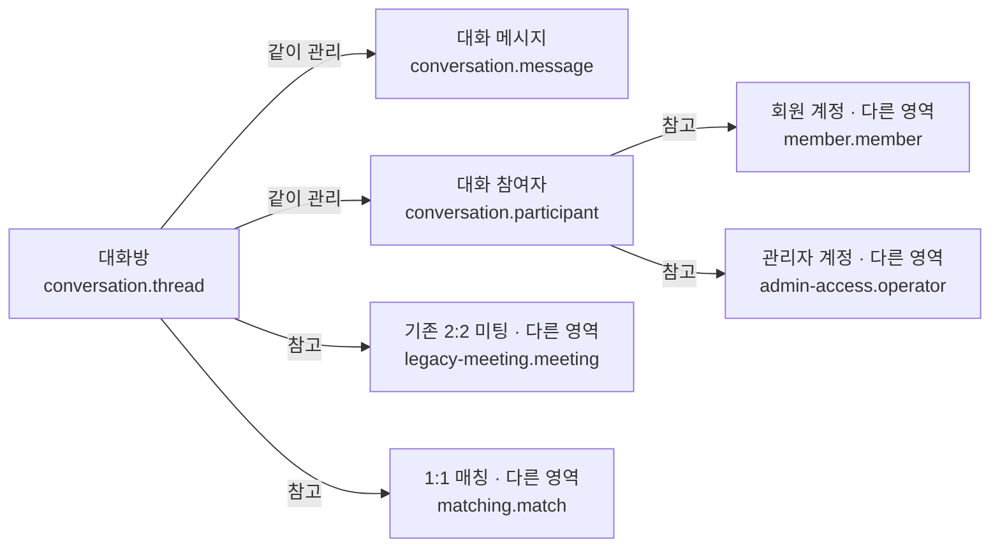
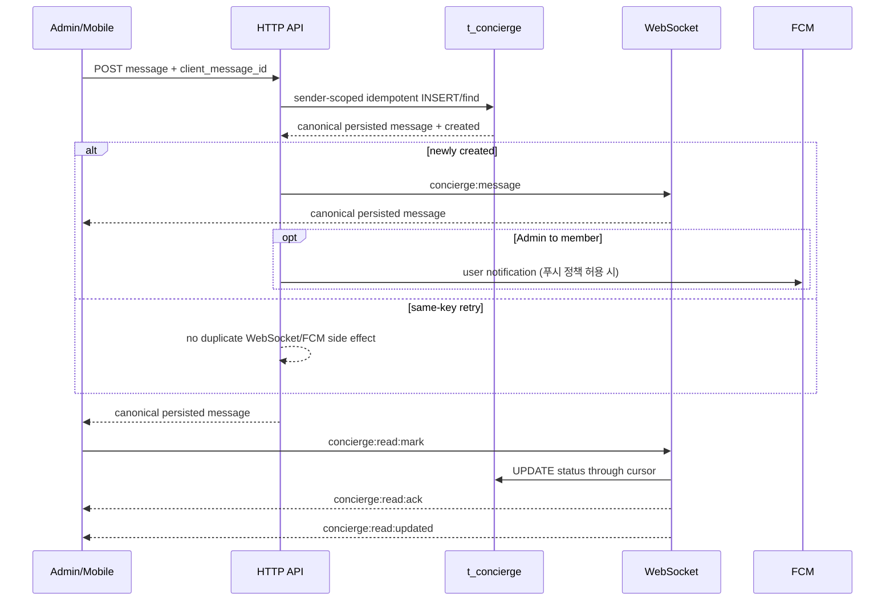
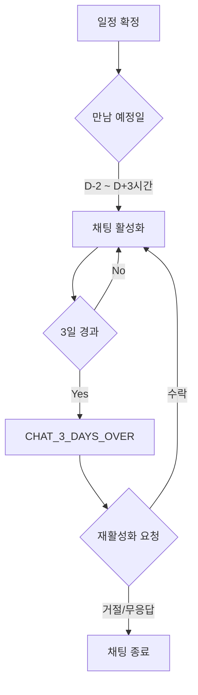

# 채팅 시스템

## 문서 역할

- 역할: `설명`
- 문서 종류: `architecture`
- 충돌 시 우선 문서: 채팅 구조/메시지 타입은 이 문서, 매칭 상태/키/일정은 [매칭 운영 정책](../policy/matching-ops-policy.md)
- 기준 성격: `as-is`

3종류의 채팅 시스템 아키텍처를 정리한 문서이다.
현재 범위에서는 채팅 시스템의 구조와 흐름 설명에 집중하며, 별도 규범 문서는 두지 않는다.
매칭 채팅의 상태 전이, 키 차감, 일정 판정은 [매칭 운영 정책](../policy/matching-ops-policy.md)을 따른다.

## 논리 데이터 모델

- 도메인 ID: `conversation`

### 먼저 보는 그림

이 그림은 데이터가 어디에 속하고 무엇을 참고하는지 먼저 보여준다.
정확한 이름과 조건은 아래 상세 표를 따른다.

```mermaid
flowchart LR
    entity_admin_dash_access_dot_operator["관리자 계정 · 다른 영역<br/>admin-access.operator"]
    entity_conversation_dot_message["대화 메시지<br/>conversation.message"]
    entity_conversation_dot_participant["대화 참여자<br/>conversation.participant"]
    entity_conversation_dot_thread["대화방<br/>conversation.thread"]
    entity_legacy_dash_meeting_dot_meeting["기존 2:2 미팅 · 다른 영역<br/>legacy-meeting.meeting"]
    entity_matching_dot_match["1:1 매칭 · 다른 영역<br/>matching.match"]
    entity_member_dot_member["회원 계정 · 다른 영역<br/>member.member"]
    entity_conversation_dot_thread -->|"같이 관리"| entity_conversation_dot_participant
    entity_conversation_dot_thread -->|"같이 관리"| entity_conversation_dot_message
    entity_conversation_dot_thread -->|"참고"| entity_matching_dot_match
    entity_conversation_dot_thread -->|"참고"| entity_legacy_dash_meeting_dot_meeting
    entity_conversation_dot_participant -->|"참고"| entity_member_dot_member
    entity_conversation_dot_participant -->|"참고"| entity_admin_dash_access_dot_operator
```

꼭 지킬 규칙:

- 메시지 작성자는 발송 시점에 해당 대화방의 유효한 참여자여야 한다
- 매칭·미팅 대화 가능 여부는 원천 도메인의 현재 상태에서 판정한다
- 삭제·비식별화 뒤에도 메시지 순서와 감사 가능한 상태는 유지한다
- 같은 작성자의 같은 client message ID는 하나의 canonical payload와 저장 결과만 식별하며, 동일 요청 재시도는 메시지·이벤트·알림을 중복 생성하지 않는다

<!-- markdownlint-disable MD046 -->

??? info "정확한 값과 조건 보기"

    ### 논리 엔티티

    | 논리 ID | 표시명 | 생명주기 역할 | 엔티티 형태 | 기록 역할 | 책임 | 최고 데이터 분류 | 생명주기 |
    | --- | --- | --- | --- | --- | --- | --- | --- |
    | `conversation.thread` | 대화방 | root | entity | state | 상담·매칭·미팅 문맥의 참여자와 대화 가능 상태 | 내부 | 원천 서비스 문맥의 종료·보관 정책을 따름 |
    | `conversation.participant` | 대화 참여자 | child | association | state | 대화방의 회원·운영자 참여 자격과 읽음 경계 | 내부 | 퇴장 뒤에도 메시지 표시 이력을 위해 비식별 보존 가능 |
    | `conversation.message` | 대화 메시지 | child | entity | history | 일반·시스템 메시지와 발송 시각·표시 상태 | 민감 | 신고·CS 기간 동안 보존하고 개인정보 정리 시 비식별화 |

    ### 관계

    | 출발 논리 ID | 관계 역할 | 관계 유형 | 도착 논리 ID | 카디널리티 | 소유·삭제 규칙 |
    | --- | --- | --- | --- | --- | --- |
    | `conversation.thread` | `participants` | owns | `conversation.participant` | 1:N | 원천 서비스 자격을 잃어도 과거 참여 이력은 보존 가능 |
    | `conversation.thread` | `messages` | owns | `conversation.message` | 1:N | 메시지는 대화방 문맥 없이 존재할 수 없음 |
    | `conversation.thread` | `match-context` | references | `matching.match` | N:1 | 매칭 종료 상태가 대화 가능 여부를 결정 |
    | `conversation.thread` | `meeting-context` | references | `legacy-meeting.meeting` | N:1 | 기존 미팅 참가 상태가 대화 가능 여부를 결정 |
    | `conversation.participant` | `member` | references | `member.member` | N:1 | 회원 참여자는 회원 생애주기의 접근 가능 상태를 따름 |
    | `conversation.participant` | `operator` | references | `admin-access.operator` | N:1 | 운영자 참여자는 현재 권한을 잃으면 새 메시지 접근을 차단 |

    ### 불변조건

    | 규칙 ID | 관련 논리 ID | 불변조건 | 기준 문서 |
    | --- | --- | --- | --- |
    | `CONVERSATION-INV-001` | `conversation.message` | 메시지 작성자는 발송 시점에 해당 대화방의 유효한 참여자여야 한다 | [보안/접근통제 정책](../policy/security-access-control-policy.md) |
    | `CONVERSATION-INV-002` | `conversation.thread` | 매칭·미팅 대화 가능 여부는 원천 도메인의 현재 상태에서 판정한다 | [매칭 운영 정책](../policy/matching-ops-policy.md) |
    | `CONVERSATION-INV-003` | `conversation.message` | 삭제·비식별화 뒤에도 메시지 순서와 감사 가능한 상태는 유지한다 | [데이터 거버넌스 정책](../policy/data-governance-policy.md) |
    | `CONVERSATION-INV-004` | `conversation.message` | 같은 작성자의 같은 client message ID는 하나의 canonical payload와 저장 결과만 식별하며, 동일 요청 재시도는 메시지·이벤트·알림을 중복 생성하지 않는다 | [API operation 설계 정책](../policy/api-operation-design-policy.md) |

<!-- markdownlint-enable MD046 -->

## 채팅 종류

| 종류 | 원천 문맥 | 참여자 | 설명 |
| --- | --- | --- | --- |
| 큐레이터 채팅 | 고객지원·회원 상담 | 관리자 ↔ 회원 | 1:1 고객 상담 |
| 매칭 채팅 | `matching.match` | 매칭 회원 2명 | 1:1 매칭 채팅 |
| 미팅 채팅 | `legacy-meeting.meeting` | 확정 참가자 | 기존 2:2 그룹 채팅 |

## 메시지 타입 (MSG_TYPE)

| 값 | 상수 | 의미 |
|----|------|------|
| 0 | NORMAL | 일반 메시지 |
| 1 | SCHEDULE | 일정 변경 알림 |
| 2 | VOICE_CALL | 보이스 콜 |
| 3 | WRITE_REVIEW | 후기 작성 |
| 4 | REACTIVATE | 재활성화 요청 |
| 5 | SEND_MY_CONTRACT | 연락처 전달 |
| 6 | ACCEPT_CONTRACT | 연락처 수락 |
| 7 | DIRECT_MEET | 직진만남 신청 |
| 8 | DIRECT_ACCEPT | 직진만남 수락 |
| 9 | DIRECT_SUCCESS | 직진만남 알림 |
| 10 | CANCEL | 만남 취소 |
| 11 | CONTRACT_SENT | 연락처 전달 + 호감 |
| 12 | USER_LEAVE | 채팅방 나가기 |
| 13 | REACTIVATE_DESC | 재활성화 상세 |
| 14 | REACTIVATE_SUCCESS | 재활성화 수락 |
| 15 | CANCELED | 만남 취소 안내 |

## 큐레이터 채팅

### 책임과 전송 선택

- 메시지 원본은 `t_concierge`이며 HTTP 명령이 DB 저장을 완료한 뒤 표준 WebSocket 이벤트를 발행한다.
- 활성 Admin·Mobile의 상태 동기화는 WebSocket 이벤트가 담당한다. 주기적 채팅 폴링과 WebSocket 장애 시 폴링
  fallback은 두지 않는다.
- Admin의 다른 미처리 알림은 기존 60초 주기 조회를 유지하지만 그 요청은 `include_concierge=false`로
  `t_concierge` 집계를 생략한다. 상담 count는 최초 진입·visibility 복귀·WebSocket 인증 완료·상담 이벤트 때만
  HTTP snapshot으로 맞추며 주기 조회 응답으로 덮어쓰지 않는다.
- WebRTC는 사용하지 않는다. 브라우저·앱과 서버 사이의 작은 영속 메시지 이벤트이며 P2P 미디어·데이터 채널,
  NAT traversal, 별도 signaling이 필요하지 않기 때문이다.
- 활성 화면 실시간 상태의 원천은 WebSocket이고 메시지 원본은 항상 DB다. FCM `CONCIERGE_CHAT(67)`의 사용자
  설정, foreground 표시와 상태 갱신 보조 경로 판정은 [푸시알림 운영 정책](../policy/push-notification-policy.md)을
  따른다.

### HTTP API

| 메서드 | 엔드포인트 | 설명 |
| --- | --- | --- |
| GET | `/app/chat/chatList` | Mobile 통합 채팅 목록과 안 읽은 상담 메시지 수 조회 |
| GET | `/app/chat/messages` | Mobile 상담 메시지 `before_id` cursor 조회 |
| POST | `/app/chat/send` | Mobile 멱등 메시지 저장 후 canonical 메시지 반환·신규 이벤트 발행 |
| GET | `/admin/member/concierge/list` | Admin 권한 범위의 상담 회원·안 읽은 수 조회 |
| GET | `/admin/member/concierge/messages` | Admin 상담 메시지 `before_id` cursor 조회 |
| POST | `/admin/member/concierge/send` | Admin 멱등 메시지 저장 후 canonical 메시지 반환·신규 이벤트·FCM 발행 |

`GET /app/chat/messages`, `GET /admin/member/concierge/messages`는 읽기 전용이다. 조회 과정에서 `status`를
바꾸지 않으며 읽음 변경은 아래 WebSocket 명령으로만 수행한다. offset·전체 배열 목록 endpoint와 GET 기반 읽음
부수효과는 제공하지 않는다.

두 `.../messages` endpoint는 최신순으로 최대 `limit`건을 반환하고, 더 오래된 메시지가 있으면 마지막 반환
ID를 `next_before_id`로 준다. 다음 요청은 이 값을 `before_id`로 보내며 서버는 `id < before_id`인 행을
`limit + 1`건만 읽는다. `t_concierge.id`는 append-only 정렬·중복 제거 기준이므로 새 메시지가 동시에 추가돼도
과거 페이지 경계가 밀리지 않는다. 큰 `OFFSET`과 전체 `COUNT`는 사용하지 않는다.

각 cursor 페이지는 `member_last_read_message_id`와 `admin_last_read_message_id`를 함께 반환한다. 두 값은 각각
회원이 확인한 관리자 발신 메시지와 관리자가 확인한 회원 발신 메시지의 단조 증가 ID 경계이며, 해당 방향에 읽은
메시지가 없으면 `0`이다. 클라이언트는 reconnect snapshot을 병합할 때 현재 메모리에 로드된 전체 목록에도
`is_send` 방향과 `id <= watermark`를 적용해 `status=Y`로 승격한다. 페이지 밖에서 놓친 `read_updated`도 이
경계로 복구하며 `Y`를 `N`으로 되돌리지 않는다.

두 `POST .../send`는 printable ASCII 64자 이하의 `client_message_id`를 필수로 받는다. 누락, 빈 문자열,
공백·비 ASCII 포함, 64자 초과 값은 저장 전에 거부한다. Admin·Mobile은 최초 전송부터 응답 완료까지 같은 키를
유지해 동일 명령을 안전하게 재시도한다.

서버는 회원 요청이면 회원 ID, 관리자 요청이면 관리자 ID와 발신 방향을 함께 저장해 송신자 범위 유일성을 보장한다.
같은 송신자가 같은 키와 같은 `member`·`content`·`image`를 다시 보내면 최초 저장된 메시지를 그대로 반환하고
WebSocket 이벤트와 FCM을 다시 발행하지 않는다. 같은 키를 다른 payload에 재사용하면
`MEMBER_CONCIERGE_MESSAGE_IDEMPOTENCY_CONFLICT`로 거부한다. 두 성공 응답은 `concierge:message`와 같은
`id`, `member`, `is_send`, `content`, `image`, `create_date`, `status` 전체를 반환하며, 클라이언트는 WebSocket
echo를 기다리지 않고 이 canonical HTTP 응답을 ID 기준으로 병합한다.

### WebSocket 계약

| 항목 | 값 |
| --- | --- |
| 회원 endpoint | `/realtime/member` |
| 관리자 endpoint | `/realtime/admin` |
| 전송 | RFC 6455 WebSocket text frame의 JSON envelope; HTTP polling 없음 |
| Origin | 운영 CMS와 React Native가 endpoint에서 생성하는 운영·개발 API Origin만 허용; Origin이 없는 native/Node 연결 허용 |
| 인증 | 연결 직후 `realtime:auth`의 token을 현재 회원·관리자 DB 상태와 대조하고 `realtime:ready` 이후에만 업무 이벤트 허용 |
| 서버 이벤트 | `realtime:ready`, `realtime:error`, `concierge:message`, `concierge:read:ack`, `concierge:read:updated` |
| 클라이언트 명령 | `realtime:auth`, `concierge:read:mark` |

모든 application frame은 `{ type, correlation_id?, payload? }` 한 가지 envelope을 사용한다. `correlation_id`는
읽음 명령과 응답을 연결하는 positive integer이며 HTTP API의 진단용 `request_id`와 책임을 섞지 않는다. 인증 전
업무 이벤트·binary frame·유효하지 않은 JSON/envelope은 적용하지 않는다. 연결 후 5초 안에 인증이 완료되지
않으면 서버가 연결을 닫는다.

`AUTH_TOKEN_MISSING`, `AUTH_TOKEN_EXPIRED`, `AUTH_TOKEN_INVALID`, `AUTH_SUBJECT_RESTRICTED`는 자격 자체가
유효하지 않은 terminal 인증 오류이므로 클라이언트가 현재 토큰을 폐기하고 자동 재연결을 멈춘다. 반면 인증 중 DB나
내부 의존성을 사용할 수 없으면 서버는 `REALTIME_UNAVAILABLE`와 close code `1011`을 보내며, 클라이언트는 토큰을
유지하고 일반 backoff 재연결을 계속한다. 의존성 장애를 terminal 토큰 오류로 바꾸지 않는다.

읽음 명령은 ACK가 성공 경계 이상을 반환할 때만 완료한다. `INTERNAL`, ACK timeout, 전송 실패, 연결 단절은
`0ms → 500ms → 1500ms`의 제한된 명령 재시도로 복구하고, `FORBIDDEN`, `INVALID_BOUNDARY` 같은 영구 오류와
로그아웃·토큰 교체는 재시도하지 않는다. 이는 사용자 동작 하나의 명령 재시도이며 상태 조회 polling이 아니다.

서버만 연결을 identity room에 배정한다. 클라이언트가 임의 회원 room을 선택할 수 없다. 장기 WebSocket context는
ID만 보관하고 관리자 역할·배정 snapshot을 보관하지 않는다. 관리자는 Super이면 전체 상담에 접근하고, 일반
관리자는 현재 `CHARGE`로 배정되고 현재 `t_manager` 연결이 유효한 회원만 접근한다. 이 권한은 HTTP 요청과
WebSocket 읽음 명령에서 현재 DB로 각각 다시 검증한다. 연결 뒤 관리자 레코드·역할·클럽매니저 연결이 회수되면
해당 명령을 거부하고 `AUTH_SUBJECT_RESTRICTED`와 close code `4403`으로 연결을 닫는다. 특정 회원 배정만 없으면
그 대상 명령만 `FORBIDDEN`으로 거부한다.

회원 연결도 최초 인증 snapshot만 신뢰하지 않는다. 회원 읽음 명령을 적용하기 전과 회원에게 새 메시지·읽음 이벤트를
보내기 전에 현재 회원 상태를 다시 조회한다. 탈퇴·차단·보류·거절 또는 삭제 상태면 이벤트를 보내지 않고 해당 회원의
모든 상담 소켓에 `AUTH_SUBJECT_RESTRICTED`와 close code `4403`을 보낸다. 상태 조회가 실패하면 해당 회원에게
이벤트를 보내지 않고 `REALTIME_UNAVAILABLE`·`1011`로 닫아 재인증과 HTTP 원본 재동기화를 요구한다.

`concierge:message` payload는 다음 필드를 모두 포함한다.

| 필드 | 타입 | 의미 |
| --- | --- | --- |
| `id` | positive integer | `t_concierge.id`; 정렬·중복 제거 기준 |
| `member` | positive integer | 상담 회원 ID |
| `is_send` | `Y \| N` | `Y`: 회원 발신, `N`: 관리자 발신 |
| `content` | string | 메시지 본문, 이미지 전용 메시지는 빈 문자열 |
| `image` | string \| null | 이미지 경로 |
| `create_date` | string | DB 생성 시각 |
| `status` | `Y \| N` | 반대편이 읽었으면 `Y` |

회원의 `concierge:read:mark` payload는 `{ last_message_id }`, 관리자는
`{ member_id, last_message_id }`다. 서버는 해당 메시지가 현재 대화와 반대편 발신 방향에 속하는지 확인한 뒤
그 ID 이하의 안 읽은 메시지를 읽음 처리한다. 같은 `correlation_id`의 `concierge:read:ack`으로 명령 결과를
응답하고, 성공하면 `concierge:read:updated`를 양쪽에 발행한다. 갱신 이벤트에는 `member_id`, `reader`,
`last_read_message_id`가 포함된다.

### 연결·복구

```mermaid
sequenceDiagram
    participant Client as Admin/Mobile
    participant HTTP as HTTP API
    participant DB as t_concierge
    participant WS as WebSocket
    participant FCM as FCM

    Client->>HTTP: POST message + client_message_id
    HTTP->>DB: sender-scoped idempotent INSERT/find
    DB-->>HTTP: canonical persisted message + created
    alt newly created
        HTTP->>WS: concierge:message
        WS-->>Client: canonical persisted message
        opt Admin to member
            HTTP->>FCM: user notification (푸시 정책 허용 시)
        end
    else same-key retry
        HTTP-->>HTTP: no duplicate WebSocket/FCM side effect
    end
    HTTP-->>Client: canonical persisted message
    Client->>WS: concierge:read:mark
    WS->>DB: UPDATE status through cursor
    WS-->>Client: concierge:read:ack
    WS-->>Client: concierge:read:updated
```

- 연결 단절 시 클라이언트는 1초부터 최대 30초까지 지수 backoff로 다시 연결하고, 인증이 완료되면 HTTP cursor의
  최신 페이지를 다시 조회한다. 최신 페이지의 가장 오래된 ID가 마지막으로 HTTP 동기화를 완료한 ID보다 새로우면
  별도 gap cursor로 `next_before_id`를 직렬 조회해 두 경계가 만날 때까지 모든 중간 페이지를 병합한다. 사용자가
  과거 메시지를 탐색하는 cursor는 이 복구 cursor와 분리해 보존한다. WebSocket 이벤트 자체를 영속 복구 원천으로
  사용하지 않는다.
- API 재시작·네트워크 단절·백그라운드 복귀 뒤에도 같은 재연결·인증·HTTP 재동기화 순서를 사용한다.
- 서버가 Admin 수신자 권한 조회에 실패하면 누락 가능성이 있는 Admin 연결에 `REALTIME_UNAVAILABLE`을 보내고
  close code `1011`로 닫는다. 클라이언트는 일반 backoff로 다시 인증하고 HTTP 스냅샷을 조회해 DB 원본과 맞춘다.
  실패한 연결을 정상 상태로 유지하거나 polling으로 보완하지 않는다.
- cursor 페이지와 이벤트가 겹쳐도 클라이언트는 `t_concierge.id`로 병합하며, 이미 확인한 `status=Y`를 이전 응답의
  `status=N`으로 되돌리지 않는다.
- reconnect HTTP 응답의 방향별 read watermark는 응답 페이지뿐 아니라 이미 로드된 전체 목록에 적용한다. 따라서
  단절 중 놓친 `read_updated`가 최신 페이지보다 오래된 말풍선의 읽음 상태도 복구한다.
- gap 복구 도중 요청이 실패하면 완료 경계를 전진시키지 않는다. 다음 reconnect·visibility·focus 복구는 마지막으로
  끝까지 연결된 HTTP 경계에서 다시 시작하며, 동시에 들어온 복구 신호는 진행 중 요청 뒤 한 번으로 합친다.
- Mobile은 앱 활성·로그인 상태에서 한 연결만 유지하고 백그라운드·로그아웃에서 연결을 닫는다. Admin도 로그인
  세션당 한 연결만 유지한다.
- Admin은 팝업이 열리고 브라우저 탭이 보일 때만, Mobile은 대화 route에 navigation focus가 있을 때만 읽음을
  명시한다. 숨김·비활성 상태에서 받은 메시지는 visibility/focus 복귀 스냅샷의 가장 최근 메시지 ID로 따라잡는다.
- Mobile은 관리자 발신 메시지 이벤트를 받으면 첫 상담 메시지인 경우에도 통합 채팅 목록의 상담 진입점과 안 읽은
  표시를 즉시 노출하고 목록 스냅샷을 한 번 다시 조회한다. 이벤트 전에 시작된 오래된 스냅샷은 이 상태를 되돌릴 수
  없으며, 진행 중인 조회가 있으면 완료 직후 최신 조회를 한 번만 이어서 실행한다.
- Mobile은 서버의 회원 `concierge:read:updated`를 받은 뒤 통합 채팅 목록을 다시 조회한다. 조회 중 새 갱신 요청이
  오면 현재 요청 완료 직후 한 번 더 조회해 안 읽은 배지를 DB 상태와 맞춘다.

### 특징

- 관리자와 회원 간 1:1 채팅
- 읽음/안읽음 상태 추적
- 송신자 구분 (`Y`: 회원, `N`: 관리자)

### 운영 구조와 확장 제약

- API 배포 전에 외부 `api.ritzy.fourhundred.co.kr`의 reverse proxy/load balancer가
  `/realtime/member`, `/realtime/admin`의 HTTP Upgrade와 `Connection: upgrade`를 API 프로세스로 전달하는지
  확인한다.
- 현재 PM2 단일 프로세스에서는 큐레이터·매칭 채팅이 공유하는 인증 회원 연결 집합과 관리자 연결 집합을
  메모리에서 관리한다. PM2 cluster 또는 다중 인스턴스로 확장하기 전 인스턴스 간 이벤트 broker와
  재동기화 전략을 먼저 확정해야 한다.
- API 계약 package, API, Admin, Android·iOS NextPush는 같은 계약 snapshot의 단일 배포 단위다. 실제 배포
  순서·검증·rollback은 [운영 배포 명령어 런북](../flows/cross-project/production-deploy-command-runbook.md)을 따른다.

## 매칭 채팅

### 책임과 전송 선택

- 메시지 원본은 `t_match_chat`이며 회원 일반 메시지와 서버가 만드는 시스템 메시지는 하나의 저장 서비스를
  통해 DB 저장을 완료한 뒤 `match:message`를 발행한다. 특정 controller·cron이 테이블에 직접 쓰고 이벤트를
  빠뜨리는 별도 경로를 두지 않는다.
- 활성 Mobile 화면의 상태 동기화는 큐레이터 채팅과 같은 `/realtime/member` WebSocket 연결을 사용한다.
  매칭 채팅 전용 소켓, 주기적 채팅 polling, WebSocket 전송 명령은 추가하지 않는다.
- 메시지 생성과 읽음 변경은 HTTP 명령이 담당한다. WebSocket 이벤트는 저장 완료 결과를 빠르게 전달하며,
  연결 단절 뒤 원본 복구는 HTTP cursor가 담당한다.
- FCM `MATCH_NEW_CHAT(22)`은 새 회원 일반 메시지의 사용자 알림과 재진입 보조 수단이다. 같은 멱등 키의 재시도와
  서버 시스템 메시지 저장은 이 알림을 중복 생성하지 않는다. FCM이나 WebSocket 이벤트를 메시지 원본으로
  사용하지 않는다.
- HTTP endpoint는 요청 회원이 현재 매칭의 두 참여자 중 한 명인지 매번 확인한다. 이벤트 발행도 저장된
  `match`에서 현재 두 회원 ID를 다시 읽어 identity room으로만 전달하며, 클라이언트가 임의 room을 선택하지
  않는다. 접근 판정은 [보안/접근통제 정책](../policy/security-access-control-policy.md)을 따른다.

### API

| 메서드 | 엔드포인트 | 설명 |
| --- | --- | --- |
| POST | `/match/chat` | 3일 채팅 활성화 |
| GET | `/match/chat/detail` | 채팅방 상세 |
| GET | `/match/chat/messages` | 읽기 전용 `before_id` cursor 목록과 양방향 읽음 경계 |
| POST | `/match/chat/read` | 상대방 발신 메시지의 명시적 읽음 경계 갱신 |
| POST | `/match/chat/send` | 회원 범위 멱등 저장 후 canonical 메시지 반환·실시간 이벤트·FCM 발행 |
| POST | `/match/chat/leave` | 채팅방 나가기 |
| POST | `/match/chat/changeSchedule` | 일정 변경 |
| POST | `/match/chat/reactivate` | 재활성화 요청 |
| POST | `/match/chat/acceptReactivate` | 재활성화 수락 |
| POST | `/match/chat/blameUser` | 회원 신고 |

`GET /match/chat/messages`는 최신순으로 최대 `limit`건을 반환하며 조회 자체로 읽음 상태를 바꾸지 않는다.
더 오래된 메시지가 있으면 마지막 반환 ID를 `next_before_id`로 주고, 다음 요청은 이를 `before_id`로 보내
`id < before_id`인 행을 조회한다. 응답의 `last_read_by_me_message_id`는 내가 확인한 상대방 발신 메시지 경계,
`last_read_by_peer_message_id`는 상대방이 확인한 내 발신 메시지 경계이며 읽은 메시지가 없으면 `0`이다.
클라이언트는 두 경계를 현재 메모리의 전체 목록에 방향별로 적용하되 `status=Y`를 `N`으로 되돌리지 않는다.

소비자는 화면 focus에 있을 때 `POST /match/chat/read`로 실제 상대방 발신 메시지 ID를 보낸다. 서버는 그 ID가
같은 매칭의 상대방 메시지인지 확인한 뒤 해당 방향의 `id <= last_message_id`만 읽음 처리하고 단조 증가한
`last_read_message_id`를 반환한다. offset 목록 endpoint와 GET 기반 읽음 부수효과는 제공하지 않는다.

`POST /match/chat/send`의 Mobile 요청은 1~255자 `content`와 printable ASCII 64자 이하
`client_message_id`를 보낸다. 같은 회원과 같은 키의 `match`·`type`·`content`가 같으면 최초 canonical
메시지를 반환하고 WebSocket·FCM을 다시 발행하지 않으며, payload가 다르면 멱등 충돌로 거부한다. 누락, 빈
문자열, 공백·비 ASCII 포함, 64자 초과 키는 저장 전에 거부한다. 서버 시스템 메시지도 서버 생성 키로 같은 저장
서비스를 통과하므로 저장 성공 메시지만 이벤트로 발행된다. 공개 request·success DTO와 exact pin 기준은
[API 클라이언트 계약 패키지 정책](../policy/api-client-contract-package-policy.md)을 따른다.

### WebSocket 계약

| 항목 | 값 |
| --- | --- |
| 회원 endpoint | 큐레이터 채팅과 공유하는 `/realtime/member` |
| 인증 | `realtime:auth` 후 `realtime:ready`; 현재 회원 상태를 서버에서 검증 |
| 서버 이벤트 | `match:message`, `match:read:updated` |
| 매칭 채팅 클라이언트 명령 | 없음; 전송·읽음은 HTTP 사용 |

`match:message` payload는 `id`, `match`, `member`, `type`, `content`, `create_date`, `status` 전체 canonical
메시지다. `id`는 정렬·중복 제거 기준이고 `status`는 상대방이 읽었으면 `Y`다.
`match:read:updated` payload는 `match_id`, `reader_member_id`, `last_read_message_id`이며, 클라이언트는
`reader_member_id` 반대편이 작성한 해당 ID 이하 메시지만 `Y`로 승격한다.

### 연결·복구

- 최초 진입은 cursor 첫 페이지를 조회한 뒤 focus 상태에서 가장 최근 상대방 메시지를 명시적으로 읽음 처리한다.
- HTTP 전송 응답, WebSocket, FCM foreground 보조 이벤트, reconnect cursor가 겹쳐도 canonical DB `id`로
  병합한다. 전송 요청은 성공 응답 전까지 같은 `client_message_id`를 유지하고 동시에 같은 명령을 중복 전송하지
  않는다.
- 재연결·focus 복귀 시 cursor 최신 페이지를 다시 조회한다. 최신 페이지의 가장 오래된 ID가 마지막으로 HTTP
  동기화를 마친 ID보다 새로우면 별도 gap cursor로 두 경계가 만날 때까지 직렬 조회한다. 사용자가 과거 메시지를
  탐색하는 cursor와 gap 복구 cursor는 분리한다.
- 복구 도중 요청이 실패하면 완료 경계를 전진시키지 않는다. 다음 재연결·focus에서 마지막 완료 경계부터 다시
  시작하며, 진행 중 복구 신호는 현재 요청 뒤 한 번으로 합친다.
- WebSocket·FCM 발행은 DB 저장 이후 best-effort 전달이다. 전달 실패 뒤 화면 상태는 HTTP 원본으로 복구하며,
  durable 알림 outbox·재시도는 [기술 부채 정리](../technical-debt/technical-debt.md)의
  `상태 전이 후 푸시 전달 재시도 미완료` 범위에서 추적한다.

### 운영·확장·롤백

- `t_match_chat`의 nullable 멱등 키 migration 90과 exact schema postcheck migration 91을 순서대로 적용하고
  [DB Migration Gate 정책](../policy/db-migration-gate-policy.md)의 대상 환경 preflight·ledger·column·unique
  index·check clause·invalid identity 검증을 통과한 뒤에만 contracts·API·Admin·Mobile 단일 배포
  단위를 활성화한다. 하나라도 없으면 배포를 시작하지 않는다.
- 큐레이터·매칭 이벤트는 한 `/realtime/member` 연결과 API 프로세스 메모리 연결 집합을 공유한다. 현재 단일
  프로세스에서는 별도 broker가 필요 없지만 다중 인스턴스 전환 전에는 인스턴스 간 이벤트 전달과 HTTP 재동기화
  전략을 먼저 확정한다.
- 문제가 있으면 API·Admin·Android·iOS NextPush를 같은 직전 검증 기준점으로 함께 롤백한다. nullable expand
  스키마는 과거 행 보존을 위해 유지하지만 누락 필드 수용이나 offset 목록 endpoint를 새로 추가하지 않는다. DB
  스키마를 즉시 축소하거나 기존 메시지를 삭제하지 않는다.
- 이번 범위에는 presence, typing, 첨부 미디어, 메시지 수정·삭제, durable outbox, 다중 인스턴스 broker를
  포함하지 않는다.

### 채팅 활성화 조건

```mermaid
flowchart TD
    A[일정 확정] --> B{만남 예정일}
    B -->|D-2 ~ D+3시간| C[채팅 활성화]
    C --> D{3일 경과}
    D -->|Yes| E[CHAT_3_DAYS_OVER]
    D -->|No| C
    E --> F{재활성화 요청}
    F -->|수락| C
    F -->|거절/무응답| G[채팅 종료]
```

### 특징

- 만남 예정 시간 기준 -48시간 ~ +3시간 활성화
- 3일간 채팅 옵션 (정규 과정 생략)
- 재활성화 횟수와 키 차감 기준은 서버 검증과 [매칭 운영 정책](../policy/matching-ops-policy.md)을 따른다.
- 시스템 메시지: 일정 변경, 장소 확정, 연락처 공유

## 미팅 채팅

### API

| 메서드 | 엔드포인트 | 설명 |
|--------|----------|------|
| POST | `/meeting/createChatRoom` | 채팅방 생성 |
| GET | `/meeting/chatList` | 채팅 리스트 |
| POST | `/meeting/sendChat` | 메시지 전송 |
| POST | `/meeting/leaveChat` | 채팅방 나가기 |
| POST | `/meeting/blameUser` | 회원 신고 |

### 특징

- 4명 확정 시 자동 채팅방 개설
- 그룹 채팅 (다중 참여자)
- 멤버 입장/퇴장 시스템 메시지

## N:N 그룹미팅 채팅

- 기존 2:2 미팅 채팅과 데이터·상태·API를 공유하지 않는다. 상세 계약은
  [그룹미팅 시스템](group-meeting-system.md)을 따른다.
- 최초 모임 확정은 승인 인원과 무관하게 행사당 채팅 principal과 현재 승인 구성원을 한 번만 초기화한다.
  이후 모집 중·모집 마감·모임 확정 상태를 왕복해도 방·구성원·메시지를 삭제하거나 다시 만들지 않는다.
- 실제 접근은 최신 행사 일시의 달력상 전날 KST 13시에 열리고 행사 시작 +24시간에 읽기 전용으로 바뀐다.
  행사 일시 변경 시 두 경계를 다시 계산한다.
- 채팅 초기화 뒤 승인된 참가자는 자신의 합류 안내 메시지부터 볼 수 있다. 승인 전 메시지는 목록·unread·
  읽음 갱신에서 모두 제외한다.
- Admin 확정 취소는 CANCELED, 사용자 명시적 퇴장은 LEFT로 구분하며 두 상태 모두 즉시 접근과 후기 자격을
  제거한다. 후기 작성 완료는 APPROVED 상태나 읽기 전용 이력 접근을 변경하지 않는다.

## 신고 사유 (BLAME_TYPE_CHAT)

| 코드 | 사유 |
|------|------|
| 1 | 욕설/비하발언/차별성 발언 |
| 2 | 선정적인 대화유도 |
| 3 | 홍보성 컨텐츠 |
| 4 | 개인정보/사생활침해 |
| 6 | 다른 이유 |

## FCM 알림

| 타입 | 상수 | 채팅 종류 |
|------|------|----------|
| 22 | MATCH_NEW_CHAT | 매칭 채팅 |
| 37 | MEET_SEND_CHAT | 미팅 채팅 |
| 67 | CONCIERGE_CHAT | 큐레이터 채팅 |
| 70 | MATCH_CHAT_OPEN | 매칭 채팅방 오픈 |
| 48 | MATCH_REACTIVATE | 재활성화 요청 |
| 49 | MATCH_REACTIVATE_ACCEPT | 재활성화 수락 |
