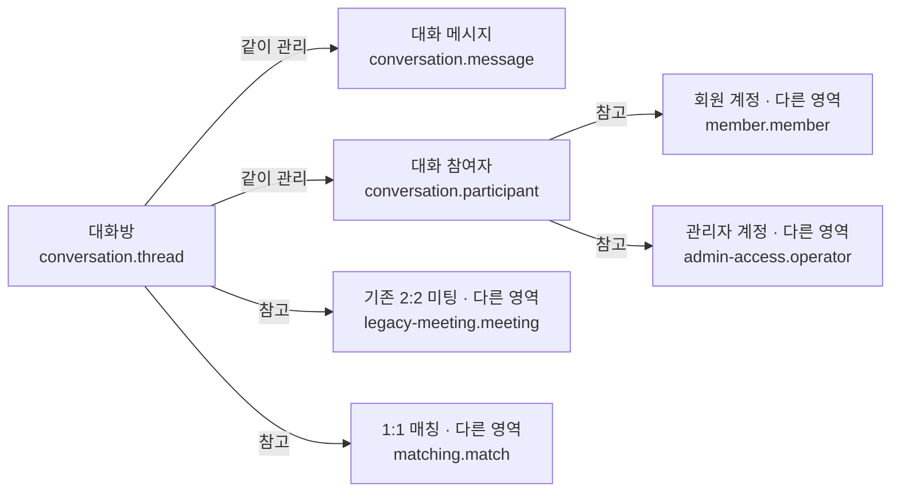
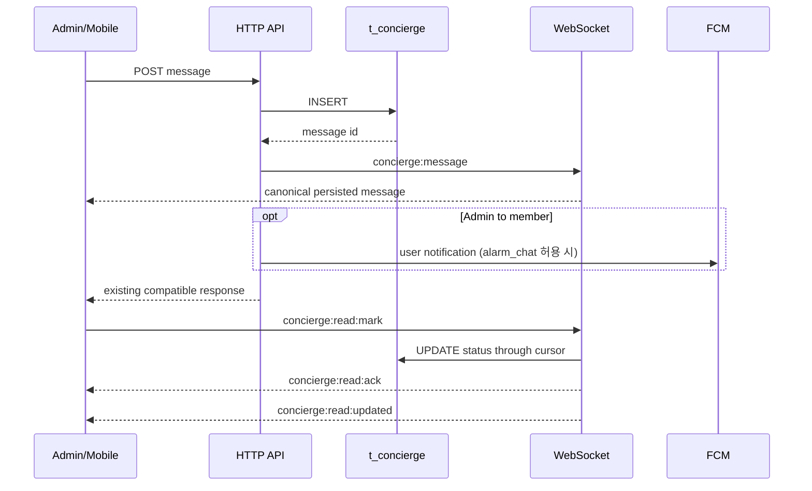
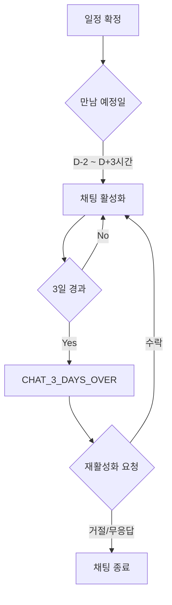

# 채팅 시스템

## 문서 역할

- 역할: `설명`
- 문서 종류: `architecture`
- 충돌 시 우선 문서: 채팅 구조/메시지 타입은 이 문서, 매칭 상태/키/일정은 [매칭 운영 정책](../policy/matching-ops-policy.md)
- 기준 성격: `as-is`

3종류의 채팅 시스템 아키텍처를 정리한 문서이다.
현재 범위에서는 채팅 시스템의 구조와 흐름 설명에 집중하며, 별도 규범 문서는 두지 않는다.
매칭 채팅의 상태 전이, 키 차감, 일정 판정은 [매칭 운영 정책](../policy/matching-ops-policy.md)을 따른다.

## 논리 데이터 모델

- 도메인 ID: `conversation`

### 먼저 보는 그림

이 그림은 데이터가 어디에 속하고 무엇을 참고하는지 먼저 보여준다.
정확한 이름과 조건은 아래 상세 표를 따른다.

```mermaid
flowchart LR
    entity_admin_dash_access_dot_operator["관리자 계정 · 다른 영역<br/>admin-access.operator"]
    entity_conversation_dot_message["대화 메시지<br/>conversation.message"]
    entity_conversation_dot_participant["대화 참여자<br/>conversation.participant"]
    entity_conversation_dot_thread["대화방<br/>conversation.thread"]
    entity_legacy_dash_meeting_dot_meeting["기존 2:2 미팅 · 다른 영역<br/>legacy-meeting.meeting"]
    entity_matching_dot_match["1:1 매칭 · 다른 영역<br/>matching.match"]
    entity_member_dot_member["회원 계정 · 다른 영역<br/>member.member"]
    entity_conversation_dot_thread -->|"같이 관리"| entity_conversation_dot_participant
    entity_conversation_dot_thread -->|"같이 관리"| entity_conversation_dot_message
    entity_conversation_dot_thread -->|"참고"| entity_matching_dot_match
    entity_conversation_dot_thread -->|"참고"| entity_legacy_dash_meeting_dot_meeting
    entity_conversation_dot_participant -->|"참고"| entity_member_dot_member
    entity_conversation_dot_participant -->|"참고"| entity_admin_dash_access_dot_operator
```

꼭 지킬 규칙:

- 메시지 작성자는 발송 시점에 해당 대화방의 유효한 참여자여야 한다
- 매칭·미팅 대화 가능 여부는 원천 도메인의 현재 상태에서 판정한다
- 삭제·비식별화 뒤에도 메시지 순서와 감사 가능한 상태는 유지한다

<!-- markdownlint-disable MD046 -->

??? info "정확한 값과 조건 보기"

    ### 논리 엔티티

    | 논리 ID | 표시명 | 생명주기 역할 | 엔티티 형태 | 기록 역할 | 책임 | 최고 데이터 분류 | 생명주기 |
    | --- | --- | --- | --- | --- | --- | --- | --- |
    | `conversation.thread` | 대화방 | root | entity | state | 상담·매칭·미팅 문맥의 참여자와 대화 가능 상태 | 내부 | 원천 서비스 문맥의 종료·보관 정책을 따름 |
    | `conversation.participant` | 대화 참여자 | child | association | state | 대화방의 회원·운영자 참여 자격과 읽음 경계 | 내부 | 퇴장 뒤에도 메시지 표시 이력을 위해 비식별 보존 가능 |
    | `conversation.message` | 대화 메시지 | child | entity | history | 일반·시스템 메시지와 발송 시각·표시 상태 | 민감 | 신고·CS 기간 동안 보존하고 개인정보 정리 시 비식별화 |

    ### 관계

    | 출발 논리 ID | 관계 역할 | 관계 유형 | 도착 논리 ID | 카디널리티 | 소유·삭제 규칙 |
    | --- | --- | --- | --- | --- | --- |
    | `conversation.thread` | `participants` | owns | `conversation.participant` | 1:N | 원천 서비스 자격을 잃어도 과거 참여 이력은 보존 가능 |
    | `conversation.thread` | `messages` | owns | `conversation.message` | 1:N | 메시지는 대화방 문맥 없이 존재할 수 없음 |
    | `conversation.thread` | `match-context` | references | `matching.match` | N:1 | 매칭 종료 상태가 대화 가능 여부를 결정 |
    | `conversation.thread` | `meeting-context` | references | `legacy-meeting.meeting` | N:1 | 기존 미팅 참가 상태가 대화 가능 여부를 결정 |
    | `conversation.participant` | `member` | references | `member.member` | N:1 | 회원 참여자는 회원 생애주기의 접근 가능 상태를 따름 |
    | `conversation.participant` | `operator` | references | `admin-access.operator` | N:1 | 운영자 참여자는 현재 권한을 잃으면 새 메시지 접근을 차단 |

    ### 불변조건

    | 규칙 ID | 관련 논리 ID | 불변조건 | 기준 문서 |
    | --- | --- | --- | --- |
    | `CONVERSATION-INV-001` | `conversation.message` | 메시지 작성자는 발송 시점에 해당 대화방의 유효한 참여자여야 한다 | [보안/접근통제 정책](../policy/security-access-control-policy.md) |
    | `CONVERSATION-INV-002` | `conversation.thread` | 매칭·미팅 대화 가능 여부는 원천 도메인의 현재 상태에서 판정한다 | [매칭 운영 정책](../policy/matching-ops-policy.md) |
    | `CONVERSATION-INV-003` | `conversation.message` | 삭제·비식별화 뒤에도 메시지 순서와 감사 가능한 상태는 유지한다 | [데이터 거버넌스 정책](../policy/data-governance-policy.md) |

<!-- markdownlint-enable MD046 -->

## 채팅 종류

| 종류 | 원천 문맥 | 참여자 | 설명 |
| --- | --- | --- | --- |
| 큐레이터 채팅 | 고객지원·회원 상담 | 관리자 ↔ 회원 | 1:1 고객 상담 |
| 매칭 채팅 | `matching.match` | 매칭 회원 2명 | 1:1 매칭 채팅 |
| 미팅 채팅 | `legacy-meeting.meeting` | 확정 참가자 | 기존 2:2 그룹 채팅 |

## 메시지 타입 (MSG_TYPE)

| 값 | 상수 | 의미 |
|----|------|------|
| 0 | NORMAL | 일반 메시지 |
| 1 | SCHEDULE | 일정 변경 알림 |
| 2 | VOICE_CALL | 보이스 콜 |
| 3 | WRITE_REVIEW | 후기 작성 |
| 4 | REACTIVATE | 재활성화 요청 |
| 5 | SEND_MY_CONTRACT | 연락처 전달 |
| 6 | ACCEPT_CONTRACT | 연락처 수락 |
| 7 | DIRECT_MEET | 직진만남 신청 |
| 8 | DIRECT_ACCEPT | 직진만남 수락 |
| 9 | DIRECT_SUCCESS | 직진만남 알림 |
| 10 | CANCEL | 만남 취소 |
| 11 | CONTRACT_SENT | 연락처 전달 + 호감 |
| 12 | USER_LEAVE | 채팅방 나가기 |
| 13 | REACTIVATE_DESC | 재활성화 상세 |
| 14 | REACTIVATE_SUCCESS | 재활성화 수락 |
| 15 | CANCELED | 만남 취소 안내 |

## 큐레이터 채팅

### 책임과 전송 선택

- 메시지 원본은 `t_concierge`이며 HTTP 명령이 DB 저장을 완료한 뒤 표준 WebSocket 이벤트를 발행한다.
- 활성 Admin·Mobile의 상태 동기화는 WebSocket 이벤트가 담당한다. 주기적 채팅 폴링과 WebSocket 장애 시 폴링
  fallback은 두지 않는다.
- WebRTC는 사용하지 않는다. 브라우저·앱과 서버 사이의 작은 영속 메시지 이벤트이며 P2P 미디어·데이터 채널,
  NAT traversal, 별도 signaling이 필요하지 않기 때문이다.
- FCM `CONCIERGE_CHAT(67)`은 Mobile 사용자 알림과 재진입 보조 수단이다. foreground에서도 사용자 알림은
  표시하되 WebSocket이 연결돼 있으면 같은 FCM으로 상태 갱신 이벤트를 중복 발행하지 않는다. 활성 화면 실시간
  상태의 원천은 WebSocket이고, 메시지 원본은 항상 DB다.

### HTTP API

| 메서드 | 엔드포인트 | 설명 |
| --- | --- | --- |
| GET | `/app/chat/chatList` | Mobile 통합 채팅 목록과 안 읽은 상담 메시지 수 조회 |
| GET | `/app/chat/list` | Mobile 상담 메시지 스냅샷 조회 |
| POST | `/app/chat/send` | Mobile 메시지 저장 후 이벤트 발행 |
| GET | `/admin/member/concierge/list` | Admin 권한 범위의 상담 회원·안 읽은 수 조회 |
| GET | `/admin/member/concierge/chat_list` | Admin 상담 메시지 스냅샷 조회 |
| POST | `/admin/member/concierge/send` | Admin 메시지 저장 후 이벤트·FCM 발행 |

`GET` 목록은 읽기 전용이다. 조회 과정에서 `status`를 바꾸지 않으며 읽음 변경은 아래 WebSocket 명령으로만
수행한다.

### WebSocket 계약

| 항목 | 값 |
| --- | --- |
| 회원 endpoint | `/realtime/member` |
| 관리자 endpoint | `/realtime/admin` |
| 전송 | RFC 6455 WebSocket text frame의 JSON envelope; HTTP polling 없음 |
| Origin | 운영 CMS와 React Native가 endpoint에서 생성하는 운영·개발 API Origin만 허용; Origin이 없는 native/Node 연결 허용 |
| 인증 | 연결 직후 `realtime:auth`의 token을 현재 회원·관리자 DB 상태와 대조하고 `realtime:ready` 이후에만 업무 이벤트 허용 |
| 서버 이벤트 | `realtime:ready`, `realtime:error`, `concierge:message`, `concierge:read:ack`, `concierge:read:updated` |
| 클라이언트 명령 | `realtime:auth`, `concierge:read:mark` |

모든 application frame은 `{ type, correlation_id?, payload? }` 한 가지 envelope을 사용한다. `correlation_id`는
읽음 명령과 응답을 연결하는 positive integer이며 HTTP API의 진단용 `request_id`와 책임을 섞지 않는다. 인증 전
업무 이벤트·binary frame·유효하지 않은 JSON/envelope은 적용하지 않는다. 연결 후 5초 안에 인증이 완료되지
않으면 서버가 연결을 닫는다.

서버만 연결을 identity room에 배정한다. 클라이언트가 임의 회원 room을 선택할 수 없다. 관리자는 Super이면 전체
상담에 접근하고, 일반 관리자는 현재 `CHARGE`로 배정되고 현재 `t_manager` 연결이 유효한 회원만 접근한다. 이
권한은 HTTP 요청과 WebSocket 읽음 명령에서 각각 다시 검증한다.

`concierge:message` payload는 다음 필드를 모두 포함한다.

| 필드 | 타입 | 의미 |
| --- | --- | --- |
| `id` | positive integer | `t_concierge.id`; 정렬·중복 제거 기준 |
| `member` | positive integer | 상담 회원 ID |
| `is_send` | `Y \| N` | `Y`: 회원 발신, `N`: 관리자 발신 |
| `content` | string | 메시지 본문, 이미지 전용 메시지는 빈 문자열 |
| `image` | string \| null | 이미지 경로 |
| `create_date` | string | DB 생성 시각 |
| `status` | `Y \| N` | 반대편이 읽었으면 `Y` |

회원의 `concierge:read:mark` payload는 `{ last_message_id }`, 관리자는
`{ member_id, last_message_id }`다. 서버는 해당 메시지가 현재 대화와 반대편 발신 방향에 속하는지 확인한 뒤
그 ID 이하의 안 읽은 메시지를 읽음 처리한다. 같은 `correlation_id`의 `concierge:read:ack`으로 명령 결과를
응답하고, 성공하면 `concierge:read:updated`를 양쪽에 발행한다. 갱신 이벤트에는 `member_id`, `reader`,
`last_read_message_id`가 포함된다.

### 연결·복구

```mermaid
sequenceDiagram
    participant Client as Admin/Mobile
    participant HTTP as HTTP API
    participant DB as t_concierge
    participant WS as WebSocket
    participant FCM as FCM

    Client->>HTTP: POST message
    HTTP->>DB: INSERT
    DB-->>HTTP: message id
    HTTP->>WS: concierge:message
    WS-->>Client: canonical persisted message
    opt Admin to member
        HTTP->>FCM: user notification (alarm_chat 허용 시)
    end
    HTTP-->>Client: existing compatible response
    Client->>WS: concierge:read:mark
    WS->>DB: UPDATE status through cursor
    WS-->>Client: concierge:read:ack
    WS-->>Client: concierge:read:updated
```

- 연결 단절 시 클라이언트는 1초부터 최대 30초까지 지수 backoff로 다시 연결하고, 인증이 완료되면 HTTP 스냅샷을
  다시 조회한다. WebSocket 이벤트 자체를 영속 복구 원천으로 사용하지 않는다.
- API 재시작·네트워크 단절·백그라운드 복귀 뒤에도 같은 재연결·인증·HTTP 재동기화 순서를 사용한다.
- 스냅샷과 이벤트가 겹쳐도 클라이언트는 `t_concierge.id`로 병합하며, 이미 확인한 `status=Y`를 이전 스냅샷의
  `status=N`으로 되돌리지 않는다.
- Mobile은 앱 활성·로그인 상태에서 한 연결만 유지하고 백그라운드·로그아웃에서 연결을 닫는다. Admin도 로그인
  세션당 한 연결만 유지한다.
- Admin은 팝업이 열리고 브라우저 탭이 보일 때만, Mobile은 대화 route에 navigation focus가 있을 때만 읽음을
  명시한다. 숨김·비활성 상태에서 받은 메시지는 visibility/focus 복귀 스냅샷의 가장 최근 메시지 ID로 따라잡는다.
- Mobile은 관리자 발신 메시지 이벤트를 받으면 첫 상담 메시지인 경우에도 통합 채팅 목록의 상담 진입점과 안 읽은
  표시를 즉시 노출하고 목록 스냅샷을 한 번 다시 조회한다. 이벤트 전에 시작된 오래된 스냅샷은 이 상태를 되돌릴 수
  없으며, 진행 중인 조회가 있으면 완료 직후 최신 조회를 한 번만 이어서 실행한다.
- Mobile은 서버의 회원 `concierge:read:updated`를 받은 뒤 통합 채팅 목록을 다시 조회한다. 조회 중 새 갱신 요청이
  오면 현재 요청 완료 직후 한 번 더 조회해 안 읽은 배지를 DB 상태와 맞춘다.

### 특징

- 관리자와 회원 간 1:1 채팅
- 읽음/안읽음 상태 추적
- 송신자 구분 (`Y`: 회원, `N`: 관리자)

### 운영·확장·롤백

- API 배포 전에 외부 `api.ritzy.fourhundred.co.kr`의 reverse proxy/load balancer가
  `/realtime/member`, `/realtime/admin`의 HTTP Upgrade와 `Connection: upgrade`를 API 프로세스로 전달하는지
  확인한다.
- 현재 PM2 단일 프로세스에서는 인증된 연결 집합을 메모리에서 관리한다. PM2 cluster 또는 다중 인스턴스로
  확장하기 전 인스턴스 간 이벤트 broker와 재동기화 전략을 먼저 확정해야 한다.
- 배포 순서는 호환 가능한 API, WSS 연결 smoke, Admin, Mobile 순서다. 로그인한 Super 또는 담당 관리자와 테스트
  회원으로 메시지 도착·안 읽은 수·양방향 읽음 표시를 확인한다.
- 문제가 있으면 Admin·Mobile 실시간 소비 코드를 먼저 롤백한 뒤 API WebSocket 기능을 롤백한다. 기존 HTTP 응답
  계약과 DB 스키마를 유지하므로 이 순서에서도 메시지 저장·스냅샷 조회는 계속 가능하다.

## 매칭 채팅

### API

| 메서드 | 엔드포인트 | 설명 |
|--------|----------|------|
| POST | `/match/chat` | 3일 채팅 활성화 |
| GET | `/match/chat/detail` | 채팅방 상세 |
| GET | `/match/chat/list` | 메시지 목록 |
| POST | `/match/chat/send` | 메시지 전송 |
| POST | `/match/chat/leave` | 채팅방 나가기 |
| POST | `/match/chat/changeSchedule` | 일정 변경 |
| POST | `/match/chat/reactivate` | 재활성화 요청 |
| POST | `/match/chat/acceptReactivate` | 재활성화 수락 |
| POST | `/match/chat/blameUser` | 회원 신고 |

### 채팅 활성화 조건

```mermaid
flowchart TD
    A[일정 확정] --> B{만남 예정일}
    B -->|D-2 ~ D+3시간| C[채팅 활성화]
    C --> D{3일 경과}
    D -->|Yes| E[CHAT_3_DAYS_OVER]
    D -->|No| C
    E --> F{재활성화 요청}
    F -->|수락| C
    F -->|거절/무응답| G[채팅 종료]
```

### 특징

- 만남 예정 시간 기준 -48시간 ~ +3시간 활성화
- 3일간 채팅 옵션 (정규 과정 생략)
- 재활성화 횟수와 키 차감 기준은 서버 검증과 [매칭 운영 정책](../policy/matching-ops-policy.md)을 따른다.
- 시스템 메시지: 일정 변경, 장소 확정, 연락처 공유

## 미팅 채팅

### API

| 메서드 | 엔드포인트 | 설명 |
|--------|----------|------|
| POST | `/meeting/createChatRoom` | 채팅방 생성 |
| GET | `/meeting/chatList` | 채팅 리스트 |
| POST | `/meeting/sendChat` | 메시지 전송 |
| POST | `/meeting/leaveChat` | 채팅방 나가기 |
| POST | `/meeting/blameUser` | 회원 신고 |

### 특징

- 4명 확정 시 자동 채팅방 개설
- 그룹 채팅 (다중 참여자)
- 멤버 입장/퇴장 시스템 메시지

## 신고 사유 (BLAME_TYPE_CHAT)

| 코드 | 사유 |
|------|------|
| 1 | 욕설/비하발언/차별성 발언 |
| 2 | 선정적인 대화유도 |
| 3 | 홍보성 컨텐츠 |
| 4 | 개인정보/사생활침해 |
| 6 | 다른 이유 |

## FCM 알림

| 타입 | 상수 | 채팅 종류 |
|------|------|----------|
| 22 | MATCH_NEW_CHAT | 매칭 채팅 |
| 37 | MEET_SEND_CHAT | 미팅 채팅 |
| 67 | CONCIERGE_CHAT | 큐레이터 채팅 |
| 70 | MATCH_CHAT_OPEN | 매칭 채팅방 오픈 |
| 48 | MATCH_REACTIVATE | 재활성화 요청 |
| 49 | MATCH_REACTIVATE_ACCEPT | 재활성화 수락 |
