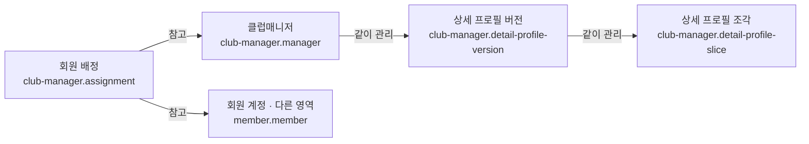

# 클럽매니저 시스템

## 문서 역할

- 역할: `설명`
- 문서 종류: `architecture`
- 충돌 시 우선 문서: [보안/접근통제 정책](../policy/security-access-control-policy.md)
- 기준 성격: `as-is`

클럽매니저의 회원 배정과 상세 프로필 저장 책임을 설명한다.

## 범위

- 클럽매니저 계정과 공개 프로필
- 회원과 클럽매니저의 운영 배정
- 긴 상세 프로필 이미지 버전과 조각
- 이미지 변환 방식은 [업로드/미디어 시스템](upload-media-system.md)을 참고한다.

## 논리 데이터 모델

- 도메인 ID: `club-manager`

### 먼저 보는 그림

이 그림은 데이터가 어디에 속하고 무엇을 참고하는지 먼저 보여준다.
정확한 이름과 조건은 아래 상세 표를 따른다.

꼭 지킬 규칙:

- 한 회원은 같은 클럽매니저에게 중복 배정되지 않고 전담(`CHARGE`)은 최대 하나이며 공유(`SHARE`)는 서로 다른 클럽매니저에게 복수 배정될 수 있다
- 현재 상세 프로필은 변환 완료된 버전만 참조한다
- 조각 순서와 개수는 상위 버전의 완성 상태와 일치해야 한다

<!-- markdownlint-disable MD046 -->

??? info "정확한 값과 조건 보기"

    ### 논리 엔티티

    | 논리 ID | 표시명 | 생명주기 역할 | 엔티티 형태 | 기록 역할 | 책임 | 최고 데이터 분류 | 생명주기 |
    | --- | --- | --- | --- | --- | --- | --- | --- |
    | `club-manager.manager` | 클럽매니저 | root | entity | state | 클럽매니저 계정과 현재 공개 프로필 | 민감 | 운영 계정 비활성 이후에도 배정 이력을 보존 |
    | `club-manager.assignment` | 회원 배정 | root | association | state | 회원과 담당 클럽매니저의 운영 관계 | 내부 | 재배정 시 현재 관계를 갱신하고 변경 근거를 보존 |
    | `club-manager.detail-profile-version` | 상세 프로필 버전 | child | entity | snapshot | 상세 이미지 원본과 변환 상태 | 내부 | 현재 버전은 유지하고 실패·이전 버전은 정리 가능 |
    | `club-manager.detail-profile-slice` | 상세 프로필 조각 | child | entity | snapshot | 상세 프로필 버전의 표시용 이미지 조각 | 내부 | 상위 버전 정리 시 함께 삭제 |

    ### 관계

    | 출발 논리 ID | 관계 역할 | 관계 유형 | 도착 논리 ID | 카디널리티 | 소유·삭제 규칙 |
    | --- | --- | --- | --- | --- | --- |
    | `club-manager.assignment` | `manager` | references | `club-manager.manager` | N:1 | 담당 계정 비활성 뒤에도 과거 배정 근거는 보존 |
    | `club-manager.assignment` | `member` | references | `member.member` | N:1 | 같은 회원·매니저 조합은 하나만 유지하고 전담 배정은 회원별 최대 하나로 제한 |
    | `club-manager.manager` | `detail-profile-versions` | owns | `club-manager.detail-profile-version` | 1:N | 현재 활성 버전은 삭제하지 않음 |
    | `club-manager.detail-profile-version` | `slices` | owns | `club-manager.detail-profile-slice` | 1:N | 버전 정리 시 조각과 파일을 함께 정리 |

    ### 불변조건

    | 규칙 ID | 관련 논리 ID | 불변조건 | 기준 문서 |
    | --- | --- | --- | --- |
    | `CLUB-MANAGER-INV-001` | `club-manager.assignment` | 한 회원은 같은 클럽매니저에게 중복 배정되지 않고 전담(`CHARGE`)은 최대 하나이며 공유(`SHARE`)는 서로 다른 클럽매니저에게 복수 배정될 수 있다 | [보안/접근통제 정책](../policy/security-access-control-policy.md) |
    | `CLUB-MANAGER-INV-002` | `club-manager.detail-profile-version` | 현재 상세 프로필은 변환 완료된 버전만 참조한다 | [업로드/미디어 시스템](upload-media-system.md) |
    | `CLUB-MANAGER-INV-003` | `club-manager.detail-profile-slice` | 조각 순서와 개수는 상위 버전의 완성 상태와 일치해야 한다 | [업로드/미디어 시스템](upload-media-system.md) |

<!-- markdownlint-enable MD046 -->

## 관련 문서

- [업로드/미디어 시스템](upload-media-system.md)
- [보안/접근통제 정책](../policy/security-access-control-policy.md)
- [논리 데이터 모델 정책](../policy/logical-data-model-policy.md)
