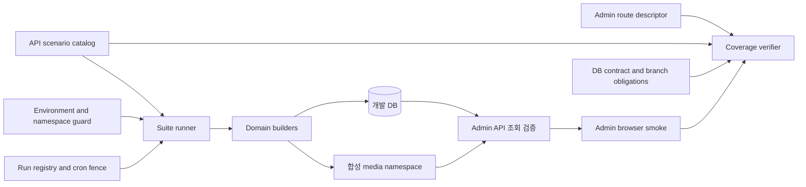

# 테스트용 개발 데이터 시스템

## 문서 역할

- 역할: `설명`
- 문서 종류: `architecture`
- 충돌 시 우선 문서: [테스트용 개발 데이터 정책](../policy/development-test-data-policy.md)
- 기준 성격: `to-be`

이 문서는 생성 엔진·DB verifier, 관리자 route coverage와 browser smoke를 route별 audience·filter·API 기대
결과까지 연결하는 목표 구조를 설명한다. 구현·공유 개발계 live 검증과 고도화의 현재 진행 현황은
[기술 부채 정리](../technical-debt/technical-debt.md)의 `테스트용 개발 데이터 운영 검증·고도화 미완료`
항목에서만 추적한다.

## 목적

- 관리자 시스템(CMS) 전체 탭과 Mobile QA에서 재현 가능한 합성 데이터를 만드는 목표 구조를 설명한다.
- 별도 repository 없이 API가 DB write를 소유하고 Admin이 탭 coverage를 소유하는 책임 경계를 고정한다.

## 범위

- `coupler-api`의 개발 데이터 CLI, catalog, domain builder, verifier, 합성 asset
- `coupler-admin-web`의 탭 coverage descriptor와 정적 검증
- 회원, 매칭, 기존 2:2 그룹미팅, N:N 그룹미팅, 라운지, 결제·매출, 통계, 설정, 매니저 데이터

운영 데이터 생성, unit test fixture, DB migration, 실제 결제·알림 호출은 포함하지 않는다.

## 상위 규범 문서

- 생성·식별·검증·reset의 규범은 [테스트용 개발 데이터 정책](../policy/development-test-data-policy.md)을 따른다.
- 상태·키·결제·개인정보 세부 규범은 해당 도메인 정책을 따르며 이 문서에서 새 값을 정의하지 않는다.

## cron 환경 분리와 마이그레이션 적용 경계

이 구조에서 별도로 운영해야 하는 핵심 대상은 DB 마이그레이션이 아니라 **cron 실행 환경과 안전
정책**이다.

- 운영 cron은 기존 운영 scheduler와 실행 정책을 그대로 사용한다. 개발 데이터 Run Registry,
  `DEV_CRON_*` 설정, 개발 cron fence에 의존하지 않는다.
- 개발 cron은 개발 전용 dispatcher·인증·설정을 사용한다. 외부 FCM 발송과 삭제성 작업을 기본
  차단하고, 합성 데이터 `apply`·`reset` 변경 구간에는 개발 전용 fence와 lease로 동시 변경을 막는다.
  `applied` 유지·화면 검증 구간에는 정상 개발 데이터만 실행 대상으로 삼고 합성 데이터 root와 연결
  객체는 제외한다.
- cron job의 핵심 도메인 로직은 공유할 수 있지만, 운영과 개발의 등록 경로·설정·외부 부작용 정책은
  섞지 않는다. 운영 프로세스에서 `DEV_CRON_*` 또는 개발 데이터 fence 설정이 감지되면 시작 단계에서
  실패해야 한다.

세부 설치·검증 기준은 [Cron 작업](cron-jobs.md)과
[개발계 cron 운영 흐름](../flows/cross-project/development-cron-operation-flow.md)을 따른다. 개발
cron fence는 운영 cron을 바꾸는 기능이 아니라 합성 데이터 작업과 개발 cron의 충돌만 막는 개발 전용
안전장치다.

서비스 DB 마이그레이션 흐름은 기존과 같다. 회원, 매칭, 그룹미팅, 결제 같은 서비스 기능의
테이블·컬럼·인덱스·제약조건·뷰 또는 필수 기준정보를 바꾸는 동일한 승인 SQL을 개발계에 한 번 적용하고,
검증이 끝나면 운영계에 한 번 적용한다. 각 DB는 자신의 migration ledger에 완료 상태를 기록하며
[DB Migration Gate 정책](../policy/db-migration-gate-policy.md)을 그대로 따른다.

합성 데이터 `apply`, `verify`, `reset`은 서비스 DB 마이그레이션이 아니며 migration ledger에 기록하지
않는다. 개발 데이터 관리 때문에 서비스 DB 마이그레이션 적용 환경이나 횟수가 늘어나지 않는다. DB
마이그레이션이 feeder 관련 table·column·view·FK를 바꿀 때만 DB contract, schema fingerprint,
ownership query, scenario version과 verifier를 함께 갱신한다. 관련 없는 마이그레이션은 기존 namespace를
일괄 reset하지 않는다.

## 배치 원칙

생성 엔진을 별도 repository로 분리하지 않는다. DB schema, model, 상태 상수와 같은 변경 단위로 검증할 수 있도록 `coupler-api`에 둔다.

```text
coupler-api/
  tools/dev-data/
    cli.ts
    core/
      environment-guard.ts
      namespace.ts
      namespace-lock.ts
      run-registry.ts
      cron-fence.ts
      runner.ts
      ownership.ts
    contracts/
      db-contract.ts
      schema-fingerprint.ts
      branch-obligations.ts
    catalog/
      scenarios.ts
      suites.ts
    domains/
      member.ts
      matching.ts
      meeting.ts
      lounge.ts
      revenue.ts
      statistics.ts
      settings.ts
      manager.ts
    assets/
      base/
        portrait-*.webp
        profile-video-*.mp4
    assets.ts
    base-asset-manifest.ts
    verify/
      database.ts
      api.ts
      coverage.ts

coupler-admin-web/
  src/config/dev-data-coverage.ts
  src/__tests__/dev-data-coverage.test.ts
  e2e/dev-data-cms.smoke.spec.ts
```

- API는 scenario ID, DB write, namespace ownership, suite 실행, DB/API 검증을 소유한다.
- Admin의 `page-route.tsx`는 component route의 stable `routeId`를 소유한다. `src/config/dev-data-coverage.ts`는 전체 route의 `ScreenAudit` exact map과 각 데이터 화면의 `CoverageEntry` exact map을 소유한다.
- workspace coverage 검증은 Admin route descriptor와 API scenario catalog의 교집합을 확인한다.
- Admin browser smoke는 실제 개발 API를 사용해 route·권한·filter별 table·card·상세 화면 렌더링을 확인한다.
- Mobile에는 생성 기능을 추가하지 않고 개발 API 결과를 소비하는 QA만 수행한다.

## 구성요소

| 구성요소 | 책임 |
| --- | --- |
| CLI | `list`, `active`, `plan`, `apply`, `verify`, `coverage`, `reset` 명령 제공 |
| Environment Guard | 설정과 실제 DB identity를 비교하고 운영·미지원 schema 차단 |
| Namespace Validator | 형식·길이·SQL parameter 사용·asset 경로 containment 검증 |
| Namespace Lock | 동일 namespace 동시 실행 차단 |
| Run Registry | owner·유지 기한·run 상태·catalog/schema fingerprint 영속화 |
| Cron Target Fence | 합성 데이터 변경 구간은 cron을 일시 중지하고 안정 상태에서는 합성 target만 제외 |
| DB Contract Verifier | 관련 table·column·view·FK·필수 insert column 계약과 fingerprint 검증 |
| Branch Obligation Map | 상태·전이·권한·filter·시간 경계의 missing·stale 분기 검출 |
| Scenario Catalog | scenario ID, version, 의존성, 생성기, verifier 연결 |
| Suite Catalog | 도메인별 scenario 묶음과 실행 순서 관리 |
| Domain Builder | 합성 root·child를 트랜잭션으로 생성 |
| Ownership Resolver | namespace root에서 생성 child와 asset을 역추적 |
| CMS Coverage Verifier | component route, scenario, API 검증의 missing·stale 항목 확인 |
| Admin Browser Smoke | suite 소유 API의 non-empty 응답, table·chart·metric 표면과 렌더 오류 부재 확인 |
| Asset Sync | checksum이 고정된 기준 미디어에서 actor별 프로필을 렌더링하고 선택 영상을 namespace 저장소에 배치·정리 |

## 데이터 흐름



coverage는 단순 row 존재 여부가 아니라 `branch obligation -> route -> audience -> filter -> scenario -> API result -> rendered UI` 연결이 모두 유효할 때 통과한다.

## Scenario 계약

각 scenario는 다음 정보를 빈값 없이 가진다.

| 필드 | 의미 |
| --- | --- |
| `id` | 변경되지 않는 kebab-case 식별자 |
| `version` | 생성 shape 또는 기대 결과 변경 버전 |
| `suite` | 소속 실행 단위 |
| `kind` | 정상 또는 의도적 위반 시나리오 분류 |
| `requires` | 선행 기준정보와 scenario ID |
| `roots` | namespace 소유권을 표시하는 root entity |
| `obligations` | 충족하는 상태·전이·권한·filter·시간 경계 ID |
| `apply` | 트랜잭션 생성기 |
| `verify` | DB 불변식과 API 기대 결과 |
| `reset` | root에서 역추적한 정리 순서 |

scenario ID 예시는 `matching-chat-open`, `lounge-comment-report-pending`, `revenue-monthly-ranking`처럼 도메인·상태·변형 순서로 작성한다.

## Run 계약과 저장 위치

유지 종료일은 scenario 정의가 아니라 namespace run의 값이다. 새 run record는 다음 필드를 빈값 없이 가진다. asset root identity 도입 전에 생성된 legacy record에 한해 `assetRoot` 부재를 전환 상태로 읽는다.

| 필드 | 의미 |
| --- | --- |
| `runId` | namespace와 생성 시각에 연결된 불변 식별자 |
| `namespace` | 검증을 통과한 소문자 식별자 |
| `owner` | 정리 책임자 식별자 |
| `suite` | 적용 suite |
| `catalogVersion` | scenario catalog version |
| `assetRoot` | apply와 reset이 함께 사용하는 API 서버 미디어 저장소의 정규화된 절대 경로. legacy record는 명시적 reset 채택 전까지만 부재 가능 |
| `schemaFingerprint` | 관련 DB 계약 fingerprint |
| `referenceTime` | 통계·시간 경계 기준 시각 |
| `expiresAt` | 공유 개발계 유지 종료일 |
| `status` | `planning`, `applying`, `applied`, `resetting`, `cleanup_failed`, `cleaned`, `failed` |
| `scenarios` | 적용 scenario ID와 version 목록 |
| `counts` | 생성·유지·삭제·잔존 건수 |

- 공유 개발계 registry는 API와 feeder가 함께 읽는 비공개 공유 filesystem의 절대 경로 `DEV_DATA_REGISTRY_DIR`에 둔다.
    - global cron fence: `{registryRoot}/fence.json`
    - active run: `{registryRoot}/active/{namespace}.json`
    - history: `{registryRoot}/history/{namespace}/{runId}.json`
    - active cron lease: `{registryRoot}/_cron_leases/{jobId}.{leaseId}.json`
    - shared registry mutex: `{registryRoot}/_locks/registry.lock`
- local·CI도 같은 filesystem adapter와 directory 구조를 사용하며 `.dev-data` 경로는 Git에서 제외한다.
- backend는 read-after-write consistency와 ETag 조건부 write를 보장해야 하며 충돌·불가용 시 전체 작업을 중단한다.
- feeder와 개발 cron은 별도 해석기를 두지 않고 동일한 Run Registry contract parser를 사용한다. fence version·namespace·중복·UTC ISO 8601 표준 형식의 시각과 active record의 namespace key·suite·상태·owner·catalog/schema fingerprint·asset root·시각·scenario·row reference·count를 같은 기준으로 검증한다. asset root 부재는 도입 전 legacy record로만 읽고 새 claim에서는 거부한다.
- init 재진입, readiness, inventory, claim, 상태 update, finalization과 개발 cron lease 생성은 registry mutex 안에서 fence와 active directory 전체 snapshot의 형식·양방향 소유권·active scope 충돌을 먼저 검증한다. 한 record만 유효하다는 이유로 손상된 나머지 snapshot을 무시하고 진행하지 않는다.
- apply는 global fence에 namespace를 먼저 추가한 뒤 active record를 만들고, 중간 실패로 fence만 남으면 DB write 없이 reconciliation 대상으로 남긴다.
- reset은 DB·asset cleanup과 history 저장을 확인한 뒤 global fence에서 namespace를 제거하고 마지막으로 cleaned active record를 제거한다.
- history write나 fence update가 실패하면 active record와 fence를 유지한다. 마지막 active 제거만 실패하면 합성 데이터와 fence는 이미 제거된 cleaned record를 남기고, 같은 reset은 DB·asset cleanup을 반복하지 않고 ETag와 현재 record가 일치할 때 finalization만 재시도한다.
- apply 시작 시 history에서 생성 후 90일이 지난 기록을 제거한다. cleanup도 동일한 run record parser와 `{runId}.json` 파일 소유권을 검증하고 손상된 history를 임의 삭제하지 않으며, 삭제 결과는 비민감 운영 증빙으로 남긴다. local·CI는 test teardown에서 임시 registry 전체를 제거한다.
- registry active/history prefix는 namespace asset인 `uploads/dev-data/{namespace}/`와 분리해 asset reset이 실행 기록을 삭제하지 않게 한다.
- registry가 불가용하거나 active record와 DB root가 불일치하면 apply·verify·reset을 중단하고 reconciliation 결과를 출력한다.
- 최초 `init-registry`는 DB에 연결하지 않고 빈 registry만 만든다. fence가 유실됐는데 active record가 남은 상태는 빈 fence로 덮지 않고 복구 대상으로 중단한다.
- `active` inventory는 registry mutex 안에서 active directory 전체를 읽고 namespace, suite, owner, 상태, 유지 종료일과 count를 출력한다. 예상하지 못한 파일, 중복 fence namespace, 유효하지 않은 fence 시각·active metadata 또는 active record 상호 간 scope 충돌이 있으면 일부 목록을 반환하지 않고 전체를 실패시킨다.
- fence-only namespace와 unfenced active record는 부분 claim·registry 손상 상태로 분류해 inventory와 신규 claim을 차단한다. 단, DB·asset 정리가 끝나고 마지막 active unlink만 재시도하는 `cleaned` record는 fence 없이 남을 수 있다.
- registry root의 active scope는 다음 두 모드 중 하나로 결정되며 별도 설정값을 두지 않는다.
    - 통합 모드: `cms-all` 하나만 active
    - 분할 모드: 서로 다른 도메인 suite를 각각 하나씩 active
- `cms-all`은 모든 도메인 scope를 포함하고, 도메인 suite는 동일 suite끼리 scope가 겹친다. claim은 같은 mutex 안에서 active inventory와 cron lease를 확인한 뒤에만 fence와 record를 생성한다.
- claim 뒤 run ID, namespace/key, owner, suite, catalog/schema fingerprint, asset root, reference/expiry/created time은 바꾸지 않는다. 단, asset root가 없는 legacy active record는 명시적 reset 채택에서 현재 정규화 경로를 한 번 기록할 수 있다. update는 `updatedAt` 단조 증가와 apply·실패 후 재시도·reset에 필요한 허용 상태 전이만 사용하며 `cleaned`는 finalization만 허용한다.
- 유지 기한은 정리 알림 기준이지 삭제 권한이 아니다. 만료·실패·cleanup/finalization 대기 record도 reset이 완료되기 전까지 overlapping claim을 차단한다.
- 동일 도메인의 화면 상태가 부족하면 두 번째 namespace로 복제하지 않고 정상 시나리오 catalog와 verifier를 확장한 뒤 해당 suite를 reset·재적용한다.

## 데이터 계층

### 1) 기준정보

- 앱 설정, 약관, 별칭, 공지, 가입 메시지, 장소처럼 여러 시나리오가 공유하는 데이터다.
- 누락 여부와 계약을 검증하며 기존 값을 자동 수정하지 않는다.
- 필요한 기준정보가 없거나 계약과 다르면 해당 suite를 중단하고 migration 또는 data repair 필요성을 보고한다.

### 2) Actor pool

- 기존 개발계 회원을 재사용하지 않고 합성 회원과 비로그인 매니저 표시 행을 만든다.
- 시나리오 간 상태 오염을 막기 위해 상태 전이·신고·결제 시나리오는 전용 actor를 기본으로 사용한다.
- 여러 상세 팝업을 한 번에 확인하는 목적에만 명시적 anchor actor를 사용한다.
- 합성 회원 식별자는 `devdata+{namespaceKey}+{actorKey}@example.invalid` 형식을 사용한다. `namespaceKey`는 검증된 원본 namespace의 SHA-256 앞 10자리, `actorKey`는 catalog role의 SHA-256 앞 12자리다. 전체 길이는 47자로 `t_member.email varchar(50)` 계약 안에 두고, 원본 namespace·run과의 대응은 Run Registry가 보존한다.
- 각 actor는 결정적 hash로 성별별 기준 인물과 표시 색상을 선택하고 `main`, `alternate`, `lifestyle` 프로필 3장을 가진다. 각 이미지에는 `TEST {actorKey}` 표식을 넣어 Admin 목록에서 합성 데이터와 actor를 구분한다.
- 일부 actor는 결정적 hash로 영상을 배정받는다. DB에는 actor별 고유 영상 경로를 저장하고 실제 파일은 성별·인물별 기준 영상에서 선택해 동기화한다.

### 3) Scenario 데이터

- root actor와 도메인 root를 먼저 만들고 관계 child, 원장, 로그, 신고, 미디어 순서로 생성한다.
- 각 child는 namespace root에서 쿼리로 역추적할 수 있어야 한다.

### 4) 파생 조회

- dashboard, 매출, 가입·로그인·매칭 통계는 별도 결과 row를 만들지 않는다.
- 여러 시간 bucket에 배치한 원천 사건으로 기존 집계 query 결과를 만든다.

### 5) 소유권 추적

- 개발 전용 metadata table을 운영 schema에 추가하지 않는다.
- owner·유지 종료일·run 상태는 Run Registry를, 회원·매니저 root의 namespace·scenario version은 결정적 합성 식별자를 기준으로 찾는다.
- 매칭, 그룹미팅, 라운지, 결제, 통계 root는 합성 회원·매니저 외래키와 catalog의 ownership query로 찾는다.
- namespace media는 프로필 `uploads/dev-data/{namespace}/profiles/{actorKey}-{variant}.webp`, 영상 `uploads/dev-data/{namespace}/videos/{actorKey}.mp4` 경로로 찾는다.
- 소유권 query로 유일하게 증명되지 않는 행은 자동 reset 대상에서 제외하는 대신 reset 전체를 실패시킨다.

## 분기 coverage 모델

scenario 수를 무작정 Cartesian product로 늘리지 않고 정책 분기를 먼저 기계 판정 가능한 obligation으로 만든다.

| 축 | 필수 obligation |
| --- | --- |
| 상태 | 서버 상태 상수의 모든 값과 stale 값 0개 |
| 전이 | 정책의 모든 허용·금지 전이와 시작·종료 경계 |
| 권한 | super admin, 일반 매니저, 회원 성별·등급 차이 |
| filter | route가 노출하는 주요 filter의 non-empty·empty 결과 |
| 데이터 형태 | 필수값, 허용 nullable, child 0·1·다건, 삭제 tombstone |
| 시간 | 경계 직전·정각·직후와 일·주·월·timezone bucket |
| 부작용 | 알림·결제·cron 호출 0건과 로컬 negative 차단 결과 |
| dependency failure | DB·registry·lock·transaction·asset adapter 실패와 복구 결과 |

- API 상태 상수에서 union type을 도출하고 domain obligation map을 `satisfies Record<State, ScenarioId[]>`로 선언한다.
- enum 추가는 missing property, enum 삭제는 excess property 또는 stale catalog test로 실패한다.
- 모든 단일 축은 100%, 상호작용하는 두 축은 pairwise 100%를 요구한다.
- 3개 이상 축의 결합 결과가 정책에 명시된 경우 pairwise로 대체하지 않고 전용 scenario를 둔다.
- 상태 값·허용 전이·화면 분기는 공유 개발계 정상 시나리오 obligation으로, 금지 전이·잘못된 FK·원장 불일치는 local·CI 의도적 위반 obligation으로 분리한다. 전체 구현 완료는 두 catalog가 각자 100%여야 하지만 `cms-all`은 정상 시나리오만 적용한다.
- 안전 모듈은 domain scenario 수와 별개로 Jest branch coverage 100%와 fault-injection matrix를 적용한다. code coverage 숫자만 맞추지 않고 각 실패에서 write 0건, rollback, fence 유지, 재시도 상태를 assertion한다.

## DB 계약과 변경 감지

TypeScript 문법이나 model import만으로 실제 DB 변경을 증명하지 않는다. `db-contract.ts`는 feeder가 읽고 쓰는 table·column·view·FK를 domain별로 선언하고 Environment Guard가 `information_schema`와 비교한다.

- 필수 column의 존재, type family, nullability, default·generated 여부를 검증한다.
- write 대상 table에 새 `NOT NULL`·default 없음 column이 생기면 builder 입력 계약이 추가될 때까지 실패한다.
- FK 추가·삭제·방향 변경은 ownership query와 reset 순서를 갱신할 때까지 fingerprint mismatch로 실패한다.
- verifier가 사용하는 view의 column shape가 바뀌면 DB/API verifier를 갱신할 때까지 실패한다.
- 관련 없는 table·column 변경은 fingerprint에 포함하지 않아 불필요한 결합을 만들지 않는다.
- migration이 feeder 관련 계약을 바꾸면 migration PR에서 scenario version, DB contract, verifier를 함께 갱신하고 local·CI schema에서 contract gate를 실행한다.
- compile error는 typed 상태·route 계약의 누락을 잡는 수단이고, raw SQL·실제 schema 차이는 DB contract gate가 잡는다.

## Suite 구성

### 회원 `member-all`

- 기본정보·필수인증·소개글의 미제출, 대기, 반려, 재심사, 승인
- 신청회원, 일반회원, 준회원, 정회원, 특별회원 표시
- 정상, 홀딩, 차단, 탈퇴, 심사 거절 생애주기
- 초대, 추천인, 컨시어지, 담당 매니저, 키·결제·매칭 상세 연결
- 원천 저장 후 `v_member_review_status`와 관리자 큐 filter로 검증

### 매칭 `matching-all`

- [매칭 운영 정책](../policy/matching-ops-policy.md)의 모든 진행·취소 `match_status`
- 일반 카드, 큐레이터 제안·수락·거절, 예약 생성·발송·취소
- 프로필 열람, 천천히 결정, 3일 채팅, 선호정보, 일정 1~4차, 장소, 채팅
- 후기 양측 미작성·한쪽 작성·완료, 연락처 요청·수락, 직진만남 요청·수락
- 회원 신고 취소, 신고 처리, 환불 전·남성 환불·여성 환불
- `t_match`, 일정·채팅·로그·후기·키 원장이 같은 결론인지 검증

### 기존 그룹미팅 `meeting-all`

- 모집, 참여 신청, 수락, 탈퇴, 채팅 개설, 완료
- 채팅, 프로필 조회, 후기, 별점, 결제·키 로그
- 게시글 신고, 채팅 회원 신고, 회원 신고의 대기·처리 상태
- 그룹미팅 패널티의 활성·누적·만료 상태
- 주최자를 포함한 `t_meeting_member` 관계, 승인된 성별별 실제 인원과 `male_cnt`·`female_cnt` 일치
- 모든 채팅 작성자의 미팅 멤버십 존재와 원본 채팅 건수·Admin 멤버십 join 노출 건수 일치

이 suite는 기존 2:2 그룹미팅 테이블만 대상으로 한다. N:N 구현과 같은 suite·scenario를 공유하지 않는다.

### N:N 그룹미팅 `group-meeting-all`

- 초안, 삭제, 모집중, 모집마감, 확정, 종료, 취소 행사 상태와 모집중·마감·확정 취소 진입 상태
- 신청, 승인, 승인 취소, 채팅방 탈퇴와 참여 가능한 모든 행사의 기준 여성 참여자 `dummy-female`
- 행사 확정·종료·취소와 참여자 입장·승인 취소·탈퇴 시스템 메시지
- 일반·관리자 삭제 채팅, 읽음 위치, 프로필 열람 공개·비공개, 후기 성공·실패, 신고 대기·처리·기각
- 확정·종료 채팅방의 호스트·승인 참여자·본인 무료 프로필 조회 조건과 사진 공개 분기를 검증하고,
  N:N 프로필 열람 행과 Key 차감 원장이 생성되지 않는지 확인
- 상세 이미지의 `pending`, `processing`, `ready`, `failed`, `discarded` 상태와 event 연결·미연결 reset 소유권
- 기존 QA host의 관리자 소유권, namespace idempotency key와 registry row ref가 모두 일치하는지 검증

이 suite는 `t_group_meeting_*` 테이블만 대상으로 하며 `meeting-all`의 기존 2:2 데이터를 만들거나 reset하지 않는다.

### 라운지 `lounge-all`

- 전체 카테고리와 성별·등급 접근 제한
- 정상, 베스트, 삭제 게시글과 공개·비공개 프로필
- 정상 댓글, 대댓글, 삭제된 최상위 댓글 tombstone, 삭제된 대댓글 tombstone
- 글·댓글 좋아요, 사용자 숨김, 회원 차단
- 게시글 신고, 댓글 신고, 회원 신고의 대기·처리 완료
- 라운지 패널티의 활성·누적·만료 상태
- 보이는 댓글 수와 실제 목록 수, 신고 누적 수, alias 유지 관계 검증

라운지 상태와 댓글 표시 기준은 [라운지 시스템](lounge-system.md)을 재정의하지 않고 그대로 사용한다.

### 결제·매출 `revenue-all`

- 합성 결제 성공, 환불 대기·복원, 무료 키 지급, 매칭·후기 환불
- 오늘·어제·최근 7일·최근 30일·지난달의 서로 다른 금액과 성별
- 단일·복수 결제 회원, 상품별 분포, 결제 횟수·금액 랭킹
- `t_iap`, `t_member.key`, `t_member_key_log` 합계와 관리자 집계 결과 일치
- 실제 provider 호출과 실제 영수증 없이 원천 transaction만 생성

### 통계 `statistics-all`

- 시간대별 로그인과 0건·다건 bucket
- 일·주·월별 가입과 성별 분포
- 심사 단계와 회원 등급 분포
- 매칭 생성, 진행, 성공, 취소 상태 분포
- dashboard card와 상세 통계 endpoint가 같은 원천을 집계하는지 확인

### 설정 `settings-all`

- 관리자 화면이 요구하는 설정 row 존재와 값 형식 확인
- 별칭, 공지, 약관, 가입 메시지의 목록·상세 조회
- 활성 설정과 공용 기준정보는 자동으로 덮어쓰거나 일반 reset에서 삭제하지 않음

### 매니저 `manager-all`

- 기존 QA 관리자 권한은 수정하지 않음
- 매니저 목록 표시용 합성 행은 원문을 폐기한 무작위 비밀값의 hash와 namespace로 식별
- super admin·일반 매니저별 목록과 담당 회원 연결 결과 검증

## 관리자 탭 coverage 모델

coverage entry는 다음 축을 가진다.

| 축 | 내용 |
| --- | --- |
| `routeId` | path와 분리된 안정적인 literal 식별자 |
| route | 실제 path와 filter 값 |
| screen kind | `data-surface` 또는 `non-data` |
| audience | super admin, 일반 매니저 또는 공통 |
| classification | `scenario-backed`, `reference-backed`, `live-only` |
| scenarios | 화면에 필요한 scenario ID 목록 |
| verifier | 호출할 Admin API와 기대 row·상태 |
| reason | `live-only`의 합성 불가 이유·대체 검증 또는 `non-data`의 제외 이유·권한 검증 |

검증은 다음 누락을 모두 실패시킨다.

- Admin component route에 coverage entry 또는 `non-data` 근거가 없음
- 삭제된 route가 manifest에 남음
- scenario ID가 API catalog에 없음
- 일반 매니저와 super admin 결과 차이를 분류하지 않음
- route의 주요 filter 중 어느 것도 row를 반환하지 않음
- `live-only`인데 이유나 대체 검증이 없음
- API 결과는 있지만 browser smoke에서 row·card·상세 연결이 보이지 않음
- 렌더 예외, console error, 인증·권한 redirect 불일치가 발생함

분류 coverage, 데이터 coverage, UI render coverage를 각각 계산한다. 모든 component route의 분류 coverage가 100%여야 하며, `data-surface` route의 데이터와 UI render coverage도 각각 100%여야 한다.

### 현재 관리자 탭 baseline

2026-07-19 `coupler-admin-web` `origin/main` `ce62445198deb0f86608382c25a72ecaaa048f0a`의 `src/config/page-route.tsx`를 기준으로 component가 연결된 route는 총 55개다.

- sidebar가 사용하는 `getFilteredRouteList(true, false)`의 `Menu` leaf 52개는 모두 `data-surface`다.
- `Extra`의 `/member/detail/:id` 1개도 `data-surface`이며 member suite의 anchor actor로 검증한다.
- `Extra`의 `/login`, `/manager/change_pwd` 2개는 feeder 데이터 대상이 아닌 `non-data`다. 기존 QA 관리자 인증과 권한 redirect smoke만 수행한다.

따라서 현재 모집단은 component route 55개, 데이터 화면 53개, `non-data` 2개다. 아래 표는 52개 sidebar 데이터 탭을 설명하며, 이후 실제 모집단은 typed route descriptor와 exact-set coverage test가 자동 판정한다.

| 영역 | 화면 수 | 데이터가 보여야 하는 화면 |
| --- | ---: | --- |
| 대시보드 | 1 | 대시보드 |
| 회원 | 12 | 일반회원 심사 신청·합격, 준회원 심사 신청·합격, 정회원 심사 신청, 정상 회원, 전체 회원, 심사항목 반려, 프로필 변경 신청, 심사 거절, 회원 상태, 초대 내역 |
| 컨시어지 | 1 | 컨시어지 목록 |
| 매칭 | 16 | 예약, 남성 큐레이터 제안, 큐레이터 목록, 여성 매칭 생성, 전체, 시도, 여성 수락, 남성 수락, 최종 수락, 만남일 결정, 만남 당일, 후기 단계, 후기 완료, 신고, 취소, 3일 채팅 |
| 기존 그룹미팅 | 5 | 목록, 채팅, 후기, 신고, 패널티 |
| N:N 그룹미팅 | 1 | 행사 상태별 목록과 상세 연결 |
| 라운지 | 4 | 게시글, 댓글, 신고, 패널티 |
| 결제·매출 | 2 | 결제 로그, 매출 통계 |
| 통계 | 3 | 로그인, 가입, 시간대별 통계 |
| 설정 | 6 | 앱 버전, 서비스 설정, 약관, 별칭, 공지, 가입 메시지 |
| 매니저 | 1 | 매니저 목록 |

52개 sidebar 탭과 회원 상세 1개, 총 53개 데이터 화면은 `live-only` 대상이 아니다. 각 화면은 `scenario-backed` 또는 `reference-backed`로 분류되고 API 결과와 실제 렌더 결과를 가져야 한다.

주석 처리된 추천인, 진행중 매칭, 매칭 후기, 매칭 장소, 결제 랭킹, 매칭 통계, 고객지원 route는 현재 노출 모집단에서 제외한다. 이 route 중 하나가 다시 활성화되면 Admin coverage 테스트가 새 entry와 scenario를 요구해야 한다.

## UI·상태·DB 변경 시 실패 방식

의도적으로 syntax error를 만들지 않는다. 변경된 SoT와 연결된 typecheck·exact-set test·runtime contract gate가 수정해야 할 계약을 구체적으로 보고하며 실패하게 한다.

| 변경 | 기대 실패 | 함께 갱신할 대상 |
| --- | --- | --- |
| component route 추가 | `DataRouteId` exact map missing entry | route kind, coverage entry, scenario, browser smoke |
| route 삭제 | coverage excess/stale entry | coverage와 smoke 제거, 필요 없는 scenario 검토 |
| path·filter·권한 변경 | route descriptor snapshot·API/UI smoke 실패 | verifier, audience, filter expectation |
| 상태 상수 추가 | exhaustive branch map typecheck 실패 | obligation과 정상 시나리오 |
| 상태 상수 삭제 | stale obligation·scenario test 실패 | catalog와 연결 route 정리 |
| table·column·view 변경 | schema fingerprint·DB contract 실패 | builder, ownership query, verifier, scenario version |
| FK 변경 | reset-plan contract 실패 | FK-safe 삭제 순서와 orphan verifier |

- typecheck 실패는 같은 repository의 `AdminRouteId -> ScreenAudit`, `DataRouteId -> CoverageEntry`, 서버 상태 type -> obligation 결합에 사용한다.
- API catalog와 Admin은 source import로 강결합하지 않는다. workspace gate가 API의 read-only catalog JSON과 Admin coverage JSON을 생성해 exact-set으로 비교한다.
- DB 전체 schema hash를 사용하지 않고 feeder 관련 contract만 비교해 무관한 migration 때문에 실패하지 않게 한다.
- 삭제된 UI나 상태를 feeder가 계속 만들지 않도록 stale entry도 missing entry와 같은 hard failure로 취급한다.

## Repository 품질 게이트 연결

새 파일이 기존 명령에서 빠지면 type·syntax·lint 실패가 CI에 전달되지 않으므로 구현 PR에서 package script 범위를 함께 바꾼다.

- `coupler-api`의 현재 `tsconfig.json`은 `**/*.ts`를 포함하므로 `tools/dev-data`도 기본 `typecheck` 대상이다.
- API `lint`와 `format`의 명시 경로에는 `tools`를 추가하고, dev-data test는 기존 `__tests__` Jest gate에 포함한다.
- Admin의 route descriptor와 static coverage test는 `src` 아래에 두어 기존 typecheck·lint·format·Jest gate를 그대로 사용한다.
- Admin `e2e`는 `tsconfig.e2e.json`과 Playwright config를 추가하고, 표준 `typecheck`, `lint`, `format`, `test:ci` 또는 별도 필수 `test:dev-data-ui`가 이를 모두 실행하게 한다.
- API·Admin 중 필요한 repository가 없거나 catalog JSON 생성이 실패하면 workspace contract gate를 skip하지 않고 실패한다.
- 구현 완료 근거에는 API typecheck·lint·format·Jest, Admin typecheck·lint·format·Jest·Playwright, workspace catalog exact-set 결과를 모두 남긴다.

## 공유 개발계 cron fence

- `routes/admin/cron.ts`의 공통 경계는 access·destructive guard 뒤, execution policy와 handler 전에 개발 환경 Run Registry의 fence index와 active record를 함께 확인한다.
- `planning`, `applying`, `resetting`과 fenced `cleaned` finalization 대기는 변경·정리 구간이다. cron handler를 시작하지 않고 `x-dev-cron-result: maintenance` 성공 응답을 반환하며 dispatcher는 이를 `SKIP`으로 기록한다.
- `applied`, `failed`, `cleanup_failed`는 안정 상태다. active namespace key로 합성 회원 root와 연결 meeting을 조회하고 13개 cron job에 `REAL_ONLY` 정책을 적용한다. 정상 개발 데이터는 기존 도메인 로직으로 처리하고 합성 member·match·meeting·reservation·profile target은 변경하지 않는다.
- Run Registry 소유권이 없는 합성 root, 유효하지 않은 fence·active record·active scope 집합, 읽을 수 없는 registry는 handler 전에 실패한다. cron은 feeder와 같은 contract parser를 사용하며 소유권을 추측하거나 전체 개발 데이터를 실행 대상으로 되돌리지 않는다.
- cron 진입은 같은 registry mutex 안에서 job별 lease를 생성한다. handler가 반환한 promise가 끝날 때까지 lease를 유지하고 같은 job의 중복 호출은 `already-running` `SKIP`으로 처리한다.
- feeder의 새 claim과 `applying`·`resetting` 상태 전환은 같은 mutex 안에서 active cron lease 0건을 확인한다. 따라서 cron과 합성 데이터 DB 변경 중 하나만 먼저 시작할 수 있다.
- production에서는 target policy를 별도로 만들지 않고 기존 `ALL_TARGETS` 동작을 유지한다. production startup은 `DEV_CRON_*` 또는 feeder·registry enable 설정이 하나라도 있으면 실패한다.
- run이 만료돼도 active 소유권 index를 자동 해제하지 않는다. reset 또는 소유권 reconciliation 완료 뒤에만 해제한다.
- 회귀 테스트는 13개 handler 모두의 target 경계, 정상 개발 target 유지, 합성 target 제외, maintenance·중복 실행 `SKIP`, lease 경쟁 차단을 확인한다.

## Admin browser smoke 구현

- Admin repository에 Playwright를 개발 의존성으로 두고 `e2e/dev-data-cms.smoke.spec.ts`에서 실제 router와 개발 API를 함께 검증한다.
- super admin과 일반 매니저의 기존 QA session storage state를 CI·개발 비밀 저장소에서 주입하며 repository나 결과 로그에 token을 남기지 않는다.
- `data-surface` route는 주요 filter별 table row 또는 card 값과 detail navigation을 확인한다.
- `/login`은 signed-out rendering, `/manager/change_pwd`는 권한·render만 확인하고 비밀번호 변경 action은 실행하지 않는다.
- page error, console error, 실패한 API response, 잘못된 redirect가 하나라도 있으면 해당 route를 실패로 기록한다.
- 실패 시 routeId·audience·filter와 민감정보를 가린 screenshot·trace만 증빙으로 보존한다.

## 시간과 통계 데이터

- `reference_time`은 실행 시작 시 한 번 정하고 모든 builder와 verifier에 전달한다.
- 공유 개발계 RDS의 global·session timezone은 `Asia/Seoul`이어야 하며 `plan`은 `CURRENT_DATE()`와 `reference_time`의 서울 날짜가 같은지 확인한다.
- feeder의 SQL `DATE`·`DATETIME` 문자열은 실행 프로세스의 OS timezone과 무관하게 `Asia/Seoul`로 변환한다. registry의 ISO timestamp는 절대 시각 보존을 위해 UTC ISO 형식을 유지한다.
- 진행 상태는 reference time 이후 충분한 만료 시각을 사용한다.
- terminal 상태는 이미 종료된 상태와 고정된 종료 사유를 저장한다.
- 통계 suite는 오늘, 어제, 주간, 월간 경계를 모두 포함하고 timezone은 `Asia/Seoul`로 고정한다.
- CI에서는 고정 reference time, 공유 개발계에서는 기록된 현재 reference time을 사용한다.

## Apply와 reset 모델

- `active`는 DB 접속 없이 현재 namespace별 owner·suite·scope·상태·유지 종료일·만료 여부·검증 count를 출력한다.
- `plan`은 변경 없이 DB identity, schema fingerprint, registry 상태, overlapping active scope, 기존 namespace root, 적용 scenario와 외부 write 0건을 출력한다. 실제 생성 건수는 apply의 mutation counter로 기록한다.
- `apply`는 기준정보 검증 뒤 의존성 순서로 scenario를 실행한다.
- 새 namespace claim은 registry mutex 안에서 overlapping active scope를 다시 검사한다. `plan` 뒤 다른 실행이 먼저 claim하면 후속 apply는 DB write 전에 실패한다.
- claim은 scope 검사 전에 fence와 active record의 양방향 정합성을 확인한다. fence-only 또는 unfenced active 부분 상태는 자동 보정하지 않고 reconciliation 대상으로 실패시킨다.
- 같은 owner·suite·catalog/schema version·reference time의 기존 namespace는 prepared 상태를 reconciliation하고 완료 scenario를 유지한다. 이 식별 계약이 하나라도 다르면 reset 후 새 namespace run으로 다시 적용한다.
- `reset`은 기록된 asset root와 현재 경로의 일치를 확인한 뒤 registry를 `resetting`으로 조건부 전환하고 namespace lock을 획득한다. asset root가 없는 legacy active record는 reset plan에 전환 필요를 표시하며, 정확한 namespace 확인과 `--adopt-legacy-asset-root`를 함께 받은 경우에만 현재 경로를 한 번 기록하고 진행한다.
- DB child·root 삭제와 DB 잔존 검증은 하나의 트랜잭션에서 수행하며 실패 시 전부 rollback하고 registry를 `failed`로 남겨 active 소유권 index를 유지한다.
- DB commit 뒤 namespace asset을 삭제한다. asset 삭제는 같은 key에 반복 실행해도 성공하는 idempotent 작업이어야 한다.
- asset 삭제가 실패하면 registry를 `cleanup_failed`로 기록하고 active 소유권 index를 유지한다. 같은 reset 명령은 DB 0건을 확인한 뒤 asset 정리부터 안전하게 재시도한다.
- DB·asset 잔존 0건을 확인한 뒤에만 active record를 history로 이동하고 `cleaned`로 종료한다.
- history 저장 재조회와 global fence namespace 제거가 모두 끝나야 reset 성공이다. registry finalization 실패는 DB·asset을 재생성하지 않고 finalization만 재시도한다.
- 일반 reset은 기준정보를 제거하지 않는다.
- reset 뒤 root 0건, 생성 child orphan 0건, namespace asset 0건을 완료 조건으로 사용한다.

## 비포함 / 금지

- 규범은 [테스트용 개발 데이터 정책](../policy/development-test-data-policy.md)에만 둔다.
- 이 문서의 suite 목록을 운영 상태·금액·권한의 새 SoT로 사용하지 않는다.
- 운영 원문 복제, 실제 연락처·영수증, 운영 DB write, 브라우저 DB write 기능은 금지된다.

## 관련 문서

- [테스트용 개발 데이터 정책](../policy/development-test-data-policy.md)
- [테스트용 개발 데이터 운영 흐름](../flows/cross-project/development-test-data-flow.md)
- [회원 심사 단일 정책](../policy/member-review-policy.md)
- [매칭 운영 정책](../policy/matching-ops-policy.md)
- [라운지 시스템](lounge-system.md)
- [결제 시스템](payment-system.md)
- [Cron 작업](cron-jobs.md)
- [DB Migration Gate 정책](../policy/db-migration-gate-policy.md)
- [테스트/CI 전략](../policy/testing-strategy.md)
