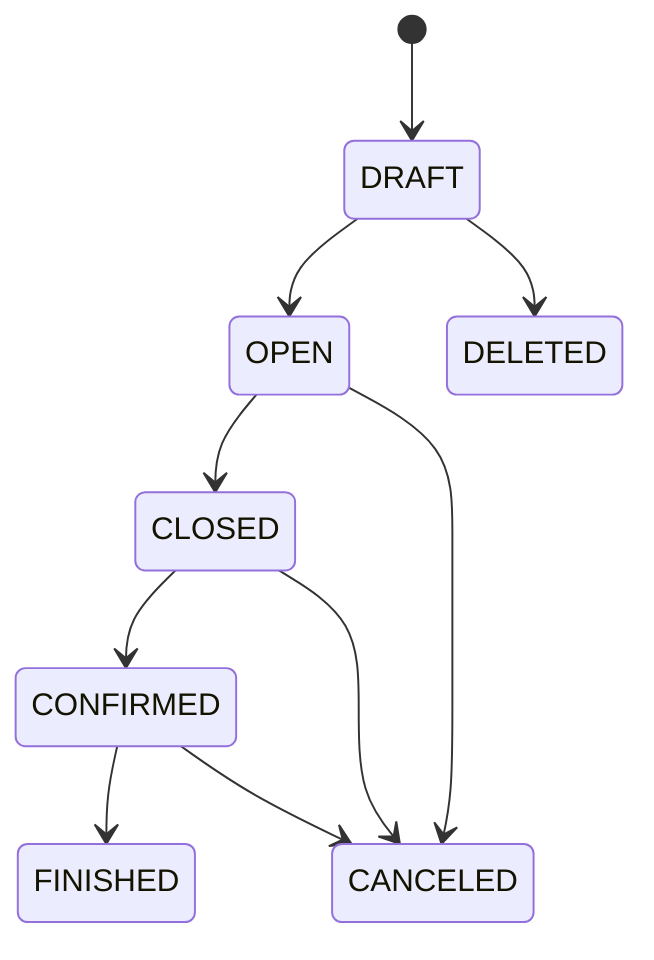

# 그룹미팅 시스템

## 문서 역할

- 역할: `설명`
- 문서 종류: `architecture`
- 충돌 시 우선 문서: [보안/접근통제 정책](../policy/security-access-control-policy.md), [결제 운영 정책](../policy/payment-ops-policy.md), [푸시알림 운영 정책](../policy/push-notification-policy.md), [데이터 거버넌스 정책](../policy/data-governance-policy.md)
- 기준 성격: `to-be`

제공된 화면 기획과 2026-07-08 기준 API/Admin/Mobile/DB를 대조한 1차 구현 기준이다.
기존 2:2 그룹미팅의 UI와 처리 패턴만 참고하고 `group_meeting` 도메인의 DB/API는 분리한다.

## 확정 범위

1차 범위는 `행사 생성 -> 모집 -> 신청 -> Admin 승인/확정 취소 -> 모임 확정 -> 그룹 채팅 -> 종료 -> 후기`다.

- 포함: 행사 목록/상세/내 모임, 긴 상세 이미지, 성별 정원, 신청/승인/확정 취소, 미니프로필 열람,
  그룹 채팅/unread, 행사·회원 신고, 후기와 Key 보상, 푸시, 운영 감사
- 제외: 현장 체크인, 좌석/회전 라운드, 라운드별 호감 선택, 전역 회원 패널티, 외부 결제/정산
- 호스트는 참가 정원에서 제외한다.
- 남녀 정원은 각각 2명 이상 20명 이하로 고정한다.
- 신청 자체에는 Key를 차감하지 않는다. 화면의 입금 확인은 외부 확인 후 Admin 승인으로 표현한다.
- 사진 미공개 행사의 미니프로필은 기존 설정 `t_setting.id=16`, 사진 공개 행사의 사진프로필은
  `t_setting.id=18`, 후기 보상은 `t_setting.id=20`의 서버 값을 사용한다. 거래 row에는 실제 적용한
  값을 `t_member_key_log.key/key_total`로 남기며 클라이언트가 보낸 Key 값은 사용하지 않는다.
- 모임 확정은 남녀 승인 인원이 각각 2명 이상이면 Admin이 수행한다. 남은 APPLIED는 별도 미선정 상태로
  바꾸지 않고 행사 CONFIRMED 이후 미확정 마감으로 해석한다.
  확정 transaction에서는 채팅 구성원만 만든다.
- 기존 2:2는 남녀 2명씩 총 4명 충원 시 채팅을 열지만, n대n은 설정 정원 전체 충원을 요구하지 않는다.
  개인의 참가 여부는 application APPROVED, 행사 진행 여부와 채팅 오픈은 event CONFIRMED로 구분한다.
- Admin CMS의 운영 목적 프로필 조회는 무료이며 감사 로그를 남긴다. Mobile에서는 호스트와 승인
  참가자 모두 다른 회원의 프로필을 최초 열람할 때 Key를 차감한다.

## 기존 구조 재사용 기준

| 대상 | 판정 |
| --- | --- |
| `t_meeting*`, `/meeting/*`, `MEET_*` FCM | 데이터/상태/타입 재사용 금지 |
| `t_member`, 승인 프로필 | 회원 조회 SoT로 재사용 |
| `t_admin` | Admin 인증 주체로 재사용 |
| 매니저 긴 이미지 처리 | upload/polling/worker/slice 코드 패턴 재사용 |
| `t_manager_detail_profile_*` | 매니저 FK이므로 행사 row 저장 금지 |
| `t_member_key_log` | 전체 Key 원장으로 함께 기록 |
| `t_alarm` | 그룹미팅 알림도 기존 수신자/type/content/target 구조로 저장 |

## 서버 운영 설정 (`t_setting`)

`t_setting`은 Mobile의 설정 탭이 아니라 Admin에서 Key 비용과 보상값을 관리하는 서버 운영 설정이다.
그룹미팅 화면은 설정을 보여주는 것이 아니라, 아래 행위가 발생할 때 API가 해당 값을 읽어 적용한다.

| 설정 ID | 그룹미팅 용도 | 2026-07-08 운영값 예시 |
| --- | --- | --- |
| 16 | 사진 미공개 행사의 미니프로필 최초 열람 비용 | -10 Key |
| 18 | 사진 공개 행사의 사진프로필 최초 열람 비용 | -25 Key |
| 20 | 종료 후기 최초 작성 보상 | +5 Key |

- 1차는 기존 row를 read-only로 공유한다. id/value/title/content를 변경하지 않고 신규 row/테이블이나
  event 가격 snapshot 컬럼도 만들지 않는다.
- 실제 적용 금액과 잔액은 기존 `t_member_key_log`에 기록한다. 그룹미팅 Key 로그의 content는 API의 신규
  그룹미팅 i18n 문구를 사용하며 `t_setting.title/content`를 사용자 문구로 재사용하지 않는다.

## DB 공통 기준

- 신규 테이블은 MySQL 8.4.9와 MariaDB 10.6.24 공통 DDL만 사용하고 모든 `CREATE TABLE` 끝에
  `ENGINE=InnoDB DEFAULT CHARSET=utf8mb4 COLLATE=utf8mb4_general_ci`를 명시한다.
- PK/FK는 기존 스키마와 `t_alarm.target`에 맞춰 signed `INT AUTO_INCREMENT`를 사용한다. 1차 범위에는
  21억 건을 넘는 단일 테이블이 없으므로 `BIGINT`를 선반영하지 않는다.
- 행사/신청/채팅 같은 비즈니스 상태는 `TINYINT`와 서버 enum을 1:1로 고정한다. 긴 이미지 worker 상태만
  재사용 코드와 맞춰 폐쇄형 ASCII `VARCHAR(20)`을 사용한다.
- `created_at`은 `DEFAULT CURRENT_TIMESTAMP`, `updated_at`은
  `DEFAULT CURRENT_TIMESTAMP ON UPDATE CURRENT_TIMESTAMP`를 사용한다.
- `client_message_id`, `*_idempotency_key`, action/status 문자열은
  `CHARACTER SET ascii COLLATE ascii_bin`으로 저장해 대소문자/locale 비교 차이를 막는다.
- host/event/application/chat/profile view/review/report/action log는 hard delete하지 않는다. media
  version/slice만 아래 cleanup 기준에 따라 정리할 수 있다.
- 회원/Admin 삭제 뒤에도 운영 기록이 필요한 FK는 nullable + `ON DELETE SET NULL`을 사용한다.
- 상태 변경, Key 변경, 채팅 구성원 생성까지만 원천 transaction에서 수행한다. 알림은 commit 성공 후
  `sendFCMPush()` 한 경로에서만 전송·저장하며 그룹미팅 코드가 `t_alarm`을 직접 insert하지 않는다.
- 정원 승인은 행사 row를 `SELECT ... FOR UPDATE`로 잠그고 승인 수를 다시 집계한다.
- 재전송 key는 행위 주체 범위의 UNIQUE로 멱등 처리한다. unique 충돌 시 같은 주체의 기존 성공 결과만
  반환하고 다른 주체의 row를 반환하지 않는다.

## 최종 테이블 구성

필수 테이블은 11개다. 신청과 참가자를 분리하지 않고, 도메인별 상태 이력과 감사 로그를
`t_group_meeting_action_log` 하나로 통합한다.

| 번호 | 테이블 | 책임 |
| --- | --- | --- |
| 1 | `t_group_meeting_host` | Admin과 호스트 회원 연결 |
| 2 | `t_group_meeting_event` | 행사/모집/확정 생명주기 |
| 3 | `t_group_meeting_event_detail_image_version` | 긴 이미지 처리 버전 |
| 4 | `t_group_meeting_event_detail_image_slice` | 긴 이미지 slice |
| 5 | `t_group_meeting_application` | 신청과 참가 자격 SoT |
| 6 | `t_group_meeting_chat_member` | 행사 채팅 구성원 principal과 unread 경계 |
| 7 | `t_group_meeting_chat_message` | 행사별 호스트/참가자 채팅 메시지 |
| 8 | `t_group_meeting_profile_view` | 미니/사진프로필 최초 열람과 과금 |
| 9 | `t_group_meeting_review` | 종료 후기와 보상 snapshot |
| 10 | `t_group_meeting_report` | 행사/회원 신고 |
| 11 | `t_group_meeting_action_log` | 상태 변경과 운영 감사 통합 로그 |

## 정규화 결정

- 해시태그는 검색/필터 조건이 아닌 필수 화면 표시값이므로 event의 `hashtags VARCHAR(255) NOT NULL`
  한 컬럼에 `#직장검증 #강남 #와인`처럼 ASCII 공백 한 칸으로 구분해 저장한다. 별도 태그 테이블과
  배열/JSON 컬럼은 만들지 않는다.
- Mobile은 `#단어` 입력 뒤 스페이스를 누르면 유효한 태그를 검정색 블록으로 확정한다. 각 token은 `#`으로
  시작하고 `#` 뒤에 `#` 이외의 공백 없는 한 글자 이상이 있어야 한다. 태그 내부 공백, 선행/후행/연속 공백,
  빈 token, 완전히 같은 token의 중복 입력은 Mobile과 API에서 거절한다.
- server는 중복 제거, trim, 공백 정규화로 잘못된 입력을 보정하지 않고 canonical 문자열만 저장한다.
  기획에 별도 개수나 개별 태그 길이 제한이 없으므로 전체 `VARCHAR(255)` 범위 외 제한은 추가하지 않는다.
- application의 gender/alias snapshot은 현재 회원정보의 복제가 아니라 행사 당시 표시값을 보존하는
  시간축 데이터다. 현재 프로필 SoT로 사용하지 않는다.
- Admin의 확정 취소는 application을 `APPROVED -> CANCELED`로 변경한다. CANCELED는 입금 확인 후
  승인된 참여를 취소해 외부 환불이 필요한 경우에만 사용하며, 취소 actor/reason/time은 action log에
  보존한다.
- profile view는 대상 application을, review는 작성자 application을 직접 참조한다. 행사/대상 회원을
  다시 저장하지 않고 application에서 조회한다.
- 행사당 채팅은 하나이므로 event.id를 채팅 식별자로 사용한다. 별도 chat room 테이블/ID/상태를 만들지 않고
  송신 가능 여부는 event.status, 참가자 자격은 application.status에서 판정한다.
- profile view 종류와 Key 설정은 OPEN 뒤 불변인 event.photo_public에서 판정하므로 profile_type을
  중복 저장하지 않는다.
- chat member는 `host_id`와 `application_id` 중 하나만 채운다. `host_id`가 있으면 HOST,
  `application_id`가 있으면 PARTICIPANT로 판정해 role을 중복 저장하지 않는다.
- profile view/review는 적용된 기존 `t_member_key_log.id`를 직접 참조한다. 변동량/잔액을 별도
  그룹미팅 원장에 중복 저장하지 않으며 각 원천 UNIQUE가 재처리 멱등성의 최종 DB guard다.
- action log의 actor_id와 action/target_id는 삭제 후에도 남아야 하는 감사 snapshot이다.
  비즈니스 관계 판정에는 사용하지 않고 event_id와 원천 테이블을 기준으로 판정한다.
- report의 reporter/target member ID도 신고 당시 감사 snapshot으로 보존하며 회원 FK를 두지 않는다.
  접수 시 회원/행사 관계를 server transaction에서 검증하고 회원 삭제 뒤에는 원천 회원과 다시 연결하지 않는다.
- 화면 기획에 JSON 감사 상세나 가변 알림 payload 보관 요구가 없으므로 신규 JSON 컬럼은 만들지 않는다.
  그룹미팅 알림은 기존 `t_alarm`의 type/content/target과 서버 FCM 상수를 사용한다.

### 기존 `t_alarm` 매핑

- `member`: 수신 `t_member.id`
- `type`: 아래 77~83의 신규 `GROUP_MEETING_*` FCM type
- `content`: type별 서버 i18n 문구를 확정해 저장
- `target`: 모든 그룹미팅 알림은 `t_group_meeting_event.id`
- Mobile은 type으로 행사 상세 또는 행사 채팅 화면을 판정한다. 추가 route/payload 컬럼은 만들지 않는다.
- application 상태 version, `client_message_id`, profile view/review UNIQUE 등으로 원천 write의 중복
  반영을 막는다.
  API는 신규 write가 실제 1건 commit된 경우에만 기존 `sendFCMPush()`를 한 번 호출한다.
- `sendFCMPush()`가 FCM과 `t_alarm` 저장의 단일 책임자다. 그룹미팅 코드의 별도 `t_alarm` insert,
  outbox/delivery/retry 테이블과 payload 컬럼은 만들지 않는다.

| 값 | 상수 | 수신자/발생 조건 | 설정 | target |
| --- | --- | --- | --- | --- |
| 77 | `GROUP_MEETING_APPLICATION_RECEIVED` | 호스트 / 신규 신청 | `alarm_event` | event ID |
| 78 | `GROUP_MEETING_APPLICATION_APPROVED` | 신청자 / Admin 승인 | `alarm_event` | event ID |
| 79 | `GROUP_MEETING_APPLICATION_CANCELED` | 신청자 / Admin 확정 취소, 외부 환불 필요 | `alarm_event` | event ID |
| 80 | `GROUP_MEETING_EVENT_CONFIRMED` | 승인 참가자 / 모임 확정 | `alarm_event` | event ID |
| 81 | `GROUP_MEETING_EVENT_CANCELED` | APPLIED/APPROVED 신청자와 필요 시 호스트 / 행사 취소 | `alarm_event` | event ID |
| 82 | `GROUP_MEETING_CHAT_MESSAGE` | 송신자 외 현재 채팅 구성원 / 신규 메시지 | `alarm_chat` | event ID |
| 83 | `GROUP_MEETING_REVIEW_AVAILABLE` | APPROVED/LEFT 참가자 / 행사 종료 | `alarm_event` | event ID |

- 운영 `t_alarm.type`은 signed `TINYINT`이고 현재 최대 타입은 76이므로 77~83은 범위 안의 미사용 값이다.
  구현 직전 운영 상수 재조회로 재사용 여부를 다시 확인하며 한 값이라도 선점됐으면 전체 예약표를 새 미사용
  연속 구간으로 옮긴다.
- 기존 `sendFCMPush()`는 현재 `alarm_chat`, `alarm_match`만 일부 타입에 적용하므로 77~81/83에는
  `alarm_event`, 82에는 `alarm_chat`을 적용하는 서버 분기와 테스트를 추가한다. 설정이 N이면 FCM과
  `t_alarm` 저장을 모두 건너뛴다.
- 서버 push content, Mobile 상수와 foreground/background/open 라우팅, 알림 목록 target 라우팅을 함께
  추가한다. 현재 앱은 미정의 타입에서 crash는 나지 않지만 탭 라우팅을 하지 않으므로, 77~83을 인식하는
  Mobile 버전을 먼저 배포하고 최소 지원 버전 도달 뒤 서버 발송을 활성화한다. 신규 Mobile 구현은 이후
  미정의 타입에 오류/경고 로그를 남긴다.

## 테이블 정의

### 1. `t_group_meeting_host`

| 컬럼 | 타입 | Null | 기본값 | 설명 |
| --- | --- | --- | --- | --- |
| id | INT | N | AUTO_INCREMENT | PK |
| admin_id | INT | Y | NULL | `t_admin.id`, 삭제 후 이력 보존 시 null |
| member_id | INT | Y | NULL | 호스트 Mobile 신원 |
| created_at | DATETIME | N | CURRENT_TIMESTAMP | 생성 시각 |

- `UNIQUE(admin_id)`, `UNIQUE(member_id)`
- 연결 시 `t_admin.super=0`인 파트너 Admin과 유효한 Mobile 회원인지 server에서 검증한다.
- 생성된 host의 Admin/회원 연결은 교체하거나 host row를 삭제하지 않는다. 원천 Admin/회원 삭제가 필요하면
  DRAFT/OPEN/CLOSED/CONFIRMED 행사가 없는지 확인하고, 삭제 뒤에는 해당 FK만 null로 바꿔 host/event 이력을
  보존한다.
- 최초 연결은 Super Admin만 수행하며 입력 사유와 `HOST_CREATED` action log를 남긴다.

### 2. `t_group_meeting_event`

| 컬럼 | 타입 | Null | 기본값 | 설명 |
| --- | --- | --- | --- | --- |
| id | INT | N | AUTO_INCREMENT | PK |
| host_id | INT | N | - | `t_group_meeting_host.id` |
| title | VARCHAR(255) | N | - | 행사명 |
| thumbnail_path | VARCHAR(255) | N | - | 목록 이미지 상대경로 |
| detail_text | TEXT | Y | NULL | 이미지 외 안내문 |
| hashtags | VARCHAR(255) | N | - | 필수 자유입력 해시태그, `#단어`를 공백 한 칸으로 구분 |
| detail_image_version_id | INT | Y | NULL | 현재 ready 긴 이미지 |
| event_at | DATETIME | N | - | 모임 일시 |
| application_close_at | DATETIME | N | - | 신청 마감 시각 |
| location | VARCHAR(255) | N | - | 장소 |
| fee_amount | INT UNSIGNED | N | 0 | 화면 표시 회비, 0=없음 |
| photo_public | TINYINT | N | 0 | 0=미니프로필, 1=사진 공개 |
| male_capacity | TINYINT UNSIGNED | N | - | 남성 정원 2~20 |
| female_capacity | TINYINT UNSIGNED | N | - | 여성 정원 2~20 |
| status | TINYINT | N | 0 | 행사 상태 |
| version | INT UNSIGNED | N | 1 | optimistic lock |
| create_idempotency_key | VARCHAR(128) CHARACTER SET ascii COLLATE ascii_bin | N | - | 행사 생성 재전송 방지 |
| created_at | DATETIME | N | CURRENT_TIMESTAMP | 생성 시각 |
| updated_at | DATETIME | N | CURRENT_TIMESTAMP | 수정 시각 |

- `INDEX(status, created_at, id)`, `INDEX(status, application_close_at)`,
  `INDEX(host_id, status, created_at, id)`
- chat member의 행사-호스트 복합 FK를 위한 `UNIQUE(id, host_id)`
- `UNIQUE(host_id, create_idempotency_key)`
- 모집 시작은 별도 시각 컬럼 없이 `DRAFT -> OPEN` action log 시각으로 기록한다.
- `DRAFT -> OPEN` 전이는 `detail_image_version_id`가 같은 행사에 attach된 ready version일 때만 허용한다.
  DRAFT에서는 업로드·교체 작업을 위해 null을 허용한다.
- `OPEN` 이후 title, 일시, 장소, 정원, 사진 공개 여부 변경은 신청자 영향 때문에 금지한다.

### 3. `t_group_meeting_event_detail_image_version`

| 컬럼 | 타입 | Null | 기본값 | 설명 |
| --- | --- | --- | --- | --- |
| id | INT | N | AUTO_INCREMENT | PK |
| event_id | INT | Y | NULL | draft는 null, attach 후 행사 ID |
| source_image_path | VARCHAR(255) | N | - | 원본 상대경로 |
| source_width | INT UNSIGNED | N | - | 원본 폭 |
| source_height | INT UNSIGNED | N | - | 원본 높이 |
| target_width | INT UNSIGNED | N | 1080 | 변환 폭 |
| slice_height | INT UNSIGNED | N | 2048 | slice 기준 높이 |
| slice_count | INT UNSIGNED | N | 0 | slice 수 |
| total_bytes | BIGINT | N | 0 | slice 총 byte, 기존 매니저 worker 타입과 동일 |
| status | VARCHAR(20) CHARACTER SET ascii COLLATE ascii_bin | N | 'pending' | pending/processing/ready/failed/discarded |
| error_message | VARCHAR(255) | Y | NULL | 실패 사유 |
| created_by_admin_id | INT | Y | NULL | 업로드 Admin |
| created_at | DATETIME | N | CURRENT_TIMESTAMP | 생성 시각 |
| processing_started_at | DATETIME | Y | NULL | worker 시작 |
| completed_at | DATETIME | Y | NULL | 완료/실패 시각 |

- `UNIQUE(id, event_id)`, `INDEX(event_id, created_at)`, `INDEX(status, created_at)`
- 신규 upload는 `created_by_admin_id`를 반드시 채운다. nullable은 Admin 삭제 시
  `ON DELETE SET NULL`을 허용하기 위한 보관 예외다.
- ready version만 행사에 attach한다. attach 시 `event_id`를 동시에 설정한다.
- ready 전환 transaction에서 slice_index가 0부터 `slice_count - 1`까지 연속인지,
  `slice_count = COUNT(slice)`, `total_bytes = SUM(slice.byte_size)`인지 검증한다.
- 교체/clear된 이전 version은 discarded로 바꾸고 파일 cleanup 대상으로 처리한다.

### 4. `t_group_meeting_event_detail_image_slice`

| 컬럼 | 타입 | Null | 기본값 | 설명 |
| --- | --- | --- | --- | --- |
| id | INT | N | AUTO_INCREMENT | PK |
| version_id | INT | N | - | 이미지 version |
| slice_index | INT UNSIGNED | N | - | 0부터 시작하는 순서 |
| image_path | VARCHAR(255) | N | - | WebP 상대경로 |
| width | INT UNSIGNED | N | - | 폭 |
| height | INT UNSIGNED | N | - | 높이 |
| byte_size | INT UNSIGNED | N | - | byte 크기 |
| created_at | DATETIME | N | CURRENT_TIMESTAMP | 생성 시각 |

- `UNIQUE(version_id, slice_index)`

### 5. `t_group_meeting_application`

신청과 승인 후 참가 자격을 한 row로 관리한다.

| 컬럼 | 타입 | Null | 기본값 | 설명 |
| --- | --- | --- | --- | --- |
| id | INT | N | AUTO_INCREMENT | PK |
| event_id | INT | N | - | 행사 |
| member_id | INT | Y | NULL | 신청 회원 |
| gender_snapshot | CHAR(1) CHARACTER SET ascii COLLATE ascii_bin | N | - | 신청 시 M/F |
| alias_snapshot | VARCHAR(255) | N | - | 행사 표시 별칭 |
| status | TINYINT | N | 0 | 신청 상태 |
| version | INT UNSIGNED | N | 1 | 동시 승인/확정 취소 방지 |
| approved_at | DATETIME | Y | NULL | 최초 참여 승인 시각, CANCELED/LEFT에도 유지 |
| created_at | DATETIME | N | CURRENT_TIMESTAMP | 신청 시각 |
| updated_at | DATETIME | N | CURRENT_TIMESTAMP | 상태 변경 시각 |

- `UNIQUE(event_id, member_id)`, 복합 FK 부모 key용 `UNIQUE(id, event_id)`
- `INDEX(event_id, status, gender_snapshot)`, `INDEX(member_id, status, event_id)`
- 신규 신청의 `member_id`는 반드시 채운다. nullable은 회원 개인정보 삭제 후 신청 이력을 보존하기 위한
  `ON DELETE SET NULL` 예외다.
- 확정 취소/퇴장 사유와 actor 및 정확한 발생 시각은 같은 transaction의 action log에 기록한다.
- 행사 CONFIRMED 이후 신규 승인과 확정 취소를 금지한다. 남은 APPLIED는 미확정 마감 상태로만 조회한다.

### 6. `t_group_meeting_chat_member`

| 컬럼 | 타입 | Null | 기본값 | 설명 |
| --- | --- | --- | --- | --- |
| id | INT | N | AUTO_INCREMENT | PK |
| event_id | INT | N | - | 행사이자 채팅 식별자 |
| application_id | INT | Y | NULL | 참가자는 신청 ID, 호스트는 null |
| host_id | INT | Y | NULL | 호스트는 행사에 연결된 host ID, 참가자는 null |
| last_read_message_id | INT | Y | NULL | unread 경계 |
| created_at | DATETIME | N | CURRENT_TIMESTAMP | 구성원 생성 시각 |

- `UNIQUE(application_id)`, `UNIQUE(event_id, host_id)`, 복합 FK 부모 key용 `UNIQUE(id, event_id)`,
  `INDEX(event_id, id)`
- 호스트 row는 `host_id`만, 참가자 row는 `application_id`만 채운다. 호스트 표시는
  `host.member_id -> t_member.nickname`에서 조회하고 회원정보가 정리됐으면 비식별 기본 문구를 사용한다.
  참가자 row는 생성 시 APPROVED application을 참조하고 이후 application이 LEFT가 되어도 메시지 표시
  이력 때문에 보존한다. 참가자 회원과 표시 별칭은 application에서 조회한다.
- HOST의 송신 자격은 event.host_id의 host.member_id가 요청 회원과 같고 유효한 회원 상태인지, 참가자의
  송신 자격은 현재 APPROVED application인지로 판정한다. LEFT application의 chat member는 읽기·쓰기
  자격 없이 이력으로만 남는다.
- unread 수는 같은 event의 정상 메시지 중 `id > COALESCE(last_read_message_id, 0)`인 건수로 계산한다.

### 7. `t_group_meeting_chat_message`

| 컬럼 | 타입 | Null | 기본값 | 설명 |
| --- | --- | --- | --- | --- |
| id | INT | N | AUTO_INCREMENT | PK |
| event_id | INT | N | - | 행사이자 채팅 식별자 |
| sender_chat_member_id | INT | N | - | 호스트 또는 참가자 chat member |
| content | TEXT | N | - | 메시지 |
| client_message_id | VARCHAR(64) CHARACTER SET ascii COLLATE ascii_bin | N | - | Mobile 재전송 키 |
| status | TINYINT | N | 1 | 1=NORMAL, 2=ADMIN_DELETED |
| created_at | DATETIME | N | CURRENT_TIMESTAMP | 발송 시각 |

- `INDEX(event_id, id)`, `UNIQUE(sender_chat_member_id, client_message_id)`,
  복합 FK 부모 key용 `UNIQUE(id, event_id)`
- 시스템 메시지는 저장하지 않는다. 호스트 안내도 host chat member가 작성한 일반 메시지로 저장한다.
- 삭제 actor/reason은 action log에 기록하며 메시지는 hard delete하지 않는다.

### 8. `t_group_meeting_profile_view`

| 컬럼 | 타입 | Null | 기본값 | 설명 |
| --- | --- | --- | --- | --- |
| id | INT | N | AUTO_INCREMENT | PK |
| viewer_member_id | INT | Y | NULL | 열람자 |
| target_application_id | INT | N | - | 열람 대상 신청 |
| member_key_log_id | INT | N | - | 열람 Key 차감 원장 ID |
| created_at | DATETIME | N | CURRENT_TIMESTAMP | 최초 열람 시각 |

- `UNIQUE(viewer_member_id, target_application_id)`, `UNIQUE(member_key_log_id)`
- 신규 열람 row의 `viewer_member_id`는 반드시 채운다. nullable은 회원 삭제 시 `ON DELETE SET NULL`을
  허용하기 위한 보관 예외이며 null viewer로 신규 insert하지 않는다.
- Mobile 호스트는 APPLIED/APPROVED 신청자를, APPROVED 참가자는 다른 APPROVED 참가자를 열람할 수
  있으며 본인은 열람/과금 대상이 아니다.
- 열람 대상 회원과 행사는 `target_application_id -> application.member_id/event_id`로 조회한다. 같은 값을
  profile view에 중복 저장하지 않는다.
- target application의 event.photo_public=0이면 MINI/id16, 1이면 PHOTO/id18을 서버에서 선택한다.
- 최초 열람 row, 회원 Key, 기존 Key 원장을 한 transaction에서 저장한다.
- `member_key_log_id`는 같은 transaction에서 생성한 기존 Key 원장 row를 반드시 참조한다. Key 원장은
  서비스 이용 기록으로 보존하므로 null을 허용하거나 회원 삭제에 연동해 제거하지 않는다.

### 9. `t_group_meeting_review`

| 컬럼 | 타입 | Null | 기본값 | 설명 |
| --- | --- | --- | --- | --- |
| id | INT | N | AUTO_INCREMENT | PK |
| application_id | INT | N | - | 작성자 신청 |
| result | TINYINT | N | - | 1=GOOD, 2=BAD |
| content | VARCHAR(1000) | N | - | GOOD/BAD 모두 필수인 후기 내용 |
| member_key_log_id | INT | N | - | 후기 보상 Key 원장 ID |
| created_at | DATETIME | N | CURRENT_TIMESTAMP | 작성 시각 |

- `UNIQUE(application_id)`, `UNIQUE(member_key_log_id)`
- 작성 회원과 행사는 `application_id -> application.member_id/event_id`로 조회한다. `event_id`와
  `member_id`를 review에 중복 저장하지 않는다.
- 후기, 회원 Key, 기존 Key 원장을 한 transaction에서 저장한다.
- `member_key_log_id`는 같은 transaction에서 생성한 기존 Key 원장 row를 반드시 참조하며 null을 허용하지 않는다.

### 10. `t_group_meeting_report`

| 컬럼 | 타입 | Null | 기본값 | 설명 |
| --- | --- | --- | --- | --- |
| id | INT | N | AUTO_INCREMENT | PK |
| event_id | INT | N | - | 관련 행사 |
| reporter_member_id | INT | N | - | 신고 당시 회원 ID snapshot |
| target_member_id | INT | Y | NULL | 회원 신고 대상 |
| reason_code | TINYINT | N | - | target null은 `BLAME_TYPE`, 값이 있으면 `BLAME_TYPE_USER` |
| content | VARCHAR(1000) | Y | NULL | 기타 사유/상세 |
| idempotency_key | VARCHAR(128) CHARACTER SET ascii COLLATE ascii_bin | N | - | 신고 접수 재전송 방지 |
| status | TINYINT | N | 0 | 0=PENDING, 1=RESOLVED, 2=DISMISSED |
| created_at | DATETIME | N | CURRENT_TIMESTAMP | 접수 시각 |

- `UNIQUE(reporter_member_id, idempotency_key)`, `INDEX(status, created_at)`,
  `INDEX(event_id, target_member_id)`
- 신고 처리는 Super Admin만 수행하며 처리자·사유·처리 시각은 같은 transaction의 action log에만 남긴다.

### 11. `t_group_meeting_action_log`

별도 도메인별 상태 history를 만들지 않고 운영 감사와 상태 이력을 합친다.

| 컬럼 | 타입 | Null | 기본값 | 설명 |
| --- | --- | --- | --- | --- |
| id | INT | N | AUTO_INCREMENT | PK |
| event_id | INT | Y | NULL | 관련 행사 |
| actor_type | TINYINT | N | - | 1=MEMBER, 2=ADMIN, 3=SYSTEM |
| actor_id | INT | Y | NULL | MEMBER/ADMIN 내부 ID, SYSTEM은 null |
| action | VARCHAR(64) CHARACTER SET ascii COLLATE ascii_bin | N | - | 폐쇄형 서버 상수 |
| target_id | INT | N | - | action이 가리키는 대상 ID |
| from_status | TINYINT | Y | NULL | 상태 변경 전 |
| to_status | TINYINT | Y | NULL | 상태 변경 후 |
| reason | VARCHAR(500) | Y | NULL | 확정 취소/삭제 등 사유 |
| request_id | VARCHAR(64) CHARACTER SET ascii COLLATE ascii_bin | N | - | 서버 요청 추적 ID |
| created_at | DATETIME | N | CURRENT_TIMESTAMP | 발생 시각 |

- `INDEX(event_id, created_at)`, `INDEX(action, target_id, id)`, `INDEX(request_id)`
- action은 아래 목록만 허용하며 대상 종류도 함께 고정한다.

| 대상 | 허용 action |
| --- | --- |
| HOST | `HOST_CREATED` |
| EVENT | `EVENT_CREATED`, `EVENT_UPDATED`, `EVENT_OPENED`, `EVENT_CLOSED`, `EVENT_CONFIRMED`, `EVENT_FINISHED`, `EVENT_CANCELED`, `EVENT_DELETED` |
| APPLICATION | `APPLICATION_APPROVED`, `APPLICATION_CANCELED`, `APPLICATION_LEFT` |
| REPORT | `REPORT_RESOLVED`, `REPORT_DISMISSED` |
| MESSAGE | `MESSAGE_ADMIN_DELETED` |
| MEMBER | `ADMIN_PROFILE_VIEWED` |
| DETAIL_IMAGE_VERSION | `DETAIL_IMAGE_ATTACHED`, `DETAIL_IMAGE_DISCARDED` |

- EVENT/APPLICATION/REPORT의 상태 전이 action과 `MESSAGE_ADMIN_DELETED`는 from/to를 모두 기록하고
  서로 다른 값이어야 한다. 생성·일반 수정·조회 및 문자열 상태를 쓰는 detail image action은 둘 다 null로 둔다.
- 호스트 연결, 참여 승인/확정 취소, 행사 취소/삭제, 신고 처리, 메시지 삭제,
  운영 프로필 조회, 이미지 폐기처럼 사유가 필요한 중요 운영 action은 reason을 필수로 기록한다.
  일반 행사 생성·수정·모집·확정·종료와 MEMBER/SYSTEM action은 reason을 null로 둘 수 있으며 값이 있으면
  공백이 아니어야 한다.
- request_id는 클라이언트 입력이 아니라 API 요청 또는 서버 job 실행 컨텍스트에서 생성해 모든 action log에
  저장한다.

## FK와 삭제 정책

| 자식 컬럼 | 부모 | ON DELETE |
| --- | --- | --- |
| host.admin_id | `t_admin.id` | SET NULL |
| host.member_id | `t_member.id` | SET NULL |
| event.host_id | host.id | RESTRICT |
| detail version.event_id | event.id | SET NULL |
| detail version.created_by_admin_id | `t_admin.id` | SET NULL |
| detail slice.version_id | detail version.id | CASCADE |
| application.event_id | event.id | RESTRICT |
| application.member_id | `t_member.id` | SET NULL |
| chat member.event_id | event.id | RESTRICT |
| chat member.(application_id, event_id) | application.(id, event_id) | RESTRICT |
| chat member.(event_id, host_id) | event.(id, host_id) | RESTRICT |
| chat message.(sender_chat_member_id, event_id) | chat member.(id, event_id) | RESTRICT |
| profile view.viewer_member_id | `t_member.id` | SET NULL |
| profile view.target_application_id | application.id | RESTRICT |
| profile view.member_key_log_id | `t_member_key_log.id` | RESTRICT |
| review.application_id | application.id | RESTRICT |
| review.member_key_log_id | `t_member_key_log.id` | RESTRICT |
| report.event_id | event.id | RESTRICT |
| action log.event_id | event.id | RESTRICT |

모든 FK의 `ON UPDATE`는 `RESTRICT`로 고정한다. PK 변경으로 관계를 이동하지 않는다.

순환 참조는 테이블 생성 뒤 `ALTER TABLE`로 추가한다.

- event의 `(detail_image_version_id, id)` -> detail version의 `(id, event_id)`, `ON DELETE RESTRICT`
- chat member의 `(last_read_message_id, event_id)` -> chat message의 `(id, event_id)`, `ON DELETE RESTRICT`
  메시지는 hard delete하지 않으므로 읽음 경계도 삭제 연동하지 않는다.

## DDL CHECK 제약

아래 조건은 API validation에만 두지 않고 MySQL 8.4/MariaDB 10.6 공통 `CHECK`로도 생성한다.

| 테이블 | CHECK |
| --- | --- |
| event | `status IN (-2,-1,0,1,2,3,4) AND version > 0 AND application_close_at <= event_at AND photo_public IN (0,1) AND male_capacity BETWEEN 2 AND 20 AND female_capacity BETWEEN 2 AND 20 AND CHAR_LENGTH(TRIM(title)) > 0 AND CHAR_LENGTH(TRIM(thumbnail_path)) > 0 AND CHAR_LENGTH(TRIM(location)) > 0 AND CHAR_LENGTH(TRIM(create_idempotency_key)) > 0 AND hashtags REGEXP '^#[^[:space:]#]+( #[^[:space:]#]+)*$'` |
| detail version | `CHAR_LENGTH(TRIM(source_image_path)) > 0 AND source_width > 0 AND source_height > 0 AND target_width > 0 AND slice_height > 0 AND total_bytes >= 0 AND ((status = 'pending' AND processing_started_at IS NULL AND completed_at IS NULL AND error_message IS NULL) OR (status = 'processing' AND processing_started_at IS NOT NULL AND completed_at IS NULL AND error_message IS NULL) OR (status = 'ready' AND processing_started_at IS NOT NULL AND completed_at IS NOT NULL AND error_message IS NULL AND slice_count > 0 AND total_bytes > 0) OR (status = 'failed' AND completed_at IS NOT NULL AND error_message IS NOT NULL AND CHAR_LENGTH(TRIM(error_message)) > 0) OR (status = 'discarded' AND completed_at IS NOT NULL AND (error_message IS NULL OR CHAR_LENGTH(TRIM(error_message)) > 0))) AND (processing_started_at IS NULL OR processing_started_at >= created_at) AND (completed_at IS NULL OR completed_at >= COALESCE(processing_started_at, created_at))` |
| detail slice | `CHAR_LENGTH(TRIM(image_path)) > 0 AND width > 0 AND height > 0 AND byte_size > 0` |
| application | `gender_snapshot IN ('M','F') AND CHAR_LENGTH(TRIM(alias_snapshot)) > 0 AND version > 0 AND status IN (-2,-1,0,1) AND ((status = 0 AND approved_at IS NULL) OR (status IN (-2,-1,1) AND approved_at IS NOT NULL))` |
| chat member | `(application_id IS NULL AND host_id IS NOT NULL) OR (application_id IS NOT NULL AND host_id IS NULL)` |
| chat message | `status IN (1,2) AND CHAR_LENGTH(TRIM(content)) > 0 AND CHAR_LENGTH(TRIM(client_message_id)) > 0` |
| review | `result IN (1,2) AND CHAR_LENGTH(TRIM(content)) > 0` |
| report | `status IN (0,1,2) AND reporter_member_id > 0 AND CHAR_LENGTH(TRIM(idempotency_key)) > 0 AND ((target_member_id IS NULL AND reason_code BETWEEN 1 AND 6) OR (target_member_id IS NOT NULL AND target_member_id > 0 AND target_member_id <> reporter_member_id AND reason_code BETWEEN 1 AND 6)) AND (reason_code <> 6 OR (content IS NOT NULL AND CHAR_LENGTH(TRIM(content)) > 0))` |
| action log 공통 | `actor_type IN (1,2,3) AND target_id > 0 AND CHAR_LENGTH(TRIM(action)) > 0 AND CHAR_LENGTH(TRIM(request_id)) > 0 AND ((actor_type IN (1,2) AND actor_id IS NOT NULL AND actor_id > 0) OR (actor_type = 3 AND actor_id IS NULL)) AND (reason IS NULL OR CHAR_LENGTH(TRIM(reason)) > 0)` |

action log에는 공통 CHECK와 함께 아래 폐쇄형 action CHECK를 추가한다. action 자체가 대상 테이블을
유일하게 결정하므로 target_type은 저장하지 않는다.

```sql
action IN (
  'HOST_CREATED',
  'EVENT_CREATED','EVENT_UPDATED','EVENT_OPENED','EVENT_CLOSED','EVENT_CONFIRMED',
  'EVENT_FINISHED','EVENT_CANCELED','EVENT_DELETED',
  'APPLICATION_APPROVED','APPLICATION_CANCELED','APPLICATION_LEFT',
  'REPORT_RESOLVED','REPORT_DISMISSED','MESSAGE_ADMIN_DELETED','ADMIN_PROFILE_VIEWED',
  'DETAIL_IMAGE_ATTACHED','DETAIL_IMAGE_DISCARDED'
)
```

action과 actor 종류도 DB에서 고정한다.

```sql
(actor_type = 1 AND action IN (
  'APPLICATION_LEFT'
))
OR (actor_type = 2 AND action IN (
  'HOST_CREATED',
  'EVENT_CREATED','EVENT_UPDATED','EVENT_OPENED','EVENT_CLOSED','EVENT_CONFIRMED',
  'EVENT_FINISHED','EVENT_CANCELED','EVENT_DELETED',
  'APPLICATION_APPROVED','APPLICATION_CANCELED',
  'REPORT_RESOLVED','REPORT_DISMISSED',
  'MESSAGE_ADMIN_DELETED','ADMIN_PROFILE_VIEWED',
  'DETAIL_IMAGE_ATTACHED','DETAIL_IMAGE_DISCARDED'
))
OR (actor_type = 3 AND action IN ('EVENT_CLOSED','EVENT_FINISHED'))
```

중요 운영 action의 사유만 별도 CHECK로 필수화한다.

```sql
action NOT IN (
  'HOST_CREATED','EVENT_CANCELED','EVENT_DELETED',
  'APPLICATION_APPROVED','APPLICATION_CANCELED',
  'REPORT_RESOLVED','REPORT_DISMISSED','MESSAGE_ADMIN_DELETED','ADMIN_PROFILE_VIEWED',
  'DETAIL_IMAGE_DISCARDED'
) OR (reason IS NOT NULL AND CHAR_LENGTH(TRIM(reason)) > 0)
```

상태 전이 action의 정확한 from/to와 비상태 action의 null 조합도 별도 CHECK로 고정한다.

```sql
(action = 'EVENT_OPENED' AND from_status = 0 AND to_status = 1)
OR (action = 'EVENT_CLOSED' AND from_status = 1 AND to_status = 2)
OR (action = 'EVENT_CONFIRMED' AND from_status = 2 AND to_status = 3)
OR (action = 'EVENT_FINISHED' AND from_status = 3 AND to_status = 4)
OR (action = 'EVENT_CANCELED' AND from_status IN (1,2,3) AND to_status = -1)
OR (action = 'EVENT_DELETED' AND from_status = 0 AND to_status = -2)
OR (action = 'APPLICATION_APPROVED' AND from_status = 0 AND to_status = 1)
OR (action = 'APPLICATION_CANCELED' AND from_status = 1 AND to_status = -1)
OR (action = 'APPLICATION_LEFT' AND from_status = 1 AND to_status = -2)
OR (action = 'REPORT_RESOLVED' AND from_status = 0 AND to_status = 1)
OR (action = 'REPORT_DISMISSED' AND from_status = 0 AND to_status = 2)
OR (action = 'MESSAGE_ADMIN_DELETED' AND from_status = 1 AND to_status = 2)
OR (action IN (
  'HOST_CREATED','EVENT_CREATED','EVENT_UPDATED','ADMIN_PROFILE_VIEWED',
  'DETAIL_IMAGE_ATTACHED','DETAIL_IMAGE_DISCARDED'
) AND from_status IS NULL AND to_status IS NULL)
```

event 연결 CHECK는 HOST action만 event_id가 null이고, 분리된 이미지 폐기는 null을 허용하며 나머지 action은
event_id를 필수로 갖도록 한다.

```sql
(action = 'HOST_CREATED' AND event_id IS NULL)
OR (action = 'DETAIL_IMAGE_DISCARDED')
OR (action NOT IN ('HOST_CREATED','DETAIL_IMAGE_DISCARDED')
    AND event_id IS NOT NULL)
```

EVENT action은 target_id와 event_id가 같은 행사인지 DB CHECK로도 고정한다.

```sql
action NOT IN (
  'EVENT_CREATED','EVENT_UPDATED','EVENT_OPENED','EVENT_CLOSED','EVENT_CONFIRMED',
  'EVENT_FINISHED','EVENT_CANCELED','EVENT_DELETED'
) OR target_id = event_id
```

chat member 생성 시 application이 실제 APPROVED인지, 보존 중에는 APPROVED/LEFT인지 같은 상태 조건은
CHECK/FK로 표현하지 못하므로 같은 transaction의 lock 조회와 통합 테스트로 강제한다. application/chat
member/message/last_read message의 event 일치는 위 복합 FK로 강제한다. 같은 방식으로 detail version,
HOST 소유관계, profile view viewer/target application, review application과 report 대상의 event 일치도 및
`member_key_log_id`의 회원/변동량이 잠근 회원과 서버 설정값에 일치하는지 검증한다.

action log 저장 전에는 action이 가리키는 application/report/message/member가 event_id 소속인지, attach된
detail version이 같은 event 소유인지 검증한다. 분리된 detail version 폐기는 created_by/요청 Admin 소유권을
검증한다. MEMBER actor는 원천 application 회원과 같아야 하고, ADMIN actor는 event 소유 Admin 또는 해당
action에 필요한 Super Admin 권한을 가져야 한다. SYSTEM actor는 허용된 job action과 서버 job identity를
검증한 경우만 허용한다.

## 변경 허용 범위

- `t_group_meeting_action_log`, `t_group_meeting_profile_view`는 business append-only다. 개인정보/부모 row 정리로
  nullable FK가 `ON DELETE SET NULL` 되는 변경만 예외다.
- `t_group_meeting_review`는 business 수정/삭제를 금지하고 개인정보 정리 시 content를 비식별 문구로
  바꾸는 것만 허용한다.
- `t_group_meeting_chat_message`는 insert 후 Admin 삭제 시 `status`만 변경한다. 회원 개인정보 정리 시의
  content 비식별화만 예외로 허용한다.
- `t_group_meeting_report`는 status와 개인정보 정리 시의 자유문 비식별화만 변경한다.
- event/application의 상태와 version은 상태 전이 service만 갱신한다.

## 데이터 분류와 보관

| 분류 | 대상 | 접근/보관 기준 |
| --- | --- | --- |
| 일반 | 공개 행사, hashtags, 공개 상세 이미지 | 행사 노출/운영 기간 동안 보관 |
| 내부 | application 상태/snapshot, chat membership, profile view, review 결과, Key log 연결, action metadata | 회원/API/Admin 권한에 따라 최소 조회 |
| 민감 | chat content, report content | 운영 목적 권한과 마스킹 적용 |

- chat/review/report 자유문은 행사 이력 조회와 CS·신고 처리를 위해 관련 회원이 LEAVE/BLOCK 상태가
  되기 전까지 보관한다. LEAVE/BLOCK 뒤에는 `t_member.status_date` 기준 30일이 지나면 기존 회원 자동
  정리 job에서 해당 회원이 작성했거나 대상인 그룹미팅 파생 개인정보를 아래 기준으로 비식별화한다.
- action log의 reason에는 연락처·프로필 원문·인증정보를 넣지 않고 확정 취소/삭제의 최소 운영
  사유만 남긴다.
- 회원 LEAVE/BLOCK 후 30일 개인정보 정리 전에 group_meeting 파생 저장소도 같은 cleanup transaction/작업에 포함한다.
- 회원 작성 chat content와 review 자유문은 비식별 문구로 교체한다.
- application alias도 비식별 문구로 교체한다.
- report 자유문은 직접 식별자를 제거한다.
- nullable member/admin FK는 부모 삭제 시 null 처리한다. RESTRICT 관계의 부모 row는 업무 이력으로
  보존하고 삭제하지 않는다. 행사/application 상태, 익명화된 신고, 기존 Key log와 action metadata는
  운영 감사 목적의 비개인 기록으로 보존한다.
- action actor_id는 부모 FK를 두지 않는 내부 감사 snapshot이며 부모 삭제 뒤에는 원천 회원/Admin과
  다시 연결하지 않는다.
- failed/discarded 또는 행사에서 분리된 상세 이미지 version은 기존 매니저 상세 이미지 cleanup과 같은
  기준으로 원본/slice 파일과 metadata를 정리한다.

## 상태 모델

### 행사

| 값 | 상수 | 의미 |
| --- | --- | --- |
| -2 | DELETED | 신청자가 없는 DRAFT 삭제 |
| -1 | CANCELED | 모집/확정 후 취소 |
| 0 | DRAFT | 작성 중 |
| 1 | OPEN | 신청 가능 |
| 2 | CLOSED | 신청 마감/승인 처리 중 |
| 3 | CONFIRMED | 모임 확정, 채팅 OPEN |
| 4 | FINISHED | 행사 종료, 후기 가능 |



### 신청

| 값 | 상수 | 의미 |
| --- | --- | --- |
| -2 | LEFT | 승인 후 채팅 퇴장 |
| -1 | CANCELED | Admin 확정 취소, 외부 환불 필요 |
| 0 | APPLIED | 신청 접수 |
| 1 | APPROVED | 입금 확인 후 참여 승인 |

- 허용 전이: `APPLIED -> APPROVED`, `APPROVED -> CANCELED | LEFT`
- `APPROVED -> CANCELED`는 행사 CONFIRMED 전 Admin의 확정 취소다. `approved_at`은 승인 증빙으로
  유지하고 version을 증가시키며, 확정 취소 사유/시각은 action log에 보존한다. CANCELED는 외부 환불이
  필요한 상태라는 의미만 가지며 환불 완료 여부나 금액은 저장하지 않는다.
- `APPROVED -> LEFT`는 행사 CONFIRMED 상태에서 참가자가 채팅을 퇴장할 때만 허용한다.
- 같은 회원은 같은 행사에 한 번만 신청하며 CANCELED 뒤 재신청은 허용하지 않는다.
- 행사 CONFIRMED 시 남아 있는 APPLIED는 상태를 변경하지 않는다. 행사 상태와 조합해 미확정 마감으로
  표시하고 이후 승인/취소 API를 허용하지 않는다.
- 행사 CANCELED는 신청 상태를 덮어쓰지 않는다. 행사 상태로 전체 취소를 해석한다.

## 핵심 transaction

### 신청

1. 행사 OPEN, 마감 전, 성별 정원 설정, 회원 상태와 중복 신청을 검증한다.
2. 원천 이력인 application을 저장한다. 접수 주체·상태·시각이 application에 있으므로 생성 action log를
   중복 저장하지 않는다.
3. transaction commit 뒤 신규 application insert가 성공한 경우에만 호스트 대상으로 77 타입
   `sendFCMPush()`를 한 번 호출한다. 중복 신청 재요청에는 호출하지 않는다.

### 참여 승인과 모임 확정

1. 행사 소유권과 application version을 검증한다.
2. event/application row를 lock하고 해당 성별 APPROVED 수를 재집계한다.
3. 참여 승인 시 CMS에서 입금 확인 사유를 필수로 받고 application을 `APPLIED -> APPROVED`로 변경한다.
   approved_at, version, 사유를 포함한 action log를 같은 transaction에 저장한다.
4. 확정 취소 시 행사 CONFIRMED 전인지 확인하고 application을 `APPROVED -> CANCELED`로 바꾼다.
   approved_at은 유지하고 version과 `APPLICATION_CANCELED` action log를 같은 transaction에 저장한다.
   CANCELED는 CMS에서 외부 환불이 필요한 대상으로 표시한다.
5. 모임 확정 시 남녀 APPROVED 각각 2명 이상을 확인한다. 설정 정원 전체 충원은 요구하지 않으며 남은
   APPLIED는 미확정 마감으로 남긴다.
6. event CONFIRMED와 `host_id`를 채운 호스트, `application_id`를 채운 참가자 chat member를 한
   transaction에 저장한다. 최초 시스템 메시지는 만들지 않는다.
7. commit 뒤 참여 승인, 확정 취소 또는 모임 확정이 실제 반영된 경우에만 각각 78, 79 또는 80 타입으로 대상별
   `sendFCMPush()`를 한 번 호출한다.

### 행사 취소/종료

1. 행사 취소는 event를 CANCELED로 바꾸고 action log를 같은 transaction에 저장한다. commit 성공 시
   APPLIED/APPROVED 신청자와 Super Admin 취소 시 호스트에게 81 타입을 보낸다. 취소 내용을 채팅 메시지로
   저장하지 않는다.
2. 행사 종료는 event를 FINISHED로 바꾸고 action log를 같은 transaction에 저장한 뒤 commit 성공 시
   APPROVED/LEFT 참가자에게 83 타입을 보낸다.

### 채팅 전송/읽음/퇴장

1. 메시지 전송은 event와 sender chat member를 lock한다. event CONFIRMED이고 sender가 event host의
   Mobile 회원이거나 APPROVED application인 경우만 허용한다.
2. 같은 sender/client_message_id가 없을 때 message를 insert하고 sender의 last_read_message_id를 신규
   message.id까지 함께 단조 증가시킨다. commit 뒤 신규 message insert가
   성공한 경우에만 sender를 제외한 host와 APPROVED 참가자에게 82 타입 `sendFCMPush()`를 한 번 호출한다.
3. 읽음 처리는 대상 message가 같은 event인지 확인하고 기존 값보다 큰 ID일 때만 last_read_message_id를
   단조 증가시킨다.
4. 참가자 퇴장은 application/chat member를 함께 lock해 application을 LEFT로 바꾸고 action log를 같은
   transaction에 저장한다. 별도 퇴장 메시지는 만들지 않으며 chat member row는 메시지 표시 이력 때문에
   보존한다. 이후 자격은 application LEFT로 차단한다. 퇴장으로 chat message, 82 타입 FCM 또는 `t_alarm`을
   만들지 않는다.
   호스트는 채팅 퇴장이 아니라 행사 취소 절차를 사용한다.

### 프로필 열람

1. target application과 event를 조회해 Mobile 호스트는 같은 행사의 APPLIED/APPROVED 신청자,
   APPROVED 참가자는 다른 APPROVED 참가자만 target으로 허용한다.
2. event.photo_public에 따라 `t_setting.id=16` 또는 `id=18`을 서버에서 읽고 viewer `t_member` row를
   `SELECT ... FOR UPDATE`로 잠근 뒤 기존 profile view를 다시 확인하고 잔액을 검증한다.
3. `t_member_key_log`, profile view의 `member_key_log_id`, 회원 Key를 한 transaction에 저장한다.
4. unique 충돌은 transaction 전체를 rollback하고 기존 열람 성공을 반환해 재차감하지 않는다.

### 후기

1. application을 기준으로 행사 FINISHED와 작성자의 APPROVED 또는 LEFT 이력, GOOD/BAD와 공백이 아닌
   필수 후기 content를 검증한다.
2. `t_setting.id=20` 값을 서버에서 읽고 작성자의 `t_member` row를 `SELECT ... FOR UPDATE`로 잠근 뒤
   기존 review를 다시 확인한다.
3. `t_member_key_log`, review의 `member_key_log_id`, 회원 Key를 한 transaction에 저장한다.
4. unique 충돌은 transaction 전체를 rollback하고 기존 성공을 반환해 중복 보상하지 않는다.

## 저장하지 않고 계산하는 값

- 행사 신청/승인/성별 인원수: application을 status/gender로 집계한다.
- 참가자: APPROVED application 자체가 참가자 SoT이므로 별도 participant row를 만들지 않는다.
- 외부 입금 상태: DB 결제 기능이 아니며 입금 확인 뒤 application APPROVED로 표현한다.
- 행사/신청 상태 이력과 처리 사유: action log에서 조회한다.
- unread 수: chat member의 last_read_message_id와 정상 message를 비교한다.
- 프로필 열람/후기 Key 금액과 변경 후 잔액: t_setting에서 읽어 기존 `t_member_key_log`에 기록한다.

## 프론트 read model과 DB VIEW

반복되는 성별 신청/승인 집계는 `v_group_meeting_event_application_summary`를 단일 SoT로 제공한다. VIEW는
event를 기준으로 application을 LEFT JOIN하고 `SUM(CASE WHEN ... THEN 1 ELSE 0 END)`를 사용해 MySQL/MariaDB
공통 문법으로 만든다.

| VIEW 컬럼 | 의미 |
| --- | --- |
| event_id | 행사 ID, VIEW 내 유일 row |
| male_applied_count | 남성 APPLIED 수 |
| female_applied_count | 여성 APPLIED 수 |
| male_approved_count | 남성 APPROVED 수 |
| female_approved_count | 여성 APPROVED 수 |

호출자별 내 application status/권한은 파라미터에 따라 달라지므로 repository query에서 VIEW에 결합한다.
API DTO는 Swagger/contracts에 필수 응답으로 정의한다.

| API read model | 구성 원천 |
| --- | --- |
| `GroupMeetingEventListItem` | event + host/member 요약 + hashtags + application summary VIEW + 내 application status |
| `GroupMeetingEventDetail` | event + ready image slices + application summary VIEW + 내 권한 + 서버 Key 설정 |
| `GroupMeetingMyEventItem` | EventListItem + host/participant role |
| `GroupMeetingApplicantItem` | application + 승인 프로필 요약 + 내가 열람한 profile view 여부 |
| `GroupMeetingChatListItem` | application/event + last message + unread 수 |
| `GroupMeetingChatMessageItem` | message + sender principal별 host 회원 nickname/application alias, 운영 삭제 표기 |
| `GroupMeetingReviewState` | event FINISHED 여부 + application 자격 + 기존 review 여부 + reward Key |

- raw DB row, 내부 status history와 `t_member_key_log` 연결은 프론트 응답으로 직접 노출하지 않는다.
- 공개 행사 목록은 OPEN/CLOSED/CONFIRMED를 먼저, FINISHED/CANCELED를 뒤에 두고 각 그룹에서
  `created_at DESC, id DESC`로 정렬한다. DRAFT/DELETED는 호스트/Admin 조회에서만 노출한다.
- 채팅 목록은 APPLIED 신청도 메시지 없이 노출해 “호스트 검토 중” 상태를 표시한다. CONFIRMED 뒤에는
  event/message를 결합하고 FINISHED/CANCELED는 읽기 전용 종료 상태로 표시한다.
- unread처럼 호출자별 계산이 필요한 값은 VIEW에 넣지 않고 repository query에서 계산한다.

## API 범위

### Mobile

- 행사 목록/상세/내가 만든 모임/내가 참여한 모임
- 신청/신청자 목록(호스트 회원)
- 미니/사진프로필 최초 열람
- 채팅방 목록, 메시지 목록/전송/읽음/퇴장
- 행사/회원 신고, 종료 후기

### Admin

- 행사 목록/상세/생성/수정/모집 시작/마감/모임 확정/종료/취소
- 신청 목록/승인/확정 취소
- 긴 이미지 upload/status/discard
- 신고 목록/처리, 채팅 메시지 운영 삭제

동시 수정 대상 write API는 `version`을, 재전송 가능한 생성/메시지/신고 API는 각각 명시된 idempotency key
또는 `client_message_id`를 받는다. 상태 전이와 Admin 감사 대상 write는 API 요청/job 실행 컨텍스트가
생성한 request_id를 action log에 기록하며 클라이언트가 감사용 request_id를 결정하지 않는다.

## 필수 검증

- 같은 host/create_idempotency_key와 reporter/idempotency_key 재요청이 행사/신고를 중복 생성하지 않는다.
- 행사 생성/수정에서 hashtags의 null/빈 문자열, `#` 없는 token, 내부 공백, 선행/후행/연속 공백과 중복
  token은 실패한다. 유효한 입력은 별도 정규화 없이 공백 한 칸 구분 문자열로 저장한다.
- ready 상태의 같은 행사 detail image version이 없으면 DRAFT 행사를 OPEN으로 바꿀 수 없다.
- 동일 회원의 행사 중복 신청과 동일 Mobile write 재전송이 한 번만 반영된다.
- 행사 CONFIRMED 전 확정 취소는 application을 CANCELED로 바꾸고 approved_at을 유지하며
  version과 `APPLICATION_CANCELED` action log를 함께 반영한다. CONFIRMED 이후에는 실패한다.
- 동시 승인에도 성별 정원 20명을 초과하지 않는다.
- 다른 호스트 Admin은 행사/신청/이미지 version을 조회·변경할 수 없다.
- DRAFT/OPEN/CLOSED/CONFIRMED 행사가 연결된 host의 원천 Admin/회원 삭제는 실패한다. 종료된 행사만 있으면
  host row와 event 이력을 유지하고 삭제된 원천 FK만 null 처리한다.
- ready가 아니거나 다른 행사 소유인 긴 이미지 version은 attach되지 않는다.
- 다른 event의 application/chat member/message를 연결하거나 다른 event message를 last_read 경계로
  설정하면 복합 FK로 실패한다.
- CONFIRMED 시 남녀 승인 인원이 각각 2명 이상이며 남은 APPLIED는 미확정 마감으로 조회된다.
- 호스트가 아니면서 APPROVED가 아닌 회원과 LEFT 회원은 채팅을 읽거나 쓰지 못한다.
- chat message는 호스트/참가자 sender와 client_message_id가 모두 있어야 하며 sender 없는 시스템 메시지는 실패한다.
- 신규 메시지는 sender 자신의 unread에 포함되지 않고 sender에게 푸시/`t_alarm`을 생성하지 않는다.
- 같은 대상의 프로필 재열람과 후기 재요청으로 Key가 중복 변경되지 않는다.
- profile view/review의 `member_key_log_id` 누락이나 잠근 회원·설정 금액과 다른 Key 원장 연결은 실패한다.
- GOOD/BAD 모두 공백이 아닌 후기 content가 없으면 작성과 Key 보상이 실패한다.
- null viewer profile view insert는 실패하고 회원 삭제로 null 처리된 이력만 허용한다.
- 호스트 연결, 참여 승인/확정 취소, 신고 처리, 메시지 삭제, 행사 취소는 사유를 포함한
  action log 없이 완료되지 않는다.
- 참가자 퇴장은 application과 action log만 반영하고 chat message, 82 타입 FCM, `t_alarm`을 만들지 않는다.
- EVENT action의 target_id/event_id 불일치와 다른 event 소속 target/권한 없는 actor의 action log는 실패한다.
- 행사 FINISHED/CANCELED 시 event 상태로 채팅 송신이 닫히고 이후 메시지 전송이 실패한다.
- 동일 상태 전이/메시지 재요청은 DB에 중복 반영되지 않고 `sendFCMPush()`도 다시 호출되지 않는다.
- 그룹미팅 코드가 `t_alarm`을 직접 insert하지 않아 기존 `sendFCMPush()`의 저장과 중복되지 않는다.
- 회원 개인정보 정리 후 파생 개인정보가 익명화되고 행사/신고/기존 Key log 연결/감사 기록은 정해진
  보관 정책을 따른다.

## Migration Gate 적용

이 문서는 DB 설계 SoT이며 실제 11개 테이블과 1개 VIEW 생성은 migration SQL로 수행한다.
기존 `t_setting` row는 읽기만 하며 변경 migration을 만들지 않는다.
미구현 상태와 후속 API/Admin/Mobile 작업은 [기술 부채 인벤토리](../technical-debt/technical-debt.md)의
`24) 그룹미팅 1차 구현 미착수`에서 추적한다.

| Gate | 적용 | 검증 |
| --- | --- | --- |
| `DBM-GATE-000` | 필수 | CHECK와 복합 UNIQUE/FK 지원, 부모 테이블 타입/collation, FCM 77~83 미사용 확인 |
| `DBM-GATE-010` | 필수 | migration checksum과 dev/prod `schema_migrations` 기록 |
| `DBM-GATE-100` | 필수 | 11개 테이블과 1개 VIEW, PK/UNIQUE/INDEX/FK/CHECK의 SHOW CREATE diff와 실패 guard |
| `DBM-GATE-200` | N/A | 기존 데이터 backfill/보정 없음. `t_setting.id IN (16,18,20)`은 변경하지 않고 read-only 재사용 |
| `DBM-GATE-300` | N/A | 기존 read/write 기준을 변경하지 않음 |
| `DBM-GATE-400` | N/A | 기존 객체 drop/contract 없음 |

로컬 운영 dump에서 잘못된 CHECK row, FK 불일치, 중복 idempotency, 정원 동시 승인, Key 중복 지급을
실패 fixture로 검증한 뒤에만 개발계/운영계 적용 대상으로 본다.

## 관련 문서

- [기존 2:2 그룹미팅 시스템](meeting-system.md)
- [채팅 시스템](chat-system.md)
- [업로드/미디어 시스템](upload-media-system.md)
- [푸시알림 시스템](push-notification.md)
- [관리자 권한 시스템](admin-permission.md)
- [결제 시스템](payment-system.md)
- [보안/접근통제 정책](../policy/security-access-control-policy.md)
- [결제 운영 정책](../policy/payment-ops-policy.md)
- [푸시알림 운영 정책](../policy/push-notification-policy.md)
- [데이터 거버넌스 정책](../policy/data-governance-policy.md)
- [DB Migration Gate 정책](../policy/db-migration-gate-policy.md)
- [기술 부채 인벤토리](../technical-debt/technical-debt.md)
