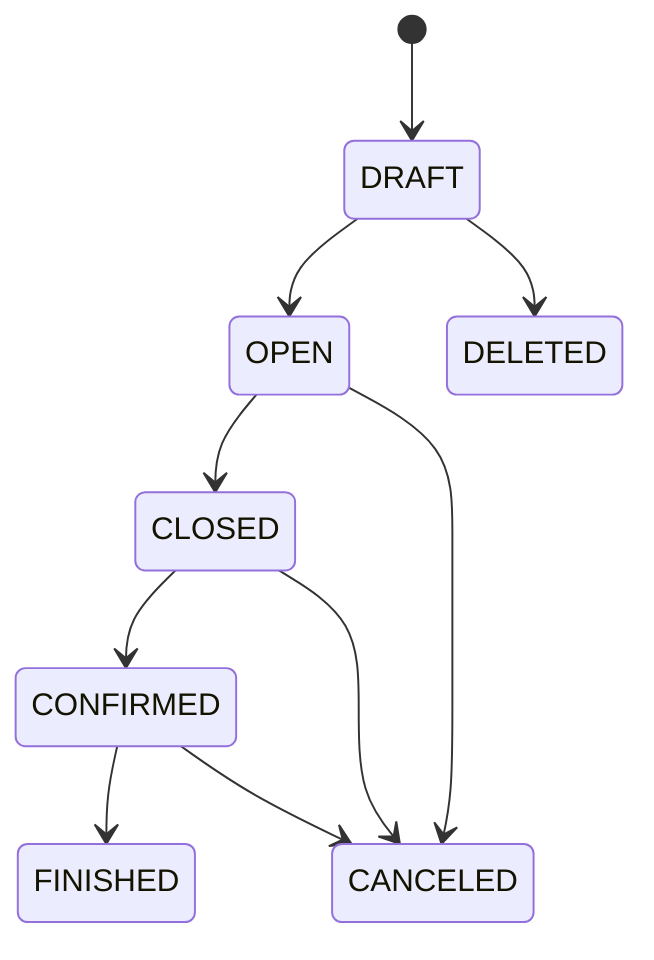

# 그룹미팅 시스템

## 문서 역할

- 역할: `설명`
- 문서 종류: `architecture`
- 충돌 시 우선 문서: [보안/접근통제 정책](../policy/security-access-control-policy.md), [결제 운영 정책](../policy/payment-ops-policy.md), [푸시알림 운영 정책](../policy/push-notification-policy.md), [데이터 거버넌스 정책](../policy/data-governance-policy.md)
- 기준 성격: `to-be`

신규 n대n 그룹미팅의 공개 논리 계약을 설명한다. 기존 2:2 미팅과 데이터·상태·API 계약을 공유하지 않는다.
물리 테이블, 컬럼, 제약과 migration은 private `coupler-api` schema contract에서 관리한다.

## 확정 범위

1차 범위는 `행사 생성 -> 모집 -> 신청 -> Admin 승인 또는 확정 취소 -> 모임 확정 -> 그룹 채팅 -> 종료 ->
후기`다.

- 포함: 행사 목록·상세·내 모임, 긴 상세 이미지, 성별 정원, 신청·승인·확정 취소, 프로필 열람, 그룹
  채팅·읽지 않은 메시지, 회원 신고, 후기와 Key 보상, 푸시, 운영 감사
- 제외: 현장 체크인, 좌석·회전 라운드, 라운드별 호감 선택, 외부 결제·정산
- 호스트는 참가 정원에서 제외한다.
- 남녀 정원은 각각 2명 이상 20명 이하로 고정한다.
- 신청 자체에는 Key를 차감하지 않는다.
- 모임 확정은 남녀 승인 인원이 각각 2명 이상일 때 Admin이 수행한다. 정원 전체 충원을 요구하지 않는다.
- 확정되지 않은 신청은 행사 확정 이후 미확정 마감으로 해석하며 별도 선정 실패 상태를 만들지 않는다.
- 기존 2:2 계약은 [기존 2:2 그룹미팅 시스템](meeting-system.md)이 계속 소유한다.

## 논리 데이터 모델

- 도메인 ID: `group-meeting`

### 논리 엔티티

| 논리 ID | 표시명 | 구조 유형 | 기록 역할 | 책임 | 최고 데이터 분류 | 생명주기 |
| --- | --- | --- | --- | --- | --- | --- |
| `group-meeting.host` | 그룹미팅 호스트 | root | state | 운영자 계정과 호스트 회원의 연결 | 민감 | 활성 행사가 없을 때 연결 해제 가능하며 행사 이력의 호스트 참조는 보존 |
| `group-meeting.event` | 그룹미팅 행사 | root | state | 모집·마감·확정·종료와 공개 행사 정보 | 민감 | 삭제·취소·종료 상태로 보존하고 공개 이미지는 정책에 따라 정리 |
| `group-meeting.detail-version` | 행사 상세 이미지 버전 | child | snapshot | 긴 상세 이미지의 원본과 변환 상태 | 내부 | 현재 버전은 유지하고 실패·교체 버전은 정리 가능 |
| `group-meeting.detail-slice` | 행사 상세 이미지 조각 | child | snapshot | 상세 이미지 버전의 표시용 조각 | 내부 | 상위 버전 정리 시 파일과 함께 삭제 |
| `group-meeting.application` | 그룹미팅 신청 | relation | state | 회원의 신청·승인·확정 취소·퇴장 자격 | 민감 | 행사 종료 뒤 신청 당시 별칭과 상태를 비식별 이력으로 보존 가능 |
| `group-meeting.participant` | 그룹미팅 참여자 | relation | state | 확정 채팅 참여 자격과 읽음 경계 | 내부 | 자격 종료 뒤에도 메시지 표시 이력을 위해 보존 가능 |
| `group-meeting.review` | 그룹미팅 후기 | child | history | 종료 행사에 대한 회원 후기와 보상 연결 | 민감 | 회원 개인정보 정리 시 자유문을 비식별화하고 보상 이력은 보존 |
| `group-meeting.action-history` | 그룹미팅 행위 이력 | child | history | 상태 전이와 중요 운영 행위의 행위자·사유 | 내부 | append-only 감사 이력으로 보존 |

### 관계

| 출발 논리 ID | 관계 유형 | 도착 논리 ID | 카디널리티 | 소유·삭제 규칙 |
| --- | --- | --- | --- | --- |
| `group-meeting.host` | references | `admin-access.operator` | N:1 | 관리자 계정 회수 뒤에도 과거 운영 이력은 보존 |
| `group-meeting.host` | references | `member.member` | 1:1 | 호스트 회원 개인정보 정리 뒤 비식별 표시 사용 |
| `group-meeting.host` | owns | `group-meeting.event` | 1:N | 활성 행사가 있으면 호스트 연결 삭제를 금지 |
| `group-meeting.event` | owns | `group-meeting.detail-version` | 1:N | 현재 활성 버전은 행사와 함께 유지 |
| `group-meeting.detail-version` | owns | `group-meeting.detail-slice` | 1:N | 버전 정리 시 조각과 파일을 함께 정리 |
| `group-meeting.event` | owns | `group-meeting.application` | 1:N | 신청 이력은 행사와 함께 보존 |
| `group-meeting.event` | owns | `group-meeting.participant` | 1:N | 승인 자격과 대화 참여 자격을 분리해 판정 |
| `group-meeting.event` | owns | `group-meeting.review` | 1:N | 신청 회원당 최초 후기 하나만 허용 |
| `group-meeting.event` | owns | `group-meeting.action-history` | 1:N | 행사 상태 변경과 같은 transaction에서 기록 |
| `group-meeting.participant` | associates | `conversation.thread` | N:1 | 유효한 참여자만 그룹 채팅을 읽고 쓸 수 있음 |
| `group-meeting.application` | associates | `key-wallet.profile-access` | N:M | 승인 참가자 간 최초 유료 열람만 거래로 기록 |
| `group-meeting.application` | associates | `moderation.member-report` | N:M | 같은 행사 참여 문맥에서만 회원 신고 허용 |

### 불변조건

| 규칙 ID | 관련 논리 ID | 불변조건 | 기준 문서 |
| --- | --- | --- | --- |
| `GROUP-MEETING-INV-001` | `group-meeting.event` | 행사와 신청·참여·메시지·후기·신고는 같은 행사 문맥에 속해야 한다 | [엔지니어링 가드레일](../policy/engineering-guardrails.md) |
| `GROUP-MEETING-INV-002` | `group-meeting.application` | 한 회원은 같은 행사에 활성 신청을 하나만 가질 수 있다 | 이 문서 |
| `GROUP-MEETING-INV-003` | `group-meeting.event` | 모임 확정 시 남녀 승인 인원은 각각 두 명 이상이며 각 정원을 넘지 않는다 | 이 문서 |
| `GROUP-MEETING-INV-004` | `group-meeting.participant` | 호스트 또는 승인 신청 중 정확히 하나의 자격으로 참여한다 | [보안/접근통제 정책](../policy/security-access-control-policy.md) |
| `GROUP-MEETING-INV-005` | `group-meeting.review` | 종료된 행사에서 유효하게 참여한 회원만 최초 후기와 보상을 받을 수 있다 | [결제 운영 정책](../policy/payment-ops-policy.md) |
| `GROUP-MEETING-INV-006` | `group-meeting.action-history` | 상태 변경과 감사 이력은 같은 요청·transaction의 결론을 가져야 한다 | [엔지니어링 가드레일](../policy/engineering-guardrails.md) |

## 외부 도메인 소유권

| 데이터 | 소유 도메인 | 그룹미팅 사용 기준 |
| --- | --- | --- |
| 회원 계정과 현재 프로필 | `member` | 호스트·신청자·참여자 자격 확인 |
| Key 잔액과 변동 원장 | `key-wallet` | 참가자 프로필 최초 열람 차감과 후기 보상 |
| 채팅방과 메시지 | `conversation` | 행사 확정 뒤 호스트·승인 참가자 대화 |
| 회원 신고 | `moderation` | 같은 행사 채팅 참여자 사이의 신고 |
| 알림 설정과 발송 이력 | `notification` | 행사·신청·채팅·후기 알림 |
| 서버 운영 설정 | `platform-config` | 프로필 열람 비용과 후기 보상값 |

그룹미팅 문서는 위 엔티티를 다시 정의하지 않고 논리 ID와 사용 조건만 설명한다.

## 상태 모델

### 행사

| 상태 | 의미 |
| --- | --- |
| `DRAFT` | 작성 중 |
| `OPEN` | 신청 가능 |
| `CLOSED` | 신청 마감·승인 처리 중 |
| `CONFIRMED` | 모임 확정·채팅 가능 |
| `FINISHED` | 행사 종료·후기 가능 |
| `CANCELED` | 모집 또는 확정 뒤 취소 |
| `DELETED` | 신청자가 없는 작성 중 행사 삭제 |

- 모집 시작 전에는 공개 정보와 상세 이미지를 수정할 수 있다.
- 모집 시작 뒤에는 신청자 판단에 영향을 주는 일시·장소·정원·프로필 공개 기준을 변경하지 않는다.
- 신청 마감 시각이 지나면 시스템이 `OPEN -> CLOSED`로 전환할 수 있다.
- 확정 행사는 예정 시각 이후 운영 기준에 따라 자동 종료한다.

### 신청

| 상태 | 의미 |
| --- | --- |
| `APPLIED` | 신청 완료·승인 대기 |
| `APPROVED` | Admin 승인·참가 확정 |
| `CANCELED` | 승인 뒤 Admin 확정 취소·외부 환불 필요 |
| `LEFT` | 확정 행사 참여 뒤 사용자 퇴장 |

- 사용자의 확정 전 신청 취소는 1차 범위에 포함하지 않는다.
- 승인·확정 취소는 Admin 권한과 행사 정원을 transaction 안에서 다시 검증한다.
- `LEFT`는 과거 참여·메시지 표시 이력을 삭제하지 않고 현재 접근 자격만 종료한다.

## 주요 transaction

### 신청

1. 행사 상태와 신청 마감 여부를 확인한다.
2. 회원 상태와 동일 행사 활성 신청 중복을 확인한다.
3. 행사 당시 표시 별칭과 성별을 snapshot으로 보존한다.
4. 신청 성공 뒤 호스트 알림을 한 번만 생성한다.

### 승인과 모임 확정

1. 행사와 신청을 잠그고 현재 승인 인원을 다시 계산한다.
2. 신청을 승인하거나, 승인된 신청을 확정 취소한다.
3. 모임 확정 시 남녀 승인 인원 최소 조건을 검증한다.
4. 확정 참가자와 호스트의 대화 참여 자격을 한 transaction에서 만든다.
5. 상태 변경과 `group-meeting.action-history`를 같은 transaction에 기록한다.
6. 알림은 commit 이후 [푸시알림 운영 정책](../policy/push-notification-policy.md)의 단일 발송 경계에서 처리한다.

### 채팅

- 대화 가능 여부는 행사 상태와 현재 참여 자격에서 판정한다.
- 메시지 재전송 식별자는 발신자 범위에서 멱등 처리한다.
- 읽음 경계는 같은 행사 메시지만 참조하며 과거 값보다 뒤로 이동하지 않는다.
- 참가자 퇴장이나 후기 완료로 접근이 종료돼도 과거 메시지와 참여 이력은 hard delete하지 않는다.

### 프로필 열람과 후기

- Mobile 호스트의 신청자 프로필 조회와 Admin 운영 조회는 무료이며 유료 열람 거래를 만들지 않는다.
- 승인 참가자가 같은 행사의 다른 승인 참가자를 최초 열람할 때만 서버 설정값으로 Key를 차감한다.
- 프로필 열람 거래와 Key 원장은 같은 transaction에서 확정한다.
- 유효한 참가자의 최초 후기만 저장하고 보상 원장과 같은 transaction에서 확정한다.
- 클라이언트가 보낸 Key 값은 사용하지 않는다.

## 데이터 분류와 보관

| 분류 | 대상 | 처리 기준 |
| --- | --- | --- |
| 일반 | 공개 행사 제목·장소·이미지 | 공개 기간과 행사 보관 정책 적용 |
| 내부 | 신청·참여 상태, 프로필 열람, 후기 결과, 감사 metadata | 회원·Admin 권한에 따라 최소 조회 |
| 민감 | 채팅·후기·신고 자유문, 회원 snapshot | 접근 통제와 개인정보 정리 적용 |

- 회원이 탈퇴 또는 차단된 뒤 [데이터 거버넌스 정책](../policy/data-governance-policy.md)의 자동 정리 시점에
  신청 별칭, 작성 메시지, 후기와 신고 자유문을 비식별화한다.
- Key 원장, 행사 상태와 비식별 감사 이력은 서비스 이용·정산 근거로 보존할 수 있다.
- 실패·폐기되거나 현재 행사에서 분리된 이미지 버전은 원본·조각 파일과 metadata를 함께 정리한다.
- 감사 사유에는 연락처·프로필 원문·인증정보를 기록하지 않는다.

## 알림

| 범주 | 수신자 | 설정 |
| --- | --- | --- |
| 신규 신청 | 호스트 | 행사 알림 |
| 신청 승인·확정 취소 | 신청자 | 행사 알림 |
| 행사 확정·취소·후기 가능 | 현재 대상 참가자 | 행사 알림 |
| 새 채팅 메시지 | 발신자 외 현재 참여자 | 채팅 알림 |

- 알림 type과 이동 대상은 [푸시알림 시스템](push-notification.md)에서 관리한다.
- 회원 설정이 꺼져 있으면 외부 발송과 알림 이력 저장을 모두 건너뛴다.
- 채팅 원문은 푸시나 알림 이력에 복제하지 않고 고정된 안전 문구만 사용한다.

## API 범위

### Mobile

- 행사 목록·상세·내 행사
- 신청
- 호스트의 작성 중 행사 생성·수정·삭제와 신청자 조회
- 참가자 프로필 열람
- 채팅 목록·메시지·읽음·퇴장
- 회원 신고
- 후기 작성

### Admin

- 호스트 연결과 행사 생성·수정·상태 변경
- 신청 목록·승인·확정 취소·모임 확정
- 채팅·후기·신고 조회와 운영 처리
- 중요 write와 운영 조회의 행위 사유·요청 식별자 기록

## Migration Gate 적용

물리 구현은 private `coupler-api`에서 [DB Migration Gate 정책](../policy/db-migration-gate-policy.md)의
`DBM-GATE-000/010/100/200/300/400` 적용 여부를 판정한다.
남은 dev/prod migration, API/Admin stable 계약 정렬, Mobile·운영 scheduler 통합은
[기술 부채 인벤토리](../technical-debt/technical-debt.md)의
`그룹미팅 Mobile 및 출시 통합 미완료`에서 추적한다.

- 공개 문서는 논리 엔티티·관계·불변조건만 소유한다.
- 물리 테이블·컬럼·제약·COMMENT·migration checksum은 private schema contract를 따른다.
- schema lock의 새 물리 객체는 private 논리 모델 매핑에서 `group-meeting` 또는 외부 소유 도메인의 논리
  ID에 연결돼야 한다.
- API·Admin·Mobile·DB 적용과 운영 scheduler의 완료 상태는 PR과 릴리스 기록에서 추적한다.

## 관련 문서

- [논리 데이터 모델 정책](../policy/logical-data-model-policy.md)
- [기존 2:2 그룹미팅 시스템](meeting-system.md)
- [채팅 시스템](chat-system.md)
- [매칭 Key 시스템](matching-key-system.md)
- [푸시알림 운영 정책](../policy/push-notification-policy.md)
- [데이터 거버넌스 정책](../policy/data-governance-policy.md)
- [DB Migration Gate 정책](../policy/db-migration-gate-policy.md)
