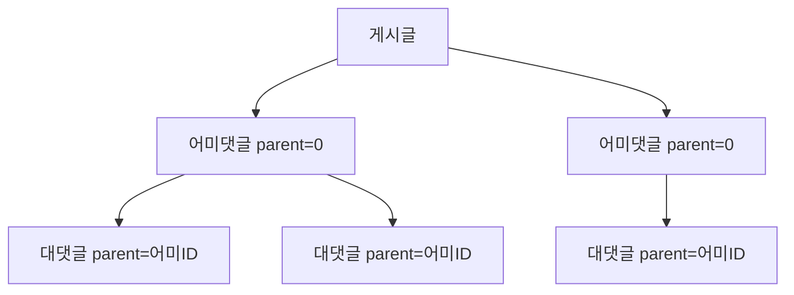
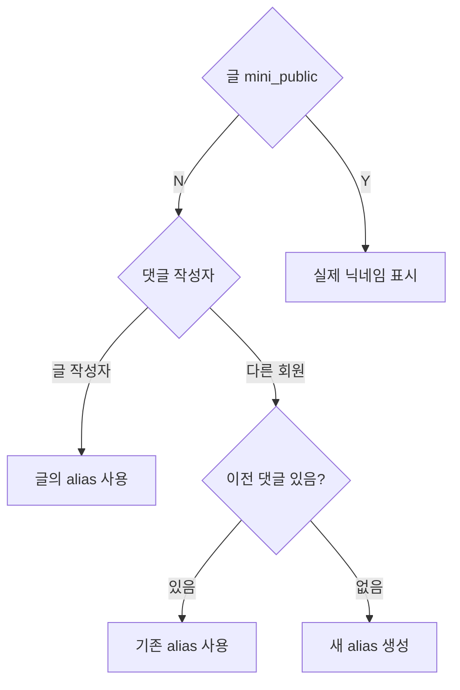

# 라운지 시스템 (커뮤니티)

라운지 커뮤니티 아키텍처를 정리한 문서이다.

## 게시글 상태

| 값  | 상수    | 의미 |
| --- | ------- | ---- |
| 0   | PENDING | 대기 |
| 1   | NORMAL  | 정상 |
| -1  | DELETED | 삭제 |

## 카테고리

| 코드 | 이름               | 접근 제한   |
| ---- | ------------------ | ----------- |
| 1    | 베스트             | -           |
| 2    | 플레이스           | -           |
| 3    | 자유               | -           |
| 4    | 연애               | -           |
| 6    | 비지니스           | -           |
| 8    | Lifestyle          | -           |
| 9    | Black Members Only | level='G'만 |
| 10   | W-Chamber          | 여성만      |
| 11   | M-Chamber          | 남성만      |

## 댓글 구조

- `parent = 0`: 어미댓글 (최상위)
- `parent > 0`: 대댓글 (해당 ID의 댓글에 대한 응답)

## API 엔드포인트

### 게시글

| 메서드 | 엔드포인트           | 설명       |
| ------ | -------------------- | ---------- |
| GET    | `/lounge/list`       | 글 목록    |
| GET    | `/lounge/myList`     | 내 글 목록 |
| GET    | `/lounge/detail`     | 글 상세    |
| POST   | `/lounge/add`        | 글 작성    |
| POST   | `/lounge/delete`     | 글 삭제    |
| POST   | `/lounge/like`       | 좋아요     |
| POST   | `/lounge/blame`      | 신고       |
| POST   | `/lounge/hide`       | 글 차단    |
| POST   | `/lounge/block_user` | 회원 차단  |

### 댓글

| 메서드 | 엔드포인트               | 설명        |
| ------ | ------------------------ | ----------- |
| GET    | `/lounge/comment/list`   | 댓글 목록   |
| POST   | `/lounge/comment/add`    | 댓글 작성   |
| GET    | `/lounge/comment/delete` | 댓글 삭제   |
| POST   | `/lounge/comment/like`   | 댓글 좋아요 |
| POST   | `/lounge/comment/blame`  | 댓글 신고   |

## 베스트 선정

- 관리자 수동 선정 (`/admin/lounge/best`)
- `t_lounge.best = 'Y'`로 설정
- 선정 시 작성자에게 FCM 알림 (LOUNGE_BEST)

## 프로필 비공개 처리

## 패널티 시스템

- `lounge_block_date`: 라운지 작성 차단 날짜
- 차단 기간 중 글/댓글 작성 불가
- 관리자가 일수 지정하여 패널티 부여

## FCM 알림

| 타입 | 상수                     | 의미        |
| ---- | ------------------------ | ----------- |
| 38   | LOUNGE_NEW_COMMENT       | 새 댓글     |
| 39   | LOUNGE_NEW_CHILD_COMMENT | 대댓글      |
| 40   | LOUNGE_BEST              | 베스트 선정 |
| 41   | LOUNGE_BLAME             | 신고        |

## 데이터 모델

### t_lounge

| 필드        | 설명                 |
| ----------- | -------------------- |
| member      | 작성자 ID            |
| category    | 카테고리             |
| title       | 제목                 |
| content     | 내용                 |
| photo       | 첨부 이미지 (# 구분) |
| mini_public | 프로필 공개 여부     |
| best        | 베스트 여부          |
| alias       | 비공개 시 닉네임     |
| visit_cnt   | 조회수               |
| like_cnt    | 좋아요 수            |
| cmt_cnt     | 댓글 수              |

### t_lounge_cmt

| 필드    | 설명                   |
| ------- | ---------------------- |
| lounge  | 게시글 ID              |
| member  | 작성자 ID              |
| parent  | 어미댓글 ID (0=최상위) |
| content | 댓글 내용              |
| alias   | 비공개 시 닉네임       |

## 근거 (코드 기준)

- 컨트롤러: `coupler-api/controller/app/v1/lounge.js`
- 라우터: `coupler-api/routes/app/v1/lounge.js`
- 모델: `coupler-api/model/lounge.js`, `lounge_cmt.js`
