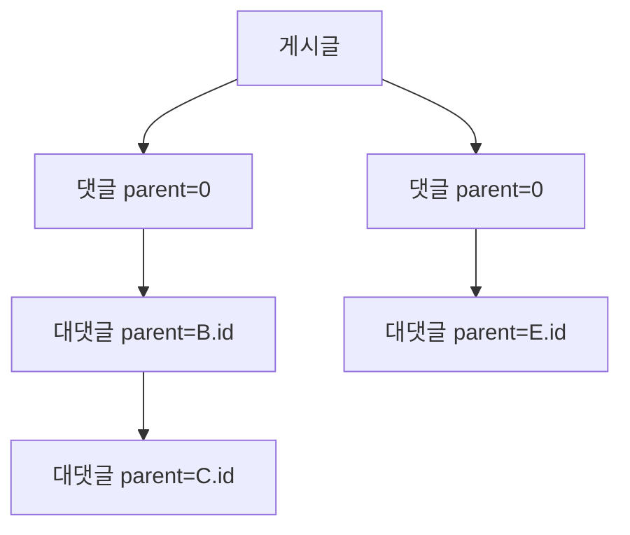
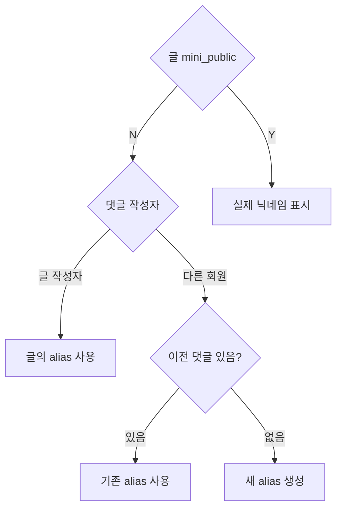

# 라운지 시스템 (커뮤니티)

## 문서 역할

- 역할: `설명`
- 문서 종류: `architecture`
- 충돌 시 우선 문서: 라운지 구조/댓글 표시 기준은 이 문서, 푸시 수신자 기준은 [푸시알림 운영 정책](../policy/push-notification-policy.md)
- 기준 성격: `as-is`

라운지 커뮤니티 아키텍처를 정리한 문서이다.
현재 범위에서는 라운지의 구조와 흐름 설명에 집중하며, 별도 규범 문서는 두지 않는다.

## 게시글 상태

| 값  | 상수    | 의미 |
| --- | ------- | ---- |
| 0   | PENDING | 대기 |
| 1   | NORMAL  | 정상 |
| -1  | DELETED | 삭제 |

## 카테고리

| 코드 | 이름               | 접근 제한   |
| ---- | ------------------ | ----------- |
| 1    | 베스트             | -           |
| 2    | 플레이스           | -           |
| 3    | 자유               | -           |
| 4    | 연애               | -           |
| 6    | 비지니스           | -           |
| 8    | Lifestyle          | -           |
| 9    | Black Members Only | level='G'만 |
| 10   | W-Chamber          | 여성만      |
| 11   | M-Chamber          | 남성만      |

## 댓글 구조


```mermaid
flowchart TD
    A[게시글] --> B[댓글 parent=0]
    B --> C[대댓글 parent=B.id]
    C --> D[대댓글 parent=C.id]
    A --> E[댓글 parent=0]
    E --> F[대댓글 parent=E.id]
```

- `parent = 0`: 직접 부모 댓글이 없는 최상위 댓글
- `parent > 0`: 직접 부모 댓글 ID
- 댓글 목록 API는 `parent` 관계를 직접 부모 트리로 해석한 뒤, 최상위 댓글부터 각 자식 댓글을 생성 순서대로 이어 붙인 평탄 목록을 반환한다.
- 현재 모바일 화면은 `parent > 0`인 댓글을 동일한 대댓글 스타일로 표시한다.

개념 모델은 아래 구조를 기준으로 한다. DB/API 숫자 표현은 기존 호환 저장 형식이다.

```ts
type CommentParentRef =
  | { type: 'root' }
  | { type: 'comment'; id: number };
```

## 댓글 표시와 작성 기준

댓글 화면은 댓글 상태(`status`)와 0-depth 여부(`parent = 0`)를 분리해서 표시한다.
신고 가능 여부는 `/lounge/comment/blame` 서버 판정을 기준으로 한다.

### 모바일 표시 기준

| 상태 | parent | 본문/시간/좋아요 | 대댓글 버튼 | 신고 아이콘 | 표시 기준 |
| --- | --- | --- | --- | --- | --- |
| `NORMAL` | `0` | 표시 | 표시 | 내가 쓴 댓글이 아니면 표시 | 0-depth 댓글 |
| `NORMAL` | `> 0` | 표시 | 숨김 | 내가 쓴 댓글이 아니면 표시 | 대댓글 |
| `DELETED` | `0` | 숨김 | 표시 | 숨김 | 0-depth 댓글의 작성자 표시명/아이콘과 `삭제된 댓글입니다`만 표시 |
| `DELETED` | `> 0` | 숨김 | 숨김 | 숨김 | 대댓글 표시선, 작성자 표시명/아이콘, `삭제된 댓글입니다`만 표시 |

- 삭제 상태 댓글은 스레드 위치 보존용 tombstone으로 목록에 남긴다.
- 삭제 상태 댓글은 원문, 작성 시간, 좋아요, 삭제, 신고 액션을 노출하지 않는다.
- 대댓글 버튼은 댓글 상태와 무관하게 0-depth 댓글(`parent = 0`)에만 표시한다.
- `/lounge/comment/blame`은 삭제 상태 댓글을 `not_found`로 처리하므로 삭제 댓글과 삭제 대댓글에는 신고 아이콘을 표시하지 않는다.
- 현재 모바일 앱은 0-depth 댓글(`parent = 0`)에만 대댓글 작성 액션을 제공한다.
- 대댓글(`parent > 0`)은 parent 댓글의 삭제 여부와 무관하게 대댓글 버튼을 표시하지 않는다.
- 정상 대댓글의 신고 아이콘은 원댓글과 같은 기준으로 표시한다.

### 댓글 작성 parent 허용 기준

`POST /lounge/comment/add`의 `parent`는 아래 기준으로만 허용한다.

| 요청 parent | 대상 댓글 상태 | 대상 댓글 parent | 허용 여부 | 의미 |
| --- | --- | --- | --- | --- |
| `0` | - | - | 허용 | 0-depth 댓글 작성 |
| 댓글 ID | `NORMAL` | 무관 | 허용 | 정상 댓글에 대한 답글 작성 |
| 댓글 ID | `DELETED` | `0` | 허용 | 삭제된 0-depth 댓글에 이어 답글 작성 |
| 댓글 ID | `DELETED` | `> 0` | 거부 | 삭제된 대댓글에는 답글 작성 불가 |

- 모바일 앱은 대댓글 버튼을 0-depth 댓글에만 노출하므로 앱에서 새로 생성되는 답글은 1-depth로 제한된다.
- API는 정상 댓글(`status = NORMAL`)을 parent로 사용할 때 depth를 추가로 제한하지 않는다.
- 삭제 상태 댓글을 parent로 사용할 때는 삭제된 0-depth 댓글만 허용한다.

## 댓글 수 표시 기준

- API 응답과 화면에 표시되는 `cmt_cnt`는 로그인한 사용자가 실제로 볼 수 있는 댓글 수를 의미한다.
- `t_member_hide`에 `type = 'LOUNGE'`로 등록된 작성자의 댓글은 댓글 목록과 `cmt_cnt`에서 제외한다.
- 삭제 상태 댓글은 `cmt_cnt`에 포함하지 않는다.
- 같은 기준을 글 목록, 내 글 목록, 글 상세에 동일하게 적용한다.

## API 엔드포인트

### 게시글

| 메서드 | 엔드포인트           | 설명       |
| ------ | -------------------- | ---------- |
| GET    | `/lounge/list`       | 글 목록    |
| GET    | `/lounge/myList`     | 내 글 목록 |
| GET    | `/lounge/detail`     | 글 상세    |
| POST   | `/lounge/visit`      | 글 조회수 증가 |
| POST   | `/lounge/add`        | 글 작성    |
| POST   | `/lounge/delete`     | 글 삭제    |
| POST   | `/lounge/like`       | 좋아요     |
| POST   | `/lounge/blame`      | 신고       |
| POST   | `/lounge/hide`       | 글 차단    |
| POST   | `/lounge/block_user` | 회원 차단  |

- `GET /lounge/detail`은 순수 조회만 수행한다.
- 조회수 증가는 최초 진입 시 `POST /lounge/visit`에서만 수행한다.

### 댓글

| 메서드 | 엔드포인트               | 설명        |
| ------ | ------------------------ | ----------- |
| GET    | `/lounge/comment/list`   | 댓글 목록   |
| POST   | `/lounge/comment/add`    | 댓글 작성   |
| GET    | `/lounge/comment/delete` | 댓글 삭제   |
| POST   | `/lounge/comment/like`   | 댓글 좋아요 |
| POST   | `/lounge/comment/blame`  | 댓글 신고   |

## 베스트 선정

- 관리자 수동 선정 (`/admin/lounge/best`)
- `t_lounge.best = 'Y'`로 설정
- 선정 시 작성자에게 FCM 알림 (LOUNGE_BEST)

## 프로필 비공개 처리


```mermaid
flowchart TD
    A{글 mini_public} -->|N| B{댓글 작성자}
    B -->|글 작성자| C[글의 alias 사용]
    B -->|다른 회원| D{이전 댓글 있음?}
    D -->|있음| E[기존 alias 사용]
    D -->|없음| F[새 alias 생성]
    A -->|Y| G[실제 닉네임 표시]
```

## 패널티 시스템

- `lounge_block_date`: 라운지 작성 차단 날짜
- 차단 기간 중 글/댓글 작성 불가
- 관리자가 일수 지정하여 패널티 부여

## FCM 알림

| 타입 | 상수                     | 의미        |
| ---- | ------------------------ | ----------- |
| 38   | LOUNGE_NEW_COMMENT       | 새 댓글     |
| 39   | LOUNGE_NEW_CHILD_COMMENT | 대댓글      |
| 40   | LOUNGE_BEST              | 베스트 선정 |
| 41   | LOUNGE_BLAME             | 신고        |

수신자 기준은 [푸시알림 운영 정책](../policy/push-notification-policy.md)의 라운지 댓글/대댓글 수신자 기준을 따른다.
이 문서는 라운지 parent 구조와 표시 기준만 설명하고, 댓글/대댓글 발송 대상은 정책 문서에서만 정의한다.

## 데이터 모델

### t_lounge

| 필드        | 설명                 |
| ----------- | -------------------- |
| member      | 작성자 ID            |
| category    | 카테고리             |
| title       | 제목                 |
| content     | 내용                 |
| photo       | 첨부 이미지 (# 구분) |
| mini_public | 프로필 공개 여부     |
| best        | 베스트 여부          |
| alias       | 비공개 시 닉네임     |
| visit_cnt   | 조회수               |
| like_cnt    | 좋아요 수            |
| cmt_cnt     | 저장 댓글 수 캐시 필드 |

### t_lounge_cmt

| 필드    | 설명                   |
| ------- | ---------------------- |
| lounge  | 게시글 ID              |
| member  | 작성자 ID              |
| parent  | 직접 부모 댓글 ID (0=없음) |
| content | 댓글 내용              |
| alias   | 비공개 시 닉네임       |
