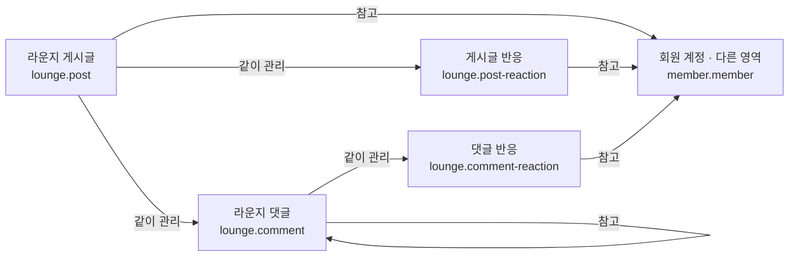
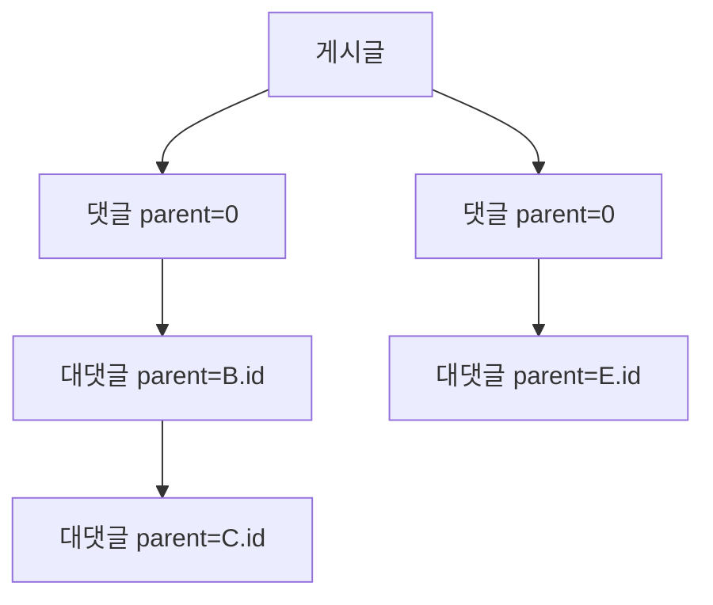
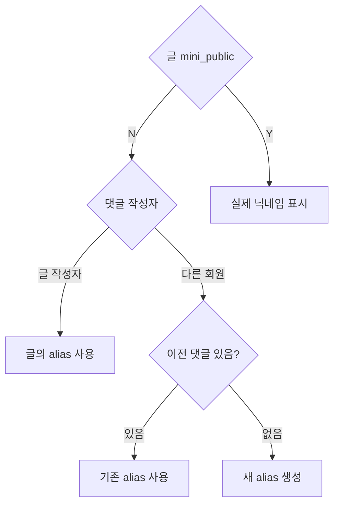

# 라운지 시스템 (커뮤니티)

## 문서 역할

- 역할: `설명`
- 문서 종류: `architecture`
- 충돌 시 우선 문서: 라운지 구조/댓글 표시 기준은 이 문서, 푸시 수신자 기준은 [푸시알림 운영 정책](../policy/push-notification-policy.md)
- 기준 성격: `as-is`

라운지 커뮤니티 아키텍처를 정리한 문서이다.
현재 범위에서는 라운지의 구조와 흐름 설명에 집중하며, 별도 규범 문서는 두지 않는다.

## 논리 데이터 모델

- 도메인 ID: `lounge`

### 먼저 보는 그림

이 그림은 데이터가 어디에 속하고 무엇을 참고하는지 먼저 보여준다.
정확한 이름과 조건은 아래 상세 표를 따른다.


```mermaid
flowchart LR
    entity_lounge_dot_comment["라운지 댓글<br/>lounge.comment"]
    entity_lounge_dot_comment_dash_reaction["댓글 반응<br/>lounge.comment-reaction"]
    entity_lounge_dot_post["라운지 게시글<br/>lounge.post"]
    entity_lounge_dot_post_dash_reaction["게시글 반응<br/>lounge.post-reaction"]
    entity_member_dot_member["회원 계정 · 다른 영역<br/>member.member"]
    entity_lounge_dot_post -->|"참고"| entity_member_dot_member
    entity_lounge_dot_post -->|"같이 관리"| entity_lounge_dot_comment
    entity_lounge_dot_post -->|"같이 관리"| entity_lounge_dot_post_dash_reaction
    entity_lounge_dot_post_dash_reaction -->|"참고"| entity_member_dot_member
    entity_lounge_dot_comment -->|"참고"| entity_lounge_dot_comment
    entity_lounge_dot_comment -->|"같이 관리"| entity_lounge_dot_comment_dash_reaction
    entity_lounge_dot_comment_dash_reaction -->|"참고"| entity_member_dot_member
```

꼭 지킬 규칙:

- 댓글의 직접 부모는 같은 게시글에 속해야 한다
- 삭제된 댓글은 원문과 액션을 노출하지 않으며 필요한 스레드 위치만 보존한다
- 저장된 반응 수와 회원별 실제 반응 관계는 같은 결론을 가져야 한다

<!-- markdownlint-disable MD046 -->

??? info "정확한 값과 조건 보기"

    ### 논리 엔티티

    | 논리 ID | 표시명 | 생명주기 역할 | 엔티티 형태 | 기록 역할 | 책임 | 최고 데이터 분류 | 생명주기 |
    | --- | --- | --- | --- | --- | --- | --- | --- |
    | `lounge.post` | 라운지 게시글 | root | entity | state | 작성자, 공개 범위, 본문과 게시 상태 | 민감 | 삭제 후 tombstone 또는 운영 이력을 남기고 원문은 정책에 따라 정리 |
    | `lounge.comment` | 라운지 댓글 | child | entity | state | 게시글의 직접 부모 관계와 댓글 상태 | 민감 | 스레드 보존이 필요하면 삭제 tombstone 유지 |
    | `lounge.post-reaction` | 게시글 반응 | child | association | state | 회원의 게시글 좋아요 관계 | 내부 | 회원이 취소하거나 원천 게시글 정리 시 삭제 |
    | `lounge.comment-reaction` | 댓글 반응 | child | association | state | 회원의 댓글 좋아요 관계 | 내부 | 회원이 취소하거나 원천 댓글 정리 시 삭제 |

    ### 관계

    | 출발 논리 ID | 관계 역할 | 관계 유형 | 도착 논리 ID | 카디널리티 | 소유·삭제 규칙 |
    | --- | --- | --- | --- | --- | --- |
    | `lounge.post` | `author` | references | `member.member` | N:1 | 작성자 개인정보 정리 뒤 별칭 또는 비식별 표시 사용 |
    | `lounge.post` | `comments` | owns | `lounge.comment` | 1:N | 게시글 삭제 정책과 댓글 스레드 보존 정책을 함께 적용 |
    | `lounge.post` | `reactions` | owns | `lounge.post-reaction` | 1:N | 게시글 정리 시 회원별 반응도 함께 정리 |
    | `lounge.post-reaction` | `member` | references | `member.member` | N:1 | 동일 회원의 동일 게시글 반응은 하나만 존재 |
    | `lounge.comment` | `parent-comment` | references | `lounge.comment` | N:1 | 직접 부모만 참조하며 삭제된 최상위 댓글은 tombstone으로 유지 가능 |
    | `lounge.comment` | `reactions` | owns | `lounge.comment-reaction` | 1:N | 댓글 정리 시 회원별 반응도 함께 정리 |
    | `lounge.comment-reaction` | `member` | references | `member.member` | N:1 | 동일 회원의 동일 댓글 반응은 하나만 존재 |

    ### 불변조건

    | 규칙 ID | 관련 논리 ID | 불변조건 | 기준 문서 |
    | --- | --- | --- | --- |
    | `LOUNGE-INV-001` | `lounge.comment` | 댓글의 직접 부모는 같은 게시글에 속해야 한다 | 이 문서 |
    | `LOUNGE-INV-002` | `lounge.comment` | 삭제된 댓글은 원문과 액션을 노출하지 않으며 필요한 스레드 위치만 보존한다 | 이 문서 |
    | `LOUNGE-INV-003` | `lounge.post-reaction` | 저장된 반응 수와 회원별 실제 반응 관계는 같은 결론을 가져야 한다 | [엔지니어링 가드레일](../policy/engineering-guardrails.md) |

<!-- markdownlint-enable MD046 -->

## 게시글/댓글 상태 SoT

`t_lounge.status`와 `t_lounge_cmt.status`는 라운지 콘텐츠의 현재 상태를 나타내는 단일 축이다.
별도 `deletion_type`이나 단일 `deleted_at` 컬럼을 두지 않으며, 신고 접수 상태와 삭제 상태 전이 이력은
각각 신고 테이블과 추가 전용 삭제 이력이 담당한다. 삭제 종류는 전이의 `next_status`로 결정하므로 같은
의미를 저장하는 별도 종류 컬럼을 만들지 않는다.

| 값 | 상수 | 의미 | 앱 노출 |
| --- | --- | --- | --- |
| 1 | `NORMAL` | 정상 | 원문과 액션 노출 |
| -1 | `AUTHOR_DELETED` | 작성자 삭제 | tombstone 노출 |
| -2 | `ADMIN_REPORT_DELETED` | 관리자 신고삭제 | tombstone 노출 |
| -3 | `ADMIN_FORCE_DELETED` | 관리자 강제삭제 | 목록/상세에서 제외 |

- 작성자 삭제는 `NORMAL -> AUTHOR_DELETED`만 허용한다.
- 관리자 신고삭제는 `NORMAL -> ADMIN_REPORT_DELETED`만 허용한다.
- 관리자 강제삭제는 `NORMAL`, `AUTHOR_DELETED`, `ADMIN_REPORT_DELETED`에서
  `ADMIN_FORCE_DELETED`로 전환할 수 있다.
- `ADMIN_FORCE_DELETED`는 최종 상태이며 복구 API를 제공하지 않는다.
- 관리자 신고삭제/강제삭제 시 같은 콘텐츠의 처리 전 신고(`status = 0`)는 처리됨(`status = 1`)으로
  함께 전환한다.
- 작성자 삭제와 관리자 삭제는 콘텐츠 상태 갱신과 삭제 이력 추가를 한 DB 트랜잭션에서 처리한다.
- 삭제 이력은 대상 종류·대상 식별자·작성자 또는 관리자 행위자·이전/다음 상태·관리 사유·행위 시각을
  보존한다. 작성자 삭제에는 관리 사유를 만들지 않고, 관리자 삭제에는 비어 있지 않은 사유를 요구한다.
- 상태는 현재값의 SoT이고 삭제 이력은 추가 전용 과거 기록이므로, 현재 상태를 이력의 마지막 행이나
  클라이언트 추론으로 대체하지 않는다.

### 기존 삭제 데이터 이관 기준

- 전환 전 게시글의 `-1`은 작성자 삭제와 CMS 삭제를 구분할 이력이 없고 앱 목록에서도 모두 제외되던
  값이다. 전환 과정에서는 과거 콘텐츠가 새로 노출되는 회귀를 막기 위해 기존 게시글 `-1`을
  `ADMIN_FORCE_DELETED(-3)`로 이관한다.
- 전환 완료 후 새 작성자 게시글 삭제부터 `AUTHOR_DELETED(-1)`을 사용한다.
- 기존 댓글 `-1`은 이미 앱에서 tombstone으로 노출되던 작성자 삭제 상태이므로 그대로 유지한다.
- 이력 기능 도입 전 삭제 행위 시각은 원천 데이터에 없으므로 생성일이나 migration 실행 시각으로
  합성하지 않는다. 이 경우 CMS는 삭제 상태와 함께 `기록 없음 (삭제 이력 기능 적용 전 데이터)`로
  구분한다.

### 삭제 표시/액션 기준

| 대상 | 상태 | 표시 문구 | 원문/첨부 | 기존 통계/댓글 | 새 액션 |
| --- | --- | --- | --- | --- | --- |
| 게시글 | `AUTHOR_DELETED` | `삭제된 글입니다` | 숨김 | 유지 | 금지 |
| 게시글 | `ADMIN_REPORT_DELETED` | `신고된 글입니다` | 숨김 | 유지 | 금지 |
| 게시글 | `ADMIN_FORCE_DELETED` | 표시 없음 | 표시 없음 | 표시 없음 | 금지 |
| 댓글 | `AUTHOR_DELETED` | `삭제된 댓글입니다.` | 숨김 | 작성 시각/스레드 위치 유지 | 좋아요·신고·삭제 금지 |
| 댓글 | `ADMIN_REPORT_DELETED` | `신고된 댓글입니다.` | 숨김 | 작성 시각/스레드 위치 유지 | 좋아요·신고·삭제 금지 |
| 댓글 | `ADMIN_FORCE_DELETED` | 표시 없음 | 표시 없음 | 노출 자식만 승격 | 금지 |

- tombstone 게시글 상세에서는 기존 댓글을 읽을 수 있지만 조회수 증가, 좋아요, 신고, 댓글 작성,
  작성자 프로필 열기 같은 새 상호작용은 허용하지 않는다. 단, 정상 상태인 본인 댓글 삭제는 개인정보
  제어 동작이므로 부모 게시글 상태와 무관하게 허용한다.
- 일반 텍스트 목록은 tombstone 게시글을 포함한다.
- 검색은 숨겨진 원문 제목이 검색되지 않도록 `NORMAL`만 대상으로 한다.
- 갤러리 목록은 노출할 첨부가 있는 `NORMAL` 게시글만 대상으로 한다.

## 카테고리

| 코드 | 이름               | 접근 제한   |
| ---- | ------------------ | ----------- |
| 1    | 베스트             | -           |
| 2    | 플레이스           | -           |
| 3    | 자유               | -           |
| 4    | 연애               | -           |
| 6    | 비지니스           | -           |
| 8    | Lifestyle          | -           |
| 9    | Black Members Only | level='G'만 |
| 10   | W-Chamber          | 여성만      |
| 11   | M-Chamber          | 남성만      |
| 12   | 인연찾기           | -           |

- 접근 제한 `-`는 카테고리 자체의 성별·회원 등급 추가 제한이 없다는 뜻이다. 조회와 작성 모두 기존의
  로그인·라운지 패널티 검사를 적용하고, 작성에는 심사 대기·라운지 읽기 전용 차단도 추가로 적용한다.

### 인연찾기(셀소) 게시글

인연찾기 게시글은 일반 라운지 게시글 저장 구조를 사용하며 아래 값으로 식별한다.
아래 계약의 구현 정합성 증빙은 `인연찾기 다중 레포 반영`에서 연결한 릴리즈 flow의 입력으로 사용한다.

| 항목 | 값과 의미 |
| --- | --- |
| 카테고리 | `category = 12` |
| 노출 범위 | `lounge_tab = ALL_MEMBERS`; 로그인한 전체 라운지 회원 |
| 제목 | `[셀소]` 접두사, 공백 한 칸과 작성자가 입력한 제목 |
| 본문 | 작성 시점의 회원 프로필로 만든 수정 가능한 초안과 `나에 대해서`, `원하는 상대방`, `바라는 관계` 세 영역 |
| 사진 | 1장 이상, 장수 상한 없음 |
| 미니프로필 | 기본값 `mini_public = N`; 작성자가 명시적으로 선택하면 `Y` |

- 프로필 초안에는 나이, 거주지, 키, 직업, 주량, 종교, 흡연 여부, 학력, 결혼 계획, 어필 포인트, MBTI,
  체형, 선호하는 만남 진도, 성격 키워드와 결혼·연애 목표가 포함된다. Mobile은 회원에게 초안 전체를
  보여주고 제출 전에 항목을 수정하거나 제거할 수 있게 한다.
- 프로필 값은 게시글 본문에 복사되는 작성 시점 스냅샷이다. 이후 회원 프로필을 변경해도 이미 등록한
  게시글 본문을 자동으로 바꾸지 않는다.
- `mini_public`은 작성자 닉네임과 미니프로필의 공개 여부만 제어한다. `N`이어도 제목, 본문에 남겨 둔
  프로필 항목과 첨부 사진은 인연찾기 게시글을 볼 수 있는 회원에게 노출된다.
- 화면의 `P.S.` 사진 안내는 입력 도움말이며 게시글 본문에는 저장하지 않는다.
- 본문에 복사된 프로필 정보와 작성자 입력은 `lounge.post`의 `민감` 분류와 기존 게시글 삭제 생명주기를
  그대로 따른다. 데이터 처리 기준은 [데이터 거버넌스 정책](../policy/data-governance-policy.md)을 따른다.

### 인연찾기 다중 레포 반영

- `coupler-api`가 공통 설정의 라운지 카테고리에 코드 12를 먼저 제공하고, `coupler-mobile-app`이 그 코드를
  사용해 작성 진입점과 게시글 등록을 제공한다.
- 운영 반영은 [API 계약 변경 모바일 릴리즈 플로우](../flows/cross-project/api-contract-mobile-release-flow.md)에
  따라 API 배포 후 공통 설정 응답의 코드 12와 기존 앱의 목록·상세 호환을 확인한 뒤 Mobile을 배포한다.
- 저장 구조와 API 요청 필드는 기존 라운지 계약을 재사용하므로 DB migration과 계약 cutover는 필요하지
  않다. 코드 12 게시글이 한 건이라도 저장된 뒤 Mobile 작성 진입점을 롤백하더라도 API 카테고리 코드는
  유지해 기존 게시글의 분류를 보존한다.

#### 인연찾기 구현 정합성 증빙

| 책임 | 구현 불변조건 | 최소 검증 |
| --- | --- | --- |
| API 카테고리 | 공통 설정 응답이 코드 12와 `인연찾기` 이름을 함께 제공한다. | 공통 설정 응답 계약 테스트와 배포 후 확인 |
| 프로필 taxonomy | 성별 `F`는 여성 체형, `M`은 남성 체형 코드표만 사용한다. `marriage_plan`은 결혼 계획, `my_marriage`는 `marriage_mileage` 코드표만 사용한다. | 여성·남성 체형과 두 결혼 관련 필드의 서로 다른 대표 코드 단위 테스트 |
| taxonomy 오류 처리 | 같은 숫자 코드라는 이유로 다른 코드표의 문구를 대신 사용하지 않는다. 코드표에 없는 값은 잘못된 문구로 저장하지 않고 계약 오류로 검출한다. | 미등록 코드와 잘못된 코드표 입력 회귀 테스트 |
| 사진 불변조건 | 사진 개수의 단일 기준은 `count >= 1`이며 선택 상태 변경과 최종 제출 경계에서 같은 기준을 적용하고 장수 상한을 두지 않는다. | `0`, `1`, `6`장 경계 테스트 |
| 개인정보 확인 | 자동 생성한 프로필 초안과 `mini_public = N`의 본문 노출 의미를 등록 전에 회원이 확인·수정할 수 있다. | 초안 수정·삭제와 미니프로필 비공개 게시 수동 시나리오 |
| 호환 배포 | 기존 앱에서 코드 12 게시글 목록·상세를 읽을 수 있고 신규 Mobile에서 작성·조회할 수 있다. | 기존 앱 목록·상세와 신규 앱 작성·조회 시나리오 |

- 위 테스트와 수동 시나리오는 같은 기능 기준점을 검증하며, 일반 CI 통과만으로 대체하지 않는다.
- API additive 카테고리와 Mobile 작성 진입점의 배포·활성화·롤백 판정은 이 절에서 다시 정의하지 않고
  [API 계약 변경 모바일 릴리즈 플로우](../flows/cross-project/api-contract-mobile-release-flow.md)를 따른다.

## 댓글 구조


```mermaid
flowchart TD
    A[게시글] --> B[댓글 parent=0]
    B --> C[대댓글 parent=B.id]
    C --> D[대댓글 parent=C.id]
    A --> E[댓글 parent=0]
    E --> F[대댓글 parent=E.id]
```

- `parent = 0`: 직접 부모 댓글이 없는 최상위 댓글
- `parent > 0`: 직접 부모 댓글 ID
- 댓글 목록 API는 `parent` 관계를 직접 부모 트리로 해석한 뒤, 최상위 댓글부터 각 자식 댓글을 생성 순서대로 이어 붙인 평탄 목록을 반환한다.
- 현재 모바일 화면은 `parent > 0`인 댓글을 동일한 대댓글 스타일로 표시한다.

개념 모델은 아래 구조를 기준으로 한다. DB/API 숫자 표현은 기존 호환 저장 형식이다.

```ts
type CommentParentRef =
  | { type: 'root' }
  | { type: 'comment'; id: number };
```

## 댓글 표시와 작성 기준

댓글 화면은 라운지 콘텐츠 상태와 0-depth 여부(`parent = 0`)를 분리해서 표시한다.
신고/좋아요/삭제 가능 여부는 서버의 `NORMAL` 판정을 기준으로 한다.

### 모바일 표시 기준

| 상태 | parent | 본문/시간/좋아요 | 대댓글 버튼 | 신고 아이콘 | 표시 기준 |
| --- | --- | --- | --- | --- | --- |
| `NORMAL` | `0` | 표시 | 표시 | 내가 쓴 댓글이 아니면 표시 | 0-depth 댓글 |
| `NORMAL` | `> 0` | 표시 | 숨김 | 내가 쓴 댓글이 아니면 표시 | 대댓글 |
| `AUTHOR_DELETED` | `0` | tombstone/시간 표시 | 표시 | 숨김 | 작성자 표시명/아이콘과 `삭제된 댓글입니다.` 표시 |
| `AUTHOR_DELETED` | `> 0` | tombstone/시간 표시 | 숨김 | 숨김 | 대댓글 표시선과 `삭제된 댓글입니다.` 표시 |
| `ADMIN_REPORT_DELETED` | `0` | tombstone/시간 표시 | 표시 | 숨김 | 작성자 표시명/아이콘과 `신고된 댓글입니다.` 표시 |
| `ADMIN_REPORT_DELETED` | `> 0` | tombstone/시간 표시 | 숨김 | 숨김 | 대댓글 표시선과 `신고된 댓글입니다.` 표시 |
| `ADMIN_FORCE_DELETED` | 무관 | 표시하지 않음 | 숨김 | 숨김 | 노출 가능한 자식을 가장 가까운 노출 부모 또는 최상위로 승격 |

- 작성자 삭제와 관리자 신고삭제 댓글은 스레드 위치 보존용 tombstone으로 목록에 남긴다.
- tombstone 댓글은 원문과 좋아요/삭제/신고 액션을 숨기고 원래 작성 시각은 유지한다.
- 대댓글 버튼은 댓글 상태와 무관하게 0-depth 댓글(`parent = 0`)에만 표시한다.
- tombstone 게시글 상세에서는 댓글의 대댓글/좋아요/신고 액션을 비활성화한다. 정상 상태인 본인 댓글의
  삭제만 허용하며, 이미 tombstone인 댓글에는 삭제 액션을 노출하지 않는다.
- 현재 모바일 앱은 0-depth 댓글(`parent = 0`)에만 대댓글 작성 액션을 제공한다.
- 대댓글(`parent > 0`)은 parent 댓글의 삭제 여부와 무관하게 대댓글 버튼을 표시하지 않는다.
- 정상 대댓글의 신고 아이콘은 원댓글과 같은 기준으로 표시한다.

## 앱 응답 계약

라운지 앱 응답의 public wire DTO는 API Swagger/OpenAPI가 단일 기준이며
`@coupler-developer/coupler-api-contracts`의 operation별 success DTO로 생성한다.

| 엔드포인트 | success `data` DTO |
| --- | --- |
| `GET /lounge/list` | `LoungeListResult` |
| `GET /lounge/myList` | `LoungeMyListResult` |
| `GET /lounge/detail` | `LoungeDetailResult` |
| `GET /lounge/comment/list` | `LoungeCommentListResult` |
| `GET /lounge/noticeList` | `LoungeNoticeListResult` |
| `GET /lounge/viewProfile` | `LoungeMemberInfo` |
| `POST /lounge/visit` | `LoungeVisitResult` |
| `POST /lounge/add`, `/lounge/delete`, `/lounge/blame`, `/lounge/like`, `/lounge/hide` | `null` |
| `POST /lounge/comment/add`, `/lounge/comment/delete`, `/lounge/comment/blame`, `/lounge/comment/like` | `null` |

- 게시글 목록과 상세, 댓글은 서로 다른 실제 응답 shape를 사용하므로 하나의 optional DTO로 합치지 않는다.
- 앱 노출 `status`는 `1 | -1 | -2`이며 `ADMIN_FORCE_DELETED(-3)`는 success DTO에 포함하지 않는다.
- 게시글 `photo`는 배열이 아니라 `#`으로 구분된 문자열이며 tombstone이면 빈 문자열이다.
- 실제 응답에서 항상 생성하는 필드는 Swagger `required`와 generated contract에서도 필수이며, 공지 필드와 조회수 응답의 `visit_cnt`도 같은 기준을 적용한다.
- Mobile은 [API 클라이언트 계약 패키지 정책](../policy/api-client-contract-package-policy.md)에 따라 operation별 generated success DTO를 직접 사용하고, 화면 파생값이 있을 때만 exact DTO → ViewModel mapping을 둔다.

## CMS 응답 계약

CMS 라운지 목록·댓글·상세·신고 목록도 같은 contracts package의 operation DTO를 직접 사용한다.
게시글/댓글 신고 목록 row는 `report_status`와 콘텐츠 상태를 구분하고, `reporter`, `target`,
`post` 또는 `comment`로 중첩한다. DB 조회 결과의 flat alias는 API canonical mapper 밖으로
노출하지 않는다. 신고 처리 완료 API는 신고 row의 `report_status`만 변경하며 콘텐츠
신고삭제·강제삭제 API와 별도 계약으로 유지한다.

`AdminLoungeDetail.deletion_history`와 `AdminLoungeCommentListRow.deletion_history`는 항상 존재하는
배열이다. 각 원소는 `action`, `actor_type`, `actor_id`, `previous_status`, `next_status`, `reason`,
`deleted_at`을 필수 필드로 가지며, 동일 시각이면 이력 ID를 보조 순서로 사용해 오래된 전이부터 반환한다.
API가 DB 전이를 명시적인 `action`과 `actor_type`으로 투영하므로 CMS는 숫자 상태로 행위자를 추론하거나
별도 normalize/fallback DTO를 두지 않는다.

| 엔드포인트 | request DTO | success `data` DTO |
| --- | --- | --- |
| `GET /admin/lounge/list` | - | `AdminLoungeListResult` |
| `GET /admin/lounge/comment/list` | - | `AdminLoungeCommentListResult` |
| `GET /admin/lounge/blame/lounge_list` | - | `AdminLoungeBlameListResult` |
| `GET /admin/lounge/blame/comment_list` | - | `AdminLoungeCommentBlameListResult` |
| `GET /admin/lounge/detail/{id}` | - | `AdminLoungeDetail` |
| `POST /admin/lounge/save` | `AdminLoungeSaveRequest` | `AdminLoungeDetail` |
| `POST /admin/lounge/best` | `AdminLoungeBestRequest` | `null` |
| `POST /admin/lounge/blame/lounge_done` | `AdminLoungeReportDoneRequest` | `null` |
| `POST /admin/lounge/blame/comment_done` | `AdminLoungeReportDoneRequest` | `null` |
| `POST /admin/lounge/{id}/{report,force}-delete` | `LoungeModerationRequest` | `LoungeModerationResult` |
| `POST /admin/lounge/comment/{id}/{report,force}-delete` | `LoungeModerationRequest` | `LoungeModerationResult` |

- CMS 상세의 수정 입력과 이미지 액션은 `NORMAL`에서만 활성화한다.
- CMS 게시글 상세와 댓글 내역은 계약의 `deletion_history`를 그대로 표시한다. 정상 콘텐츠는 빈 배열이고,
  기능 도입 전 tombstone의 빈 배열은 삭제 시각을 합성하지 않고 레거시 기록 없음으로 표시한다.
- CMS 기본 게시글·댓글 목록은 작성자 삭제·신고삭제·강제삭제 행을 모두 유지한다. 강제삭제는 앱 노출만
  제거하며, CMS에서는 기존 삭제 관리와 동일하게 상태와 삭제 이력을 확인할 수 있다.
- 위 표에서 request DTO가 명시된 JSON mutation body는 Swagger의
  `additionalProperties: false`와 같은 exact generated DTO shape로 API 진입점에서 한 번
  검증하고, 통과한 뒤에는 controller/usecase가 해당 DTO를 신뢰한다.
- 수정과 베스트 설정 API도 `WHERE status = NORMAL` 조건으로만 갱신하며, tombstone 또는
  강제삭제 상태에는 `LOUNGE_MODERATION_STATE_CONFLICT`를 반환한다.
- 따라서 CMS UI를 우회하거나 삭제 전이와 요청이 겹쳐도 삭제 상태 콘텐츠의 원문과 베스트 값은
  새로 갱신하지 않는다.

### 댓글 작성 parent 허용 기준

`POST /lounge/comment/add`의 `parent`는 아래 기준으로만 허용한다.

| 요청 parent | 대상 댓글 상태 | 대상 댓글 parent | 허용 여부 | 의미 |
| --- | --- | --- | --- | --- |
| `0` | - | - | 허용 | 0-depth 댓글 작성 |
| 댓글 ID | `NORMAL` | 무관 | 허용 | 정상 댓글에 대한 답글 작성 |
| 댓글 ID | `AUTHOR_DELETED`/`ADMIN_REPORT_DELETED` | `0` | 허용 | 노출 tombstone인 0-depth 댓글에 이어 답글 작성 |
| 댓글 ID | `AUTHOR_DELETED`/`ADMIN_REPORT_DELETED` | `> 0` | 거부 | tombstone 대댓글에는 답글 작성 불가 |
| 댓글 ID | `ADMIN_FORCE_DELETED` | 무관 | 거부 | 앱/API 대상에서 제외 |

- 모바일 앱은 대댓글 버튼을 0-depth 댓글에만 노출하므로 앱에서 새로 생성되는 답글은 1-depth로 제한된다.
- API는 정상 댓글(`status = NORMAL`)을 parent로 사용할 때 depth를 추가로 제한하지 않는다.
- tombstone 댓글을 parent로 사용할 때는 0-depth 댓글만 허용한다.

## 댓글 수 표시 기준

- API 응답과 화면에 표시되는 `cmt_cnt`는 로그인한 사용자가 실제로 볼 수 있는 댓글 수를 의미한다.
- `t_member_hide`에 `type = 'LOUNGE'`로 등록된 작성자의 댓글은 댓글 목록과 `cmt_cnt`에서 제외한다.
- 앱에 노출되는 `NORMAL`, `AUTHOR_DELETED`, `ADMIN_REPORT_DELETED` 댓글은 `cmt_cnt`에 포함하고,
  `ADMIN_FORCE_DELETED` 댓글만 제외한다.
- 같은 기준을 글 목록, 내 글 목록, 글 상세에 동일하게 적용한다.

## API 엔드포인트

### 게시글

| 메서드 | 엔드포인트           | 설명       |
| ------ | -------------------- | ---------- |
| GET    | `/lounge/list`       | 글 목록    |
| GET    | `/lounge/myList`     | 내 글 목록 |
| GET    | `/lounge/detail`     | 글 상세    |
| POST   | `/lounge/visit`      | 글 조회수 증가 |
| POST   | `/lounge/add`        | 글 작성    |
| POST   | `/lounge/delete`     | 글 삭제    |
| POST   | `/lounge/like`       | 좋아요     |
| POST   | `/lounge/blame`      | 신고       |
| POST   | `/lounge/hide`       | 글 차단    |
| POST   | `/lounge/block_user` | 회원 차단  |

- `GET /lounge/detail`은 순수 조회만 수행한다.
- 조회수 증가는 최초 진입 시 `POST /lounge/visit`에서만 수행한다.

### 댓글

| 메서드 | 엔드포인트               | 설명        |
| ------ | ------------------------ | ----------- |
| GET    | `/lounge/comment/list`   | 댓글 목록   |
| POST   | `/lounge/comment/add`    | 댓글 작성   |
| POST   | `/lounge/comment/delete` | 댓글 삭제   |
| POST   | `/lounge/comment/like`   | 댓글 좋아요 |
| POST   | `/lounge/comment/blame`  | 댓글 신고   |

### 관리자 삭제

| 메서드 | 엔드포인트 | 설명 |
| --- | --- | --- |
| POST | `/admin/lounge/{id}/report-delete` | 게시글 신고삭제 |
| POST | `/admin/lounge/{id}/force-delete` | 게시글 강제삭제 |
| POST | `/admin/lounge/comment/{id}/report-delete` | 댓글 신고삭제 |
| POST | `/admin/lounge/comment/{id}/force-delete` | 댓글 강제삭제 |

- 네 API는 기존 CMS 삭제와 같은 인증 관리자 권한으로 호출할 수 있고 최대 500자의 `reason`을 필수로 받는다.
- CMS의 기존 `삭제` 버튼은 `강제삭제`로 대체하며, `신고삭제` 버튼을 별도로 제공한다.
- 상태 전이, 미처리 신고 처리, 감사 로그 저장은 한 DB 트랜잭션으로 수행한다.

## 베스트 선정

- 관리자 수동 선정 (`/admin/lounge/best`)
- `NORMAL` 게시글만 설정/해제 가능
- `t_lounge.best = 'Y'`로 설정
- 선정 시 작성자에게 FCM 알림 (LOUNGE_BEST)

## 프로필 비공개 처리


```mermaid
flowchart TD
    A{글 mini_public} -->|N| B{댓글 작성자}
    B -->|글 작성자| C[글의 alias 사용]
    B -->|다른 회원| D{이전 댓글 있음?}
    D -->|있음| E[기존 alias 사용]
    D -->|없음| F[새 alias 생성]
    A -->|Y| G[실제 닉네임 표시]
```

## 패널티 시스템

- `lounge_block_date`: 라운지 작성 차단 날짜
- 차단 기간 중 글/댓글 작성 불가
- 관리자가 일수 지정하여 패널티 부여

## FCM 알림

| 타입 | 상수                     | 의미        |
| ---- | ------------------------ | ----------- |
| 38   | LOUNGE_NEW_COMMENT       | 새 댓글     |
| 39   | LOUNGE_NEW_CHILD_COMMENT | 대댓글      |
| 40   | LOUNGE_BEST              | 베스트 선정 |
| 41   | LOUNGE_BLAME             | 신고        |

수신자 기준은 [푸시알림 운영 정책](../policy/push-notification-policy.md)의 라운지 댓글/대댓글 수신자 기준을 따른다.
이 문서는 라운지 parent 구조와 표시 기준만 설명하고, 댓글/대댓글 발송 대상은 정책 문서에서만 정의한다.

## 데이터 모델

### t_lounge

| 필드        | 설명                 |
| ----------- | -------------------- |
| member      | 작성자 ID            |
| category    | 카테고리             |
| title       | 제목                 |
| content     | 내용                 |
| photo       | 첨부 이미지 (# 구분) |
| mini_public | 프로필 공개 여부     |
| best        | 베스트 여부          |
| alias       | 비공개 시 닉네임     |
| visit_cnt   | 조회수               |
| like_cnt    | 좋아요 수            |
| cmt_cnt     | 레거시 저장 댓글 수 캐시. 앱 응답은 viewer별 노출 댓글 수를 다시 계산한다. |
| status      | 라운지 콘텐츠 현재 상태 SoT |

### t_lounge_cmt

| 필드    | 설명                   |
| ------- | ---------------------- |
| lounge  | 게시글 ID              |
| member  | 작성자 ID              |
| parent  | 직접 부모 댓글 ID (0=없음) |
| content | 댓글 내용              |
| alias   | 비공개 시 닉네임       |
| status  | 라운지 댓글 현재 상태 SoT |

### t_lounge_moderation_log

작성자와 관리자의 삭제 상태 전이를 추가 전용으로 보존하는 운영 감사 원장이다. 콘텐츠 현재 상태를
판정하는 테이블이 아니다.

| 필드 | 설명 |
| --- | --- |
| target_type/target_id | `LOUNGE` 또는 `COMMENT` 대상과 콘텐츠 ID |
| admin_id/member_id | 관리자 또는 작성자 행위자. 한 이력에는 하나만 존재 |
| previous_status/next_status | 변경 전후 콘텐츠 상태 |
| reason | 관리자 입력 사유. 작성자 삭제는 값 없음 |
| created_at | 행위 시각 |

- 삭제 이력 기본 키 `id`는 CMS `deletion_history` 항목의 `id`이고, 관리자 삭제 명령 응답에서는
  `audit_id`로 반환해 운영 로그와 연결한다.
- `request_id`는 별도로 저장하지 않는다. CMS가 멱등 키를 보내지 않는 현재 구조에서 서버가 임의 생성한
  요청 ID는 중복 실행을 막지 못하고 감사 로그 기본 키와 역할이 겹친다.
- 행위자, 사유, 변경 전후 상태 같은 감사 필드는 `t_lounge`/`t_lounge_cmt`에 추가하지 않는다.
- 콘텐츠가 나중에 정리되더라도 감사 기록을 보존할 수 있도록 콘텐츠/행위자 FK에 의존하지 않는다.

## 레거시 전환

- 기존 `t_lounge.status = -1` 게시글은 현재 앱에서 흔적 없이 숨겨지므로
  `ADMIN_FORCE_DELETED(-3)`로 일괄 전환한다.
- 기존 `t_lounge_cmt.status = -1` 댓글은 현재 tombstone으로 표시되므로
  `AUTHOR_DELETED(-1)`로 유지한다.
- 과거 삭제 행위가 작성자 삭제인지 관리자 삭제인지 판별할 근거가 없으므로 추정해서 복원하지 않는다.
- 기존 API는 게시글 `status = -1`만 삭제로 판정하므로 `-1 -> -3` backfill 뒤에도 기존 API 트래픽을
  계속 받으면 직접 상세 요청에서 원문이 노출될 수 있다. 따라서 이 변경은 일반적인 DB 선반영이 아니다.
- merge 전에는 API Draft PR head의 contracts preview를 발행하고 CMS와 Mobile Draft PR의
  dependency·lockfile을 그 prerelease exact 버전으로 고정해 교차 컴파일과 각 품질 게이트를 끝낸다.
  Preview는 `latest`를 바꾸지 않으며 배포 또는 cutover 완료 근거가 아니다.
- 승인 후 API가 main에 병합돼 stable 버전이 자동 발행되면 CMS와 Mobile을 같은 stable exact 버전으로
  교체하고 다시 검증한 뒤 Ready로 전환한다. stable은 preview 검증을 위해 수동 선발행하지 않는다.
- 새 API는 기존 CMS의 라운지 `DELETE` 경로와 flat 신고 응답을 제공하지 않으므로 기존 CMS와 새 API를
  열린 트래픽에서 섞지 않는다.
- cutover 시 API와 CMS 사용 트래픽을 drain하고 호환 API와 CMS 산출물을 배치한다. API 바이너리는 DB보다
  먼저 배치할 수 있지만, migration `79~82` 적용·postcheck·ledger와 API/CMS 시나리오 검증이 끝나기
  전에는 트래픽을 다시 열지 않는다.
- Mobile은 cutover 전에 배포할 수 있다. 구버전 앱도 새 API가 원문을 제거한 DTO를 반환하므로 데이터가
  노출되지는 않지만, 신규 상태별 스타일과 액션 제한은 Mobile 배포 후 완성된다.
