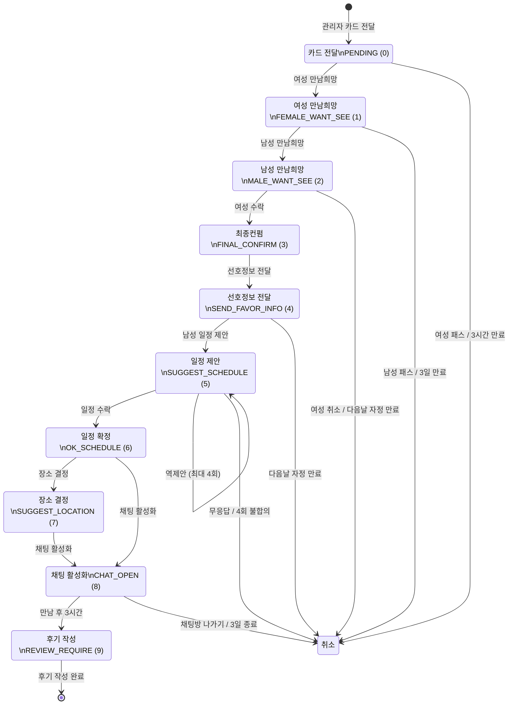
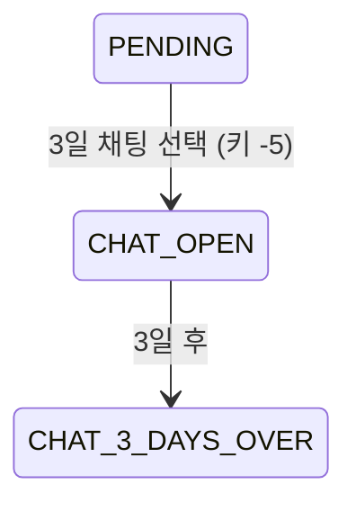
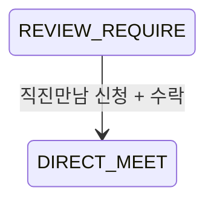
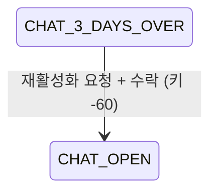

# 매칭 상태 머신 (Matching FSM)

매칭의 전체 상태 흐름을 정리한 문서이다.

## 매칭 상태 (MATCH_STATUS)

### 진행 상태

| 값  | 상수               | 의미            | 다음 액션          |
| --- | ------------------ | --------------- | ------------------ |
| 0   | `PENDING`          | 카드 전달됨     | 여성 응답 대기     |
| 1   | `FEMALE_WANT_SEE`  | 여성 만남희망   | 남성 응답 대기     |
| 2   | `MALE_WANT_SEE`    | 남성 만남희망   | 여성 최종컨펌 대기 |
| 3   | `FINAL_CONFIRM`    | 여성 최종컨펌   | 선호정보 전달      |
| 4   | `SEND_FAVOR_INFO`  | 선호정보 전달됨 | 남성 일정 제안     |
| 5   | `SUGGEST_SCHEDULE` | 일정 제안됨     | 상대방 수락/역제안 |
| 6   | `OK_SCHEDULE`      | 일정 확정       | 장소 결정          |
| 7   | `SUGGEST_LOCATION` | 장소 결정됨     | 채팅 활성화        |
| 8   | `CHAT_OPEN`        | 채팅 활성화     | 3일간 채팅         |
| 9   | `REVIEW_REQUIRE`   | 후기 작성 필요  | 후기 작성          |
| 10  | `SHARE_CONTRACT`   | 연락처 공개     | 완료               |
| 11  | `DIRECT_MEET`      | 직진만남        | 진지한 만남 진행   |

### 취소 상태

| 값   | 상수                       | 의미               | 환불      |
| ---- | -------------------------- | ------------------ | --------- |
| -1   | `FEMALE_PASS`              | 여성 패스          | 없음      |
| -2   | `MALE_PASS`                | 남성 패스          | 여성 전액 |
| -10  | `CANCELED`                 | 무응답 취소        | 조건부    |
| -100 | `FINAL_CONFIRM_CANCEL`     | 여성 최종컨펌 취소 | 남성 전액 |
| -101 | `CONFIRM_NO_REPLY`         | 최종컨펌 무응답    | 조건부    |
| -102 | `FAVOR_INFO_NO_REPLY`      | 선호정보 무응답    | 조건부    |
| -103 | `SCHEDULE_NO_REPLY`        | 일정제안 무응답    | 조건부    |
| -104 | `SCHEDULE_ACCEPT_NO_REPLY` | 일정수락 무응답    | 조건부    |
| -105 | `SCHEDULE_NOT_SELECTED`    | 일정 불합의        | 양쪽 50%  |
| -106 | `LOCATION_NO_REPLY`        | 장소결정 무응답    | 조건부    |
| -107 | `CHAT_ROOM_LEAVE`          | 채팅방 나가기      | 없음      |
| -108 | `USER_BLAME`               | 회원 신고          | 없음      |
| -109 | `CHAT_SCHEDULE_CANCEL`     | 일정변경 취소      | 없음      |
| -110 | `CHAT_3_DAYS_OVER`         | 3일 채팅 종료      | 없음      |

## 상태 전환 FSM

## 단계별 만료 시간

| 상태             | 만료 시간             | 만료 시 상태                    |
| ---------------- | --------------------- | ------------------------------- |
| PENDING          | 3시간                 | 카드 삭제                       |
| FEMALE_WANT_SEE  | 3일                   | CANCELED (-10)                  |
| MALE_WANT_SEE    | 다음날 자정           | CONFIRM_NO_REPLY (-101)         |
| SEND_FAVOR_INFO  | 다음날 자정           | FAVOR_INFO_NO_REPLY (-102)      |
| SUGGEST_SCHEDULE | 다음날 자정           | SCHEDULE_NO_REPLY (-103)        |
| OK_SCHEDULE      | 만남일 or 다음날 자정 | SCHEDULE_ACCEPT_NO_REPLY (-104) |
| CHAT_OPEN        | 3일                   | CHAT_3_DAYS_OVER (-110)         |

## 특수 경로

### 3일 채팅 (남성 전용)

- 정규 매칭 과정을 건너뛰고 바로 채팅
- 별도 키 소진 (-5)

### 직진만남

- 후기 작성 후에만 가능
- 별도 키 소진 (-77)

### 채팅방 재활성화

## 큐레이터 제안 상태 (CURATOR_STATUS)

| 값  | 상수            | 의미                          |
| --- | --------------- | ----------------------------- |
| 0   | `NONE`          | CMS 전달 카드                 |
| 1   | `PENDING`       | 큐레이터 제안                 |
| 2   | `MALE_WANT_SEE` | 남성 수락                     |
| 3   | `FROM_CURATOR`  | 큐레이터 제안으로 시작된 매칭 |
| -1  | `MALE_PASS`     | 남성 패스                     |
| -2  | `ADMIN_DENY`    | 관리자 거절                   |

## 근거 (코드 기준)

- 상태 상수: `coupler-api/config/constant.js`
- 매칭 로직: `coupler-api/controller/app/v1/match.js`
- 매칭 모델: `coupler-api/model/match.js`
- 라우팅: `coupler-api/routes/app/v1/match.js`
