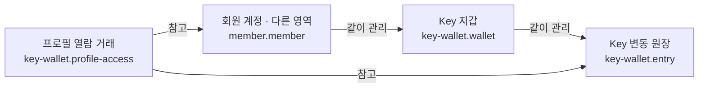

# 매칭 키(Key) 시스템

## 문서 역할

- 역할: `설명`
- 문서 종류: `architecture`
- 충돌 시 우선 문서: [매칭 운영 정책](../policy/matching-ops-policy.md)
- 기준 성격: `as-is`

매칭 도메인의 키 정산 구조, 로그 기록 방식, 대표 정산 코드 경로를 정리한 문서이다.

정확한 차감/환불 기준의 원문 SoT는 [매칭 운영 정책](../policy/matching-ops-policy.md)을 따른다.

## 논리 데이터 모델

- 도메인 ID: `key-wallet`

### 먼저 보는 그림

이 그림은 데이터가 어디에 속하고 무엇을 참고하는지 먼저 보여준다.
정확한 이름과 조건은 아래 상세 표를 따른다.

꼭 지킬 규칙:

- 현재 잔액은 원장의 순차 적용 결과와 일치해야 한다
- Key 변동 성공 응답 전 회원 잔액 갱신과 원장 기록을 모두 완료한다
- 재열람 과금 여부는 서비스 문맥별 서버 실행 경로에서 판정하며 전역 최초 1회로 간주하지 않는다

<!-- markdownlint-disable MD046 -->

??? info "정확한 값과 조건 보기"

    ### 논리 엔티티

    | 논리 ID | 표시명 | 생명주기 역할 | 엔티티 형태 | 기록 역할 | 책임 | 최고 데이터 분류 | 생명주기 |
    | --- | --- | --- | --- | --- | --- | --- | --- |
    | `key-wallet.wallet` | Key 지갑 | child | entity | state | 회원이 현재 사용할 수 있는 Key 잔액 | 내부 | 회원 계정과 함께 유지하고 모든 변경을 원장과 일치시킴 |
    | `key-wallet.entry` | Key 변동 원장 | child | entity | ledger | 지급·차감·환불과 변경 후 잔액 | 내부 | append-only 서비스 이용·정산 이력으로 보존 |
    | `key-wallet.profile-access` | 프로필 열람 거래 | root | association | ledger | 서비스 문맥별 프로필 열람과 요청 시점의 Key 차감 결과 | 민감 | 열람·과금 확인 기간 동안 보존하고 회원 개인정보 정리 시 삭제 |

    ### 관계

    | 출발 논리 ID | 관계 역할 | 관계 유형 | 도착 논리 ID | 카디널리티 | 소유·삭제 규칙 |
    | --- | --- | --- | --- | --- | --- |
    | `member.member` | `key-wallet` | owns | `key-wallet.wallet` | 1:1 | 회원 계정마다 하나의 현재 지갑만 유지 |
    | `key-wallet.wallet` | `entries` | owns | `key-wallet.entry` | 1:N | 원장 삭제 없이 잔액 변동을 보존 |
    | `key-wallet.profile-access` | `debit-entry` | references | `key-wallet.entry` | 1:1 | Key를 차감한 열람 요청은 같은 요청에서 한 건의 원장 기록을 생성 |
    | `key-wallet.profile-access` | `viewer` | references | `member.member` | N:1 | 열람 회원과 서비스 문맥에 따라 요청별 과금을 판정 |
    | `key-wallet.profile-access` | `subject` | references | `member.member` | N:1 | 대상 회원이 같아도 서비스 문맥이 다르면 별도 거래로 판정 가능 |

    ### 불변조건

    | 규칙 ID | 관련 논리 ID | 불변조건 | 기준 문서 |
    | --- | --- | --- | --- |
    | `KEY-WALLET-INV-001` | `key-wallet.wallet` | 현재 잔액은 원장의 순차 적용 결과와 일치해야 한다 | [매칭 운영 정책](../policy/matching-ops-policy.md) |
    | `KEY-WALLET-INV-002` | `key-wallet.entry` | Key 변동 성공 응답 전 회원 잔액 갱신과 원장 기록을 모두 완료한다 | [매칭 운영 정책](../policy/matching-ops-policy.md) |
    | `KEY-WALLET-INV-003` | `key-wallet.profile-access` | 재열람 과금 여부는 서비스 문맥별 서버 실행 경로에서 판정하며 전역 최초 1회로 간주하지 않는다 | 이 문서 |

<!-- markdownlint-enable MD046 -->

## 정산 구조 요약

- 키 차감/환불 판단은 서버가 수행하고, 결과는 `t_member_key_log`와 `t_member.key`에 반영한다.
- 이 문서는 어떤 이벤트가 어떤 로그 기록으로 남는지, 대표 환불 코드 경로가 어디인지 설명한다.
- 액션별 차감량, 환불 비율, 종료 상태 판정은 정책 문서를 기준으로 본다.

## 대표 정산 이벤트

- 프로필 열람 계열: 프로필/비디오/미니프로필 열람 차감
- 만남/의사표현 계열: 만남 의향, 만남 수락, 프로필 패스 차감
- 환불 계열: 남성 패스, 여성 최종컨펌 취소, 일정 불합의 환불
- 후속 액션 계열: 후기 작성 보상, 채팅 재활성화, 직진만남 차감

## 환불 로직 상세

대표 환불 경로는 `coupler-api/controller/app/v1/match.ts`에 있다.

| 상황 | 코드 경계 | 로그 문구 기준 |
| --- | --- | --- |
| 남성 패스 시 여성 환불 | `pass` 흐름 | `key_log.male_pass` |
| 여성 최종컨펌 취소 시 남성 환불 | `confirm` 흐름 | `key_log.confirm_cancel` |
| 일정 불합의 환불 | 매칭 취소 흐름 | `key_log.match_cancel` |

구체적인 환불 금액과 상태 조건은 [매칭 운영 정책](../policy/matching-ops-policy.md)을 기준으로 본다.

## 키 로그 기록 기준

키 로그는 `coupler-api/model/member_key_log.ts`의 `insertLog`를 통해 `t_member_key_log`에 기록한다.
`type`은 현재 `KEY_LOG.NORMAL` 또는 `KEY_LOG.FREE_KEY` 구분에 사용하고, 매칭 액션의 의미는 `content`에 저장되는 로그 문구를 기준으로 남긴다.

## 키 잔액 추적

모든 Key 변동은 `key-wallet.entry`로 기록하고 `key-wallet.wallet`의 현재 잔액과 같은 transaction에서
갱신한다. 물리 저장 구조와 컬럼 설명은 private schema contract를 기준으로 한다.
