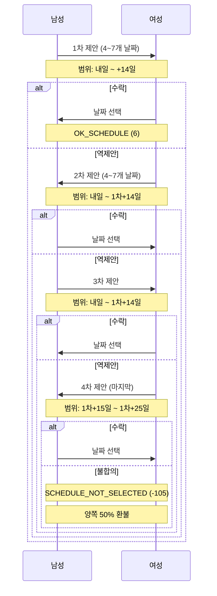

# 매칭 일정 제안 알고리즘

일정 제안/역제안의 범위 검증 및 제한 규칙을 정리한 문서이다.

## 일정 제안 개요

- 최대 4회까지 제안/역제안 가능
- 각 제안 시 4~7개의 날짜를 제시해야 함
- 제안 횟수에 따라 선택 가능한 날짜 범위가 다름


## 제안 횟수별 날짜 범위

| 제안 횟수    | 범위 시작         | 범위 끝           | 비고         |
| ------------ | ----------------- | ----------------- | ------------ |
| 1차 (최초)   | 내일              | 오늘 + 14일       | 2주 이내     |
| 2차 (역제안) | 내일              | 1차 제안일 + 14일 | 1차 기준 2주 |
| 3차 (역제안) | 내일              | 1차 제안일 + 14일 | 1차 기준 2주 |
| 4차 (역제안) | 1차 제안일 + 15일 | 1차 제안일 + 25일 | 원거리 날짜  |

## 범위 검증 로직

```javascript
// match.js 라인 756-786
switch (schedule_count) {
  case 0:
    // 최초 제안: 내일 ~ +14일
    moment(date).isBetween(
      moment().add(1, "days"),
      moment().add(14, "days"),
      "day",
      "[]", // 경계 포함
    );
    break;

  case 1:
  case 2:
    // 1차, 2차 역제안: 내일 ~ 최초제안일 + 14일
    moment(date).isBetween(
      moment().add(1, "days"),
      moment(first_schedule_date).add(14, "days"),
      "day",
      "[]",
    );
    break;

  case 3:
    // 3차, 4차 역제안: 최초제안일 + 15일 ~ +25일
    moment(date).isBetween(
      moment(first_schedule_date).add(15, "days"),
      moment(first_schedule_date).add(25, "days"),
      "day",
      "[]",
    );
    break;
}
```

## 제안 규칙

### 날짜 개수

- 최소: 4개
- 최대: 7개

```javascript
// match.js 라인 788-793
if (schedule_list.length < 4 || schedule_list.length > 7) {
  return response_error(res, "4~7개의 날짜를 선택해주세요");
}
```

### 검증 조건

1. 모든 날짜가 허용 범위 내에 있어야 함
2. 중복 날짜 불가
3. 과거 날짜 불가


## 역제안 흐름



## 4회 불합의 처리

4차 제안까지 합의되지 않으면:

1. 상태: `SCHEDULE_NOT_SELECTED (-105)`
2. 환불: 양쪽 50%
3. 매칭 종료

```javascript
// match.js 라인 941-975
if (schedule_count >= 4 && !accepted) {
  // 상태 변경
  await MMatch.getInstance().update(
    {
      status: MATCH_STATUS.SCHEDULE_NOT_SELECTED,
    },
    match_id,
  );

  // 50% 환불
  const femaleRefund = Math.floor(female_paid_key * 0.5);
  const maleRefund = Math.floor(male_paid_key * 0.5);
}
```

## 만료 처리

각 제안 후 다음날 자정까지 응답이 없으면:

- 상태: `SCHEDULE_NO_REPLY (-103)`
- Cron 작업으로 자동 처리


## 근거 (코드 기준)

- 일정 제안: `coupler-api/controller/app/v1/match.js` (`addSchedule`)
- 일정 수락: `coupler-api/controller/app/v1/match.js` (`acceptSchedule`)
- 일정 모델: `coupler-api/model/match_schedule.js`
