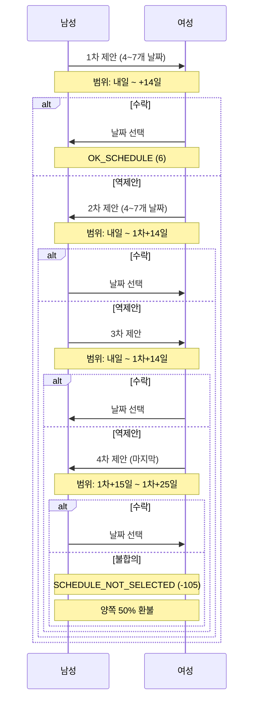

# 매칭 일정 제안 알고리즘

## 문서 역할

- 역할: `설명`
- 문서 종류: `architecture`
- 충돌 시 우선 문서: [매칭 운영 정책](../policy/matching-ops-policy.md)
- 기준 성격: `as-is`

일정 제안/역제안 검증의 구조와 대표 흐름을 정리한 문서이다.

정확한 허용 횟수, 날짜 개수, 범위 규칙의 원문 SoT는 [매칭 운영 정책](../policy/matching-ops-policy.md)을 따른다.

## 검증 구조 요약

- 서버는 제안 횟수에 따라 허용 날짜 창을 다르게 적용한다.
- 각 제안은 날짜 개수, 중복 여부, 과거 날짜 여부를 함께 검증한다.
- 이 문서는 분기 구조와 시퀀스를 설명하고, 실제 제한 값은 정책 문서를 기준으로 본다.

## 범위 검증 로직

```javascript
// match.js 라인 756-786
switch (schedule_count) {
  case 0:
    // 최초 제안: 내일 ~ +14일
    moment(date).isBetween(
      moment().add(1, "days"),
      moment().add(14, "days"),
      "day",
      "[]", // 경계 포함
    );
    break;

  case 1:
  case 2:
    // 1차, 2차 역제안: 내일 ~ 최초제안일 + 14일
    moment(date).isBetween(
      moment().add(1, "days"),
      moment(first_schedule_date).add(14, "days"),
      "day",
      "[]",
    );
    break;

  case 3:
    // 3차, 4차 역제안: 최초제안일 + 15일 ~ +25일
    moment(date).isBetween(
      moment(first_schedule_date).add(15, "days"),
      moment(first_schedule_date).add(25, "days"),
      "day",
      "[]",
    );
    break;
}
```

## 입력 검증 예시

```javascript
// match.js 라인 788-793
if (schedule_list.length < MIN_COUNT || schedule_list.length > MAX_COUNT) {
  return response_error(res, "허용 범위를 벗어난 날짜 개수");
}
```

- 실제 최소/최대 허용 개수와 상태 전이 결과는 정책 문서를 따른다.

## 역제안 흐름


```mermaid
sequenceDiagram
    participant M as 남성
    participant F as 여성

    M->>F: 1차 제안 (4~7개 날짜)
    Note over M,F: 범위: 내일 ~ +14일

    alt 수락
        F->>M: 날짜 선택
        Note over M,F: OK_SCHEDULE (6)
    else 역제안
        F->>M: 2차 제안 (4~7개 날짜)
        Note over M,F: 범위: 내일 ~ 1차+14일

        alt 수락
            M->>F: 날짜 선택
        else 역제안
            M->>F: 3차 제안
            Note over M,F: 범위: 내일 ~ 1차+14일

            alt 수락
                F->>M: 날짜 선택
            else 역제안
                F->>M: 4차 제안 (마지막)
                Note over M,F: 범위: 1차+15일 ~ 1차+25일

                alt 수락
                    M->>F: 날짜 선택
                else 불합의
                    Note over M,F: SCHEDULE_NOT_SELECTED (-105)
                    Note over M,F: 양쪽 50% 환불
                end
            end
        end
    end
```

## 불합의 종료 예시

정책에서 정의한 최종 제안 횟수까지 합의되지 않으면 서버는 불합의 종료 상태로 전환하고 환불 규칙을 적용한다.

```javascript
// match.js 라인 941-975
if (schedule_count >= MAX_SCHEDULE_ATTEMPTS && !accepted) {
  // 상태 변경
  await MMatch.getInstance().update(
    {
      status: MATCH_STATUS.SCHEDULE_NOT_SELECTED,
    },
    match_id,
  );

  // 정책 기준 환불 적용
  const femaleRefund = Math.floor(female_paid_key * 0.5);
  const maleRefund = Math.floor(male_paid_key * 0.5);
}
```

## 만료 처리

- 각 제안 후 응답 기한이 지나면 서버가 무응답 종료 상태로 전환한다.
- 구체적인 기한과 상태 값은 정책 문서를 따른다.
