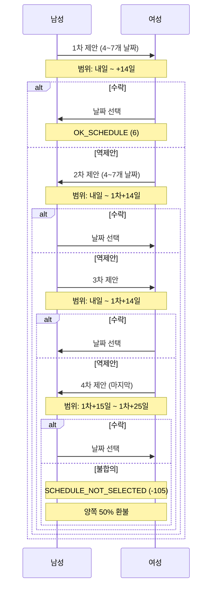

# 매칭 일정 제안 알고리즘

## 문서 역할

- 역할: `설명`
- 문서 종류: `architecture`
- 충돌 시 우선 문서: [매칭 운영 정책](../policy/matching-ops-policy.md)
- 기준 성격: `as-is`

일정 제안/역제안 검증의 구조와 대표 흐름을 정리한 문서이다.

정확한 허용 횟수, 날짜 개수, 범위 규칙의 원문 SoT는 [매칭 운영 정책](../policy/matching-ops-policy.md)을 따른다.

## 검증 구조 요약

- 서버는 제안 횟수에 따라 허용 날짜 창을 다르게 적용한다.
- 각 제안은 날짜 범위와 날짜 개수를 함께 검증한다.
- 이 문서는 분기 구조와 시퀀스를 설명하고, 실제 제한 값은 정책 문서를 기준으로 본다.

## 범위 검증 구조

현행 구현 경계는 `coupler-api/lib/matching-schedule-parser.ts`다.

| 함수 | 역할 |
| --- | --- |
| `getMatchingScheduleSelectableDateRange` | 제안 횟수별 허용 날짜 범위 산출 |
| `parseMatchingScheduleCandidates` | 입력된 날짜 후보를 허용 범위 기준으로 필터링 |
| `getMatchingScheduleDayCountErrorCode` | 필터링된 후보가 허용 개수인지 판정 |

## 입력 검증 경계

컨트롤러 경계는 `coupler-api/controller/app/v1/match.ts`의 `addSchedule` 흐름이다.
실패 응답 계약은 [API 에러 계약 정책](../policy/api-error-contract-policy.md)을 따른다.

- `addSchedule`은 parser 결과를 기준으로 허용 날짜 개수를 판정한다.
- 범위 밖 날짜는 후보에서 제외되며, 제외 후 개수가 허용 최소보다 작으면 실패한다.
- 중복 없는 날짜 요구사항은 [매칭 운영 정책](../policy/matching-ops-policy.md)의 규범이지만, 현행 parser/controller 경계는 중복 제거/거부를 별도로 수행하지 않는다.
- 실제 최소/최대 허용 개수와 상태 전이 결과는 정책 문서를 따른다.

## 역제안 흐름

```mermaid
sequenceDiagram
    participant M as 남성
    participant F as 여성

    M->>F: 1차 제안 (4~7개 날짜)
    Note over M,F: 범위: 내일 ~ +14일

    alt 수락
        F->>M: 날짜 선택
        Note over M,F: OK_SCHEDULE (6)
    else 역제안
        F->>M: 2차 제안 (4~7개 날짜)
        Note over M,F: 범위: 내일 ~ 1차+14일

        alt 수락
            M->>F: 날짜 선택
        else 역제안
            M->>F: 3차 제안
            Note over M,F: 범위: 내일 ~ 1차+14일

            alt 수락
                F->>M: 날짜 선택
            else 역제안
                F->>M: 4차 제안 (마지막)
                Note over M,F: 범위: 1차+15일 ~ 1차+25일

                alt 수락
                    M->>F: 날짜 선택
                else 불합의
                    Note over M,F: SCHEDULE_NOT_SELECTED (-105)
                    Note over M,F: 양쪽 50% 환불
                end
            end
        end
    end
```

## 불합의 종료 예시

정책에서 정의한 최종 제안 횟수까지 합의되지 않으면 서버는 불합의 종료 상태로 전환하고 환불 규칙을 적용한다.

현행 종료 처리는 `coupler-api/controller/app/v1/match.ts`의 매칭 취소 흐름에서 수행한다.
서버는 일정 제안 횟수를 확인한 뒤 정책 기준 환불 로그를 남기고, 매칭 상태를 `SCHEDULE_NOT_SELECTED`로 갱신한다.

## 만료 처리

- 각 제안 후 응답 기한이 지나면 서버가 무응답 종료 상태로 전환한다.
- 구체적인 기한과 상태 값은 정책 문서를 따른다.
