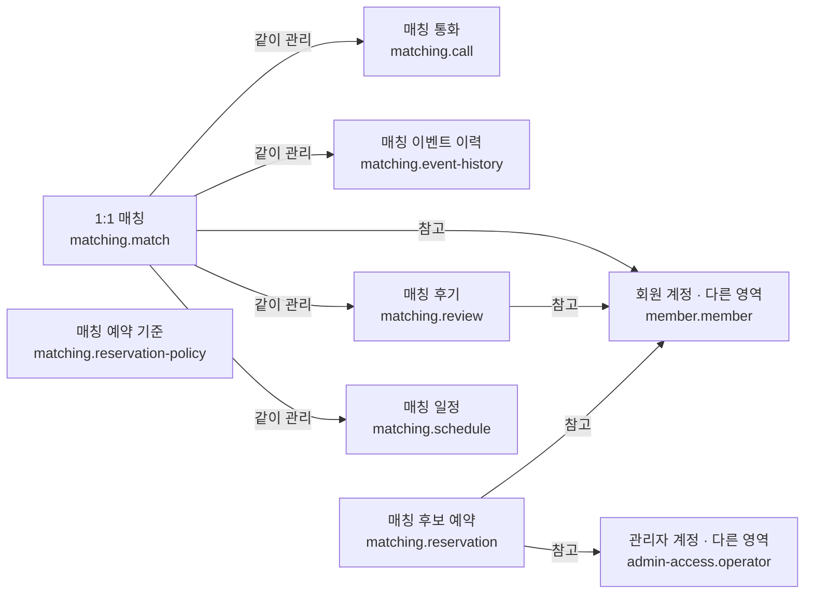

# 매칭 시스템

## 문서 역할

- 역할: `설명`
- 문서 종류: `architecture`
- 충돌 시 우선 문서: [매칭 운영 정책](../policy/matching-ops-policy.md)
- 기준 성격: `as-is`

1:1 매칭의 저장 책임을 설명한다. 상태 전이는 [매칭 FSM](matching-fsm.md), 일정 합의 규칙은
[매칭 일정 제안 알고리즘](matching-schedule-algorithm.md)을 참고한다.

## 범위

- 매칭 생명주기와 참여 회원
- 일정 제안·합의, 통화, 후기와 상태 이력
- 자동 추천 후보와 추천 기준
- 채팅 메시지는 [채팅 시스템](chat-system.md)이 소유한다.

## 논리 데이터 모델

- 도메인 ID: `matching`

### 먼저 보는 그림

이 그림은 데이터가 어디에 속하고 무엇을 참고하는지 먼저 보여준다.
정확한 이름과 조건은 아래 상세 표를 따른다.

꼭 지킬 규칙:

- 동일 매칭의 두 참여 회원은 같을 수 없다
- 확정 일정은 허용된 제안·수락 상태 전이를 거쳐야 한다
- 상태 변경과 Key 정산 이력은 원천 상태 변경과 같은 결론을 가져야 한다
- 예약 후보는 발송 전 작업 상태이며 발송 완료 또는 운영자 삭제 시 제거된다
- 일반 운영자의 예약 작업은 생성 계정 범위로 격리하고 공통 cron은 전체 생성 계정의 발송 대상을 처리한다

<!-- markdownlint-disable MD046 -->

??? info "정확한 값과 조건 보기"

    ### 논리 엔티티

    | 논리 ID | 표시명 | 생명주기 역할 | 엔티티 형태 | 기록 역할 | 책임 | 최고 데이터 분류 | 생명주기 |
    | --- | --- | --- | --- | --- | --- | --- | --- |
    | `matching.match` | 1:1 매칭 | root | association | state | 두 회원의 매칭 상태와 현재 진행 정보 | 민감 | 완료·취소 뒤 운영 이력을 보존하고 개인정보는 정책에 따라 정리 |
    | `matching.schedule` | 매칭 일정 | child | entity | state | 일정 제안·역제안·합의 결과 | 내부 | 매칭 종료 후 이력으로 보존 |
    | `matching.call` | 매칭 통화 | child | entity | history | 통화 요청·수락과 통화 시간 | 민감 | 운영·분쟁 처리 기간 동안 보존 |
    | `matching.review` | 매칭 후기 | child | association | history | 작성 회원과 대상 회원의 만남 결과·후기 연결 | 민감 | 개인정보 정리 후 비식별 이력만 보존 가능 |
    | `matching.event-history` | 매칭 이벤트 이력 | child | entity | history | 상태 변경, Key 처리와 운영 메시지 | 내부 | append-only 이력으로 보존 |
    | `matching.reservation` | 매칭 후보 예약 | root | entity | state | 발송 전 자동 매칭 후보, 생성 운영 계정 범위와 현재 실패 사유 | 내부 | 발송 성공 또는 운영자 삭제 시 제거하고 실패 후보는 재시도·삭제 전까지 유지 |
    | `matching.reservation-policy` | 매칭 예약 기준 | root | entity | reference | 자동 매칭 횟수·연령·등급 범위 | 내부 | 운영 설정 변경 시 갱신 |

    ### 관계

    | 출발 논리 ID | 관계 역할 | 관계 유형 | 도착 논리 ID | 카디널리티 | 소유·삭제 규칙 |
    | --- | --- | --- | --- | --- | --- |
    | `matching.match` | `participant-a` | references | `member.member` | N:1 | 첫 번째 참여자와 두 번째 참여자는 서로 달라야 함 |
    | `matching.match` | `participant-b` | references | `member.member` | N:1 | 두 참여자의 순서가 바뀌어도 같은 매칭을 중복 생성하지 않음 |
    | `matching.match` | `schedules` | owns | `matching.schedule` | 1:N | 매칭 종료 뒤에도 제안 이력을 보존 |
    | `matching.match` | `calls` | owns | `matching.call` | 1:N | 매칭 이력과 함께 보존 |
    | `matching.match` | `reviews` | owns | `matching.review` | 1:N | 회원당 후기 중복을 허용하지 않음 |
    | `matching.review` | `author` | references | `member.member` | N:1 | 작성자는 해당 매칭 참여자여야 함 |
    | `matching.review` | `subject` | references | `member.member` | N:1 | 대상자는 작성자와 다른 해당 매칭 참여자여야 함 |
    | `matching.match` | `event-history` | owns | `matching.event-history` | 1:N | 원천 매칭 삭제 없이 이력을 유지 |
    | `matching.reservation` | `female-candidate` | references | `member.member` | N:1 | 예약 발송 전 여성 후보를 참조 |
    | `matching.reservation` | `male-candidate` | references | `member.member` | N:1 | 예약 발송 전 남성 후보를 참조 |
    | `matching.reservation` | `created-by` | references | `admin-access.operator` | N:1 | 생성 계정이 일반 운영자의 조회·삭제·즉시 발송 범위를 결정하며, 생성자를 복원할 수 없는 전환 이전 예약은 공통 발송 범위로만 유지 |

    ### 불변조건

    | 규칙 ID | 관련 논리 ID | 불변조건 | 기준 문서 |
    | --- | --- | --- | --- |
    | `MATCHING-INV-001` | `matching.match` | 동일 매칭의 두 참여 회원은 같을 수 없다 | [매칭 운영 정책](../policy/matching-ops-policy.md) |
    | `MATCHING-INV-002` | `matching.schedule` | 확정 일정은 허용된 제안·수락 상태 전이를 거쳐야 한다 | [매칭 일정 제안 알고리즘](matching-schedule-algorithm.md) |
    | `MATCHING-INV-003` | `matching.event-history` | 상태 변경과 Key 정산 이력은 원천 상태 변경과 같은 결론을 가져야 한다 | [매칭 운영 정책](../policy/matching-ops-policy.md) |
    | `MATCHING-INV-004` | `matching.reservation` | 예약 후보는 발송 전 작업 상태이며 발송 완료 또는 운영자 삭제 시 제거된다 | 이 문서 |
    | `MATCHING-INV-005` | `matching.reservation` | 일반 운영자의 예약 작업은 생성 계정 범위로 격리하고 공통 cron은 전체 생성 계정의 발송 대상을 처리한다 | [매칭 운영 정책](../policy/matching-ops-policy.md) |

<!-- markdownlint-enable MD046 -->

## 관련 문서

- [매칭 운영 정책](../policy/matching-ops-policy.md)
- [매칭 FSM](matching-fsm.md)
- [매칭 일정 제안 알고리즘](matching-schedule-algorithm.md)
- [매칭 Key 시스템](matching-key-system.md)
- [채팅 시스템](chat-system.md)
