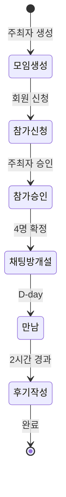

# 미팅 시스템 (2:2 그룹 미팅)

2:2 그룹 미팅 아키텍처를 정리한 문서이다.

## 미팅 상태

### 모임 상태 (t_meeting.status)

| 값  | 상수    | 의미   |
| --- | ------- | ------ |
| 0   | PENDING | 대기   |
| 1   | NORMAL  | 진행중 |
| 2   | FINISH  | 완료   |
| -1  | DELETED | 삭제   |

### 채팅방 상태 (t_meeting.chat_open)

| 값  | 상수    | 의미              |
| --- | ------- | ----------------- |
| 0   | PENDING | 미개설 (4명 미만) |
| 1   | NORMAL  | 개설됨 (4명 확정) |
| 2   | FINISH  | 종료 (후기 완료)  |

### 멤버 상태 (t_meeting_member.status)

| 값  | 상수    | 의미      |
| --- | ------- | --------- |
| 0   | PENDING | 승인 대기 |
| 1   | NORMAL  | 참여 확정 |
| 2   | CANCEL  | 탈퇴/취소 |

## 미팅 흐름

## 참가 조건

- 진행중인 모임 최대 2개
- 같은 날 다른 모임 참가 불가
- 지인 필터:

  - 전화번호 중복
  - 1:1 매칭 진행자
  - 추천인 관계
  - 이전 2:2 동반 참여자

## API 엔드포인트

| 메서드 | 엔드포인트                | 설명          |
| ------ | ------------------------- | ------------- |
| GET    | `/meeting/list`           | 모임 목록     |
| GET    | `/meeting/myList`         | 내 모임 목록  |
| GET    | `/meeting/detail`         | 모임 상세     |
| POST   | `/meeting/add`            | 모임 생성     |
| POST   | `/meeting/delete`         | 모임 삭제     |
| POST   | `/meeting/attend`         | 참가 신청     |
| POST   | `/meeting/allow`          | 참가 승인     |
| POST   | `/meeting/createChatRoom` | 채팅방 생성   |
| GET    | `/meeting/chatList`       | 채팅 목록     |
| POST   | `/meeting/sendChat`       | 채팅 전송     |
| POST   | `/meeting/leaveChat`      | 채팅방 나가기 |
| POST   | `/meeting/review`         | 후기 작성     |
| POST   | `/meeting/blame`          | 모임 신고     |
| POST   | `/meeting/blameUser`      | 회원 신고     |

## 키 소진

| 액션              | 키  | 비고 |
| ----------------- | --- | ---- |
| 사진미공개방 참여 | -10 |      |
| 사진공개방 참여   | -10 |      |
| 미니프로필 보기   | -10 |      |
| 사진프로필 보기   | -25 |      |
| 후기 작성         | +5  | 보상 |

## 회비/분위기

### 회비 (MEET_MONEY)

| 코드 | 금액   |
| ---- | ------ |
| 3    | 3만원  |
| 5    | 5만원  |
| 10   | 10만원 |
| 0    | 미정   |

### 분위기 (MEET_MOOD)

| 코드 | 분위기        |
| ---- | ------------- |
| 1    | 정중한 분위기 |
| 2    | 편안한 분위기 |
| 3    | 재밌는 분위기 |
| 4    | 맛집팀방      |
| 5    | 뭐든!         |
| 6    | 텐션좋은 파티 |

## FCM 알림

| 타입  | 상수                  | 의미              |
| ----- | --------------------- | ----------------- |
| 31    | MEET_ATTEND_REQUEST   | 참가 신청         |
| 32    | MEET_ACCEPT_ATTEND    | 참가 승인         |
| 33    | MEET_MEMBER_OK_OWNER  | 4명 확정 (주최자) |
| 34    | MEET_MEMBER_OK_MEMBER | 4명 확정 (멤버)   |
| 35-36 | MEET*2_HOUR_PASSED*\* | 2시간 경과        |
| 37    | MEET_SEND_CHAT        | 채팅 전송         |
| 58    | MEET_DELETED          | 모임 삭제         |

## 데이터 모델

### t_meeting

| 필드         | 설명          |
| ------------ | ------------- |
| member       | 주최자 ID     |
| status       | 모임 상태     |
| chat_open    | 채팅방 상태   |
| photo_public | 사진공개 여부 |
| title        | 모임 제목     |
| money        | 회비          |
| mood         | 분위기        |
| location     | 장소          |
| date         | 예정 시간     |
| male_cnt     | 남성 수       |
| female_cnt   | 여성 수       |

### t_meeting_member

| 필드    | 설명        |
| ------- | ----------- |
| meeting | 모임 ID     |
| member  | 회원 ID     |
| status  | 멤버 상태   |
| alias   | 랜덤 닉네임 |
| key     | 소비 키     |

## 근거 (코드 기준)

- 컨트롤러: `coupler-api/controller/app/v1/meeting.js`
- 라우터: `coupler-api/routes/app/v1/meeting.js`
- 모델: `coupler-api/model/meeting.js`, `meeting_member.js`
