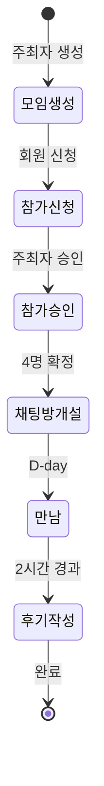

# 기존 2:2 그룹미팅 시스템

## 문서 역할

- 역할: `설명`
- 문서 종류: `architecture`
- 충돌 시 우선 문서: 이 문서
- 기준 성격: `as-is`

기존에 구현·배포된 2:2 그룹미팅 아키텍처를 정리한 문서이다.
신규 그룹미팅의 DB/API는 [그룹미팅 시스템](group-meeting-system.md)을 따르며, 이 문서의 `t_meeting*`,
`/meeting/*`, `MEET_*`는 호환성을 위해 유지하는 기존 계약이다.
현재 범위에서는 미팅의 구조와 흐름 설명에 집중하며, 별도 규범 문서는 두지 않는다.

## 논리 데이터 모델

- 도메인 ID: `legacy-meeting`

### 논리 엔티티

| 논리 ID | 표시명 | 구조 유형 | 기록 역할 | 책임 | 최고 데이터 분류 | 생명주기 |
| --- | --- | --- | --- | --- | --- | --- |
| `legacy-meeting.meeting` | 기존 2:2 미팅 | root | state | 행사 모집·확정·종료와 현재 표시 정보 | 민감 | 기존 호환 계약으로 보존하며 종료·삭제 이력 유지 |
| `legacy-meeting.participation` | 기존 미팅 참가 | relation | state | 회원의 신청·승인·퇴장과 행사 당시 별칭 | 민감 | 행사 종료 뒤 참가 이력으로 보존 |
| `legacy-meeting.review` | 기존 미팅 후기 | child | history | 행사 결과와 후기 내용 | 민감 | 개인정보 정리 뒤 비식별 보존 가능 |
| `legacy-meeting.rating` | 기존 미팅 별점 | relation | history | 작성 회원과 대상 회원 사이의 별점 | 민감 | 운영·신고 확인 기간 동안 보존 |

### 관계

| 출발 논리 ID | 관계 유형 | 도착 논리 ID | 카디널리티 | 소유·삭제 규칙 |
| --- | --- | --- | --- | --- |
| `legacy-meeting.meeting` | references | `member.member` | N:1 | 주최 회원 개인정보 정리 뒤 행사 이력은 보존 |
| `legacy-meeting.meeting` | owns | `legacy-meeting.participation` | 1:N | 참가 이력은 행사와 함께 보존 |
| `legacy-meeting.meeting` | owns | `legacy-meeting.review` | 1:N | 후기 중복 기준을 유지하고 원문은 정책에 따라 정리 |
| `legacy-meeting.rating` | associates | `member.member` | N:M | 작성자와 대상자를 행사 문맥에서 검증 |

### 불변조건

| 규칙 ID | 관련 논리 ID | 불변조건 | 기준 문서 |
| --- | --- | --- | --- |
| `LEGACY-MEETING-INV-001` | `legacy-meeting.meeting` | 기존 2:2와 신규 그룹미팅의 상태·데이터 계약을 혼용하지 않는다 | [논리 데이터 모델 정책](../policy/logical-data-model-policy.md) |
| `LEGACY-MEETING-INV-002` | `legacy-meeting.participation` | 채팅 개설에 사용하는 확정 참가자는 서로 다른 네 회원이어야 한다 | 이 문서 |
| `LEGACY-MEETING-INV-003` | `legacy-meeting.rating` | 별점 작성자와 대상자는 같은 행사에 참여한 서로 다른 회원이어야 한다 | 이 문서 |

## 미팅 상태

### 모임 상태 (t_meeting.status)

| 값  | 상수    | 의미   |
| --- | ------- | ------ |
| 0   | PENDING | 대기   |
| 1   | NORMAL  | 진행중 |
| 2   | FINISH  | 완료   |
| -1  | DELETED | 삭제   |

### 채팅방 상태 (t_meeting.chat_open)

| 값  | 상수    | 의미              |
| --- | ------- | ----------------- |
| 0   | PENDING | 미개설 (4명 미만) |
| 1   | NORMAL  | 개설됨 (4명 확정) |
| 2   | FINISH  | 종료 (후기 완료)  |

### 멤버 상태 (t_meeting_member.status)

| 값  | 상수    | 의미      |
| --- | ------- | --------- |
| 0   | PENDING | 승인 대기 |
| 1   | NORMAL  | 참여 확정 |
| 2   | CANCEL  | 탈퇴/취소 |

## 미팅 흐름

```mermaid
stateDiagram-v2
    [*] --> 모임생성 : 주최자 생성
    모임생성 --> 참가신청 : 회원 신청
    참가신청 --> 참가승인 : 주최자 승인
    참가승인 --> 채팅방개설 : 4명 확정
    채팅방개설 --> 만남 : D-day
    만남 --> 후기작성 : 2시간 경과
    후기작성 --> [*] : 완료
```

## 참가 조건

- 진행중인 모임 최대 2개
- 같은 날 다른 모임 참가 불가
- 지인 필터:

    - 전화번호 중복
    - 1:1 매칭 진행자
    - 추천인 관계
    - 이전 2:2 동반 참여자

## API 엔드포인트

| 메서드 | 엔드포인트                | 설명          |
| ------ | ------------------------- | ------------- |
| GET    | `/meeting/list`           | 모임 목록     |
| GET    | `/meeting/myList`         | 내 모임 목록  |
| GET    | `/meeting/detail`         | 모임 상세     |
| POST   | `/meeting/add`            | 모임 생성     |
| POST   | `/meeting/delete`         | 모임 삭제     |
| POST   | `/meeting/attend`         | 참가 신청     |
| POST   | `/meeting/allow`          | 참가 승인     |
| POST   | `/meeting/createChatRoom` | 채팅방 생성   |
| GET    | `/meeting/chatList`       | 채팅 목록     |
| POST   | `/meeting/sendChat`       | 채팅 전송     |
| POST   | `/meeting/leaveChat`      | 채팅방 나가기 |
| POST   | `/meeting/review`         | 후기 작성     |
| POST   | `/meeting/blame`          | 모임 신고     |
| POST   | `/meeting/blameUser`      | 회원 신고     |

## 키 소진

| 액션              | 키  | 비고 |
| ----------------- | --- | ---- |
| 사진미공개방 참여 | -10 |      |
| 사진공개방 참여   | -10 |      |
| 미니프로필 보기   | -10 |      |
| 사진프로필 보기   | -25 |      |
| 후기 작성         | +5  | 보상 |

## 회비/분위기

### 회비 (MEET_MONEY)

| 코드 | 금액   |
| ---- | ------ |
| 3    | 3만원  |
| 5    | 5만원  |
| 10   | 10만원 |
| 0    | 미정   |

- `MEET_MONEY` 상수, Swagger, DB 주석은 `0`을 `미정`으로 정의한다.
- 모바일 모임 생성 화면의 미선택 내부값은 `-1`이고, 선택 완료 기준은 `money > -1`이다.
- 앱 생성 API는 현재 truthy 검증(`!money`)을 사용하므로 `money=0`을 빈값으로 거부한다.
- 관리자 편집 화면은 `0`을 기본 선택값으로 사용한다.
- 따라서 `0`의 운영 의미는 상수/Swagger/Admin 표시와 앱 생성 API 검증이 일치하지 않는 as-is 상태다. 후속 정리는 [기술 부채 정리](../technical-debt/technical-debt.md)의 미팅 회비 코드 계약 항목에서 추적한다.

### 분위기 (MEET_MOOD)

| 코드 | 분위기        |
| ---- | ------------- |
| 1    | 정중한 분위기 |
| 2    | 편안한 분위기 |
| 3    | 재밌는 분위기 |
| 4    | 맛집팀방      |
| 5    | 뭐든!         |
| 6    | 텐션좋은 파티 |

## FCM 알림

| 타입  | 상수                  | 의미              |
| ----- | --------------------- | ----------------- |
| 31    | MEET_ATTEND_REQUEST   | 참가 신청         |
| 32    | MEET_ACCEPT_ATTEND    | 참가 승인         |
| 33    | MEET_MEMBER_OK_OWNER  | 4명 확정 (주최자) |
| 34    | MEET_MEMBER_OK_MEMBER | 4명 확정 (멤버)   |
| 35-36 | MEET*2_HOUR_PASSED*\* | 2시간 경과        |
| 37    | MEET_SEND_CHAT        | 채팅 전송         |
| 58    | MEET_DELETED          | 모임 삭제         |
