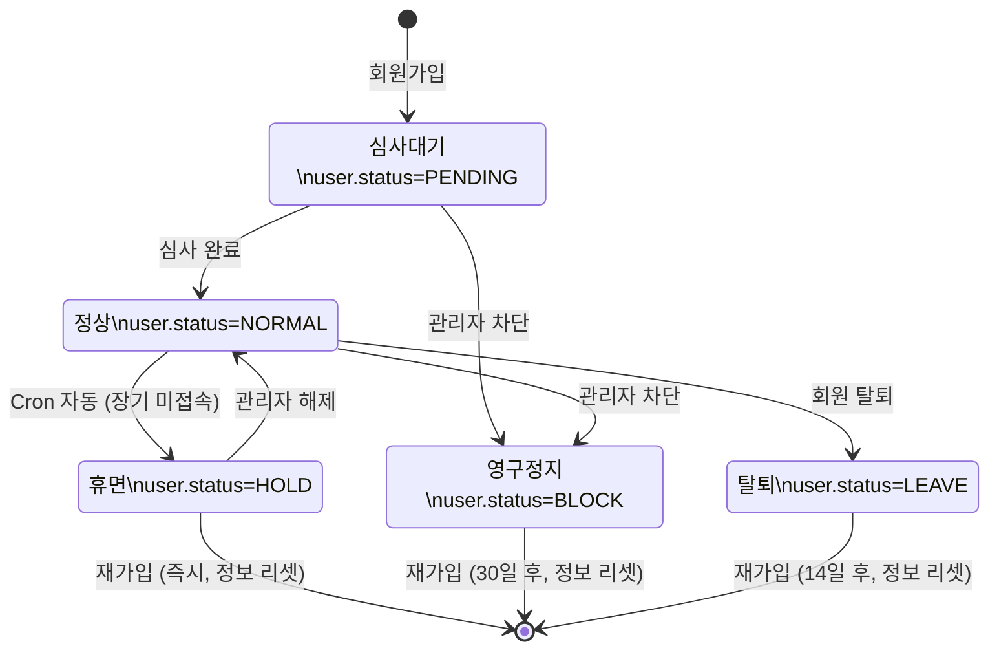

# 회원 생명주기

회원의 전체 상태 흐름을 정리한 문서이다. 심사 과정의 세부 사항은 [member-review-fsm.md](./member-review-fsm.md)를 참고한다.

## 회원 상태 (user.status)

| 값  | 상수      | 의미     | 로그인 | 매칭 |
| --- | --------- | -------- | ------ | ---- |
| -3  | `LEAVE`   | 탈퇴     | 불가   | 불가 |
| -2  | `BLOCK`   | 영구정지 | 불가   | 불가 |
| -1  | `HOLD`    | 휴면     | 불가   | 불가 |
| 0   | `PENDING` | 심사대기 | 가능   | 불가 |
| 1   | `NORMAL`  | 정상     | 가능   | 가능 |

## 상태 전환 FSM

## 상태별 상세

### PENDING (심사대기)

- 회원가입 직후 진입
- 심사 완료 시 `NORMAL`로 전환
- 심사 과정 상세: [member-review-fsm.md](./member-review-fsm.md)

### NORMAL (정상)

- 모든 기능 사용 가능
- 매칭 대상에 포함

### HOLD (휴면)

- **진입**: Cron 자동 실행 (장기 미접속 회원)
- **복귀 경로**:

  1. 관리자 해제 → `NORMAL` (기존 정보 유지)
  2. 재가입 시도 → 정보 리셋 후 신규 가입 (대기 기간 없음)
- **제한**: 로그인/매칭 불가
- **개인정보 파기**: 해당 없음

### BLOCK (영구정지)

- **진입**: Super Admin 차단
- **복귀**: 없음 (30일 후 재가입만 가능)
- **재가입**: 30일 경과 후 정보 리셋하여 신규 가입
- **제한**: 로그인/매칭 불가
- **개인정보 파기**: 30일 후 자동 파기

### LEAVE (탈퇴)

- **진입**: 회원 자발적 탈퇴 (`member.leave` API)
- **복귀**: 없음 (14일 후 재가입만 가능)
- **재가입**: 14일 경과 후 정보 리셋하여 신규 가입
- **제한**: 로그인 시 "존재하지 않는 회원" 처리
- **개인정보 파기**: 30일 후 자동 파기

## 재가입 정책

| 상태  | 대기 기간 | 기존 정보 |
| ----- | --------- | --------- |
| HOLD  | 없음      | 리셋      |
| BLOCK | 30일      | 리셋      |
| LEAVE | 14일      | 리셋      |

- 재가입 시 기존 회원정보는 `resetUserInfo()`로 초기화된다.
- HOLD만 관리자 해제로 기존 정보를 유지한 채 복귀 가능하다.

## 개인정보 자동 파기

- **대상**: `BLOCK` 또는 `LEAVE` 상태
- **조건**: `status_date`로부터 30일 경과 + `auto_delete=NORMAL`
- **실행**: Cron 작업

## 근거 (코드 기준)

- 상태 상수: `coupler-api/config/constant.js`
- 로그인 검증: `coupler-api/controller/app/v1/auth.js`
- 재가입 로직: `coupler-api/controller/app/v1/auth.js` (1134-1155)
- HOLD 자동 전환: `coupler-api/controller/admin/cron.js`
- HOLD 해제: `coupler-api/controller/admin/member.js` (`release_hold`)
- BLOCK 토글: `coupler-api/controller/admin/member.js` (`block`)
- 탈퇴: `coupler-api/controller/app/v1/member.js` (`leave`)
- 개인정보 파기: `coupler-api/controller/admin/cron.js`
