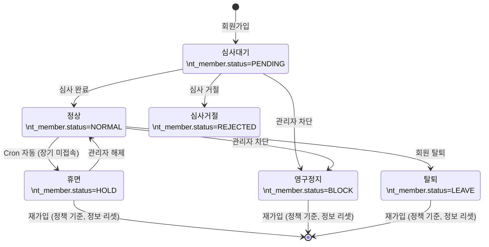

# 회원 라이프사이클

## 문서 역할

- 역할: `설명`
- 문서 종류: `architecture`
- 충돌 시 우선 문서: [회원 심사 단일 정책](../policy/member-review-policy.md)
- 기준 성격: `as-is`

회원의 전체 상태 흐름을 정리한 as-is 문서다.
현재 운영 중인 회원 생애주기 상태 구조를 읽고 설명할 때는 이 문서를 보조 자료로 참고한다.
신규 구현/리뷰/전환 목표의 규범 SoT는 [회원 심사 단일 정책](../policy/member-review-policy.md)을 따르며, 심사 과정의 세부 상태 흐름은 [회원 심사 FSM](./member-review-fsm.md)을 참고한다.
개인정보 자동 파기와 보관 기한의 규범 SoT는 [데이터 거버넌스 정책](../policy/data-governance-policy.md)을 따른다.

## 회원 상태 (`t_member.status`)

| 값  | 상수       | 의미     | 로그인            | 매칭 |
| --- | ---------- | -------- | ----------------- | ---- |
| -4  | `REJECTED` | 심사거절 | 제한(심사중 투영·철회용) | 불가 |
| -3  | `LEAVE`    | 탈퇴     | 불가   | 불가 |
| -2  | `BLOCK`    | 영구정지 | 불가   | 불가 |
| -1  | `HOLD`     | 휴면     | 불가   | 불가 |
| 0   | `PENDING`  | 심사대기 | 가능   | 불가 |
| 1   | `NORMAL`   | 정상     | 가능   | 가능 |

## 상태 전환 FSM

```mermaid
stateDiagram-v2
    [*] --> PENDING : 회원가입

    state "심사대기\nt_member.status=PENDING" as PENDING
    state "정상\nt_member.status=NORMAL" as NORMAL
    state "심사거절\nt_member.status=REJECTED" as REJECTED
    state "휴면\nt_member.status=HOLD" as HOLD
    state "영구정지\nt_member.status=BLOCK" as BLOCK
    state "탈퇴\nt_member.status=LEAVE" as LEAVE

    PENDING --> NORMAL : 심사 완료
    PENDING --> REJECTED : 심사 거절
    PENDING --> BLOCK : 관리자 차단

    NORMAL --> HOLD : Cron 자동 (장기 미접속)
    NORMAL --> BLOCK : 관리자 차단
    NORMAL --> LEAVE : 회원 탈퇴

    HOLD --> NORMAL : 관리자 해제
    HOLD --> [*] : 재가입 (정책 기준, 정보 리셋)

    BLOCK --> [*] : 재가입 (정책 기준, 정보 리셋)

    LEAVE --> [*] : 재가입 (정책 기준, 정보 리셋)
```

## 상태별 상세

### REJECTED (심사거절)

- **진입**: 관리자 심사 거절 (PENDING에서 전환)
- **복귀**: 없음
- **제한**: 일반 기능 진입 불가, 매칭 불가
- **Mobile 투영**: 거절 사실을 노출하지 않고 수동로그인·자동로그인 모두 심사중 화면을 유지한다.
- **제한 세션**: 본인 심사 현황 조회와 가입 심사 철회만 허용한다.
- **삭제**: 사용자가 가입 심사를 철회하면 회원 데이터가 삭제되고 CMS 거절 회원 탭에서도 사라진다.

### PENDING (심사대기)

- 회원가입 직후 진입
- 심사 완료 시 `NORMAL`로, 거절 시 `REJECTED`로 전환
- 심사 과정 상세: [회원 심사 단일 정책](../policy/member-review-policy.md), [회원 심사 FSM](./member-review-fsm.md)

### NORMAL (정상)

- 모든 기능 사용 가능
- 매칭 대상에 포함

### HOLD (휴면)

- **진입**: Cron 자동 실행 (장기 미접속 회원)
- **복귀 경로**:
    1. 관리자 해제 → `NORMAL` (기존 정보 유지)
    2. 재가입 시도 → 정책 기준 대기 후 정보 리셋 신규 가입

- **제한**: 로그인/매칭 불가
- **개인정보 파기**: 해당 없음

### BLOCK (영구정지)

- **진입**: Super Admin 차단
- **복귀**: 없음 (재가입 대기 기준은 정책 참조)
- **재가입**: 정책 기준 경과 후 정보 리셋하여 신규 가입
- **제한**: 로그인/매칭 불가
- **개인정보 파기**: [데이터 거버넌스 정책](../policy/data-governance-policy.md) 참조

### LEAVE (탈퇴)

- **진입**: 회원 자발적 탈퇴 (`member.leave` API)
- **복귀**: 없음 (재가입 대기 기준은 정책 참조)
- **재가입**: 정책 기준 경과 후 정보 리셋하여 신규 가입
- **제한**: 로그인 시 "존재하지 않는 회원" 처리
- **개인정보 파기**: [데이터 거버넌스 정책](../policy/data-governance-policy.md) 참조

## 재가입 정책

| 상태  | 대기 기간 | 기존 정보 |
| ----- | --------- | --------- |
| HOLD  | 정책 참조 | 리셋      |
| BLOCK | 정책 참조 | 리셋      |
| LEAVE | 정책 참조 | 리셋      |

- 재가입 시 기존 회원정보는 `resetUserInfo()`로 초기화된다.
- HOLD만 관리자 해제로 기존 정보를 유지한 채 복귀 가능하다.
- 재가입 대기 기간의 원문 SoT는 [회원 심사 단일 정책](../policy/member-review-policy.md)을 따른다.

## 개인정보 자동 파기

- **대상**: `BLOCK` 또는 `LEAVE` 상태
- **조건**: [데이터 거버넌스 정책](../policy/data-governance-policy.md)의 자동 정리 기준
- **실행**: Cron 작업
