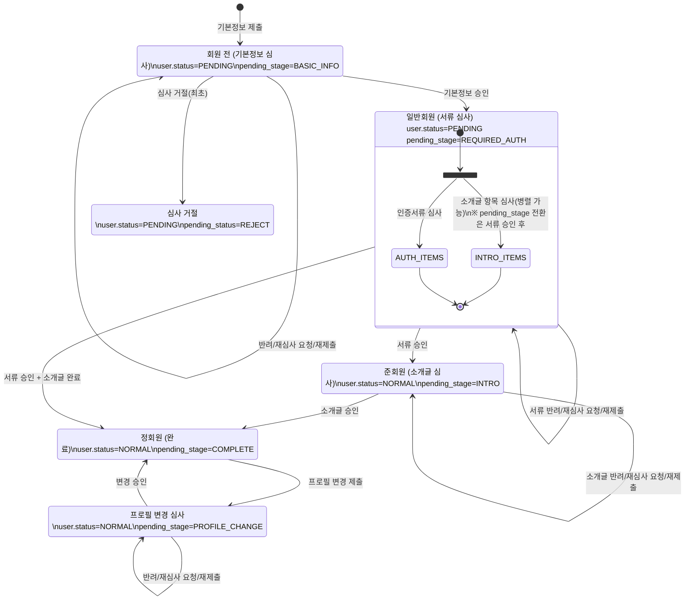
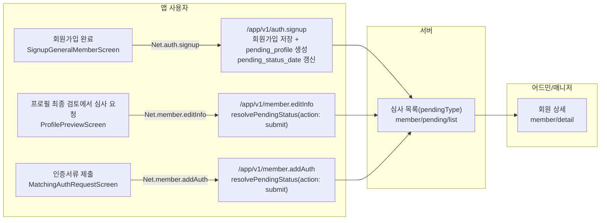
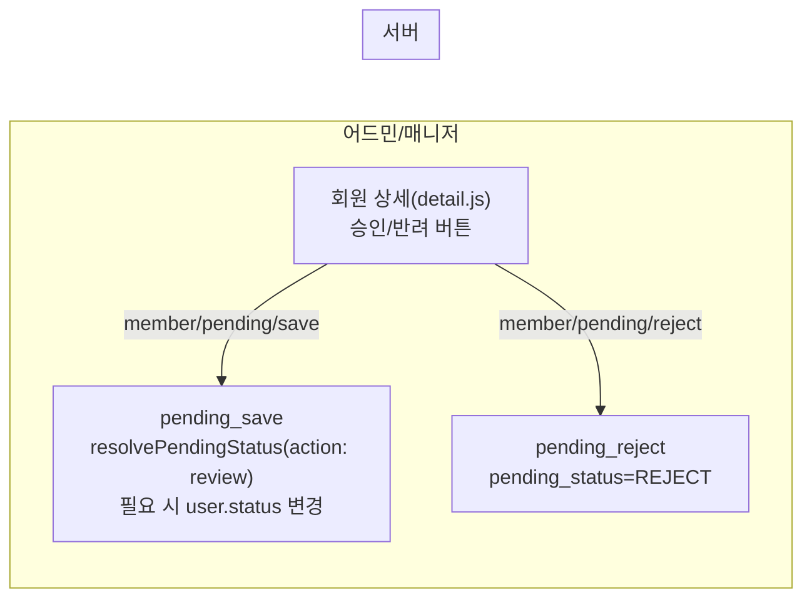

# 심사 FSM (회원 전/일반/준/정) - 현 코드 기준

본 문서는 **모바일 제출 → 서버 상태 변경 → 어드민 검수/표시**를 한 흐름으로 정리한 FSM이다.

## 상태 필드

- `user.status`: 회원 상태(PENDING/NORMAL/HOLD/BLOCK/LEAVE)
- `pending_status`: 심사 상태(BASIC_INFO_REVIEW/REQUIRED_AUTH_REVIEW/INTRO_REVIEW/EDIT_NEED/REAPPLY/COMPLETE/REJECT)
- `pending_stage`: 심사 단계(BASIC_INFO/REQUIRED_AUTH/INTRO/PROFILE_CHANGE/COMPLETE)


## 회원 등급(표기 기준)

- 회원 전: `user.status=PENDING` + `pending_stage=BASIC_INFO`
- 일반회원(매칭 불가): `user.status=PENDING` + `pending_stage=REQUIRED_AUTH`
- 준회원(매칭 불가): `user.status=NORMAL` + `pending_stage=INTRO`
- 정회원(매칭 가능): `user.status=NORMAL` + `pending_stage=COMPLETE`
- 정회원(프로필 변경 심사중): `user.status=NORMAL` + `pending_stage=PROFILE_CHANGE`


## FSM (Mermaid)



## 세부 플로우 (앱/서버/어드민 스윔레인)

### 1) 제출/재제출 경로



### 2) 어드민 심사 액션



## 제출/반려/재심사 정의

- 제출: 단계별 `pending_status`를 **심사 대기 상태로 전환**한다.

  - 기본정보 제출 → `BASIC_INFO_REVIEW`
  - 인증서류 제출 → `REQUIRED_AUTH_REVIEW` 유지 + auth pending 생성/갱신
  - 소개글 제출 → `INTRO_REVIEW` (intro 카테고리 pending 생성)
  - 기존 `pending_status=REAPPLY`면 `REAPPLY` 유지
  - 기존 `pending_status=EDIT_NEED`면 `REAPPLY`로 전환
  - 기존 `pending_status=REQUIRED_AUTH_REVIEW/INTRO_REVIEW`면 제출 종류와 무관하게 상태 유지
- 반려: `pending_status=EDIT_NEED`
- 재심사 요청: `pending_status=REAPPLY`

  - 심사 아이템 상태는 `STATUS.REAPPLY`로 표시하며, 모바일 인증서류는 `ITEM_PENDING_STATUS.RE_WAIT`로 표시한다.
- 아이템 상태 정의

  | 상태          | 의미     | 다음 액션     | 상태열 표기 | 라벨     | 배지 | 심사적용 |
  | ------------- | -------- | ------------- | ----------- | -------- | ---- | -------- |
  | `UNSUBMITTED` | 미제출   | 사용자 제출   | -           | X        | X    | X        |
  | `PENDING`     | 제출됨   | 매니저 심사   | 심사대기    | O        | O    | O        |
  | `RETURN`      | 반려됨   | 사용자 재제출 | 재요청      | O (사유) | X    | X        |
  | `REAPPLY`     | 재제출됨 | 매니저 재심사 | 재심사요청  | O        | O    | O        |
  | `NORMAL`      | 승인됨   | - (완료)      | -           | X        | X    | X        |

  ```mermaid
  stateDiagram-v2
      [*] --> UNSUBMITTED : 항목 생성

      UNSUBMITTED --> PENDING : 사용자 첫 제출
      PENDING --> NORMAL : 매니저 승인
      PENDING --> RETURN : 매니저 반려
      RETURN --> REAPPLY : 사용자 재제출
      REAPPLY --> NORMAL : 매니저 승인
      REAPPLY --> RETURN : 매니저 반려
      NORMAL --> REAPPLY : 사용자 수정 제출
  ```

- 서버는 미제출 항목을 `UNSUBMITTED`로 내려준다. 미제출 판정은 값이 비어있거나( `''/null/undefined` ), 선택형 기본값(예: `-1`)인 경우를 포함한다. `UNSUBMITTED`는 승인/반려/배지/상태 라벨 대상이 아니다.
- 미제출 표현 원칙(도메인별):

  - 기본정보/소개글: `pending_profile`에 `UNSUBMITTED` 항목을 포함한다.
  - 인증서류: 제출 전에는 `t_member_auth`/`t_member_auth_image` 행이 없으므로 **행 없음 = 미제출**로 간주한다(UNSUBMITTED 미사용).
- 어드민 표시/액션/배지 기준(내용 vs 액션 분리):

  - **내용(이미지/텍스트)**: 상태와 무관하게 항상 표시한다. 상태가 바뀌어도 내용은 사라지지 않는다.
  - **라벨/사유**: `NORMAL`은 "승인됨" 라벨만 표시하고, `RETURN`은 "반려됨" 라벨과 사유를 표시한다.
  - **승인/반려 버튼**: `PENDING/REAPPLY`일 때만 노출한다.
  - **배지**: 기본은 `PENDING/REAPPLY(제출/재제출)`만 카운트한다. `RETURN`은 배지·심사적용 대상이 아니다.
  - **반려 탭 예외**: 반려 탭에서는 **배지/액션을 `REAPPLY`만** 대상으로 본다. `PENDING`은 노출 대상이 아니며, `RETURN`은 라벨/사유만 표시한다.
- 완료: `pending_status=COMPLETE`
- 심사 거절(최초): `pending_status=REJECT` (PENDING 회원 전용)

  - 사용자에게는 "심사중"으로 표시한다. 거절 사실을 명시할 경우 보복성 발언 등의 문제가 발생하여, 재신청 경로 없이 가입 취소만 가능하도록 조치했다.


> `REQUIRED_AUTH_REVIEW`는 기본정보 승인 완료 후 진입하며, 인증서류 제출 여부는 auth pending 유무로 구분한다.
>
> 인증서류/소개글 단계는 `pending_status`만으로 신청/반려/재심사 구분이 어려우므로 해당 단계 아이템 상태로 판단한다(인증서류는 auth pending, 소개글은 intro pending).
> 이 규칙은 서버 계산 기준이며, 어드민은 서버 값을 그대로 사용한다. 모바일은 서버 값을 우선하되 심사 요청 직후에는 임시 반영을 허용한다.
> 목록/스코프 분류는 `pending_status`를 쓰고, 승인/반려/배지는 아이템 `status` 기준으로 판단한다.
>
> 인증서류 단계 화면 분기:
>
> - 필수 인증 미설정이면 안내 화면/문구를 노출한다
> - 인증 아이템 상태는 `ITEM_PENDING_STATUS`로 판단한다(WAIT/RE_WAIT/ADD/RETURN/COMPLETE)
> - 아이템 상태가 RETURN이면 재제출 화면(`MatchingAuthRequestScreen`)
> - 아이템 상태가 WAIT/RE_WAIT이고 제출된 인증서류가 있으며 `ADD/RETURN`이 없으면 심사중 화면(`LockPanel` 유지)
> - 제출된 인증서류가 없거나 `ADD/RETURN`이 있으면 재제출 화면(`MatchingAuthRequestScreen`)

## 화면 분기(앱)

- `MatchingScreen`은 `pending_stage`/인증 상태에 따라 `MatchingAuthRequestScreen`/`FullMemberMatchingLockPanel`/정상 매칭 화면/필수 인증 미설정 안내로 분기한다.
- `ProfilePreviewScreen`에서 심사 요청 시 `Net.member.editInfo`를 호출하며, 필요 시 `submit_target=intro`를 함께 전송한다.
- `MatchingAuthRequestScreen`의 제출 버튼은 `Net.member.addAuth`를 호출한다.
- 로그인/자동로그인 경로에서 `pending_stage=BASIC_INFO`면 `SignupReviewScreen`으로 이동한다. `pending_stage=REQUIRED_AUTH/INTRO`면 매칭 탭(ON_GOING)으로 이동한다.


## Repo별 역할(상태 관점)

### coupler-mobile-app

- 사용자가 기본정보/서류/소개글을 제출한다.
- 서버가 내려주는 `pending_status`/`pending_stage`를 기준으로 표시하되, 심사 요청 직후에는 낙관적으로 임시 반영한다.


### coupler-api

- 제출/검수 액션 후 `pending_status`/`pending_stage`를 계산한다.
- 어드민 목록용 `pending_status_display_targets`/`pending_status_display_state`를 산출한다.


### coupler-admin-web

- 목록: `pending_status_display_targets`/`pending_status_display_state`로 상태 라벨/분류를 표시한다.
- 상세: `pendingType`으로 스코프를 잡되 탭은 숨기지 않는다.
- 스코프 없음(일반 상세): 내용은 표시하되 배지/승인·반려/상태 라벨을 표시하지 않는다.
- 승인/반려 액션은 서버 상태 계산을 트리거하고 결과를 표시한다.
- 배지 정책: 배지는 **PENDING/REAPPLY(제출/재제출)**만 카운트한다. RETURN(반려)은 배지에 포함하지 않는다.
- 기본정보 배지 대상: `nickname, job, location, school, family, single, drink, religion, smoke, marriage_plan, height, body_type, appeal_point`
- 스코프 배지: `full-*`는 인증서류 탭 배지만, `intro-*`는 소개글 탭 배지만 표시한다. `review-reject`는 기본정보/인증/소개글/프로필 배지를 표시한다.
- 소개글 배지: `intro-*`/`review-reject` 스코프에서만 표시한다. `about_me`/`intro`만 카운트하며 `content=''`인 항목은 카운트에서 제외한다.
- 프로필 배지 대상: `video`, `profile`만 카운트하며 `content=''`는 제외한다.
- 저장 검사: `full-*`는 인증서류, `intro-*`는 소개글, `review-reject`는 기본정보+인증서류+소개글+프로필을 검사한다.
- 저장 차단: 미처리 **PENDING/REAPPLY**가 남아 있으면 `심사적용`을 막는다. RETURN은 심사적용 대상이 아니므로 저장 가능하며 최종 상태는 서버 계산 기준을 따른다.
- 저장 차단(필수 인증): `pending_status=REQUIRED_AUTH_REVIEW`이고 필수 인증 설정이 0이면 `심사적용`을 막는다.
- 저장 차단(관리자 프로필): `admin_profile`이 비어 있으면 `심사적용`을 막는다.
- 인증서류 배지: 인증서류 탭 배지는 **이미지 status가 PENDING/REAPPLY인 개수**로 계산한다(RETURN 제외).
- 인증서류 탭(배지): `review-reject` 스코프에서는 **REAPPLY만** 카운트한다(RETURN/PENDING 제외).
- 기본정보 탭(목록): 스코프와 무관하게 **항목/내용은 항상 표시**하되, 라벨/버튼/배지는 상태 기준 규칙을 따른다.
- 인증서류 탭(목록): 스코프와 무관하게 **항목(타입/이미지)은 항상 표시**하되, 라벨/버튼/배지는 상태 기준 규칙을 따른다.
- 소개글 탭(목록): 스코프와 무관하게 **항목/내용은 항상 표시**하되, 라벨/버튼/배지는 상태 기준 규칙을 따른다. `appeal_extra`는 상태와 무관하게 항상 표시한다.
- 프로필 탭(목록): review-reject 포함 모든 스코프에서 프로필 이미지는 전체 표시하되, 라벨/버튼/배지는 상태 기준 규칙을 따른다.
- 스코프 버튼 비활성: `auth`/`intro` 스코프에서는 기본정보/프로필 탭만 비활성화한다. `review-reject` 스코프는 기본정보/프로필 비활성화를 하지 않는다.


## 상태열 표기 정책(도메인 기준)

- 도메인 정의: 인증서류(`required_auth`), 소개글(`intro`) 두 도메인만 상태열 표기 대상으로 본다.
- 도메인 내부 항목은 분리 표기하지 않는다.

  - 인증서류 내부: 학력/직업/연봉/신분증 등 개별 항목 상태는 합산하지 않고 도메인 단일 상태로 본다.
  - 소개글 내부: `about_me`, `intro` 중 하나라도 RETURN이면 소개글 도메인은 RETURN으로 본다.
- 도메인 상태 우선순위:

  - RETURN 존재 → `재요청`
  - RETURN 없음 + REAPPLY 존재 → `재심사요청`
  - 그 외 → `심사대기` 또는 없음
- 두 도메인 모두 상태가 있으면 다음 규칙으로 표시한다.

  - 같은 상태: `인증필수서류/소개글 재요청`, `인증필수서류/소개글 재심사요청`
  - 다른 상태: `인증필수서류 재요청/소개글 재심사요청`처럼 **도메인별 상태를 분리 표기**한다.


## 어드민 분류 키(pendingType) 요약

- 기본정보 심사: `semi-apply`, `semi-reject`, `semi-reapply`
- 서류 심사: `full-apply`, `full-reject`, `full-reapply`, `full-accepted`
- 소개글 심사: `intro-apply`, `intro-reject`, `intro-reapply`, `semi-accepted`
- 반려 합집합: `review-reject`
- 프로필 변경 심사: `profile-edit`
- `review-reject` 목록 표시 규칙

  - 상태열을 `서류/소개글/기본정보` 3개로 분리해 도메인별 상태를 각각 표기한다.
  - 각 열 상태 우선순위는 RETURN → REAPPLY → PENDING → (없음/승인됨) 기준으로 판단한다.
  - 기본정보 상태에는 프로필 이미지/영상 심사 상태를 포함한다.
- `review-reject` 목록 포함 조건(쿼리 기준)

  - `status=PENDING` + `pending_status=EDIT_NEED/REAPPLY` + 인증서류/소개글 이슈 없음
  - `status=PENDING` + `pending_status=EDIT_NEED/REAPPLY` + 인증서류 RETURN/REAPPLY 존재
  - `status=NORMAL` + 소개글 RETURN/REAPPLY 존재
  - `status=PENDING` + `pending_status=REQUIRED_AUTH_REVIEW/EDIT_NEED/REAPPLY` + 소개글 RETURN/REAPPLY 존재
  - `status=PENDING` + `pending_status=REQUIRED_AUTH_REVIEW` + 인증서류 REAPPLY 존재
- 인증서류/소개글 이슈 기준(반려/재심사)

  - 인증서류: 필수 인증 타입 중 status=RETURN/REAPPLY
  - 소개글: `about_me/intro` status=RETURN/REAPPLY ( `appeal_extra`는 심사 제외로 이슈 판단에 포함하지 않음 )
- `full-apply` 목록 포함 조건(쿼리 기준)

  - 기본 조건: `status=PENDING` + `pending_status=REQUIRED_AUTH_REVIEW` + 인증서류 제출 존재 + 인증서류 REAPPLY 없음 (소개글 상태는 무관, `appeal_extra` 포함)
  - 병렬 보정: `status=PENDING` + `pending_status=EDIT_NEED/REAPPLY` + 인증서류 PENDING 존재 + 인증서류 RETURN/REAPPLY 없음 + 소개글 RETURN/REAPPLY 존재 (`about_me/intro` 기준)
- `full-reject` 목록 포함 조건(쿼리 기준)

  - `status=PENDING` + `pending_status=EDIT_NEED` + 인증서류 RETURN 존재
- `full-reapply` 목록 포함 조건(쿼리 기준)

  - `status=PENDING` + `pending_status=REAPPLY` + 인증서류 REAPPLY 존재


## 근거(코드 기준)

- 회원가입 제출: `coupler-mobile-app/src/screens/signup/SignupGeneralMemberScreen.js`
- 프로필 심사 요청: `coupler-mobile-app/src/screens/shared/ProfilePreviewScreen.tsx`
- 인증서류 제출: `coupler-mobile-app/src/screens/matching/MatchingAuthRequestScreen.tsx`
- 매칭 탭 분기: `coupler-mobile-app/src/screens/matching/MatchingScreen.js`
- 심사 상세/승인/거절: `coupler-admin-web/src/pages/member/detail.js`
- 어드민 심사 처리: `coupler-api/controller/admin/member.js`
- 상태 계산: `coupler-api/lib/pending-status.js`, `coupler-api/lib/pending-stage.js`
