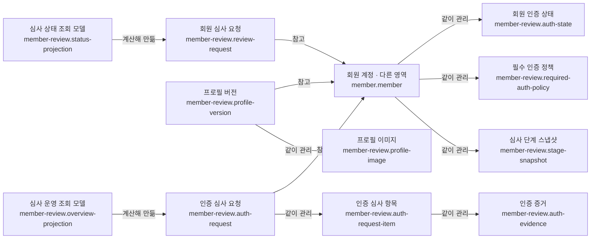

# 회원 심사 시스템

## 문서 역할

- 역할: `설명`
- 문서 종류: `architecture`
- 충돌 시 우선 문서: [회원 심사 단일 정책](../policy/member-review-policy.md)
- 기준 성격: `as-is`

회원 심사의 저장 책임과 조회 모델을 설명한다. 상태 전이 시각화는
[회원 심사 FSM](member-review-fsm.md)을 따르고, 심사 판정 규칙은 정책 문서를 우선한다.

## 목적과 범위

- 회원의 기본정보·필수 인증·소개 프로필 심사 요청과 증거를 추적한다.
- 현재 심사 상태를 쓰기 원장과 분리된 조회 모델로 제공한다.
- 회원 계정 생애주기는 [회원 라이프사이클](member-lifecycle.md)이 소유한다.

## 논리 데이터 모델

- 도메인 ID: `member-review`

### 먼저 보는 그림

이 그림은 데이터가 어디에 속하고 무엇을 참고하는지 먼저 보여준다.
정확한 이름과 조건은 아래 상세 표를 따른다.

꼭 지킬 규칙:

- 회원과 요청 종류별 활성 인증 요청은 동시에 하나만 존재한다
- 회원이 참조하는 현재 프로필 버전은 승인·활성 상태여야 한다
- 조회 모델은 판정 원천이 아니며 쓰기 원장과 회원 생애주기에서만 파생한다

<!-- markdownlint-disable MD046 -->

??? info "정확한 값과 조건 보기"

    ### 논리 엔티티

    | 논리 ID | 표시명 | 생명주기 역할 | 엔티티 형태 | 기록 역할 | 책임 | 최고 데이터 분류 | 생명주기 |
    | --- | --- | --- | --- | --- | --- | --- | --- |
    | `member-review.review-request` | 회원 심사 요청 | root | entity | ledger | 기본정보·소개정보 심사 요청과 판정 이력 | 민감 | 요청 순서를 보존하고 정책에 따라 개인정보를 정리 |
    | `member-review.auth-state` | 회원 인증 상태 | child | entity | state | 인증 종류별 현재 판정과 반려 사유 | 민감 | 회원 계정과 함께 유지하고 재심사로 변경 |
    | `member-review.auth-request` | 인증 심사 요청 | root | entity | ledger | 필수 인증 제출·재제출·판정 생명주기 | 민감 | 이전 요청 연결을 보존하고 완료 요청은 이력 유지 |
    | `member-review.auth-request-item` | 인증 심사 항목 | child | entity | ledger | 요청 안의 인증 종류별 판정 | 민감 | 상위 인증 요청과 함께 보존 |
    | `member-review.auth-evidence` | 인증 증거 | child | entity | snapshot | 심사 시점의 인증 이미지와 개별 판정 | 민감 | 보관 기한 후 삭제 또는 비식별화 |
    | `member-review.profile-version` | 프로필 버전 | root | entity | snapshot | 제출 시점의 프로필 이미지·영상 세트 | 민감 | 활성 버전은 유지하고 이전 버전은 정책에 따라 정리 |
    | `member-review.profile-image` | 프로필 이미지 | child | entity | snapshot | 프로필 버전의 이미지와 이미지별 판정 | 민감 | 상위 버전의 보관 정책을 따름 |
    | `member-review.required-auth-policy` | 필수 인증 정책 | child | entity | reference | 회원에게 적용되는 필수 인증 종류 | 내부 | 최초 생성 뒤 명시적 정책 정정 전까지 유지 |
    | `member-review.stage-snapshot` | 심사 단계 스냅샷 | child | entity | snapshot | 화면·호환을 위한 단계별 현재 상태 복사본 | 내부 | 재계산 가능한 보조 데이터로 유지 |
    | `member-review.status-projection` | 심사 상태 조회 모델 | root | entity | projection | API와 Mobile의 회원별 심사 상태 요약 | 내부 | 원천 데이터 변경 시 재계산 |
    | `member-review.overview-projection` | 심사 운영 조회 모델 | root | entity | projection | Admin 큐와 단계 이력 집계 | 내부 | 원천 데이터 변경 시 재계산 |

    ### 관계

    | 출발 논리 ID | 관계 역할 | 관계 유형 | 도착 논리 ID | 카디널리티 | 소유·삭제 규칙 |
    | --- | --- | --- | --- | --- | --- |
    | `member-review.review-request` | `member` | references | `member.member` | N:1 | 제출 회원의 현재 상태와 요청 당시 snapshot을 구분해 보존 |
    | `member.member` | `auth-states` | owns | `member-review.auth-state` | 1:N | 회원 개인정보 정리 정책을 함께 적용 |
    | `member-review.auth-request` | `member` | references | `member.member` | N:1 | 회원과 요청 종류별 활성 요청을 하나로 제한 |
    | `member-review.auth-request` | `items` | owns | `member-review.auth-request-item` | 1:N | 요청 삭제 없이 항목 이력을 보존 |
    | `member-review.auth-request-item` | `evidence` | owns | `member-review.auth-evidence` | 1:N | 증거만 보관 기한에 따라 정리 가능 |
    | `member-review.profile-version` | `member` | references | `member.member` | N:1 | 회원이 참조하는 현재 버전은 승인·활성 상태여야 함 |
    | `member-review.profile-version` | `images` | owns | `member-review.profile-image` | 1:N | 현재 활성 버전은 삭제하지 않음 |
    | `member.member` | `required-auth-policy` | owns | `member-review.required-auth-policy` | 1:1 | 회원에게 적용되는 한 세트의 필수 인증 정책을 유지 |
    | `member.member` | `review-stage-snapshots` | owns | `member-review.stage-snapshot` | 1:N | 원천 심사 상태와 불일치하면 재계산 |
    | `member-review.status-projection` | `review-requests` | derives-from | `member-review.review-request` | 1:N | 원천 요청과 현재 회원 상태에서 계산 |
    | `member-review.overview-projection` | `auth-requests` | derives-from | `member-review.auth-request` | 1:N | 운영 집계이며 쓰기 기준으로 사용하지 않음 |

    ### 불변조건

    | 규칙 ID | 관련 논리 ID | 불변조건 | 기준 문서 |
    | --- | --- | --- | --- |
    | `MEMBER-REVIEW-INV-001` | `member-review.auth-request` | 회원과 요청 종류별 활성 인증 요청은 동시에 하나만 존재한다 | [회원 심사 단일 정책](../policy/member-review-policy.md) |
    | `MEMBER-REVIEW-INV-002` | `member-review.profile-version` | 회원이 참조하는 현재 프로필 버전은 승인·활성 상태여야 한다 | [회원 심사 단일 정책](../policy/member-review-policy.md) |
    | `MEMBER-REVIEW-INV-003` | `member-review.status-projection` | 조회 모델은 판정 원천이 아니며 쓰기 원장과 회원 생애주기에서만 파생한다 | [회원 심사 FSM](member-review-fsm.md) |

<!-- markdownlint-enable MD046 -->

## 데이터 흐름

1. 회원이 심사 범위별 요청과 증거를 제출한다.
2. Admin이 요청 또는 항목 단위로 승인·반려한다.
3. 판정 결과가 회원 생애주기와 단계 스냅샷에 동기화된다.
4. API와 Admin은 조회 모델을 통해 현재 상태를 읽는다.

## 관련 문서

- [회원 심사 단일 정책](../policy/member-review-policy.md)
- [회원 심사 FSM](member-review-fsm.md)
- [회원 라이프사이클](member-lifecycle.md)
- [논리 데이터 모델 정책](../policy/logical-data-model-policy.md)
