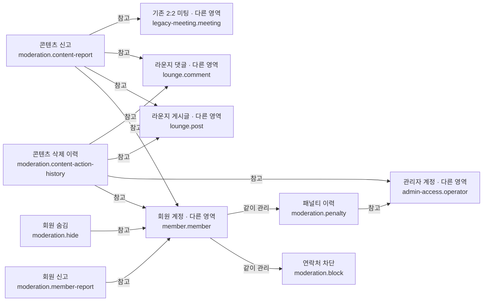

# 신고·제재 시스템

## 문서 역할

- 역할: `설명`
- 문서 종류: `architecture`
- 충돌 시 우선 문서: [보안/접근통제 정책](../policy/security-access-control-policy.md), [데이터 거버넌스 정책](../policy/data-governance-policy.md)
- 기준 성격: `as-is`

회원·콘텐츠 신고와 서비스 이용 제한 데이터를 한 소유 경계로 설명한다.

## 범위

- 회원 신고와 라운지·미팅 콘텐츠 신고
- 작성자·관리자의 콘텐츠 삭제 상태 전이 이력
- 연락처 차단과 콘텐츠 숨김
- 운영자가 부여하는 기간성 패널티
- 신고 대상 콘텐츠의 본문과 생명주기는 각 원천 도메인이 소유한다.

## 논리 데이터 모델

- 도메인 ID: `moderation`

### 먼저 보는 그림

이 그림은 데이터가 어디에 속하고 무엇을 참고하는지 먼저 보여준다.
정확한 이름과 조건은 아래 상세 표를 따른다.

꼭 지킬 규칙:

- 신고자와 대상 회원은 같을 수 없다
- 신고 대상은 존재하는 하나의 원천 콘텐츠 문맥으로 해석돼야 한다
- Super Admin이 적용한 패널티는 기간·사유·처리 관리자를 함께 기록한다
- 처리 이력은 게시글 또는 댓글 대상 중 하나만 가리키며 대상 종류와 식별자가 일치해야 한다
- 처리 이력은 추가 전용 감사 기록이며 현재 상태는 원천 콘텐츠 도메인이 판정한다
- 작성자 삭제는 회원 행위자만, 신고삭제·강제삭제는 관리자 행위자와 비어 있지 않은 사유만 기록한다

<!-- markdownlint-disable MD046 -->

??? info "정확한 값과 조건 보기"

    ### 논리 엔티티

    | 논리 ID | 표시명 | 생명주기 역할 | 엔티티 형태 | 기록 역할 | 책임 | 최고 데이터 분류 | 생명주기 |
    | --- | --- | --- | --- | --- | --- | --- | --- |
    | `moderation.member-report` | 회원 신고 | root | association | state | 신고자·대상 회원·사유와 처리 상태 | 민감 | 처리 완료 뒤 감사 목적의 비식별 이력 보존 |
    | `moderation.content-report` | 콘텐츠 신고 | root | association | state | 신고자와 게시글·댓글·미팅 콘텐츠의 처리 상태 | 민감 | 원천 콘텐츠 삭제 후에도 처리 이력 보존 가능 |
    | `moderation.block` | 연락처 차단 | child | entity | state | 회원이 회피하려는 연락처 식별자 | 민감 | 회원 요청 또는 개인정보 정리 시 삭제 |
    | `moderation.hide` | 회원 숨김 | root | association | state | 회원별 작성자 노출 제외와 적용 문맥 | 내부 | 사용자가 해제하거나 원천 문맥 종료 시 정리 |
    | `moderation.penalty` | 패널티 이력 | child | entity | ledger | 이용 제한 종류·기간·사유와 처리 관리자 | 민감 | 적용·해제 이력을 append-only로 보존 |
    | `moderation.content-action-history` | 콘텐츠 삭제 이력 | root | entity | history | 작성자·관리자의 삭제 대상, 행위자, 사유와 상태 전이 기록 | 민감 | 추가 전용으로 보존하고 원천 콘텐츠 삭제와 독립적으로 유지 |

    ### 관계

    | 출발 논리 ID | 관계 역할 | 관계 유형 | 도착 논리 ID | 카디널리티 | 소유·삭제 규칙 |
    | --- | --- | --- | --- | --- | --- |
    | `moderation.member-report` | `reporter` | references | `member.member` | N:1 | 신고자 개인정보 정리 뒤에도 처리 근거는 비식별 보존 가능 |
    | `moderation.member-report` | `subject` | references | `member.member` | N:1 | 신고자와 대상 회원은 같을 수 없음 |
    | `moderation.content-report` | `reporter` | references | `member.member` | N:1 | 신고 당시 회원과 원천 콘텐츠 문맥을 함께 검증 |
    | `moderation.content-report` | `post` | references | `lounge.post` | N:1 | 게시글이 삭제돼도 신고 처리 이력은 유지 |
    | `moderation.content-report` | `comment` | references | `lounge.comment` | N:1 | 댓글이 삭제돼도 신고 처리 이력은 유지 |
    | `moderation.content-report` | `meeting` | references | `legacy-meeting.meeting` | N:1 | 기존 미팅 종료 뒤에도 처리 이력은 유지 |
    | `member.member` | `blocked-contacts` | owns | `moderation.block` | 1:N | 차단 연락처는 해당 회원의 개인정보 정리 시 함께 삭제 |
    | `moderation.hide` | `viewer` | references | `member.member` | N:1 | 숨김 주체가 소유하며 대상에게 역관계를 강제하지 않음 |
    | `moderation.hide` | `hidden-member` | references | `member.member` | N:1 | 적용 문맥에서 숨김 대상 회원의 콘텐츠를 제외 |
    | `member.member` | `penalties` | owns | `moderation.penalty` | 1:N | 회원 상태와 별도로 기간성 제재 이력을 유지 |
    | `moderation.penalty` | `operator-actor` | references | `admin-access.operator` | N:1 | 패널티 적용 행은 처리 관리자 식별자를 보존 |
    | `moderation.content-action-history` | `author-actor` | references | `member.member` | N:1 | 작성자 삭제 전이에서는 작성 회원 식별자를 보존 |
    | `moderation.content-action-history` | `operator-actor` | references | `admin-access.operator` | N:1 | 신고삭제·강제삭제 전이에서는 처리 관리자 식별자를 보존 |
    | `moderation.content-action-history` | `post-target` | references | `lounge.post` | N:1 | 게시글 처리 행은 게시글 대상 식별자를 기록하고 대상 삭제 뒤에도 이력을 유지 |
    | `moderation.content-action-history` | `comment-target` | references | `lounge.comment` | N:1 | 댓글 처리 행은 댓글 대상 식별자를 기록하고 대상 삭제 뒤에도 이력을 유지 |

    ### 불변조건

    | 규칙 ID | 관련 논리 ID | 불변조건 | 기준 문서 |
    | --- | --- | --- | --- |
    | `MODERATION-INV-001` | `moderation.member-report` | 신고자와 대상 회원은 같을 수 없다 | [보안/접근통제 정책](../policy/security-access-control-policy.md) |
    | `MODERATION-INV-002` | `moderation.content-report` | 신고 대상은 존재하는 하나의 원천 콘텐츠 문맥으로 해석돼야 한다 | [논리 데이터 모델 정책](../policy/logical-data-model-policy.md) |
    | `MODERATION-INV-003` | `moderation.penalty` | Super Admin이 적용한 패널티는 기간·사유·처리 관리자를 함께 기록한다 | [보안/접근통제 정책](../policy/security-access-control-policy.md) |
    | `MODERATION-INV-004` | `moderation.content-action-history` | 처리 이력은 게시글 또는 댓글 대상 중 하나만 가리키며 대상 종류와 식별자가 일치해야 한다 | [논리 데이터 모델 정책](../policy/logical-data-model-policy.md) |
    | `MODERATION-INV-005` | `moderation.content-action-history` | 처리 이력은 추가 전용 감사 기록이며 현재 상태는 원천 콘텐츠 도메인이 판정한다 | [라운지 시스템](lounge-system.md) |
    | `MODERATION-INV-006` | `moderation.content-action-history` | 작성자 삭제는 회원 행위자만, 신고삭제·강제삭제는 관리자 행위자와 비어 있지 않은 사유만 기록한다 | [라운지 시스템](lounge-system.md) |

<!-- markdownlint-enable MD046 -->

## 관련 문서

- [보안/접근통제 정책](../policy/security-access-control-policy.md)
- [데이터 거버넌스 정책](../policy/data-governance-policy.md)
- [라운지 시스템](lounge-system.md)
- [기존 2:2 그룹미팅 시스템](meeting-system.md)
