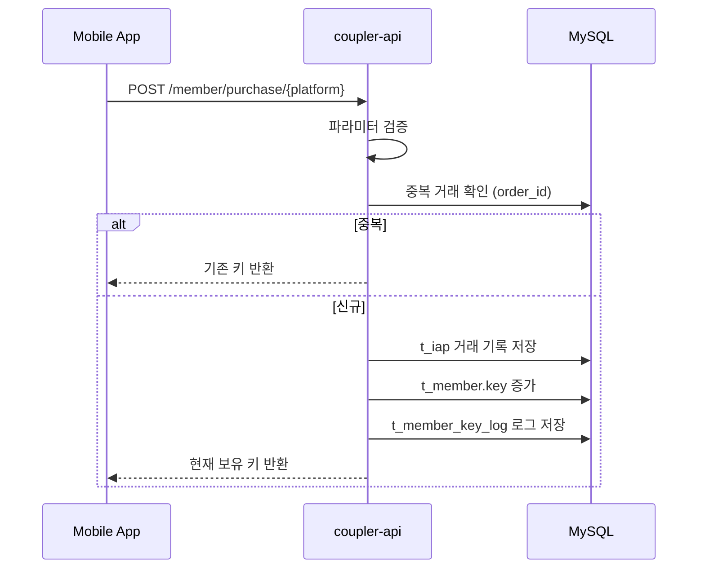
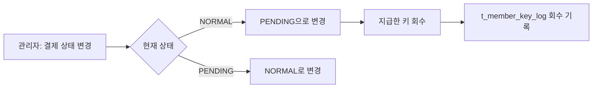

# 결제 시스템

키 충전 및 인앱결제 관련 아키텍처를 정리한 문서이다.

## 결제 아이템 (IAP_ITEM)

| SKU | 기본 키 | 보너스 | 가격(원) | 비고 |
|-----|--------|--------|----------|------|
| ritzy.iap.item07 | 666 | 234 | 660,000 | Android 전용 |
| ritzy.iap.item06 | 333 | 117 | 330,000 | |
| ritzy.iap.item05 | 155 | 45 | 154,000 | HOT |
| ritzy.iap.item04 | 77 | 23 | 77,000 | BEST |
| ritzy.iap.item03 | 55 | 15 | 55,000 | |
| ritzy.iap.item02 | 11 | 2 | 11,000 | NEW |
| ritzy.iap.item01 | 5 | 1 | 5,500 | |

## 결제 플랫폼

| 플랫폼 | API | 보너스 적용 |
|--------|-----|------------|
| Google Play | `POST /member/purchase/google` | O |
| App Store | `POST /member/purchase/apple` | O |
| OneStore | `POST /member/purchase/onestore` | X |

## 결제 처리 흐름

## 결제 상태

| 값 | 상태 | 의미 |
|----|------|------|
| 0 | PENDING | 대기 (결제 미완료) |
| 1 | NORMAL | 정상 (결제 완료) |

## 키 로그 타입 (KEY_LOG)

| 타입 | 값 | 의미 |
|------|-----|------|
| NORMAL | 0 | 일반 결제/사용 |
| FREE_KEY | 1 | 관리자 무료키 지급 |

## 환불 처리

- API: `POST /admin/iap/change_status`
- 회수 시 회원 보유 키보다 많이 회수하지 않음 (최소값 제한)

## 결제 통계 API

| API | 응답 |
|-----|------|
| `GET /admin/iap/sta` | 오늘/어제/이번주/이번달 결제액/환불액 |
| `GET /admin/iap/log` | 결제 기록 목록 (페이징, 검색) |
| `GET /admin/iap/free-key-log` | 무료키 지급 내역 |

## 데이터 모델

### t_iap (결제 기록)

| 필드 | 타입 | 설명 |
|------|------|------|
| id | INT | 기본키 |
| member | INT | 회원 ID (FK) |
| order_id | VARCHAR | 거래 ID |
| purchase_data | TEXT | 결제 데이터 (JSON) |
| purchase_signature | TEXT | 서명 데이터 |
| ip | VARCHAR | 클라이언트 IP |
| price | INT | 결제 금액 |
| point | INT | 지급된 키 |
| status | INT | 결제 상태 |
| path | VARCHAR | 결제 경로 (google/apple/onestore) |
| create_date | DATETIME | 거래 시간 |

### t_member_key_log (키 변동 로그)

| 필드 | 타입 | 설명 |
|------|------|------|
| member_id | INT | 회원 ID |
| match_id | INT | 매칭 ID (선택) |
| type | INT | 로그 타입 |
| key | INT | 변동량 (+/-) |
| created_date | DATETIME | 발생 시각 |

## 검증 현황

| 항목 | 상태 |
|------|------|
| 거래 중복성 검증 | ✅ 구현됨 |
| 파라미터 필수 여부 | ✅ 구현됨 |
| 상품 존재 여부 | ✅ 구현됨 |
| 영수증 서명 검증 | ❌ TODO |
| 플랫폼 검증 서버 연동 | ❌ TODO |

## 근거 (코드 기준)

- 상수 정의: `coupler-api/config/constant.js`
- 결제 처리: `coupler-api/controller/app/v1/member.js` (889-1069)
- 결제 모델: `coupler-api/model/iap.js`
- 키 로그 모델: `coupler-api/model/member_key_log.js`
- 관리자 API: `coupler-api/controller/admin/iap.js`
