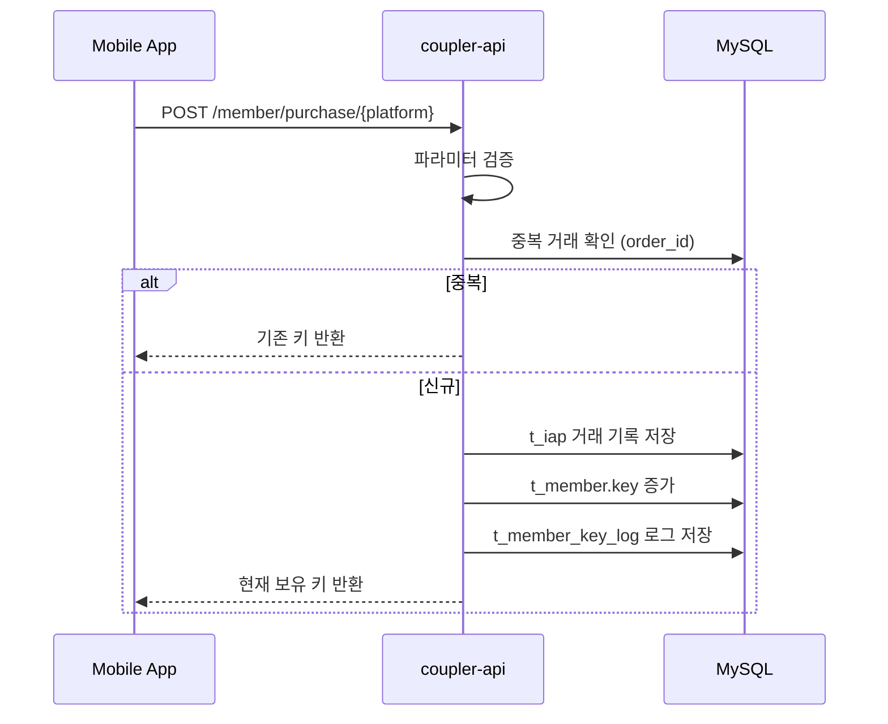
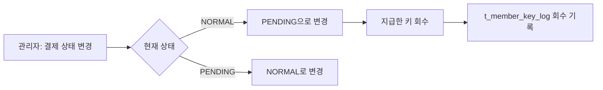

# 결제 시스템

## 문서 역할

- 역할: `설명`
- 문서 종류: `architecture`
- 충돌 시 우선 문서: [결제 운영 정책](../policy/payment-ops-policy.md)
- 기준 성격: `as-is`

키 충전 및 인앱결제 관련 아키텍처를 정리한 문서이다.

## 논리 데이터 모델

- 도메인 ID: `payment`

### 논리 엔티티

| 논리 ID | 표시명 | 구조 유형 | 기록 역할 | 책임 | 최고 데이터 분류 | 생명주기 |
| --- | --- | --- | --- | --- | --- | --- |
| `payment.purchase` | 인앱결제 거래 | root | ledger | 플랫폼 거래 식별자, 검증 결과, 결제 금액과 지급 결과 | 민감 | 정산·환불·분쟁 대응 기간 동안 append-only 거래 이력 보존 |

### 관계

| 출발 논리 ID | 관계 유형 | 도착 논리 ID | 카디널리티 | 소유·삭제 규칙 |
| --- | --- | --- | --- | --- |
| `payment.purchase` | references | `member.member` | N:1 | 회원 개인정보 정리 뒤에도 비식별 정산 이력은 보존 |
| `payment.purchase` | references | `key-wallet.entry` | 1:N | 성공·환불 결과에 해당하는 Key 변동 원장을 연결 |

### 불변조건

| 규칙 ID | 관련 논리 ID | 불변조건 | 기준 문서 |
| --- | --- | --- | --- |
| `PAYMENT-INV-001` | `payment.purchase` | 동일 플랫폼 거래 식별자는 한 번만 지급 처리한다 | [결제 운영 정책](../policy/payment-ops-policy.md) |
| `PAYMENT-INV-002` | `payment.purchase` | 결제 상태와 Key 지급·회수 원장은 같은 transaction 결론을 가져야 한다 | [결제 운영 정책](../policy/payment-ops-policy.md) |
| `PAYMENT-INV-003` | `payment.purchase` | 영수증·서명·접속정보 원문은 최소 권한으로만 조회한다 | [데이터 거버넌스 정책](../policy/data-governance-policy.md) |

## 결제 아이템 (IAP_ITEM)

> SKU 식별자(`ritzy.iap.item*`)는 스토어에 등록된 프로덕션 값이므로 변경하지 않는다.

| SKU | 기본 키 | 보너스 | 가격(원) | 비고 |
|-----|--------|--------|----------|------|
| ritzy.iap.item07 | 666 | 234 | 660,000 | Android 전용 |
| ritzy.iap.item06 | 333 | 117 | 330,000 | |
| ritzy.iap.item05 | 155 | 45 | 154,000 | HOT |
| ritzy.iap.item04 | 77 | 23 | 77,000 | BEST |
| ritzy.iap.item03 | 55 | 15 | 55,000 | |
| ritzy.iap.item02 | 11 | 2 | 11,000 | NEW |
| ritzy.iap.item01 | 5 | 1 | 5,500 | |

## 결제 플랫폼

| 플랫폼 | API | 보너스 적용 |
|--------|-----|------------|
| Google Play | `POST /member/purchase/google` | O |
| App Store | `POST /member/purchase/apple` | O |
| OneStore | `POST /member/purchase/onestore` | X |

## 결제 처리 흐름

```mermaid
sequenceDiagram
    participant App as Mobile App
    participant API as coupler-api
    participant DB as MySQL

    App->>API: POST /member/purchase/{platform}
    API->>API: 파라미터 검증
    API->>DB: 중복 거래 확인 (order_id)
    alt 중복
        API-->>App: 기존 키 반환
    else 신규
        API->>DB: t_iap 거래 기록 저장
        API->>DB: t_member.key 증가
        API->>DB: t_member_key_log 로그 저장
        API-->>App: 현재 보유 키 반환
    end
```

## 결제 상태

| 값 | 상태 | 의미 |
|----|------|------|
| 0 | PENDING | 대기 (결제 미완료) |
| 1 | NORMAL | 정상 (결제 완료) |

## 키 로그 타입 (KEY_LOG)

| 타입 | 값 | 의미 |
|------|-----|------|
| NORMAL | 0 | 일반 결제/사용 |
| FREE_KEY | 1 | 관리자 무료키 지급 |

## 환불 처리

```mermaid
flowchart LR
    A[관리자: 결제 상태 변경] --> B{현재 상태}
    B -->|NORMAL| C[PENDING으로 변경]
    B -->|PENDING| D[NORMAL로 변경]
    C --> E[지급한 키 회수]
    E --> F[t_member_key_log 회수 기록]
```

- API: `POST /admin/iap/change_status`
- 회수 시 회원 보유 키보다 많이 회수하지 않음 (최소값 제한)

## 결제 통계 API

| API | 응답 |
|-----|------|
| `GET /admin/iap/sta` | 오늘/어제/이번주/이번달 결제액/환불액 |
| `GET /admin/iap/log` | 결제 기록 목록 (페이징, 검색) |
| `GET /admin/iap/free-key-log` | 무료키 지급 내역 |

## 현재 문서화된 검증 범위

| 항목 | 상태 |
|------|------|
| 거래 중복성 검증 | ✅ 구현됨 |
| 파라미터 필수 여부 | ✅ 구현됨 |
| 상품 존재 여부 | ✅ 구현됨 |
| 영수증 서명 검증 | 현재 문서 범위 외 |
| 플랫폼 검증 서버 연동 | 현재 문서 범위 외 |

- 위 표는 현재 문서에서 확인한 범위만 적는다.
- 별도 합의되지 않은 검증 항목은 TODO로 두지 않고, 필요성 확정 전까지 정책/구현 범위 밖으로 본다.
