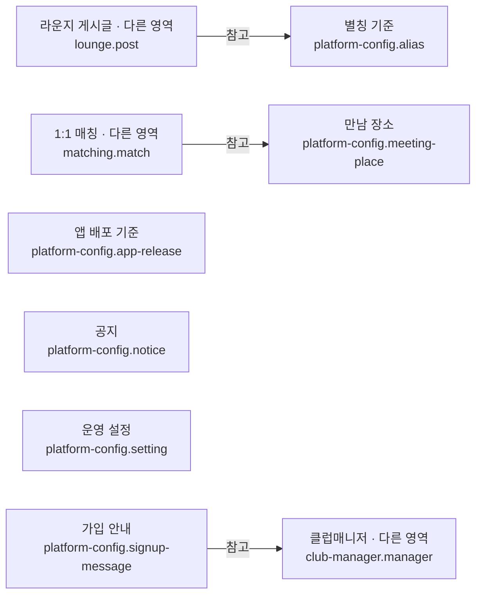

# 플랫폼 기준정보 시스템

## 문서 역할

- 역할: `설명`
- 문서 종류: `architecture`
- 충돌 시 우선 문서: 이 문서
- 기준 성격: `as-is`

서비스 전역에서 공유하는 운영 설정과 기준정보의 저장 책임을 설명한다. 별도 규범이 필요한 설정의 값과
변경 절차는 각 도메인 정책을 우선한다.

## 논리 데이터 모델

- 도메인 ID: `platform-config`

### 먼저 보는 그림

이 그림은 데이터가 어디에 속하고 무엇을 참고하는지 먼저 보여준다.
정확한 이름과 조건은 아래 상세 표를 따른다.

꼭 지킬 규칙:

- 금액·보상 설정은 사용하는 도메인이 기대하는 부호와 범위를 만족해야 한다
- 최소 지원 버전은 현재 배포 버전보다 높게 설정할 수 없다
- 활성 가입 안내는 적용 범위에서 하나의 결정적인 템플릿으로 선택돼야 한다

<!-- markdownlint-disable MD046 -->

??? info "정확한 값과 조건 보기"

    ### 논리 엔티티

    | 논리 ID | 표시명 | 생명주기 역할 | 엔티티 형태 | 기록 역할 | 책임 | 최고 데이터 분류 | 생명주기 |
    | --- | --- | --- | --- | --- | --- | --- | --- |
    | `platform-config.setting` | 운영 설정 | root | entity | reference | Key 비용·보상 등 서버 운영 기준값 | 내부 | 변경 이력을 운영 절차로 추적하며 현재값 유지 |
    | `platform-config.app-release` | 앱 배포 기준 | root | entity | reference | 플랫폼별 버전, 최소 버전과 심사 상태 | 내부 | 앱 릴리스 전환 시 갱신 |
    | `platform-config.notice` | 공지 | root | entity | reference | 사용자 공지 내용과 노출 상태 | 일반 | 게시 기간과 운영 상태에 따라 보관 |
    | `platform-config.signup-message` | 가입 안내 | root | entity | reference | 클럽매니저·성별·지역별 가입 인사와 무료 Key | 내부 | 운영 템플릿 변경 시 갱신 |
    | `platform-config.meeting-place` | 만남 장소 | root | entity | reference | 추천 장소와 지도·연락 정보 | 일반 | 운영 사용 여부에 따라 활성·비활성 |
    | `platform-config.alias` | 별칭 기준 | root | entity | reference | 비공개 활동에 사용하는 성별·유형별 별칭 | 내부 | 운영 목록 변경 시 갱신 |

    ### 관계

    | 출발 논리 ID | 관계 역할 | 관계 유형 | 도착 논리 ID | 카디널리티 | 소유·삭제 규칙 |
    | --- | --- | --- | --- | --- | --- |
    | `platform-config.signup-message` | `manager` | references | `club-manager.manager` | N:1 | 클럽매니저 비활성 뒤에도 과거 발송 근거를 보존 |
    | `matching.match` | `meeting-place` | references | `platform-config.meeting-place` | N:1 | 장소 기준정보 비활성 뒤 기존 매칭 이력은 유지 |
    | `lounge.post` | `display-alias` | references | `platform-config.alias` | N:1 | 공개 프로필 여부에 따라 별칭을 표시 |

    ### 불변조건

    | 규칙 ID | 관련 논리 ID | 불변조건 | 기준 문서 |
    | --- | --- | --- | --- |
    | `PLATFORM-CONFIG-INV-001` | `platform-config.setting` | 금액·보상 설정은 사용하는 도메인이 기대하는 부호와 범위를 만족해야 한다 | [엔지니어링 가드레일](../policy/engineering-guardrails.md) |
    | `PLATFORM-CONFIG-INV-002` | `platform-config.app-release` | 최소 지원 버전은 현재 배포 버전보다 높게 설정할 수 없다 | [릴리스 프로세스](../policy/release-process.md) |
    | `PLATFORM-CONFIG-INV-003` | `platform-config.signup-message` | 활성 가입 안내는 적용 범위에서 하나의 결정적인 템플릿으로 선택돼야 한다 | [엔지니어링 가드레일](../policy/engineering-guardrails.md) |

<!-- markdownlint-enable MD046 -->

## 앱 버전 확인과 진입 차단

Mobile의 공통 `AppUpdateGate`가 초기 부트스트랩 완료 후와 백그라운드·비활성 상태에서 활성 상태로 복귀할 때
`GET /auth/getSettingList`를 조회한다. 플랫폼(`google` 또는 `apple`)과 설치된 앱의 빌드 번호를 전달하며,
서버가 반환한 `app_info.force_update`를 판단 기준으로 사용한다. 클라이언트가 버전 이름을 별도로 비교하거나
최소 지원 버전을 자체 계산하지 않는다. 공지·푸시 수신 여부와 무관하게 동작한다.

- `0`: 앱 이용을 허용한다.
- `1`: 업데이트를 안내하며 `나중에`를 선택할 수 있다. 같은 실행 중 선택 업데이트 안내를 닫아도 복귀 시
  서버 설정은 다시 확인하고, 필수 업데이트로 바뀌면 차단한다.
- `2`: 취소할 수 없는 업데이트 안내로 앱 이용을 차단한다. 스토어를 여는 것만으로 차단을 해제하지 않으며,
  복귀 후 서버 확인을 다시 통과해야 한다.

최초 확인을 통과하기 전에는 내비게이터와 자동 로그인을 시작하지 않아 가입·로그인·메인 화면에 동일하게
적용된다. 최초 검사 중에는 로고 화면을 유지하고, 복귀 검사 중에는 기존 화면과 입력 상태를 유지하되 화면
조작을 막는다. 검사 중에는 확인 팝업·배경 어둡게 처리·표시 애니메이션 없이 투명 차단층만 사용하며,
정상 버전이면 팝업을 표시하지 않는다. 업데이트 안내는 서버가 `1` 또는 `2`로 판단했을 때만 표시한다.
버전 확인 실패·응답 누락·15초 시간 초과는 이용 허용으로 처리하지 않고 재시도 안내를 표시한다.
백그라운드 전환·재시도·해제 시에는
진행 중인 확인 요청을 취소하여 오래된 응답이 최신 판단을 덮어쓰지 못하게 한다.

업데이트 안내는 공통 확인 팝업을 사용한다. iOS에서는 이미 열린 네이티브 모달과 충돌하지 않도록
`react-native-screens`의 `FullWindowOverlay` 안에 표시하고, Android에서는 네이티브 모달로 표시한다.

이 동작은 공통 검사가 포함된 앱 코드에 적용된다. 앱 화면 차단은 서버 API 요청 자체를 거부하는 기능과는
다르며, 이미 배포된 이전 앱의 코드나 진행 중인 API 요청을 소급하여 변경하지 않는다.

## 관련 문서

- [릴리스 프로세스](../policy/release-process.md)
- [결제 운영 정책](../policy/payment-ops-policy.md)
- [매칭 운영 정책](../policy/matching-ops-policy.md)
- [논리 데이터 모델 정책](../policy/logical-data-model-policy.md)
