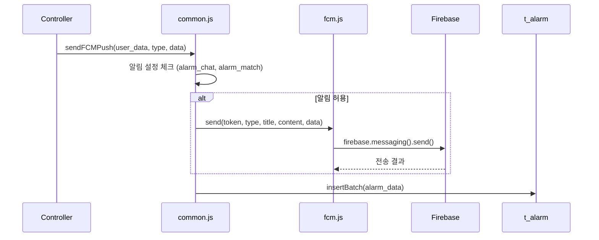

# 푸시알림 시스템 (FCM)

Firebase Cloud Messaging 기반 푸시알림 아키텍처를 정리한 문서이다.

## FCM 알림 타입 (74개)

### 회원가입 관련 (1-4)

| 값 | 상수 | 의미 |
|----|------|------|
| 1 | SIGNUP_PROFILE_EDIT | 가입심사 정보 수정 필요 |
| 2 | SIGNUP_PROFILE_EDIT_AGAIN | 1차 심사 미승인 |
| 3 | SIGNUP_OK | 가입심사 승인 |
| 4 | SIGNUP_FAVOR_INFO | 추가정보 입력 안내 |

### 설정 관련 (5-11, 73-74)

| 값 | 상수 | 의미 |
|----|------|------|
| 5 | SETTING_AUTH_OK | 인증 승인 |
| 6 | SETTING_PROFILE_OK | 프로필 승인 |
| 7 | SETTING_PROFILE_DENY | 프로필 반려 |
| 8-11 | SETTING_RECOMMEND_* | 추천 관련 |
| 73 | SETTING_MEMBER_REVIEW_DENY | 준회원/정회원 승급 심사 반려(즉시) |
| 74 | SETTING_MEMBER_REVIEW_DENY_AGAIN | 준회원/정회원 반려 후 미재제출 리마인드 |

### 1:1 매칭 관련 (12-30)

| 값 | 상수 | 의미 |
|----|------|------|
| 12 | MATCH_NEW_MALE_ARRIVE | 남성 프로필 전달 |
| 13 | MATCH_MALE_PROFILE_ACCEPTED | 여성이 프로필 수락 |
| 14 | MATCH_FEMALE_PROFILE_ACCEPTED | 남성이 프로필 수락 |
| 15 | MATCH_FEMALE_CONFIRM | 여성 최종승인 |
| 16 | MATCH_SCHEDULE_SUGGESTED | 일정 제안 |
| 18-19 | MATCH_SCHEDULE_OK_* | 일정 확정 |
| 20 | MATCH_LOCATION_OK | 약속 장소 확정 |
| 21 | MATCH_D_DAY_2 | D-2일 도래 |
| 22 | MATCH_NEW_CHAT | 새 채팅 메시지 |
| 24 | MATCH_CANCEL | 만남 취소 |
| 25 | MATCH_DAY | 만남 당일 |
| 26 | MATCH_4_HOUR_PASSED | 만남 4시간 경과 |
| 27-30 | MATCH_*_CONTRACT/DIRECT | 연락처/직진만남 |

### 2:2 미팅 관련 (31-37)

| 값 | 상수 | 의미 |
|----|------|------|
| 31 | MEET_ATTEND_REQUEST | 참석 요청 |
| 32 | MEET_ACCEPT_ATTEND | 참석 수락 |
| 33-34 | MEET_MEMBER_OK_* | 멤버 확정 |
| 35-36 | MEET_2_HOUR_PASSED_* | 2시간 경과 |
| 37 | MEET_SEND_CHAT | 채팅 전송 |

### 라운지 관련 (38-41)

| 값 | 상수 | 의미 |
|----|------|------|
| 38 | LOUNGE_NEW_COMMENT | 새 댓글 |
| 39 | LOUNGE_NEW_CHILD_COMMENT | 대댓글 |
| 40 | LOUNGE_BEST | 베스트 선정 |
| 41 | LOUNGE_BLAME | 신고 |

### 기타 (42-74)

| 값 | 상수 | 의미 |
|----|------|------|
| 67 | CONCIERGE_CHAT | 큐레이터 채팅 |
| 68 | ADMIN_FREE_KEY | 무료 키 지급 |
| 70 | MATCH_CHAT_OPEN | 채팅방 오픈 |

## 발송 흐름



## 발송 조건 정책

| 조건 | 체크 항목 | 결과 |
|------|----------|------|
| 채팅 알림 | `alarm_chat = NO` | MATCH_NEW_CHAT 스킵 |
| 매칭 알림 | `alarm_match = NO` | FCM 12-30 스킵 |
| FCM 토큰 | `fcm_token` 없음 | 전송 스킵 |
| OFFLINE_MODE | 개발 환경 | 전송 스킵 |

## 메시지 구조

```javascript
{
  notification: {
    title: '커플러',
    body: '새로운 남성 프로필이 도착했습니다.'
  },
  android: {
    notification: { sound: 'default' }
  },
  apns: {
    payload: { aps: { sound: 'default' } }
  },
  data: {
    type: '12',
    custom_data: '{"match_id": 123}',
    title: '커플러',
    message: '새로운 남성 프로필이 도착했습니다.'
  },
  token: 'device_fcm_token'
}
```

## 알림 저장 (t_alarm)

| 필드 | 타입 | 설명 |
|------|------|------|
| member | INT | 수신자 ID |
| type | INT | FCM_TYPE (1-74) |
| content | VARCHAR | 알림 메시지 |
| target | INT | 관련 ID (매칭/미팅/라운지) |
| create_date | DATETIME | 발송 시간 |

운영 집계 호환 규칙:
- 반려 알림 전체 지표는 `type IN (7,73,74)` 기준으로 조회한다.
- `type = 7` 단독 필터는 신규 반려 알림(73/74)을 누락한다.

## 주요 발송 지점

| 파일 | 기능 | 주요 알림 |
|------|------|----------|
| `controller/admin/cron.js` | 스케줄 작업 | D-DAY, 만남 당일, 카드 만료 |
| `controller/app/v1/match.js` | 매칭 액션 | 프로필 수락, 채팅, 일정 |
| `controller/admin/member.js` | 회원 관리 | 심사 승인, 무료키 지급 |
| `controller/app/v1/lounge.js` | 라운지 | 댓글, 베스트 |

## 다국어 지원

```json
// locales/ko.json
{
  "push": {
    "title": "커플러",
    "signup_profile_edit": "가입심사 단계에서 이용자의 기입정보 수정이 필요합니다.",
    "match_new_male_arrive": "새로운 남성 프로필이 도착했습니다."
  }
}
```

## 근거 (코드 기준)

- FCM 코어: `coupler-api/lib/fcm.js`
- 고수준 API: `coupler-api/controller/common.js` (75-255)
- 알림 타입: `coupler-api/config/constant.js` (FCM_TYPE)
- 알림 모델: `coupler-api/model/alarm.js`
- 다국어: `coupler-api/locales/ko.json`
