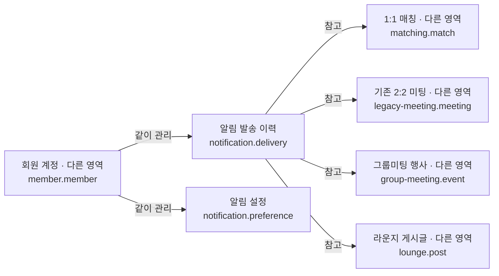
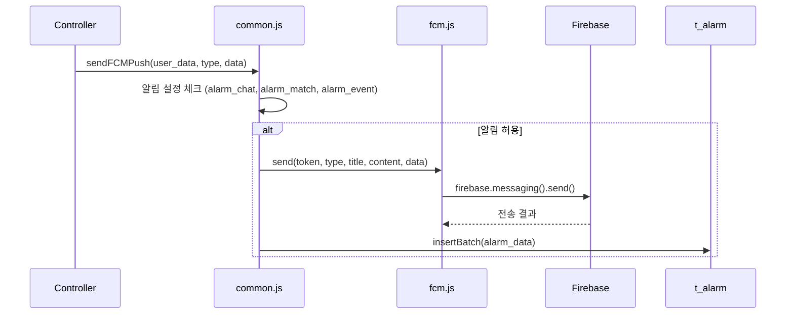

# 푸시알림 시스템 (FCM)

## 문서 역할

- 역할: `설명`
- 문서 종류: `architecture`
- 충돌 시 우선 문서: [푸시알림 운영 정책](../policy/push-notification-policy.md)
- 기준 성격: `as-is`

Firebase Cloud Messaging 기반 푸시알림 아키텍처를 정리한 문서이다.
이 문서의 타입 섹션은 대표 타입과 범주를 설명하는 요약본이며, 전체 타입 인벤토리를 1:1로 열거하지 않는다.
기존 알림 흐름과 그룹미팅 77~83의 API 타입은 현행이다. 별도 Mobile 소비자 cutover와 운영 증빙은
[기술 부채 정리](../technical-debt/technical-debt.md)의 `그룹미팅 소비자 cutover 및 출시 통합 미완료`에서 추적한다.

## 논리 데이터 모델

- 도메인 ID: `notification`

### 먼저 보는 그림

이 그림은 데이터가 어디에 속하고 무엇을 참고하는지 먼저 보여준다.
정확한 이름과 조건은 아래 상세 표를 따른다.


```mermaid
flowchart LR
    entity_group_dash_meeting_dot_event["그룹미팅 행사 · 다른 영역<br/>group-meeting.event"]
    entity_legacy_dash_meeting_dot_meeting["기존 2:2 미팅 · 다른 영역<br/>legacy-meeting.meeting"]
    entity_lounge_dot_post["라운지 게시글 · 다른 영역<br/>lounge.post"]
    entity_matching_dot_match["1:1 매칭 · 다른 영역<br/>matching.match"]
    entity_member_dot_member["회원 계정 · 다른 영역<br/>member.member"]
    entity_notification_dot_delivery["알림 발송 이력<br/>notification.delivery"]
    entity_notification_dot_preference["알림 설정<br/>notification.preference"]
    entity_member_dot_member -->|"같이 관리"| entity_notification_dot_preference
    entity_member_dot_member -->|"같이 관리"| entity_notification_dot_delivery
    entity_notification_dot_delivery -->|"참고"| entity_matching_dot_match
    entity_notification_dot_delivery -->|"참고"| entity_legacy_dash_meeting_dot_meeting
    entity_notification_dot_delivery -->|"참고"| entity_group_dash_meeting_dot_event
    entity_notification_dot_delivery -->|"참고"| entity_lounge_dot_post
```

꼭 지킬 규칙:

- 발송과 저장 여부는 같은 회원 설정 판정 결과를 사용한다
- 알림 문구와 이동 대상에는 인증정보나 대화 원문을 포함하지 않는다
- 서버는 알림 종류별 설정을 단일 기준으로 판정한다

<!-- markdownlint-disable MD046 -->

??? info "정확한 값과 조건 보기"

    ### 논리 엔티티

    | 논리 ID | 표시명 | 생명주기 역할 | 엔티티 형태 | 기록 역할 | 책임 | 최고 데이터 분류 | 생명주기 |
    | --- | --- | --- | --- | --- | --- | --- | --- |
    | `notification.preference` | 알림 설정 | child | entity | state | 회원의 채팅·매칭·행사 알림 수신 선택 | 내부 | 회원 계정과 함께 유지하고 변경 시 현재값 갱신 |
    | `notification.delivery` | 알림 발송 이력 | child | entity | history | 수신자, 알림 종류, 표시 문구와 이동 대상 | 민감 | 알림함·운영 확인 기간 동안 보존 후 정리 |

    ### 관계

    | 출발 논리 ID | 관계 역할 | 관계 유형 | 도착 논리 ID | 카디널리티 | 소유·삭제 규칙 |
    | --- | --- | --- | --- | --- | --- |
    | `member.member` | `notification-preference` | owns | `notification.preference` | 1:1 | 회원 계정 삭제 시 설정도 함께 정리 |
    | `member.member` | `notification-deliveries` | owns | `notification.delivery` | 1:N | 회원 개인정보 정리 시 수신자 연결과 문구를 정리 가능 |
    | `notification.delivery` | `match-target` | references | `matching.match` | N:1 | 이동 대상이 매칭이면 해당 문맥을 참조 |
    | `notification.delivery` | `meeting-target` | references | `legacy-meeting.meeting` | N:1 | 이동 대상이 기존 미팅이면 해당 문맥을 참조 |
    | `notification.delivery` | `group-meeting-target` | references | `group-meeting.event` | N:1 | 이동 대상이 그룹미팅이면 해당 행사 문맥을 참조 |
    | `notification.delivery` | `post-target` | references | `lounge.post` | N:1 | 이동 대상이 라운지면 해당 문맥을 참조 |

    ### 불변조건

    | 규칙 ID | 관련 논리 ID | 불변조건 | 기준 문서 |
    | --- | --- | --- | --- |
    | `NOTIFICATION-INV-001` | `notification.delivery` | 발송과 저장 여부는 같은 회원 설정 판정 결과를 사용한다 | [푸시알림 운영 정책](../policy/push-notification-policy.md) |
    | `NOTIFICATION-INV-002` | `notification.delivery` | 알림 문구와 이동 대상에는 인증정보나 대화 원문을 포함하지 않는다 | [데이터 거버넌스 정책](../policy/data-governance-policy.md) |
    | `NOTIFICATION-INV-003` | `notification.preference` | 서버는 알림 종류별 설정을 단일 기준으로 판정한다 | [푸시알림 운영 정책](../policy/push-notification-policy.md) |

<!-- markdownlint-enable MD046 -->

## FCM 알림 타입 요약

### 회원가입 관련 (1-4)

| 값 | 상수 | 의미 |
|----|------|------|
| 1 | SIGNUP_PROFILE_EDIT | 가입심사 정보 수정 필요 |
| 2 | SIGNUP_PROFILE_EDIT_AGAIN | 1차 심사 미승인 |
| 3 | SIGNUP_OK | 가입심사 승인 |
| 4 | SIGNUP_FAVOR_INFO | 추가정보 입력 안내 |

### 설정 관련 (5-11, 73-74, 76)

| 값 | 상수 | 의미 |
|----|------|------|
| 5 | SETTING_AUTH_OK | 인증 승인 |
| 6 | SETTING_PROFILE_OK | 프로필 승인 |
| 7 | SETTING_PROFILE_DENY | 프로필 반려 |
| 8-11 | SETTING_RECOMMEND_* | 추천 관련 |
| 73 | SETTING_MEMBER_REVIEW_DENY | 준회원/정회원 승급 심사 반려(즉시) |
| 74 | SETTING_MEMBER_REVIEW_DENY_AGAIN | 준회원/정회원 반려 후 미재제출 리마인드 |
| 76 | SETTING_AUTH_DENY | 설정 인증정보 반려 |

### 1:1 매칭 관련 (12-30)

| 값 | 상수 | 의미 |
|----|------|------|
| 12 | MATCH_NEW_MALE_ARRIVE | 남성 프로필 전달 |
| 13 | MATCH_MALE_PROFILE_ACCEPTED | 여성이 프로필 수락 |
| 14 | MATCH_FEMALE_PROFILE_ACCEPTED | 남성이 프로필 수락 |
| 15 | MATCH_FEMALE_CONFIRM | 여성 최종승인 |
| 16 | MATCH_SCHEDULE_SUGGESTED | 일정 제안 |
| 18-19 | MATCH_SCHEDULE_OK_* | 일정 확정 |
| 20 | MATCH_LOCATION_OK | 약속 장소 확정 |
| 21 | MATCH_D_DAY_2 | D-2일 도래 |
| 22 | MATCH_NEW_CHAT | 새 채팅 메시지 |
| 24 | MATCH_CANCEL | 만남 취소 |
| 25 | MATCH_DAY | 만남 당일 |
| 26 | MATCH_4_HOUR_PASSED | 만남 4시간 경과 |
| 27-30 | MATCH_*_CONTRACT/DIRECT | 연락처/직진만남 |

### 2:2 미팅 관련 (31-37)

| 값 | 상수 | 의미 |
|----|------|------|
| 31 | MEET_ATTEND_REQUEST | 참석 요청 |
| 32 | MEET_ACCEPT_ATTEND | 참석 수락 |
| 33-34 | MEET_MEMBER_OK_* | 멤버 확정 |
| 35-36 | MEET_2_HOUR_PASSED_* | 2시간 경과 |
| 37 | MEET_SEND_CHAT | 채팅 전송 |

### 라운지 관련 (38-41, 68)

| 값 | 상수 | 의미 |
|----|------|------|
| 38 | LOUNGE_NEW_COMMENT | 새 댓글 |
| 39 | LOUNGE_NEW_CHILD_COMMENT | 대댓글 |
| 40 | LOUNGE_BEST | 베스트 선정 |
| 41 | LOUNGE_BLAME | 신고 |
| 68 | LOUNGE_LIKE | 게시글 좋아요 수 변경 |

### 기타 대표 타입 (42-75)

| 값 | 상수 | 의미 |
|----|------|------|
| 53 | MATCH_VOICE_CALL | 보이스톡 오픈 알림(모바일 알림 노출 제외) |
| 67 | CONCIERGE_CHAT | 큐레이터 채팅 |
| 66 | ADMIN_FREE_KEY | 관리자 Key 지급/차감 |
| 70 | MATCH_CHAT_OPEN | 채팅방 오픈 |
| 75 | SIGNUP_FULL_MEMBER_OK | 정회원 가입심사 최종 승인 |

- 위 표는 전체 타입 목록이 아니라 대표 타입 예시와 범주 요약이다.

### 그룹미팅 타입 (77-83)

아래 값은 [그룹미팅 시스템](group-meeting-system.md)의 API 발송 계약에 반영됐다. Mobile 연결 계약은 신청 상태
알림 77~79를 행사 상세, 취소·새 메시지·후기 알림 81~83을 채팅 이력으로 연결한다. 확정 80은 클릭 시 서버의 최신
`can_chat`을 확인해 개방됐으면 채팅, 아직 미개방이면 행사 상세로 연결한다. 소비자 cutover와 운영 전환 상태는
[기술 부채 정리](../technical-debt/technical-debt.md)의 `그룹미팅 소비자 cutover 및 출시 통합 미완료`에서
추적한다. 모든 `target`은 그룹미팅 행사 ID다.

| 값 | 상수 | 의미 | Mobile 이동 |
| --- | --- | --- | --- |
| 77 | `GROUP_MEETING_APPLICATION_RECEIVED` | 신규 신청 | 행사 상세 |
| 78 | `GROUP_MEETING_APPLICATION_APPROVED` | 신청 승인 | 행사 상세 |
| 79 | `GROUP_MEETING_APPLICATION_CANCELED` | Admin 확정 취소(외부 환불 필요) | 행사 상세 |
| 80 | `GROUP_MEETING_EVENT_CONFIRMED` | 모임 확정 | 개방 시 채팅, 미개방 시 행사 상세 |
| 81 | `GROUP_MEETING_EVENT_CANCELED` | 행사 취소 | 채팅 이력 |
| 82 | `GROUP_MEETING_CHAT_MESSAGE` | 새 채팅 메시지 | 채팅 이력 |
| 83 | `GROUP_MEETING_REVIEW_AVAILABLE` | 후기 작성 가능 | 채팅 이력 |

## 발송 흐름


```mermaid
sequenceDiagram
    participant C as Controller
    participant Common as common.js
    participant FCM as fcm.js
    participant Firebase as Firebase
    participant DB as t_alarm

    C->>Common: sendFCMPush(user_data, type, data)
    Common->>Common: 알림 설정 체크 (alarm_chat, alarm_match, alarm_event)
    alt 알림 허용
        Common->>FCM: send(token, type, title, content, data)
        FCM->>Firebase: firebase.messaging().send()
        Firebase-->>FCM: 전송 결과
        Common->>DB: insertBatch(alarm_data)
    end
```

## 발송 조건

타입별 사용자 설정 매핑, FCM·`t_alarm` 생략 조건, foreground 처리와 상태 갱신 보조 경로 판정은
[푸시알림 운영 정책](../policy/push-notification-policy.md)이 소유한다. 이 문서는 발송 구성요소와 데이터 흐름만
설명한다. 큐레이터 채팅의 활성 상태 동기화 구조는 [채팅 시스템](chat-system.md)의 WebSocket 절을 따른다.

## 메시지 구조

```javascript
{
  notification: {
    title: '커플러',
    body: '새로운 남성 프로필이 도착했습니다.'
  },
  android: {
    notification: { sound: 'default' }
  },
  apns: {
    payload: { aps: { sound: 'default' } }
  },
  data: {
    type: '12',
    custom_data: '{"target": 123}',
    title: '커플러',
    message: '새로운 남성 프로필이 도착했습니다.'
  },
  token: 'device_fcm_token'
}
```

라운지 foreground 동기화는 FCM `custom_data`를 모바일 진입점에서 한 번 검증한 뒤 typed domain event로 전달한다.
화면은 FCM 원본 JSON을 직접 파싱하거나 숫자 변환 fallback을 수행하지 않는다. 타입별 필드 계약은
[푸시알림 운영 정책](../policy/push-notification-policy.md)의 `라운지 custom_data 계약`을 따른다.

## 알림 저장

발송된 사용자 알림은 `notification.delivery`로 저장한다. 수신자, 알림 종류, 사용자에게 표시한 문구와 이동
대상만 보존하며, FCM 토큰이나 원천 도메인의 민감 본문은 알림 이력에 복제하지 않는다.

운영 집계 호환 규칙:

- 반려 알림 전체 지표는 `type IN (7,73,74,76)` 기준으로 조회한다.
- `type = 7` 단독 필터는 신규 반려 알림(73/74/76)을 누락한다.

## 주요 발송 지점

| 영역 | 기능 | 주요 알림 |
|------|------|----------|
| Admin cron | 스케줄 작업 | D-DAY, 만남 당일, 카드 만료 |
| Match 도메인 | 매칭 액션 | 프로필 수락, 채팅, 일정 |
| Admin member | 회원 관리 | 심사 승인, 관리자 Key 지급/차감 |
| Lounge 도메인 | 라운지 | 댓글, 베스트 |

## 다국어 지원

```json
// locales/ko.json
{
  "push": {
    "title": "커플러",
    "signup_profile_edit": "가입심사 단계에서 이용자의 기입정보 수정이 필요합니다.",
    "match_new_male_arrive": "새로운 남성 프로필이 도착했습니다."
  }
}
```
