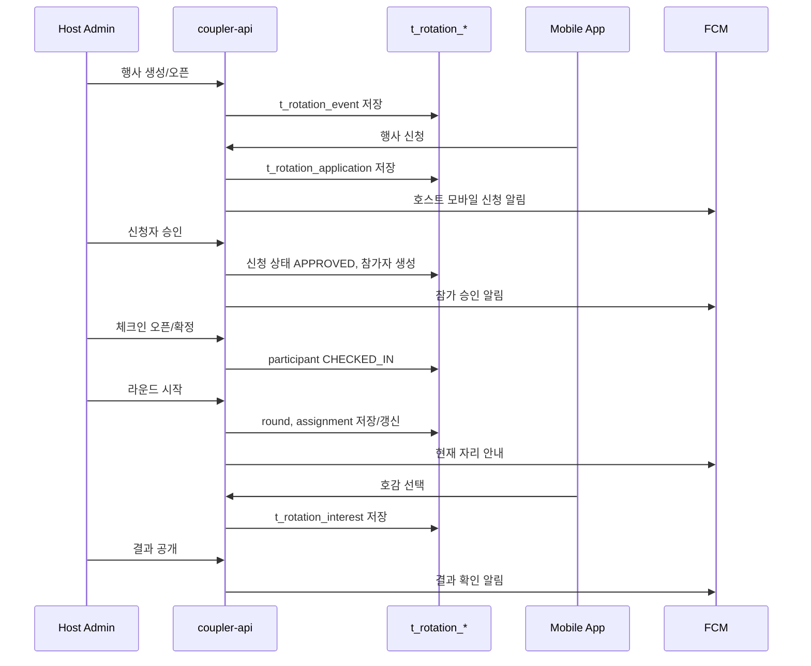

# n대n 로테이션 소개팅 시스템

## 문서 역할

- 역할: `설명`
- 문서 종류: `architecture`
- 충돌 시 우선 문서: [보안/접근통제 정책](../policy/security-access-control-policy.md), [결제 운영 정책](../policy/payment-ops-policy.md), [푸시알림 운영 정책](../policy/push-notification-policy.md), [데이터 거버넌스 정책](../policy/data-governance-policy.md)
- 기준 성격: `to-be`

이 문서는 2:2 그룹 미팅과 별도 도메인으로 구축할 n대n 로테이션 소개팅의 목표 구조를 정리한다.
현재 구현은 없으며, 기존 2:2 미팅의 레이아웃과 운영 트리거를 참고하되 저장 구조와 API는 분리한다.

## 목적

- 호스트가 행사 단위로 n대n 로테이션 소개팅을 생성하고, 회원 신청부터 승인, 체크인, 라운드 배정, 결과 공개까지 운영할 수 있는 별도 시스템을 정의한다.

## 범위

- 포함 범위:
    - 호스트 Admin 계정과 모바일 회원 계정의 연결
    - 행사 생성, 신청, 승인, 대기, 취소, 체크인, 라운드 배정, 결과 공개
    - Admin 운영 화면, Mobile 사용자 화면, API, DB, 푸시 알림
    - 참가 신청과 승인 흐름의 키 과금 기준
- 제외 범위:
    - 2:2 그룹 미팅의 기존 DB/API 상태 변경
    - 오프라인 현장 결제, 외부 티켓팅 연동, 좌석 QR 시스템
    - 호스트 정산, 매출 쉐어, 외부 파트너 계약 관리

## 상위 규범 문서

- 권한, 호스트 계정 연결, 운영 액션 감사 기준은 [보안/접근통제 정책](../policy/security-access-control-policy.md)을 따른다.
- 키 차감, 환불, 키 로그 기준은 [결제 운영 정책](../policy/payment-ops-policy.md)을 따른다.
- 푸시 타입, 중복 발송 방지, 알림 저장 기준은 [푸시알림 운영 정책](../policy/push-notification-policy.md)을 따른다.
- 회원 프로필, 연락처, 운영 로그 같은 데이터 분류와 접근 통제는 [데이터 거버넌스 정책](../policy/data-governance-policy.md)을 따른다.
- 사용자 노출 용어는 [서비스 용어 정책](../policy/service-terminology-policy.md)을 따른다.

## 기본 방향

### 1) 2:2 미팅과 분리

- 기존 [미팅 시스템](meeting-system.md)은 2:2 그룹 미팅의 as-is 구조로 유지한다.
- 로테이션 소개팅은 `rotation` 도메인으로 분리하고 `t_meeting`, `t_meeting_member`, `/meeting/*` API를 재사용하지 않는다.
- 화면 레이아웃, 리스트 테이블, 상세 팝업, 푸시 발송 helper 같은 구현 패턴은 참고할 수 있다.
- 2:2 미팅 데이터를 백업해서 전환하는 방식이 아니라, 신규 테이블과 API를 additive로 추가한다.

### 2) 호스트는 Admin 계정으로만 운영

- 행사 생성, 신청자 승인, 체크인 확정, 라운드 시작, 결과 공개는 Admin 권한에서만 수행한다.
- 호스트가 모바일 회원으로도 존재하는 경우를 위해 Admin 계정과 모바일 회원 계정의 연결 테이블을 둔다.
- 기존 `t_member_manager_assignment`는 클럽매니저 담당 배정 책임이므로 호스트 신원 연결에 사용하지 않는다.

### 3) 신청자 수신 시 호스트 무과금

- 참가 신청이 들어오거나 신청자를 승인할 때 호스트 모바일 계정의 키를 차감하지 않는다.
- 호스트 관련 과금/정산은 이 문서의 MVP 범위 밖이다.
- 참가자 키 과금은 승인 또는 체크인 시점 중 하나로 고정해야 하며, MVP 권장값은 `승인 시 차감, 거절/행사 취소 시 환불`이다.

### 4) 푸시는 트리거만 재사용

- 기존 2:2 미팅 푸시 흐름은 신청, 승인, 확정, 채팅/상세 갱신 트리거를 참고한다.
- FCM 타입 ID와 i18n key는 `ROTATION_*`, `push.rotation_*`로 새로 추가한다.
- 알림 문구는 2:2 문구를 초안으로 참고할 수 있지만, 로테이션 행사 맥락에 맞게 별도 문구로 저장한다.

### 5) 백업/전환 안전장치

- 2:2 미팅을 로테이션 소개팅으로 변환하지 않는다.
- DB 변경은 `t_rotation_*` 신규 테이블 추가 중심으로 진행하고, 기존 `t_meeting_*` 테이블 변경은 MVP 범위에서 제외한다.
- 운영 DB 반영 전 백업과 검증은 [DB Migration Gate 정책](../policy/db-migration-gate-policy.md)에 따른다.

### 6) 현 DB 구조 반영 기준

- 기존 Admin 계정은 `t_admin`, 클럽매니저 프로필은 `t_manager`, 회원-클럽매니저 배정은 `t_member_manager_assignment`가 담당한다.
- 로테이션 호스트는 클럽매니저 배정과 다른 책임이므로 `t_rotation_host`에서 `t_admin.id`와 `t_member.id`를 직접 연결한다.
- 기존 알림 저장소 `t_alarm`은 `member` FK 기준이므로 호스트 FCM은 `t_rotation_host.member_id`로 보낸다.
- Admin Web의 신청자 알림은 `t_alarm`에 저장하지 않고, `t_rotation_application`의 대기 건수 집계로 노출한다.
- 기존 키 변동 원장은 `t_member_key_log`지만 행사/신청 FK가 없으므로, 로테이션 과금 추적은 `t_rotation_key_ledger`를 추가해 보완한다.

## 구성요소

| 구성요소 | 책임 |
| --- | --- |
| Rotation Host | Admin 계정과 모바일 회원 계정 연결, 호스트 활성/비활성 관리 |
| Rotation Event | 행사 기본 정보, 모집 정원, 상태, 장소, 라운드 설정 관리 |
| Rotation Application | 참가 신청, 승인, 대기, 거절, 취소, 환불 기준 상태 관리 |
| Rotation Participant | 최종 참가자, 체크인, 노쇼, 완료 상태 관리 |
| Rotation Round | 라운드 번호, 시작/종료 시간, 진행 상태 관리 |
| Rotation Assignment | 라운드별 테이블, 좌석, 상대 배정 관리 |
| Rotation Interest | 라운드 후 호감 선택과 상호 매칭 결과 관리 |
| Rotation Key Ledger | 참가자 키 차감/환불과 원천 신청/행사 연결 |
| Admin Rotation UI | 행사 생성, 신청자 승인, 체크인, 라운드 시작/종료, 결과 공개 운영 |
| Mobile Rotation UI | 행사 목록, 상세, 신청, 승인 상태, 체크인, 현재 라운드, 결과 확인 |
| Push Dispatcher | 신청/승인/체크인/라운드/결과 이벤트 알림 발송 |

## 코드 / 파일 배치 계획

로테이션 소개팅은 같은 레포 안에서 별도 도메인 파일로 분리한다.
2:2 미팅 파일을 직접 확장하지 않고, 필요한 UI 패턴만 복제해 `rotation` 이름으로 새 파일을 둔다.

| 레포 | 신규 파일/디렉터리 방향 | 비고 |
| --- | --- | --- |
| coupler-api | `routes/app/v1/rotation.ts`, `controller/app/v1/rotation.ts`, `model/rotation_*.ts` | Mobile API |
| coupler-api | `routes/admin/rotation.ts`, `controller/admin/rotation.ts` | Admin API |
| coupler-api | `swagger/app/v1/rotation.yaml`, Admin Swagger 대상 | API 명세 |
| coupler-admin-web | `src/pages/rotation/*` | 기존 `src/pages/meeting/*` 레이아웃 참고 |
| coupler-mobile-app | `src/screens/rotation/*` | 기존 2:2 목록/상세 카드 레이아웃 참고 |
| coupler-mobile-app | `src/utils/Common.tsx`, `src/constants/AppConstants.ts`의 `ROTATION_*` 분기 | 푸시 네비게이션 |

## 저장 구조 / 데이터 모델

공통 기준:

- 신규 PK는 기존 테이블 관례에 맞춰 `INT NOT NULL AUTO_INCREMENT`를 기본으로 한다.
- 상태값은 기존 DB의 `tinyint` 상태 모델과 맞춰 `TINYINT NOT NULL`로 저장하고, 코드 상수에서 의미를 고정한다.
- 날짜는 기존 DB 관례에 맞춰 `DATETIME`을 사용한다.
- FK는 운영 삭제 정책을 먼저 확정한 뒤 `ON DELETE CASCADE` 또는 `ON DELETE RESTRICT`를 선택한다. MVP 권장값은 행사 하위 운영 데이터(`application`, `participant`, `round`, `assignment`, `interest`)는 `event_id` 기준 cascade 후보로 두되, 과금 원장인 `key_ledger`는 `RESTRICT` 또는 soft-delete 보존으로 둔다.

### t_rotation_host

| 필드 | 타입 | 설명 |
| --- | --- | --- |
| id | INT | 호스트 연결 PK |
| admin_id | INT | `t_admin.id` |
| member_id | INT | `t_member.id` |
| status | TINYINT | 1=활성, 0=비활성 |
| create_date | DATETIME | 생성 시각 |
| edit_date | DATETIME NULL | 수정 시각 |

제약:

- `admin_id`는 유일해야 한다.
- `member_id`는 유일해야 한다.
- 연결 생성과 해제는 Super Admin만 수행한다.
- API는 `admin_id`가 `t_admin.super = 0`인 호스트 계정인지 확인한다. Super Admin 계정은 운영자이며 호스트 연결 대상이 아니다.

### t_rotation_event

| 필드 | 타입 | 설명 |
| --- | --- | --- |
| id | INT | 행사 PK |
| host_id | INT | `t_rotation_host.id` |
| title | VARCHAR(255) | 행사 제목 |
| location | VARCHAR(255) | 행사 장소 |
| event_date | DATETIME | 행사 일시 |
| application_open_at | DATETIME | 신청 오픈 시각 |
| application_close_at | DATETIME | 신청 마감 시각 |
| male_capacity | TINYINT UNSIGNED | 남성 정원 |
| female_capacity | TINYINT UNSIGNED | 여성 정원 |
| round_count | TINYINT UNSIGNED | 라운드 수 |
| round_minutes | TINYINT UNSIGNED | 라운드당 진행 시간 |
| status | TINYINT | 행사 상태 |
| content | TEXT | 상세 설명 |
| thumbnail | VARCHAR(255) | 목록 이미지 |
| create_date | DATETIME | 생성 시각 |
| edit_date | DATETIME NULL | 수정 시각 |

권장 인덱스:

- `idx_rotation_event_host_status_date (host_id, status, event_date)`
- `idx_rotation_event_status_date (status, event_date)`

### t_rotation_application

| 필드 | 타입 | 설명 |
| --- | --- | --- |
| id | INT | 신청 PK |
| event_id | INT | `t_rotation_event.id` |
| member_id | INT | 신청 회원 |
| gender | ENUM('F','M') | 신청 시점 성별 스냅샷 |
| status | TINYINT | 신청, 승인, 대기, 거절, 취소 |
| payment_status | TINYINT | 0=미차감, 1=차감, 2=환불 |
| key_amount | INT | 참가자에게 차감한 키 |
| charged_at | DATETIME NULL | 차감 시각 |
| refunded_at | DATETIME NULL | 환불 시각 |
| create_date | DATETIME | 신청 시각 |
| edit_date | DATETIME NULL | 수정 시각 |

제약:

- `(event_id, member_id)`는 유일해야 한다.
- 동일 행사 중복 신청은 서버에서 fail-closed로 거부한다.
- `payment_status = 1`이면 `charged_at`과 `key_amount < 0`을 함께 보장한다.
- `payment_status = 2`이면 `refunded_at`과 환불 `t_rotation_key_ledger` row가 있어야 한다.

권장 인덱스:

- `uq_rotation_application_event_member (event_id, member_id)`
- `idx_rotation_application_event_status_gender (event_id, status, gender)`
- `idx_rotation_application_member_status_event (member_id, status, event_id)`

### t_rotation_participant

| 필드 | 타입 | 설명 |
| --- | --- | --- |
| id | INT | 참가자 PK |
| event_id | INT | 행사 ID |
| application_id | INT | 신청 ID |
| member_id | INT | 회원 ID |
| status | TINYINT | 참가 확정, 체크인, 노쇼, 완료, 중도 이탈 |
| alias | VARCHAR(255) | 행사 내 노출 별칭 |
| checkin_at | DATETIME NULL | 체크인 시각 |
| create_date | DATETIME | 생성 시각 |
| edit_date | DATETIME NULL | 수정 시각 |

권장 인덱스:

- `uq_rotation_participant_event_application (event_id, application_id)`
- `uq_rotation_participant_event_member (event_id, member_id)`
- `idx_rotation_participant_event_status (event_id, status)`

### t_rotation_round

| 필드 | 타입 | 설명 |
| --- | --- | --- |
| id | INT | 라운드 PK |
| event_id | INT | 행사 ID |
| round_no | TINYINT UNSIGNED | 라운드 번호 |
| starts_at | DATETIME NULL | 시작 시각 |
| ends_at | DATETIME NULL | 종료 시각 |
| status | TINYINT | 대기, 진행, 종료 |

권장 인덱스:

- `uq_rotation_round_event_no (event_id, round_no)`

### t_rotation_round_assignment

| 필드 | 타입 | 설명 |
| --- | --- | --- |
| id | INT | 배정 PK |
| event_id | INT | 행사 ID |
| round_id | INT | 라운드 ID |
| table_no | SMALLINT UNSIGNED | 테이블 번호 |
| male_participant_id | INT | 남성 참가자 ID |
| female_participant_id | INT | 여성 참가자 ID |
| status | TINYINT | 예정, 진행, 완료, 결석 무효 |

권장 인덱스:

- `uq_rotation_assignment_round_table (round_id, table_no)`
- `uq_rotation_assignment_round_male (round_id, male_participant_id)`
- `uq_rotation_assignment_round_female (round_id, female_participant_id)`

### t_rotation_interest

| 필드 | 타입 | 설명 |
| --- | --- | --- |
| id | INT | 호감 선택 PK |
| event_id | INT | 행사 ID |
| round_id | INT | 라운드 ID |
| chooser_participant_id | INT | 선택한 참가자 |
| target_participant_id | INT | 선택 대상 참가자 |
| choice | TINYINT | 1=선택, 0=미선택 |
| matched | TINYINT | 1=상호 선택, 0=상호 선택 아님 |
| create_date | DATETIME | 선택 시각 |

권장 인덱스:

- `uq_rotation_interest_round_chooser (round_id, chooser_participant_id)`
- `idx_rotation_interest_target (event_id, target_participant_id)`

### t_rotation_key_ledger

| 필드 | 타입 | 설명 |
| --- | --- | --- |
| id | INT | 로테이션 키 원장 PK |
| event_id | INT | 행사 ID |
| application_id | INT | 신청 ID |
| member_id | INT | 키 변동 회원 |
| member_key_log_id | INT | `t_member_key_log.id` |
| action | TINYINT | 1=차감, 2=환불 |
| key_amount | INT | 키 변동량 |
| key_total | INT | 변동 후 회원 키 |
| actor_admin_id | INT NULL | 처리 Admin ID |
| reason | VARCHAR(255) | 사유 |
| create_date | DATETIME | 발생 시각 |

운영 기준:

- 참가자 키 차감/환불은 `t_member.key`, `t_member_key_log`, `t_rotation_key_ledger`, `t_rotation_application.payment_status`를 같은 트랜잭션에서 갱신한다.
- `member_key_log_id`로 기존 키 원장과 로테이션 원장을 연결한다.
- 호스트 무과금 원칙 때문에 `t_rotation_key_ledger.member_id`는 참가자 회원만 기록한다.
- 정산/감사 추적을 위해 행사 삭제 시에도 물리 삭제하지 않는다.

## 상태 모델

### 행사 상태

| 값 | 상태 | 의미 |
| --- | --- | --- |
| -1 | CANCELED | 행사 취소 |
| 0 | DRAFT | 호스트가 작성 중 |
| 1 | OPEN | 신청 가능 |
| 2 | APPLY_CLOSED | 신청 마감 |
| 3 | CONFIRMED | 참가자 확정 |
| 4 | CHECKIN_OPEN | 체크인 가능 |
| 5 | IN_PROGRESS | 라운드 진행 중 |
| 6 | RESULT_OPEN | 결과 공개 |
| 7 | FINISHED | 행사 종료 |

### 신청 상태

| 값 | 상태 | 의미 |
| --- | --- | --- |
| -2 | CANCELED | 신청자 취소 |
| -1 | REJECTED | 거절 |
| 0 | APPLIED | 신청 접수 |
| 1 | APPROVED | 승인 완료 |
| 2 | WAITLISTED | 대기자 |

### 신청 과금 상태

| 값 | 상태 | 의미 |
| --- | --- | --- |
| 0 | NONE | 미차감 |
| 1 | CHARGED | 차감 완료 |
| 2 | REFUNDED | 환불 완료 |

### 참가자 상태

| 값 | 상태 | 의미 |
| --- | --- | --- |
| -2 | LEFT | 중도 이탈 |
| -1 | NO_SHOW | 노쇼 |
| 0 | CONFIRMED | 참가 확정 |
| 1 | CHECKED_IN | 현장 체크인 |
| 2 | COMPLETED | 행사 완료 |

### 라운드 / 배정 상태

| 값 | 상태 | 의미 |
| --- | --- | --- |
| -1 | VOID | 취소 또는 결석으로 무효 |
| 0 | PENDING | 대기 |
| 1 | IN_PROGRESS | 진행 중 |
| 2 | FINISHED | 종료 |

## 데이터 흐름

Admin Web의 신청자 알림/배지는 FCM 이벤트가 아니라 `t_rotation_application.status = 0` 신청 대기 건수 조회로 노출한다.
모바일 푸시를 받은 호스트는 `t_rotation_host.member_id` 기준의 회원 알림으로 행사 상세 또는 호스트 모바일 운영 화면에 진입한다.

## 라운드 배정

- MVP는 남녀 동수 확정 후 시작을 기본으로 한다.
- 한쪽 그룹은 고정하고 다른 한쪽 그룹을 라운드마다 한 칸씩 회전시키면 중복 만남 없이 배정할 수 있다.
- 예시: 남성 `A1..A5`, 여성 `B1..B5`일 때 `round_no = r`에서 `Ai`는 `B((i + r) mod 5)`와 만난다.
- 인원이 맞지 않는 행사는 MVP에서 시작 불가로 처리한다.
- 후속 버전에서 홀수 인원, 지각, 노쇼를 지원할 때는 `BYE` 또는 운영자 수동 재배정 상태를 추가한다.

## API 초안

### Mobile API

| 메서드 | 엔드포인트 | 설명 |
| --- | --- | --- |
| GET | `/rotation/list` | 행사 목록 |
| GET | `/rotation/my-list` | 내 신청/참가 행사 |
| GET | `/rotation/detail` | 행사 상세 |
| POST | `/rotation/apply` | 참가 신청 |
| POST | `/rotation/cancel-application` | 신청 취소 |
| GET | `/rotation/current-round` | 현재 라운드/자리 확인 |
| POST | `/rotation/interest` | 호감 선택 |
| GET | `/rotation/result` | 결과 확인 |

### Admin API

| 메서드 | 엔드포인트 | 설명 |
| --- | --- | --- |
| GET | `/admin/rotation/list` | 행사 목록 |
| POST | `/admin/rotation/save` | 행사 생성/수정 |
| POST | `/admin/rotation/open` | 신청 오픈 |
| POST | `/admin/rotation/close-application` | 신청 마감 |
| GET | `/admin/rotation/application-summary` | 행사별 신청 대기 건수 |
| GET | `/admin/rotation/applications` | 신청자 목록 |
| POST | `/admin/rotation/approve` | 신청 승인 |
| POST | `/admin/rotation/reject` | 신청 거절 |
| POST | `/admin/rotation/checkin` | 체크인 처리 |
| POST | `/admin/rotation/generate-assignments` | 라운드 배정 생성 |
| POST | `/admin/rotation/start-round` | 라운드 시작 |
| POST | `/admin/rotation/finish-round` | 라운드 종료 |
| POST | `/admin/rotation/open-result` | 결과 공개 |
| POST | `/admin/rotation/cancel` | 행사 취소 |

## Admin 화면 계획

- 메뉴: `로테이션 소개팅 관리`
- 1차 화면:
    - 행사 목록
    - 행사 생성/수정 팝업
    - 신청자/대기자 관리
    - 체크인 운영판
    - 라운드 배정표
    - 결과/호감 선택 현황
- 기존 미팅관리의 리스트, 상세, 신고/후기 팝업 구조는 참고하되 API와 상태 컬럼은 `rotation` 기준으로 분리한다.
- 호스트 Admin은 자기 행사만 조회하고, Super Admin은 전체 행사를 조회한다.

## Mobile 화면 계획

- 기존 2:2 미팅 카드 레이아웃을 최대한 따르되 사용자에게 보이는 정보는 로테이션 행사에 맞게 바꾼다.
- 목록 카드:
    - 행사명, 일시, 장소, 모집 현황, 신청 상태
- 상세 화면:
    - 행사 소개, 참가 조건, 신청 버튼, 승인/대기/거절 상태
- 당일 화면:
    - 체크인 상태, 현재 라운드, 테이블/좌석, 다음 이동 안내
- 결과 화면:
    - 상호 선택 결과만 공개한다.
    - 일방 선택 결과는 기본 비공개로 둔다.

## 푸시 알림 초안

| 상수 | 수신자 | 트리거 | 이동 |
| --- | --- | --- | --- |
| ROTATION_APPLY_REQUEST | 호스트 모바일 회원 | 회원 신청 | 호스트 모바일 행사 상세 |
| ROTATION_APPROVED | 참가자 | 호스트 승인 | 행사 상세 |
| ROTATION_WAITLISTED | 참가자 | 대기자 전환 | 행사 상세 |
| ROTATION_REJECTED | 참가자 | 신청 거절 | 행사 상세 |
| ROTATION_CHECKIN_OPEN | 참가자 | 체크인 오픈 | 체크인 화면 |
| ROTATION_ROUND_START | 참가자 | 라운드 시작 | 현재 라운드 |
| ROTATION_NEXT_ROUND | 참가자 | 다음 라운드 이동 | 현재 라운드 |
| ROTATION_RESULT_OPEN | 참가자 | 결과 공개 | 결과 화면 |
| ROTATION_CANCELED | 참가자 | 행사 취소 | 행사 상세 |

운영 기준:

- 타입 ID는 기존 FCM 타입과 충돌하지 않는 새 번호를 배정한다.
- `t_alarm.member`는 수신 모바일 회원 ID로 저장한다. 참가자 알림은 `t_rotation_participant.member_id`, 호스트 알림은 `t_rotation_host.member_id`를 사용한다.
- `t_alarm.target`은 `t_rotation_event.id`로 저장한다. 신청 단위 식별자가 필요하면 FCM `custom_data`에 `application_id`를 추가하되 `t_alarm` 스키마 확장은 별도 결정으로 둔다.
- Admin Web 신청자 목록과 신청 대기 배지는 `t_alarm`이 아니라 `t_rotation_application` 집계 API로 제공한다.
- 라운드 알림은 `event_id + round_id + participant_id + type` 기준으로 중복 발송을 막는다.
- 모바일 푸시 네비게이션은 기존 2:2 상세/채팅 이동 분기를 재사용하지 않고 `rotation` 전용 분기를 추가한다.

## 과금 계획

| 액션 | 호스트 키 | 참가자 키 | 비고 |
| --- | --- | --- | --- |
| 행사 생성 | 0 | 0 | 호스트 무과금 |
| 참가 신청 | 0 | 0 | MVP 권장 |
| 신청 승인 | 0 | 차감 | MVP 권장 차감 시점 |
| 신청 거절 | 0 | 0 또는 환불 | 차감 전이면 환불 없음 |
| 신청자 취소 | 0 | 환불 정책 필요 | 승인 후 취소 시점별 정책 필요 |
| 행사 취소 | 0 | 환불 | 승인 차감분 환불 |
| 체크인 | 0 | 0 | 승인 시 차감 기준 |

승인 시 차감을 채택하면 참가 의사가 약한 신청을 줄이고, 거절/대기 단계에서 환불 처리가 단순해진다.
다만 승인 후 회원 취소 가능 시각과 환불 가능 여부는 운영 정책으로 별도 확정해야 한다.

## 구현 작업 계획

| 영역 | 필요 작업 |
| --- | --- |
| DB | `t_rotation_host`, `t_rotation_event`, `t_rotation_application`, `t_rotation_participant`, `t_rotation_round`, `t_rotation_round_assignment`, `t_rotation_interest`, `t_rotation_key_ledger` additive migration 작성 |
| DB | FK/인덱스/유니크 제약 추가, `key_ledger`는 cascade 금지, DB Migration Gate 백업/리허설/롤백 SQL 준비 |
| API | `model/rotation_*.ts`, `routes/app/v1/rotation.ts`, `controller/app/v1/rotation.ts`, `routes/admin/rotation.ts`, `controller/admin/rotation.ts` 추가, `app.ts`에 `/app/rotation`, `/admin/rotation` mount |
| API | Mobile 목록/상세/신청/취소/현재라운드/호감/결과, Admin 행사 CRUD/신청 집계/승인/거절/체크인/배정/라운드/결과/취소 구현 |
| API | 승인/거절/취소의 키 차감·환불 트랜잭션, 호스트 소유권 필터, `ROTATION_*` FCM 발송과 중복 방지 구현 |
| Docs | App/Admin Swagger에 `rotation` API 추가, FCM 타입/문구/i18n key 문서화, DBM Gate와 배포 체크리스트 기록 |
| Admin Web | `src/pages/rotation/*` 메뉴 추가, 행사 목록/생성·수정 팝업, 신청 대기 배지, 신청자 승인·거절, 체크인 운영판, 라운드/결과 화면 구현 |
| Admin Web | Super Admin은 전체 행사와 호스트 연결 관리, 호스트 Admin은 자기 `t_rotation_host.id` 행사만 조회·수정하도록 UI/API 권한을 맞춘다 |
| Mobile | `src/screens/rotation/*`, navigation type, `AppNavigator.tsx` Stack.Screen 추가, 행사 목록/상세/신청/취소/상태/현재라운드/호감/결과 화면 구현 |
| Mobile | `src/constants/AppConstants.ts`, `src/utils/Common.tsx`에 `ROTATION_*` 푸시 이동 분기 추가, 호스트 모바일 신청 알림은 읽기용 행사 상세로 연결 |
| 검증 | API 트랜잭션/권한/중복신청/중복푸시 테스트, Admin/Mobile 핵심 화면 스모크, 문서 구조·Markdown lint 통과 |

구현 순서는 `DB -> API -> Admin Web -> Mobile -> Docs/검증 보강`으로 진행한다.
체크인/라운드/결과는 신청/승인 MVP가 동작한 뒤 같은 도메인 테이블 위에 확장한다.

## MVP 완료 기준

- Super Admin이 호스트 Admin과 모바일 회원 계정을 연결할 수 있다.
- 호스트 Admin은 자기 행사만 생성/수정/운영할 수 있다.
- 회원은 행사 목록을 보고 신청할 수 있다.
- 호스트는 Admin Web에서 신청자 목록과 신청 대기 건수를 확인하고 승인/거절할 수 있다.
- 호스트 모바일 회원은 신청 접수 푸시를 받을 수 있으며, 이 알림은 호스트에게 과금하지 않는다.
- 승인 시 참가자 키 차감과 환불 가능 이벤트가 `t_member_key_log`와 `t_rotation_key_ledger`에 함께 남는다.
- 체크인된 참가자 기준으로 라운드 배정을 생성할 수 있다.
- 참가자는 현재 라운드의 자리와 상대를 확인할 수 있다.
- 참가자는 호감 선택을 제출하고 상호 선택 결과만 확인할 수 있다.
- 로테이션 전용 푸시 타입과 모바일 네비게이션이 동작한다.

## 후속 결정 필요 항목

- 참가자 키 차감량
- 승인 후 신청자 취소 가능 시각과 환불률
- 대기자 자동 승격 여부
- 행사 최소 성립 인원
- 노쇼 패널티와 다음 행사 신청 제한
- 호스트가 참가자로도 행사에 들어갈 수 있는지 여부
- 결과 공개 범위: 상호 선택만 공개할지, 운영자에게 일방 선택까지 공개할지 여부

## 비포함 / 금지

- 2:2 미팅의 기존 테이블에 `type = rotation` 같은 구분자를 추가해 혼합 저장하지 않는다.
- 기존 `MEET_*` FCM 타입을 로테이션 알림에 재사용하지 않는다.
- 호스트 계정 연결을 `t_member_manager_assignment`에 섞지 않는다.
- Admin UI 숨김만으로 권한을 처리하지 않고 API 서버에서 행사 소유권을 판정한다.
- 회원 연락처는 결과 공개만으로 자동 노출하지 않는다.

## 관련 문서

- [미팅 시스템](meeting-system.md)
- [푸시알림 시스템](push-notification.md)
- [관리자 권한 시스템](admin-permission.md)
- [결제 시스템](payment-system.md)
- [채팅 시스템](chat-system.md)
- [보안/접근통제 정책](../policy/security-access-control-policy.md)
- [결제 운영 정책](../policy/payment-ops-policy.md)
- [푸시알림 운영 정책](../policy/push-notification-policy.md)
- [데이터 거버넌스 정책](../policy/data-governance-policy.md)
