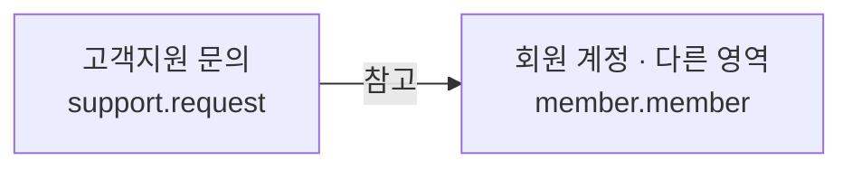

# 고객지원 시스템

## 문서 역할

- 역할: `설명`
- 문서 종류: `architecture`
- 충돌 시 우선 문서: 접근 권한은 [보안/접근통제 정책](../policy/security-access-control-policy.md), 데이터 분류·보관은 [데이터 거버넌스 정책](../policy/data-governance-policy.md)
- 기준 성격: `as-is`

고객센터 문의와 운영 답변의 저장 책임을 설명한다. 실시간 큐레이터 메시지는
[채팅 시스템](chat-system.md)이 소유한다.

## 논리 데이터 모델

- 도메인 ID: `support`

### 먼저 보는 그림

이 그림은 데이터가 어디에 속하고 무엇을 참고하는지 먼저 보여준다.
정확한 이름과 조건은 아래 상세 표를 따른다.

꼭 지킬 규칙:

- 처리 완료 상태에는 운영 답변 또는 종료 근거가 있어야 한다
- 문의와 답변에는 인증정보·결제 원문 등 불필요한 민감정보를 저장하지 않는다

<!-- markdownlint-disable MD046 -->

??? info "정확한 값과 조건 보기"

    ### 논리 엔티티

    | 논리 ID | 표시명 | 생명주기 역할 | 엔티티 형태 | 기록 역할 | 책임 | 최고 데이터 분류 | 생명주기 |
    | --- | --- | --- | --- | --- | --- | --- | --- |
    | `support.request` | 고객지원 문의 | root | entity | state | 회원 문의, 앱 버전, 답변과 처리 상태 | 민감 | CS 처리와 분쟁 대응 기간 동안 보존 후 정리 |

    ### 관계

    | 출발 논리 ID | 관계 역할 | 관계 유형 | 도착 논리 ID | 카디널리티 | 소유·삭제 규칙 |
    | --- | --- | --- | --- | --- | --- |
    | `support.request` | `requester` | references | `member.member` | N:1 | 회원 삭제 뒤 직접 식별정보를 비식별화할 수 있음 |

    ### 불변조건

    | 규칙 ID | 관련 논리 ID | 불변조건 | 기준 문서 |
    | --- | --- | --- | --- |
    | `SUPPORT-INV-001` | `support.request` | 처리 완료 상태에는 운영 답변 또는 종료 근거가 있어야 한다 | [데이터 거버넌스 정책](../policy/data-governance-policy.md) |
    | `SUPPORT-INV-002` | `support.request` | 문의와 답변에는 인증정보·결제 원문 등 불필요한 민감정보를 저장하지 않는다 | [데이터 거버넌스 정책](../policy/data-governance-policy.md) |

<!-- markdownlint-enable MD046 -->

## 관련 문서

- [채팅 시스템](chat-system.md)
- [보안/접근통제 정책](../policy/security-access-control-policy.md)
- [데이터 거버넌스 정책](../policy/data-governance-policy.md)
- [논리 데이터 모델 정책](../policy/logical-data-model-policy.md)
