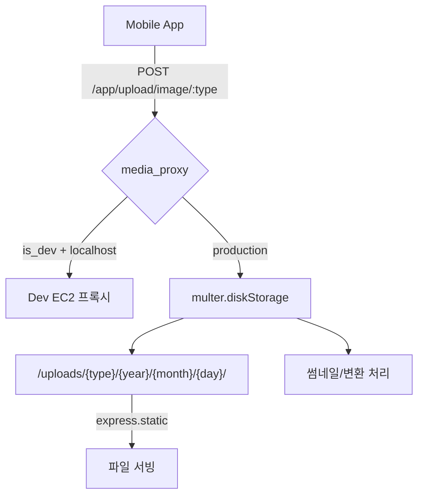
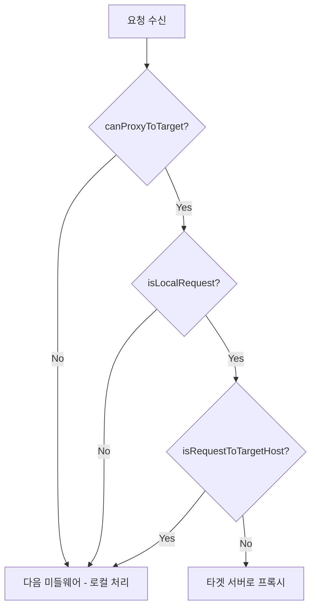

# 업로드/미디어 시스템

파일 업로드, 저장, 서빙의 전체 아키텍처와 로컬 개발 환경의 media_proxy 동작을 정리한 문서이다.

## 현행 아키텍처



- 모든 파일은 API 서버의 **로컬 디스크**에 저장된다 (S3 미사용)
- 로컬 개발 시 `media_proxy`가 업로드/다운로드를 Dev EC2로 프록시한다

## 업로드 엔드포인트

| 메서드 | 엔드포인트 | 설명 | multer 설정 |
| ------ | ----------------------------- | ------------ | ----------------------- |
| POST   | `/app/upload/image/:type`     | 단일 이미지   | `imageUpload.single('file')` |
| POST   | `/app/upload/images/:type`    | 다중 이미지   | `imageUpload.array('file')` |
| POST   | `/app/upload/video`           | 단일 비디오   | `videoUpload.single('file')` |
| POST   | `/admin/upload/image/:type`   | (관리자) 이미지 | `imageUpload.single('file')` |
| POST   | `/admin/upload/images/:type`  | (관리자) 다중  | `imageUpload.array('file')` |
| POST   | `/admin/upload/video`         | (관리자) 비디오 | `videoUpload.single('file')` |

- 모든 라우트에 `proxyUpload` 미들웨어가 multer보다 먼저 실행된다

## 저장 경로 구조

```
uploads/
├── image/{type}/{year}/{month}/{day}/
│   ├── image_1700000000000.jpg
│   └── image_1700000000000_thumb.jpg   ← 512x512 썸네일
├── video/{year}/{month}/{day}/
│   ├── video_1700000000000.MOV
│   └── video_1700000000000.jpg         ← 비디오 썸네일 (10초 프레임)
├── audio/{type}/{year}/{month}/{day}/
│   └── audio_1700000000000.mp3         ← 원본 → MP3 변환 (원본 삭제)
└── file/{type}/{year}/{month}/{day}/
    └── file_1700000000000.pdf
```

- `:type` 파라미터: `profile`, `lounge`, `auth` 등 용도별 서브디렉토리
- 파일명: `{prefix}_{timestamp}{ext}` 형식 (`getDir()` 함수로 경로 생성)

## 파일 타입별 처리

| 타입 | 후처리 | 라이브러리 | 비고 |
| ---- | ------ | ---------- | ---- |
| 이미지 | 512x512 리사이즈 → `_thumb` 파일 생성 | GraphicsMagick (gm) | |
| 비디오 | 10초 프레임 추출 → JPG 썸네일 | FFmpeg | 썸네일 실패 시 에러 응답 |
| 오디오 | 원본 → MP3 변환 후 원본 삭제 | FFmpeg | |
| 파일 | 없음 | - | |

## API 응답 형식

```json
{
  "result_code": 0,
  "result_data": {
    "image": "uploads/image/profile/2024/1/15/image_1700000000000.jpg"
  }
}
```

- `uploads/`로 시작하는 **상대경로**를 반환한다
- DB 저장 시 이 상대경로를 그대로 사용한다

## 파일 서빙

```typescript
// app.ts line 49 — 루트 정적 파일 (직접 접근)
app.use(express.static(path.join(__dirname, 'uploads')));

// app.ts line 57 — /uploads 경로 (proxyDownload 미들웨어 적용)
app.use('/uploads', proxyDownload, express.static(path.join(__dirname, 'uploads')));
```

## media_proxy 미들웨어

### 동작 원리



### 핵심 조건

| 조건 | 설명 |
| ---- | ---- |
| `canProxyToTarget` | 프록시 대상이 존재하고 localhost가 아닌 경우 |
| `isLocalRequest` | 요청 출처가 localhost, 127.x, 10.0.2.2(Android), 10.0.3.2(Genymotion) |
| `isRequestToTargetHost` | 요청이 이미 타겟 서버를 향하고 있는 경우 (무한 루프 방지) |

### 프록시 대상 결정

| `server.is_dev` | 프록시 대상 |
| --------------- | ---------- |
| `true` | `DEV_EC2_SERVER_URL` (하드코딩: `http://13.124.79.87:3002`) |
| `false` | `config.server.base_url` (운영 서버 URL) |

### 적용 범위

| 미들웨어 | 적용 위치 | 조건 |
| -------- | --------- | ---- |
| `proxyUpload` | 모든 upload 라우트 (multer 앞) | shouldProxyUpload |
| `proxyDownload` | `/uploads` 정적 파일 경로 | shouldProxyDownload + `/uploads/terms/` 제외 |

### 로컬 개발 제약

- `is_dev=true`일 때 localhost에서 오는 모든 업로드/다운로드 요청이 Dev EC2(`13.124.79.87:3002`)로 프록시된다
- 로컬 디스크에 파일이 저장되지 않는다 → **EC2 의존**
- Dev EC2 접근 불가 시 업로드/파일 서빙 불가 (502 응답)
- 이 구조는 개발 환경에서 파일 저장소를 공유하기 위한 임시 방편이다

## 설정

| 키 | 값 | 설명 |
| -- | -- | ---- |
| `server.is_dev` | `true`/`false` | true이면 DEV_EC2로 프록시 |
| `server.base_url` | URL | 운영환경 기준 URL |
| `DEV_EC2_SERVER_URL` | `http://13.124.79.87:3002` | 하드코딩된 개발 EC2 주소 |

## To-Be 방향: S3 직접 업로드

| 항목 | 현행 (As-Is) | 목표 (To-Be) |
| ---- | ------------ | ------------ |
| 업로드 | multer.diskStorage → 로컬 디스크 | multer-s3 → S3 직접 업로드 |
| 서빙 | express.static + media_proxy | CloudFront CDN |
| 썸네일 | GM/FFmpeg 서버 내 동기처리 | Lambda 비동기 처리 (선택) |
| 로컬 개발 | Dev EC2 프록시 필수 | S3 직접 접근 (media_proxy 제거) |

**핵심 목표**: API 서버는 비즈니스 로직만 담당하고, 파일 저장/서빙은 S3/CDN으로 관심사를 분리한다

## 관련 문서

- [레포지토리 요약](repo-overview.md)
- [기술 부채 정리](../technical-debt.md)

## 근거 (코드 기준)

- multer 스토리지: `coupler-api/lib/file.ts`
- 업로드 컨트롤러: `coupler-api/controller/upload.ts`
- 앱 라우터: `coupler-api/routes/app/v1/upload.ts`
- 관리자 라우터: `coupler-api/routes/admin/upload.ts`
- media_proxy 미들웨어: `coupler-api/middleware/media_proxy.ts`
- 정적 파일 서빙: `coupler-api/app.ts` (line 49, 57)
