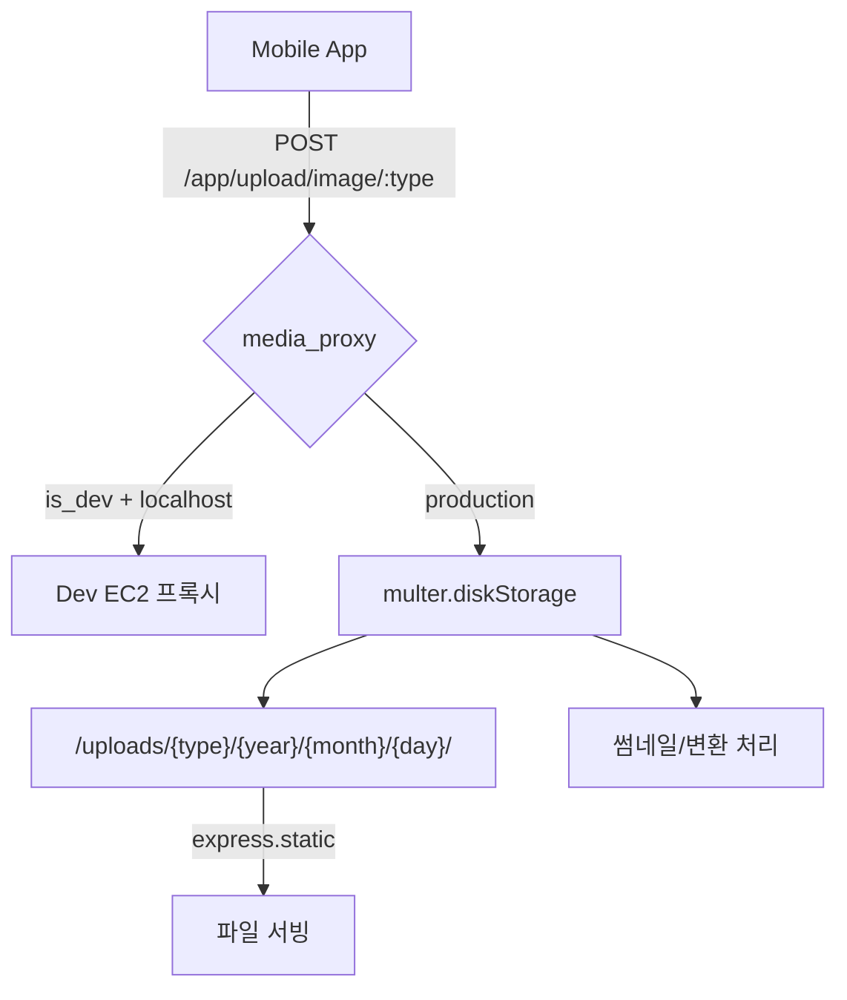
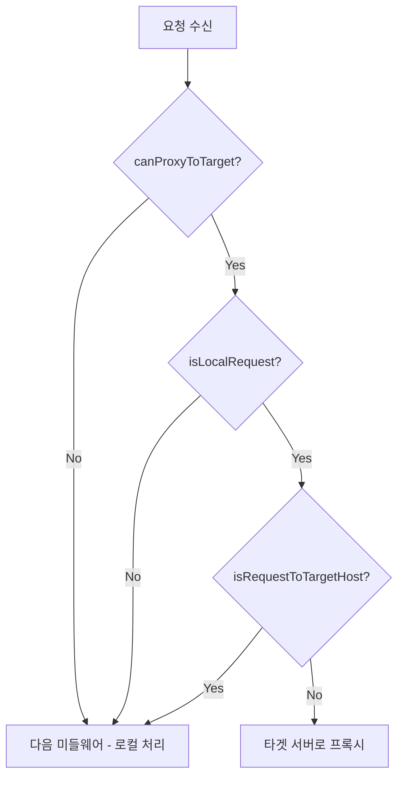

# 업로드/미디어 시스템

## 문서 역할

- 역할: `설명`
- 문서 종류: `architecture`
- 충돌 시 우선 문서: 이 문서
- 기준 성격: `as-is`

파일 업로드, 저장, 서빙의 전체 아키텍처와 로컬 개발 환경의 media_proxy 동작을 정리한 문서이다.
현재 범위에서는 업로드/미디어의 구조와 흐름 설명에 집중하며, 별도 규범 문서는 두지 않는다.

## 현행 아키텍처


```mermaid
flowchart TD
    A[Mobile App] -->|POST /app/upload/image/:type| B{media_proxy}
    B -->|"is_dev + localhost"| C[Dev EC2 프록시]
    B -->|production| D[multer.diskStorage]
    D --> E["/uploads/{type}/{year}/{month}/{day}/"]
    D --> F[썸네일/변환 처리]
    E -->|express.static| G[파일 서빙]
```

- 모든 파일은 API 서버의 **로컬 디스크**에 저장된다 (S3 미사용)
- 로컬 개발 시 `media_proxy`가 업로드/다운로드를 Dev EC2로 프록시한다

## 업로드 엔드포인트

| 메서드 | 엔드포인트                                 | 설명                                           | multer 설정                                          |
| ------ | ------------------------------------------ | ---------------------------------------------- | ---------------------------------------------------- |
| POST   | `/app/upload/image/:type`                  | 단일 이미지                                    | `imageUpload.single('file')`                         |
| POST   | `/app/upload/images/:type`                 | 다중 이미지                                    | `imageUpload.array('file')`                          |
| POST   | `/app/upload/video`                        | 단일 비디오                                    | `videoUpload.single('file')`                         |
| POST   | `/admin/upload/image/:type`                | (관리자) 이미지                                | `imageUpload.single('file')`                         |
| POST   | `/admin/upload/images/:type`               | (관리자) 다중                                  | `imageUpload.array('file')`                          |
| POST   | `/admin/upload/video`                      | (관리자) 비디오                                | `videoUpload.single('file')`                         |
| POST   | `/admin/manager/detail-profile/upload`     | (관리자) 긴 manager 상세 이미지 source 업로드  | `imageUpload.single('file')` 후 pending version 생성 |
| GET    | `/admin/manager/detail-profile/status/:id` | (관리자) 긴 manager 상세 이미지 처리 상태 조회 | worker 결과 polling                                  |

- 모든 라우트에 `proxyUpload` 미들웨어가 multer보다 먼저 실행된다
- `manager-detail` 긴 상세 포스터는 일반 `/admin/upload/image/:type`이 아니라 전용 `/admin/manager/detail-profile/upload`를 기준으로 처리한다

## 저장 경로 구조

```
uploads/
├── image/{type}/{year}/{month}/{day}/
│   ├── image_1700000000000.jpg
├── image/manager-detail-source/{year}/{month}/{day}/
│   └── image_1700000000000.png       ← 업로드 원본 보관
├── image/manager-detail-slice/{year}/{month}/{day}/
│   ├── image_1700000000000_slice_000.webp
│   └── image_1700000000000_slice_001.webp
├── video/{year}/{month}/{day}/
│   ├── video_1700000000000.MOV
│   └── video_1700000000000.jpg         ← 비디오 썸네일 (10초 프레임)
├── audio/{type}/{year}/{month}/{day}/
│   └── audio_1700000000000.mp3         ← 원본 → MP3 변환 (원본 삭제)
└── file/{type}/{year}/{month}/{day}/
    └── file_1700000000000.pdf
```

- `:type` 파라미터: `profile`, `lounge`, `auth` 등 용도별 서브디렉토리
- 파일명: `{prefix}_{timestamp}{ext}` 형식 (`getDir()` 함수로 경로 생성)

## 파일 타입별 처리

| 타입                   | 후처리                                                                               | 라이브러리          | 비고                                                                                      |
| ---------------------- | ------------------------------------------------------------------------------------ | ------------------- | ----------------------------------------------------------------------------------------- |
| 이미지                 | 기본: 원본 저장, `manager-list`는 `webp` 변환 + 최대 `720x1280` 최적화               | GraphicsMagick (gm) | `_thumb` 생성 없음                                                                        |
| 긴 manager 상세 이미지 | 원본 업로드 → pending version 생성 → background worker가 `manager-detail-slice` 생성 | GraphicsMagick (gm) | `target_width=1080`, `slice_height=2048`, `status=ready`일 때만 `detail_profile_set` 반환 |
| 비디오                 | 10초 프레임 추출 → JPG 썸네일                                                        | FFmpeg              | 썸네일 실패 시 에러 응답                                                                  |
| 오디오                 | 원본 → MP3 변환 후 원본 삭제                                                         | FFmpeg              |                                                                                           |
| 파일                   | 없음                                                                                 | -                   |                                                                                           |

## manager 상세 긴 이미지 구조

- Admin는 긴 세로 포스터를 `/admin/manager/detail-profile/upload`로 업로드한다.
- API는 업로드 요청에서 원본만 `manager-detail-source`로 옮기고 `pending` version row를 만든 뒤 즉시 응답한다.
- background worker가 원본에서 ordered slice N장을 직접 생성하고 `status=ready`가 되면 `detail_profile_set`이 조회 가능해진다.
- DB는 `t_manager.detail_profile_version_id`로 현재 활성 버전을 가리키고, 실제 slice 메타데이터는 `t_manager_detail_profile_version`, `t_manager_detail_profile_slice`에 저장한다. `t_manager.detail_profile` 레거시 컬럼은 2026-03-10 개발계 기준 제거 완료 상태다.
- `t_manager_detail_profile_version`의 source 메타데이터는 `source_image_path`, `source_width`, `source_height` 3개 컬럼으로 유지한다.
- `t_manager_detail_profile_version`은 `status(pending/processing/ready/failed/discarded)`와 `error_message`를 가지며, save는 `ready` version id만 허용한다.
- save에서 새 `detail_profile_version_id`를 attach하거나 `null`로 clear하면, 이전 활성 version은 `discarded`로 retire되고 source/slice 파일 cleanup 대상으로 넘긴다.
- Admin는 `status/:id` polling으로 완료 여부를 보고, `ready` 전에는 save를 막는다.
- Mobile 상세 화면은 `/app/manager/detail/:id`에서 `ready` 상태의 `detail_profile_set.slices`만 순서대로 렌더링하고, 선택 리스트에서는 상세 이미지를 preload하지 않는다.

### `detail_profile_set` 예시

```json
{
  "version_id": 31,
  "source_image_path": "uploads/image/manager-detail-source/2026/3/10/image_1700000000000.png",
  "source_width": 1170,
  "source_height": 30000,
  "target_width": 1080,
  "slice_height": 2048,
  "slice_count": 14,
  "total_bytes": 1842231,
  "slices": [
    {
      "index": 0,
      "image_url": "uploads/image/manager-detail-slice/2026/3/10/image_1700000000000_slice_000.webp",
      "width": 1080,
      "height": 2048,
      "byte_size": 164221
    }
  ]
}
```

## API 응답 형식

```json
{
  "result_code": 0,
  "result_data": {
    "image": "uploads/image/profile/2024/1/15/image_1700000000000.jpg"
  }
}
```

- `uploads/`로 시작하는 **상대경로**를 반환한다
- DB 저장 시 이 상대경로를 그대로 사용한다

## 파일 서빙

```typescript
// app.ts line 49 — 루트 정적 파일 (직접 접근)
app.use(express.static(path.join(__dirname, "uploads")));

// app.ts line 57 — /uploads 경로 (proxyDownload 미들웨어 적용)
app.use(
  "/uploads",
  proxyDownload,
  express.static(path.join(__dirname, "uploads")),
);
```

## media_proxy 미들웨어

### 동작 원리


```mermaid
flowchart TD
    A[요청 수신] --> B{canProxyToTarget?}
    B -->|No| C[다음 미들웨어 - 로컬 처리]
    B -->|Yes| D{isLocalRequest?}
    D -->|No| C
    D -->|Yes| E{isRequestToTargetHost?}
    E -->|Yes| C
    E -->|No| F[타겟 서버로 프록시]
```

### 핵심 조건

| 조건                    | 설명                                                                  |
| ----------------------- | --------------------------------------------------------------------- |
| `canProxyToTarget`      | 프록시 대상이 존재하고 localhost가 아닌 경우                          |
| `isLocalRequest`        | 요청 출처가 localhost, 127.x, 10.0.2.2(Android), 10.0.3.2(Genymotion) |
| `isRequestToTargetHost` | 요청이 이미 타겟 서버를 향하고 있는 경우 (무한 루프 방지)             |

### 프록시 대상 결정

| `server.is_dev` | 프록시 대상                                                |
| --------------- | ---------------------------------------------------------- |
| `true`          | `DEV_EC2_SERVER_URL` (하드코딩: `http://3.36.66.178:3002`) |
| `false`         | `config.server.base_url` (운영 서버 URL)                   |

### 적용 범위

| 미들웨어        | 적용 위치                      | 조건                                         |
| --------------- | ------------------------------ | -------------------------------------------- |
| `proxyUpload`   | 모든 upload 라우트 (multer 앞) | shouldProxyUpload                            |
| `proxyDownload` | `/uploads` 정적 파일 경로      | shouldProxyDownload + `/uploads/terms/` 제외 |

### 로컬 개발 제약

- `is_dev=true`일 때 localhost에서 오는 모든 업로드/다운로드 요청이 Dev EC2(`3.36.66.178:3002`)로 프록시된다
- 로컬 디스크에 파일이 저장되지 않는다 → **EC2 의존**
- Dev EC2 접근 불가 시 업로드/파일 서빙 불가 (502 응답)
- 긴 manager 상세 이미지는 전체 `master.webp`를 만들지 않고 원본에서 직접 slice를 생성해야 GM dimension limit에 걸리지 않는다
- 긴 manager 상세 이미지는 request thread에서 동기 후처리를 끝내면 dev EC2 worker를 묶어 timeout이 나므로, 업로드는 즉시 응답하고 slice 생성은 background worker로 분리해야 한다
- 이 구조는 개발 환경에서 파일 저장소를 공유하기 위한 임시 방편이다

## 설정

| 키                   | 값                        | 설명                      |
| -------------------- | ------------------------- | ------------------------- |
| `server.is_dev`      | `true`/`false`            | true이면 DEV_EC2로 프록시 |
| `server.base_url`    | URL                       | 운영환경 기준 URL         |
| `DEV_EC2_SERVER_URL` | `http://3.36.66.178:3002` | 하드코딩된 개발 EC2 주소  |

## To-Be 방향: S3 직접 업로드

| 항목      | 현행 (As-Is)                     | 목표 (To-Be)                    |
| --------- | -------------------------------- | ------------------------------- |
| 업로드    | multer.diskStorage → 로컬 디스크 | multer-s3 → S3 직접 업로드      |
| 서빙      | express.static + media_proxy     | CloudFront CDN                  |
| 썸네일    | GM/FFmpeg 서버 내 동기처리       | Lambda 비동기 처리 (선택)       |
| 로컬 개발 | Dev EC2 프록시 필수              | S3 직접 접근 (media_proxy 제거) |

**핵심 목표**: API 서버는 비즈니스 로직만 담당하고, 파일 저장/서빙은 S3/CDN으로 관심사를 분리한다

## 관련 문서

- [레포지토리 요약](repo-overview.md)
- [기술 부채 정리](../technical-debt/technical-debt.md)

## 운영 보정 (레거시 manager 이미지)

- 과거에 저장된 큰 `png/jpg` manager 이미지는 아래 스크립트로 일괄 변환/경로 갱신한다.

```bash
cd coupler-api
node -r ts-node/register/transpile-only scripts/migrate-manager-images-to-webp.ts --dry-run
node -r ts-node/register/transpile-only scripts/migrate-manager-images-to-webp.ts
```
