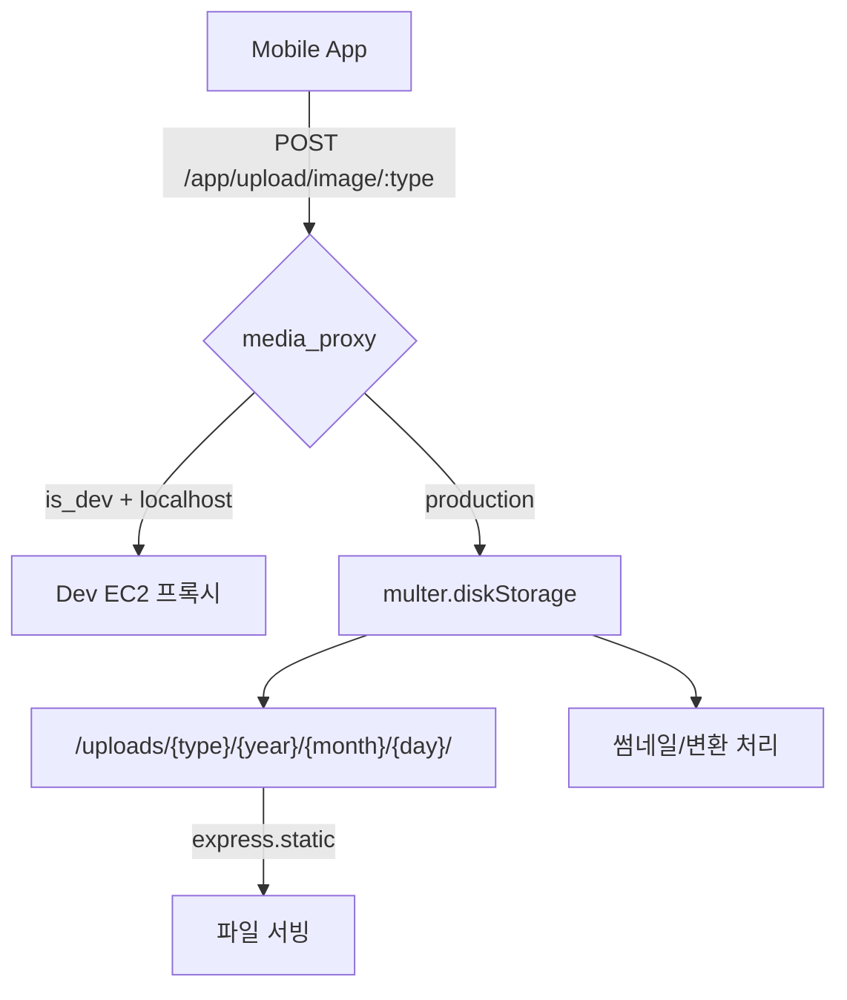
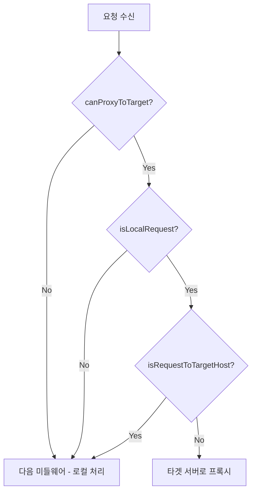

# 업로드/미디어 시스템

## 문서 역할

- 역할: `설명`
- 문서 종류: `architecture`
- 충돌 시 우선 문서: 업로드/미디어 구조는 이 문서, 실패 응답은 [API 에러 계약 정책](../policy/api-error-contract-policy.md), 회원 심사 미디어 선택/Crop 기준은 [회원 심사 단일 정책](../policy/member-review-policy.md)
- 기준 성격: `as-is`

파일 업로드, 저장, 서빙의 전체 아키텍처와 로컬 개발 환경의 media_proxy 동작을 정리한 문서이다.
현재 범위에서는 업로드/미디어의 구조와 흐름 설명에 집중하며, 별도 규범 문서는 두지 않는다.
실패 응답 계약은 [API 에러 계약 정책](../policy/api-error-contract-policy.md)을 따른다.

## 현행 아키텍처


```mermaid
flowchart TD
    A[Mobile App] -->|POST /app/upload/image/:type| B{media_proxy}
    B -->|"is_dev + localhost"| C[Dev EC2 프록시]
    B -->|production| D[multer.diskStorage]
    D --> E["/uploads/{type}/{year}/{month}/{day}/"]
    D --> F[썸네일/변환 처리]
    E -->|express.static| G[파일 서빙]
```

- 모든 파일은 API 서버의 **로컬 디스크**에 저장된다 (S3 미사용)
- 로컬 개발 시 `media_proxy`가 업로드/다운로드를 Dev EC2로 프록시한다

## 업로드 엔드포인트

| 메서드 | 엔드포인트                                 | 설명                                           | multer 설정                                          |
| ------ | ------------------------------------------ | ---------------------------------------------- | ---------------------------------------------------- |
| POST   | `/app/upload/image/:type`                  | 단일 이미지                                    | `imageUpload.single('file')`                         |
| POST   | `/app/upload/images/:type`                 | 다중 이미지                                    | `imageUpload.array('file')`                          |
| POST   | `/app/upload/video`                        | 단일 비디오                                    | `videoUpload.single('file')`                         |
| POST   | `/admin/upload/image/:type`                | (관리자) 이미지                                | `imageUpload.single('file')`                         |
| POST   | `/admin/upload/images/:type`               | (관리자) 다중                                  | `imageUpload.array('file')`                          |
| POST   | `/admin/upload/video`                      | (관리자) 비디오                                | `videoUpload.single('file')`                         |
| POST   | `/admin/manager/detail-profile/upload`     | (관리자) 긴 manager 상세 이미지 source 업로드  | `imageUpload.single('file')` 후 pending version 생성 |
| GET    | `/admin/manager/detail-profile/status/:id` | (관리자) 긴 manager 상세 이미지 처리 상태 조회 | worker 결과 polling                                  |

- 모든 라우트에 `proxyUpload` 미들웨어가 multer보다 먼저 실행된다
- `manager-detail` 긴 상세 포스터는 일반 `/admin/upload/image/:type`이 아니라 전용 `/admin/manager/detail-profile/upload`를 기준으로 처리한다

## 저장 경로 구조

```
uploads/
├── image/{type}/{year}/{month}/{day}/
│   ├── image_1700000000000_2f8b6f10-4de8-4c62-bf18-950e1f2c8030.jpg
├── image/manager-detail-source/{year}/{month}/{day}/
│   └── image_1700000000000.png       ← 업로드 원본 보관
├── image/manager-detail-slice/{year}/{month}/{day}/
│   ├── image_1700000000000_slice_000.webp
│   └── image_1700000000000_slice_001.webp
├── video/{year}/{month}/{day}/
│   ├── video_1700000000000.MOV
│   └── video_1700000000000.jpg         ← 비디오 썸네일 (10초 프레임)
├── audio/{type}/{year}/{month}/{day}/
│   └── audio_1700000000000.mp3         ← 원본 → MP3 변환 (원본 삭제)
└── file/{type}/{year}/{month}/{day}/
    └── file_1700000000000.pdf
```

- `:type` 파라미터: `profile`, `lounge`, `auth` 등 용도별 서브디렉토리
- 이미지 파일명: `image_{timestamp}_{uuid}{ext}` 형식으로 요청 내·동시 요청 간 basename 충돌을 방지한다.
- 비디오·오디오·일반 파일명은 기존 `{prefix}_{timestamp}{ext}` 형식을 유지한다 (`getDir()` 함수로 경로 생성).

## 파일 타입별 처리

| 타입 | 후처리 | 라이브러리 | 비고 |
| --- | --- | --- | --- |
| 전용 정책이 없는 이미지 | 실제 바이트가 HEIC/HEIF이면 Crop 없이 최대 `2560x2560`, 품질 90의 JPEG로 정규화하고, 그 외 포맷은 원본으로 저장 | GraphicsMagick + Sharp | 업로드 용도나 파일 확장자와 무관하게 실제 바이트를 판독하며 결과 경로는 `.jpg` |
| 인증 서류·큐레이터 이미지 | 모든 유효 이미지를 Crop 없이 최대 `2560x2560`, 품질 90의 JPEG로 정규화 | GraphicsMagick + Sharp | HEVC 기반 HEIC/HEIF는 HEIF 지원 `gm`으로 먼저 디코딩 |
| manager 목록 이미지 | 최대 `720x1280`, 품질 82의 WebP로 정규화 | Sharp (libvips) | `_thumb` 생성 없음 |
| 그룹 미팅 썸네일 | 최대 `1440x1440`, 품질 85의 WebP로 정규화 | Sharp (libvips) | 원본 비율 유지 |
| 긴 manager 상세 이미지 | 원본 업로드 → 대기 버전 생성 → background worker가 표시 조각 생성 | Sharp (libvips) | 변환이 끝난 버전만 조회 허용 |
| 비디오 | 10초 프레임 추출 → JPG 썸네일 | FFmpeg | 썸네일 실패 시 에러 응답 |
| 오디오 | 원본 → MP3 변환 후 원본 삭제 | FFmpeg | |
| 파일 | 없음 | - | |

썸네일/변환 실패 응답은 [API 에러 계약 정책](../policy/api-error-contract-policy.md)의 `ErrorData`를 사용한다.

## Mobile 사전 선택/Crop 경계

Mobile의 갤러리/카메라 선택과 Crop 여부는 업로드 API 호출 전 클라이언트 단계에서 결정된다.
회원 심사 제출 미디어의 규범 기준은 [회원 심사 단일 정책](../policy/member-review-policy.md)의 `Mobile 미디어 선택/Crop 정책`을 따른다.

| Mobile 제출 영역 | 업로드 전 처리 | 업로드 API |
| --- | --- | --- |
| 인증 서류 이미지 | Crop 없이 원본 비율 유지 | `/app/upload/image/auth` 또는 `/app/upload/images/auth` |
| 프로필 사진 | 정사각형 Crop 적용 | `/app/upload/image/profile` 또는 `/app/upload/images/profile` |
| 미니프로필 사진 | 정사각형 Crop 적용 | `/app/upload/image/profile` |
| 동영상 | Crop 없음 | `/app/upload/video` |

- 공용 `/app/upload/image(s)/:type` 및 `/admin/upload/image(s)/:type` 경로는 Mobile/Admin이 보낸 파일을 현재 업로드 타입(`profile`, `auth`, `lounge`, `concierge` 등)에 맞는 저장 경로에 저장하고 상대경로를 반환한다.
- 이 공용 이미지 업로드 경로는 클라이언트 확장자나 MIME이 아닌 실제 바이트 포맷을 기준으로 HEIC/HEIF 여부를 판독한다. 전용 이미지 정책이 없는 업로드도 HEIC/HEIF이면 원본 비율을 유지한 JPEG로 정규화한 뒤 `.jpg` 상대경로를 반환하며, 그 외 포맷은 기존 원본 저장 동작을 유지한다.
- `auth`와 `concierge`는 포맷과 무관하게 브라우저 호환 JPEG 정책을 적용한다. `manager-list`, `manager-detail`, 그룹 미팅 썸네일은 각 용도의 크기·출력 포맷 정책을 우선 적용한다.
- HEIC 디코딩 중간파일은 정적 서빙 경로 밖에서 처리하고, 변환 결과는 정적 서빙에서 제외되는 고유 숨김 파일에서 완성한다. 확장자가 바뀌는 결과는 기존 대상이 없을 때만 원자적으로 게시하며 대상이 이미 있으면 덮어쓰지 않고 실패한다.
- 교체와 원본 정리가 모두 성공한 경우에만 업로드 성공을 반환한다. 다중 업로드의 한 파일이라도 실패하면 완료 결과, 실패 파일과 아직 처리하지 않은 원본을 모두 롤백한다.
- API 서버는 시작 시 비식별 HEVC HEIC fixture를 `gm`으로 실제 디코딩해 decoder 가용성을 확인한다. Ubuntu/Debian의 모듈형 libheif 환경에는 `graphicsmagick`과 `libheif-plugin-libde265`가 모두 필요하며, 실제 디코딩에 실패하면 업로드를 받기 전에 서버 시작을 중단한다.
- Mobile에서 사용자가 선택을 취소하면 기존처럼 종료한다. 네이티브 선택기 오류, 선택 결과·Crop 결과 누락 또는 Crop 실패는 사용자 안내 팝업과 진단 로그를 남긴다. 운영 진단 로그에는 실패 위치와 native error code만 기록하고 native error 원문은 개발 환경에서만 확인한다.
- 정규화는 새 업로드에만 적용하며, 기존에 저장된 HEIC/HEIF 파일을 소급 변환하지 않는다.
- 서버는 인증 서류 이미지의 원본 비율 유지 여부를 별도 DB 상태로 저장하지 않는다.
- Crop 정책 변경은 Mobile 제출 전 처리 기준 변경이며, 업로드 엔드포인트/DB 저장 경로/심사 큐 라우팅 계약을 변경하지 않는다.

## manager 상세 긴 이미지 구조

- Admin는 긴 세로 포스터를 `/admin/manager/detail-profile/upload`로 업로드한다.
- 상세 이미지 데이터의 소유권과 생명주기는 [클럽매니저 시스템](club-manager-system.md)의
  `club-manager.detail-profile-version`, `club-manager.detail-profile-slice`를 따른다.
- API는 원본과 대기 버전을 만든 뒤 응답하고, background worker가 원본에서 표시 순서대로 조각을 생성한다.
- 변환이 끝난 버전만 저장·조회할 수 있으며 교체하거나 해제한 이전 버전은 원본·조각 정리 대상으로 넘긴다.
- Admin는 `status/:id` polling으로 완료 여부를 보고, `ready` 전에는 save를 막는다.
- Mobile 상세 화면은 완료된 조각만 순서대로 렌더링하고 선택 리스트에서는 상세 이미지를 preload하지 않는다.

## API 응답 형식

아래는 성공 응답 예시다.
실패 응답은 [API 에러 계약 정책](../policy/api-error-contract-policy.md)을 따른다.

```json
{
  "ok": true,
  "data": {
    "image": "uploads/image/profile/2024/1/15/image_1700000000000.jpg"
  }
}
```

- `uploads/`로 시작하는 **상대경로**를 반환한다
- DB 저장 시 이 상대경로를 그대로 사용한다

## 파일 서빙

```typescript
// coupler-api/app.ts — 루트 정적 파일 (직접 접근)
app.use(express.static(path.join(__dirname, "uploads")));

// coupler-api/app.ts — /uploads 경로 (proxyDownload 미들웨어 적용)
app.use(
  "/uploads",
  proxyDownload,
  express.static(path.join(__dirname, "uploads")),
);
```

## media_proxy 미들웨어

### 동작 원리


```mermaid
flowchart TD
    A[요청 수신] --> B{canProxyToTarget?}
    B -->|No| C[다음 미들웨어 - 로컬 처리]
    B -->|Yes| D{isLocalRequest?}
    D -->|No| C
    D -->|Yes| E{isRequestToTargetHost?}
    E -->|Yes| C
    E -->|No| F[타겟 서버로 프록시]
```

### 핵심 조건

| 조건                    | 설명                                                                  |
| ----------------------- | --------------------------------------------------------------------- |
| `canProxyToTarget`      | 프록시 대상이 존재하고 localhost가 아닌 경우                          |
| `isLocalRequest`        | 요청 출처가 localhost, 127.x, 10.0.2.2(Android), 10.0.3.2(Genymotion) |
| `isRequestToTargetHost` | 요청이 이미 타겟 서버를 향하고 있는 경우 (무한 루프 방지)             |

### 프록시 대상 결정

| `server.is_dev` | 프록시 대상                                                |
| --------------- | ---------------------------------------------------------- |
| `true`          | `DEV_EC2_SERVER_URL` (정확한 값은 private 구현에서 관리) |
| `false`         | `config.server.base_url` (운영 서버 URL)                   |

### 적용 범위

| 미들웨어        | 적용 위치                      | 조건                                         |
| --------------- | ------------------------------ | -------------------------------------------- |
| `proxyUpload`   | 모든 upload 라우트 (multer 앞) | shouldProxyUpload                            |
| `proxyDownload` | `/uploads` 정적 파일 경로      | shouldProxyDownload + `/uploads/terms/` 제외 |

### 로컬 개발 제약

- `is_dev=true`일 때 localhost에서 오는 모든 업로드/다운로드 요청이 private 구현에 설정된 Dev EC2로 프록시된다
- 로컬 디스크에 파일이 저장되지 않는다 → **EC2 의존**
- Dev EC2 접근 불가 시 업로드/파일 서빙 불가 (502 응답)
- media proxy 502 실패 응답은 API ErrorData taxonomy 밖의 transport/proxy 실패로 처리하며, HTTP 502와 proxy 실패 로그만 사용한다
- 긴 manager 상세 이미지는 전체 `master.webp`를 만들지 않고 원본에서 직접 slice를 생성해야 GM dimension limit에 걸리지 않는다
- 긴 manager 상세 이미지는 request thread에서 동기 후처리를 끝내면 dev EC2 worker를 묶어 timeout이 나므로, 업로드는 즉시 응답하고 slice 생성은 background worker로 분리해야 한다

## 설정

| 키                   | 값                        | 설명                      |
| -------------------- | ------------------------- | ------------------------- |
| `server.is_dev`      | `true`/`false`            | true이면 DEV_EC2로 프록시 |
| `server.base_url`    | URL                       | 운영환경 기준 URL         |
| `DEV_EC2_SERVER_URL` | private 구현 값            | 개발 EC2 origin           |

## 관련 문서

- [레포지토리 요약](repo-overview.md)
- [클럽매니저 시스템](club-manager-system.md)
- [기술 부채 정리](../technical-debt/technical-debt.md)
