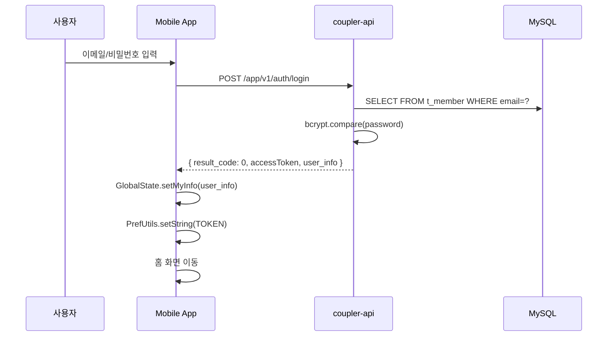

# 사용자 인증 플로우 (로그인)

## 개요

사용자가 모바일 앱에서 로그인하고 인증 토큰을 받는 플로우

## 플로우 다이어그램



## 단계별 설명

### Step 1: 사용자 입력

#### 관련 파일

- `screens/login/LoginScreen.js`


#### 입력 데이터

```javascript
{
  email: "user@example.com",
  password: "********"
}
```

### Step 2: API 요청

#### 요청

```
POST /app/v1/auth/login
Content-Type: application/json

{
  "email": "user@example.com",
  "pwd": "password",
  "fcm_token": "firebase_token",
  "os": 2,              // 1: Android, 2: iOS
  "version_code": "123",
  "version_name": "1.0.0"
}
```

#### 관련 파일

- `coupler-api/controller/app/v1/auth.js` → `login()`


### Step 3: API 응답

#### 성공 응답

```json
{
  "result_code": 0,
  "result_msg": "SUCCESS",
  "result_data": {
    "accessToken": "jwt_token_here",
    "id": 12345,
    "email": "user@example.com",
    "nickname": "닉네임",
    "gender": 1,
    "status": 1,
    "pending_status": 7,
    "pending_stage": "complete"
  }
}
```

### Step 4: 토큰 및 상태 저장

#### 관련 파일

- `mobx/GlobalState.js` → `setMyInfo()`
- `utils/PrefUtils.js`


#### 저장 데이터

```javascript
// PrefUtils (AsyncStorage)
PrefUtils.setString(ASYNC_PARAM.USER_EMAIL, email);
PrefUtils.setString(ASYNC_PARAM.USER_PASSWORD, password);
PrefUtils.setString(ASYNC_PARAM.LAST_LOGIN_PROVIDER, "email");

// GlobalState (MobX)
GlobalState.loginStatus.accessToken = accessToken;
GlobalState.setMyInfo(user_info);
```

### Step 5: 화면 분기

#### 분기 조건

| pending_stage   | 이동 화면                     |
| --------------- | ----------------------------- |
| `basic_info`    | SignupReviewScreen (심사대기) |
| `required_auth` | MatchingScreen (인증서류)     |
| `intro`         | MatchingScreen (소개글)       |
| `complete`      | HomeScreen (정상)             |

## 자동 로그인

### 앱 시작 시

```javascript
// 저장된 토큰 확인
const token = await PrefUtils.getString(ASYNC_PARAM.ACCESS_TOKEN);
if (token) {
  // 토큰 유효성 검증 API 호출
  const response = await requestGet(Net.auth.check);
  if (response.result_code === 0) {
    GlobalState.setMyInfo(response.result_data);
    // 홈 화면 이동
  } else {
    // 로그인 화면 이동
  }
}
```

## 소셜 로그인

### 지원 플랫폼

- 카카오
- 네이버
- 애플 (iOS)


### API

```
POST /app/v1/auth/login/social
{
  "provider": "kakao",
  "social_token": "kakao_access_token",
  "email": "user@kakao.com"
}
```

## 에러 처리

| result_code | 의미        | 처리                                       |
| ----------- | ----------- | ------------------------------------------ |
| 0           | 성공        | 화면 분기                                  |
| -1          | 인증 실패   | "이메일 또는 비밀번호가 올바르지 않습니다" |
| -2          | 차단된 회원 | LoginFailScreen 이동                       |
| -3          | 탈퇴한 회원 | "탈퇴한 계정입니다"                        |

## 관련 컴포넌트

### Mobile App

- `screens/login/LoginScreen.js`
- `mobx/GlobalState.js`
- `utils/APIUtils.js` → `Net.auth.login`
- `utils/PrefUtils.js`


### API

- `controller/app/v1/auth.js` → `login()`
- `routes/app/v1/auth.js`


## 보안 고려사항

1. **비밀번호 전송**

   - HTTPS 필수
   - 서버에서 bcrypt 해싱/검증

2. **토큰 저장**

   - AsyncStorage 사용
   - 앱 삭제 시 자동 제거

3. **세션 관리**

   - accessToken 만료 시 재로그인
   - 서버에서 강제 로그아웃 가능


## 관련 문서

- [사용자 등록 플로우](../cross-project/user-registration-flow.md)
- [회원 심사 FSM](../../architecture/member-review-fsm.md)
