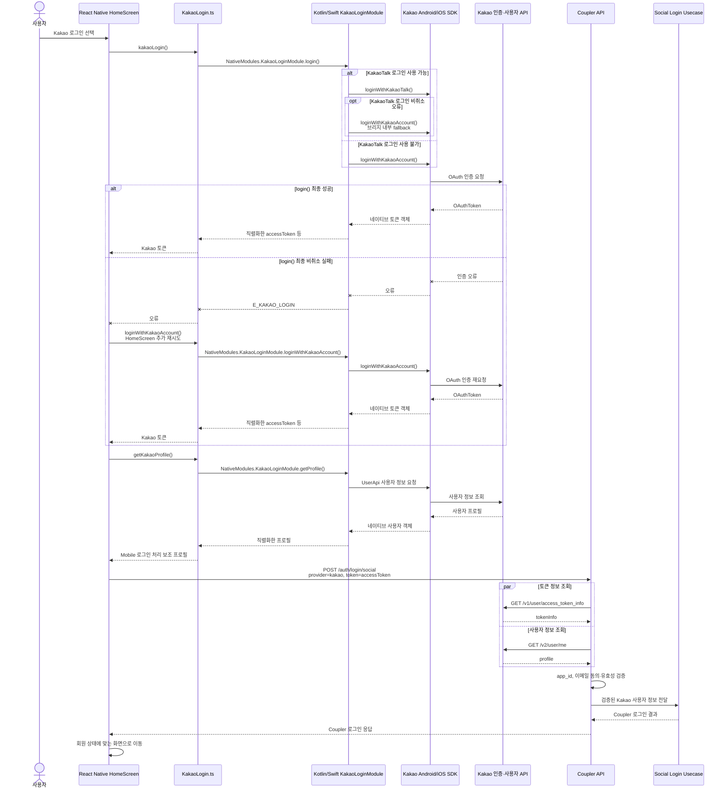

# Kakao 네이티브 로그인 플로우

## 문서 역할

- 역할: `시나리오`
- 문서 종류: `flow`
- 충돌 시 우선 문서: 응답 계약은 [API 공통 응답 계약 정책](../../policy/api-response-contract-policy.md)과 [API 에러 계약 정책](../../policy/api-error-contract-policy.md), 회원 상태는 [회원 심사 단일 정책](../../policy/member-review-policy.md)
- 기준 성격: `as-is`

## 목적

- Mobile의 Kakao 로그인 요청이 React Native 브리지와 Kakao 네이티브 SDK를 거쳐 Coupler API의 독립 검증으로 이어지는 현재 흐름을 설명한다.
- Kakao JavaScript SDK, React Native JavaScript 코드, Android/iOS 네이티브 SDK를 서로 다른 계층으로 구분한다.

## 범위

- 시작: 사용자가 Mobile에서 Kakao 로그인을 선택한다.
- 종료: Coupler API가 검증된 Kakao 사용자 정보로 소셜 로그인 유스케이스를 실행하고 Mobile이 로그인 응답을 처리한다.
- 포함: KakaoTalk 로그인, Kakao계정 fallback, 네이티브 브리지, Kakao 액세스 토큰 전달, Coupler API의 토큰·사용자 재조회.
- 제외: Kakao Talk Share, 웹 서비스의 Kakao JavaScript SDK, Google·Apple 로그인 세부 구현, 회원 심사 상태 규칙의 원문.

## 상위 규범 문서

- 클라이언트·서버 책임과 외부 SDK 경계는 [엔지니어링 가드레일](../../policy/engineering-guardrails.md)을 따른다.
- 로그인 성공·실패 envelope은 [API 공통 응답 계약 정책](../../policy/api-response-contract-policy.md)과 [API 에러 계약 정책](../../policy/api-error-contract-policy.md)을 따른다.
- 로그인 이후 회원 상태별 진입 제한은 [회원 심사 단일 정책](../../policy/member-review-policy.md)을 따른다.

## 액터와 책임

| 액터 | 책임 | 구현 근거 |
| --- | --- | --- |
| Mobile 화면 | 사용자 입력, 로그인 호출, Coupler API 요청과 응답 라우팅 | `coupler-mobile-app/src/screens/auth/HomeScreen.tsx` |
| React Native Kakao wrapper | `NativeModules.KakaoLoginModule` 호출과 브리지 결과 전달 | `coupler-mobile-app/src/utils/KakaoLogin.ts` |
| Android/iOS Kakao bridge | React Native 호출을 네이티브 Kakao SDK API로 변환 | `KakaoLoginModule.kt`, `KakaoLoginModule.swift` |
| Kakao Android/iOS SDK | KakaoTalk 또는 Kakao계정 OAuth 로그인, 토큰 발급·갱신, 사용자 API 호출 | Android Gradle dependency, iOS Kakao SDK dependency |
| Kakao 서버 | OAuth 인증, 액세스 토큰 정보와 사용자 정보 제공 | Kakao Login API |
| Coupler API | 외부 토큰 재검증, Kakao 앱 식별자 확인, 회원 로그인 유스케이스 실행 | `coupler-api/controller/app/v1/auth.ts` |

## SDK와 브리지 경계

| 구분 | 소유 | 의미 |
| --- | --- | --- |
| `KakaoLogin.ts` | Coupler | React Native에서 네이티브 모듈을 호출하는 JavaScript wrapper다. Kakao JavaScript SDK가 아니다. |
| `KakaoLoginModule.kt`, `KakaoLoginModule.swift` | Coupler | Android/iOS Kakao SDK를 React Native에 노출하는 커스텀 브리지다. |
| Kakao Android/iOS SDK | Kakao | Gradle 또는 iOS dependency manager로 설치하는 네이티브 라이브러리다. 실제 SDK 버전의 기준은 각 플랫폼 빌드 설정이다. |
| Kakao JavaScript SDK | Kakao | 브라우저에서 `<script>`와 `Kakao.init()`으로 사용하는 별도 제품군이다. 현재 Mobile 로그인 경로에는 포함되지 않는다. |
| Kakao REST API | Kakao | Coupler API가 전달받은 액세스 토큰을 독립 검증할 때 직접 호출한다. |

## 메인 흐름

- 브리지는 React Native 호출과 네이티브 SDK 응답을 변환할 뿐, Kakao 인증 서버나 Coupler 로그인 서버를 대체하지 않는다.
- Mobile의 프로필 조회는 로컬 처리용이며, Coupler API는 액세스 토큰으로 Kakao 사용자 정보를 독립적으로 다시 조회한다.
- Coupler 회원 로그인은 Kakao 토큰 발급이 아니라 서버의 앱 식별자·이메일 검증과 소셜 로그인 유스케이스 실행 이후에 완료된다.

## 신뢰 경계

- Kakao SDK 로그인 성공은 Kakao 토큰을 얻었다는 의미이며, Coupler 회원 로그인이 완료됐다는 의미가 아니다.
- Mobile이 받은 Kakao 액세스 토큰은 외부 입력이다. Coupler API는 토큰 정보와 사용자 정보를 Kakao 서버에서 다시 조회한 뒤 로그인 판단에 사용한다.
- Mobile의 `getProfile()` 결과는 로컬 로그인 처리 보조값이다. Coupler API의 Kakao 사용자 검증은 클라이언트가 전달한 프로필이 아니라 액세스 토큰으로 다시 조회한 Kakao 응답을 기준으로 한다.
- Kakao 앱 식별자 allowlist의 런타임 기준은 `coupler-api/config/default.json`의 `kakao.appIds`와 운영 config merge 결과다.

## 예외 흐름

- KakaoTalk 로그인을 사용할 수 없으면 Kakao계정 로그인으로 전환한다.
- KakaoTalk 로그인 비취소 오류는 브리지 내부에서 Kakao계정 로그인으로 전환한다. 이 시도까지 실패하면 `HomeScreen`이 Kakao계정 로그인을 한 번 더 호출하며, 추가 재시도도 실패하면 오류를 노출하고 Coupler API를 호출하지 않는다.
- 사용자가 인증을 취소하면 브리지는 `E_CANCELLED_OPERATION`을 반환하고 Mobile은 Coupler API를 호출하지 않는다.
- 네이티브 모듈이 없거나 액세스 토큰이 비어 있으면 Mobile은 오류를 노출하고 Coupler API를 호출하지 않는다.
- Mobile의 Kakao 프로필 보조 조회가 실패해도 액세스 토큰이 있으면 Coupler API 요청은 계속하며, 서버가 Kakao 사용자 정보를 독립적으로 다시 조회한다.
- Kakao 토큰이 무효하거나 Kakao 앱 식별자 또는 이메일 조건이 맞지 않으면 Coupler API가 로그인 실패로 처리한다.
- Kakao 검증은 성공했지만 Coupler 회원 상태가 로그인을 제한하면 회원 정책과 공통 실패 계약에 따라 응답한다.

## Kakao Developers JavaScript SDK 공지 영향

- 확인 기준일: `2026-07-14`
- 공식 공지의 지원 종료 대상은 JavaScript SDK `1.43.6` 이하이며, 해당 SDK를 통한 Kakao 로그인과 API 호출이 종료 이후 실패 처리된다.
- 현재 Kakao 로그인 경로는 Android/iOS 네이티브 SDK와 Kakao REST API를 사용하며 `kakao_js_sdk`, `Kakao.init()` 기반 JavaScript SDK를 로드하지 않는다.
- 따라서 해당 JavaScript SDK 지원 종료 공지는 현재 Mobile Kakao 로그인 경로에 직접 적용되지 않는다.
- 워크스페이스 밖의 별도 웹사이트, 랜딩 페이지 또는 CMS가 Kakao JavaScript SDK를 사용하면 그 서비스는 별도 점검 대상이다.

근거: [JavaScript SDK 1.43.6 버전 이하 지원 종료 예정](https://devtalk.kakao.com/t/javascript-sdk-1-43-6-end-of-support-for-javascript-sdk-version-1-43-6-and-below/149873), [Kakao Login REST API](https://developers.kakao.com/docs/ko/kakaologin/rest-api)

## 구현 근거

- Mobile SDK 설정
    - `coupler-mobile-app/android/app/build.gradle`
    - `coupler-mobile-app/ios/Podfile`
- Mobile wrapper와 브리지
    - `coupler-mobile-app/src/utils/KakaoLogin.ts`
    - `coupler-mobile-app/android/app/src/main/java/com/ritzy/fourhundred/KakaoLoginModule.kt`
    - `coupler-mobile-app/ios/ritzy/KakaoLoginModule.swift`
- Mobile 로그인 요청
    - `coupler-mobile-app/src/screens/auth/HomeScreen.tsx`
- API route와 검증
    - `coupler-api/routes/app/v1/auth.ts`
    - `coupler-api/controller/app/v1/auth.ts`
    - `coupler-api/lib/auth-login-usecase.ts`
    - `coupler-api/swagger/app/v1/auth.yaml`

## 비포함 / 금지

- 이 문서는 Kakao Talk Share의 실제 전송 완료 판정이나 웹훅 흐름을 설명하지 않는다.
- 회원 상태, 심사 상태, 재가입 제한을 이 문서에서 새로 정의하지 않는다.
- Kakao JavaScript SDK, Android SDK, iOS SDK의 버전 번호는 서로 다른 제품군이므로 숫자 크기로 호환성이나 공지 적용 여부를 비교하지 않는다.

## 관련 문서

- [레포지토리 요약](../../architecture/repo-overview.md)
- [회원 라이프사이클](../../architecture/member-lifecycle.md)
- [회원 심사 단일 정책](../../policy/member-review-policy.md)
- [기술 부채 정리](../../technical-debt/technical-debt.md)의 `Mobile Kakao 초대 완료 문구와 실제 전송 의미 불일치`
