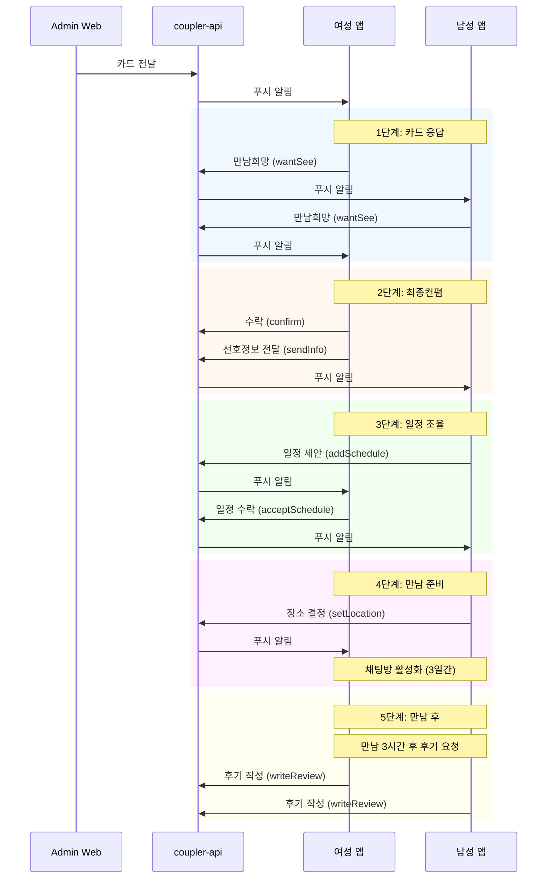
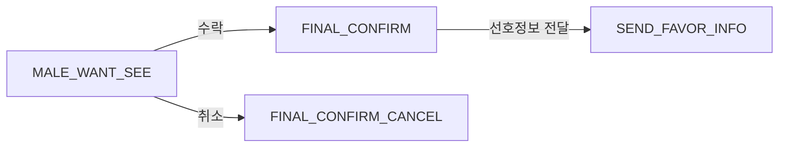

# 매칭 플로우

사용자가 매칭 카드를 받고 만남까지 진행하는 전체 플로우를 정리한 문서이다.

## 참여 시스템

- **coupler-mobile-app**: 사용자 인터페이스
- **coupler-api**: 비즈니스 로직, 상태 관리
- **coupler-admin-web**: 카드 전달, 큐레이터 제안

## 전체 플로우 다이어그램



## 단계별 상세

### 1단계: 카드 응답 (PENDING → MALE_WANT_SEE)

#### 여성 액션

| 액션 | API | 결과 상태 | 키 소진 |
|------|-----|----------|---------|
| 만남희망 | `POST /match/wantSee` | FEMALE_WANT_SEE (1) | -35 (프로필) |
| 패스 | `POST /match/pass` | FEMALE_PASS (-1) | -5 |
| 천천히 결정 | `POST /match/postpone` | PENDING (유지) | -5 |

#### 남성 액션

| 액션 | API | 결과 상태 | 키 소진 |
|------|-----|----------|---------|
| 만남희망 | `POST /match/wantSee` | MALE_WANT_SEE (2) | -200~450 |
| 패스 | `POST /match/pass` | MALE_PASS (-2) | 없음 (여성 환불) |
| 3일 채팅 | `POST /match/chat` | CHAT_OPEN (8) | -5 |

### 2단계: 최종컨펌 (MALE_WANT_SEE → SEND_FAVOR_INFO)

#### 여성 최종컨펌



- API: `POST /match/confirm`
- 취소 시 남성 키 전액 환불

#### 선호정보 전달

```javascript
// 요청 바디
{
  match_id: Number,
  location: String,  // 선호 지역
  food: String,      // 선호 음식
}
```

- API: `POST /match/sendInfo`

### 3단계: 일정 조율 (SEND_FAVOR_INFO → OK_SCHEDULE)

#### 일정 제안

```javascript
// 요청 바디
{
  match_id: Number,
  schedule_list: ['2024-01-15', '2024-01-16', ...],  // 4~7개
}
```

- API: `POST /match/addSchedule`
- 상세: [matching-schedule-algorithm.md](../../architecture/matching-schedule-algorithm.md)

#### 일정 수락

```javascript
// 요청 바디
{
  match_id: Number,
  schedule_id: Number,  // 선택한 일정 ID
}
```

- API: `POST /match/acceptSchedule`

### 4단계: 만남 준비 (OK_SCHEDULE → CHAT_OPEN)

#### 장소 결정

```javascript
// 요청 바디
{
  match_id: Number,
  location_name: String,
  location_address: String,
  location_lat: Number,
  location_lng: Number,
}
```

- API: `POST /match/setLocation`
- 카카오맵 API 활용: `GET /match/searchLocation`

#### 채팅

| API | 설명 |
|-----|------|
| `GET /match/chat/detail` | 채팅방 정보 |
| `GET /match/chat/list` | 메시지 목록 |
| `POST /match/chat/send` | 메시지 전송 |
| `POST /match/chat/leave` | 채팅방 나가기 |
| `POST /match/chat/changeSchedule` | 일정 변경 |

### 5단계: 만남 후 (CHAT_OPEN → REVIEW_REQUIRE)

#### 후기 작성

```javascript
// 요청 바디
{
  match_id: Number,
  rating: Number,       // 평점
  content: String,      // 후기 내용
  // 남성: 실물 비교
  // 여성: 만족도
}
```

- API: `POST /match/writeReview`
- 보상: +15 키

#### 후기 작성 후 옵션

| 액션 | API | 키 소진 |
|------|-----|---------|
| 연락처 공개 | `POST /match/sendContract` | 별도 |
| 직진만남 | `POST /match/sendDirect` | -77 |

## 모바일 앱 화면 구조

```
MatchingScreen
├── MatchingFragmentYou (맞춤 카드)
│   └── 카드 목록, 패스/만남희망
├── MatchingFragmentGoing (진행중)
│   └── 진행중인 매칭 목록
└── FinalMatchingScreen (최종 단계)
    ├── Fragment1: 선호정보 입력
    ├── Fragment2: 일정 제안/수락
    ├── Fragment3: 장소 결정
    └── Fragment4: 채팅
```

## 통화 기능

| API | 설명 |
|-----|------|
| `POST /match/call/request` | 통화 요청 |
| `POST /match/call/accept` | 통화 수락 |
| `POST /match/call/reject` | 통화 거절 |
| `POST /match/call/cancel` | 요청 취소 |
| `POST /match/call/end` | 통화 종료 |
| `GET /match/generateAgoraToken` | Agora 토큰 |

## 에러 코드

| result_code | 의미 | 처리 |
|-------------|------|------|
| 0 | 성공 | 다음 단계 |
| -1 | 키 부족 | 충전 안내 |
| -100 | 즉시 처리 필요 | 상태 갱신 |
| 기타 | 서버 오류 | 에러 메시지 |

## 관련 문서

- [matching-fsm.md](../../architecture/matching-fsm.md) - 상태 머신
- [matching-key-system.md](../../architecture/matching-key-system.md) - 키 시스템
- [matching-schedule-algorithm.md](../../architecture/matching-schedule-algorithm.md) - 일정 알고리즘

## 근거 (코드 기준)

- 모바일 화면: `coupler-mobile-app/src/screens/matching/`
- API 라우팅: `coupler-api/routes/app/v1/match.js`
- 매칭 로직: `coupler-api/controller/app/v1/match.js`
