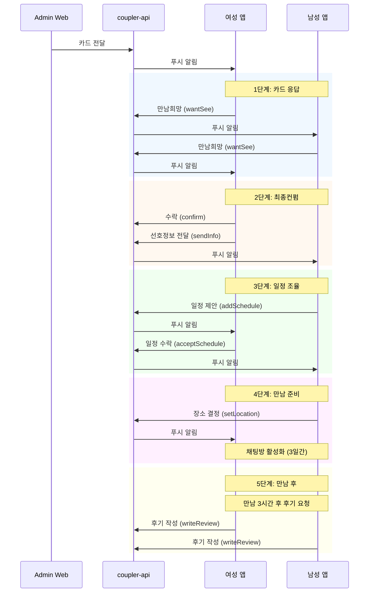
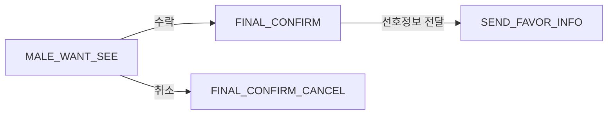

# 매칭 플로우

## 문서 역할

- 역할: `시나리오`
- 문서 종류: `flow`
- 충돌 시 우선 문서: [매칭 운영 정책](../../policy/matching-ops-policy.md)
- 기준 성격: `as-is`

사용자가 매칭 카드를 받고 만남까지 진행하는 전체 플로우를 정리한 문서이다.
상태값, 키 차감/환불, 일정 검증의 원문 SoT는 [매칭 운영 정책](../../policy/matching-ops-policy.md)을 따른다.
요청 예시는 흐름 이해용이며, 실제 wire field는 `coupler-api/swagger/app/v1/match.yaml`과 `coupler-api/controller/app/v1/match.ts`를 기준으로 본다.

## 참여 시스템

- **coupler-mobile-app**: 사용자 인터페이스
- **coupler-api**: 비즈니스 로직, 상태 관리
- **coupler-admin-web**: 카드 전달, 큐레이터 제안

## 전체 플로우 다이어그램


```mermaid
sequenceDiagram
    participant Admin as Admin Web
    participant API as coupler-api
    participant F as 여성 앱
    participant M as 남성 앱

    Admin->>API: 카드 전달
    API->>F: 푸시 알림

    rect rgb(240, 248, 255)
        Note over F,M: 1단계: 카드 응답
        F->>API: 만남희망 (wantSee)
        API->>M: 푸시 알림
        M->>API: 만남희망 (wantSee)
        API->>F: 푸시 알림
    end

    rect rgb(255, 248, 240)
        Note over F,M: 2단계: 최종컨펌
        F->>API: 수락 (confirm)
        F->>API: 선호정보 전달 (sendInfo)
        API->>M: 푸시 알림
    end

    rect rgb(240, 255, 240)
        Note over F,M: 3단계: 일정 조율
        M->>API: 일정 제안 (addSchedule)
        API->>F: 푸시 알림
        F->>API: 일정 수락 (acceptSchedule)
        API->>M: 푸시 알림
    end

    rect rgb(255, 240, 255)
        Note over F,M: 4단계: 만남 준비
        M->>API: 장소 결정 (setLocation)
        API->>F: 푸시 알림
        Note over F,M: 채팅방 활성화 (3일간)
    end

    rect rgb(255, 255, 240)
        Note over F,M: 5단계: 만남 후
        Note over F,M: 만남 3시간 후 후기 요청
        F->>API: 후기 작성 (writeReview)
        M->>API: 후기 작성 (writeReview)
    end
```

## 단계별 상세

### 1단계: 카드 응답 (`PENDING -> FEMALE_WANT_SEE -> MALE_WANT_SEE`)

#### 여성 액션

| 액션 | API | 결과 상태 | 비고 |
|------|-----|----------|------|
| 만남희망 | `POST /match/wantSee` | FEMALE_WANT_SEE (1) | 키 차감 기준은 정책 문서 참조 |
| 패스 | `POST /match/pass` | FEMALE_PASS (-1) | 키 차감/환불 기준은 정책 문서 참조 |
| 천천히 결정 | `POST /match/postpone` | PENDING (유지) | 키 차감 기준은 정책 문서 참조 |

#### 남성 액션

| 액션 | API | 결과 상태 | 비고 |
|------|-----|----------|------|
| 만남희망 | `POST /match/wantSee` | MALE_WANT_SEE (2) | 등급별 키 차감 기준은 정책 문서 참조 |
| 패스 | `POST /match/pass` | MALE_PASS (-2) | 환불 기준은 정책 문서 참조 |
| 3일 채팅 | `POST /match/chat` | CHAT_OPEN (8) | 키 차감 기준은 정책 문서 참조 |

### 2단계: 최종컨펌 (MALE_WANT_SEE → SEND_FAVOR_INFO)

#### 여성 최종컨펌


```mermaid
flowchart LR
    A[MALE_WANT_SEE] -->|수락| B[FINAL_CONFIRM]
    A -->|취소| C[FINAL_CONFIRM_CANCEL]
    B -->|선호정보 전달| D[SEND_FAVOR_INFO]
```

- API: `POST /match/confirm`
- 취소 시 환불 기준은 [매칭 운영 정책](../../policy/matching-ops-policy.md)을 따른다.

#### 선호정보 전달

```javascript
// 요청 바디
{
  match: Number,
  location: String,  // 선호 지역
  meal: String,      // 선호 음식
}
```

- API: `POST /match/sendInfo`

### 3단계: 일정 조율 (SEND_FAVOR_INFO → OK_SCHEDULE)

#### 일정 제안

```javascript
// 요청 바디
{
  match: Number,
  schedule: 'YYYY-MM-DD,YYYY-MM-DD,...',
}
```

- API: `POST /match/addSchedule`
- 허용 개수/중복/범위/응답 만료 기준: [매칭 운영 정책](../../policy/matching-ops-policy.md)
- 시퀀스 상세: [matching-schedule-algorithm.md](../../architecture/matching-schedule-algorithm.md)

#### 일정 수락

```javascript
// 요청 바디
{
  id: Number,  // 선택한 일정 ID
}
```

- API: `POST /match/acceptSchedule`

### 4단계: 만남 준비 (OK_SCHEDULE → CHAT_OPEN)

#### 장소 결정

```javascript
// 요청 바디
{
  match: Number,
  location: String,
  address: String,
}
```

- API: `POST /match/setLocation`
- 카카오맵 API 활용: `GET /match/searchLocation`

#### 채팅

| API | 설명 |
|-----|------|
| `GET /match/chat/detail` | 채팅방 정보 |
| `GET /match/chat/list` | 메시지 목록 |
| `POST /match/chat/send` | 메시지 전송 |
| `POST /match/chat/leave` | 채팅방 나가기 |
| `POST /match/chat/changeSchedule` | 일정 변경 |

### 5단계: 만남 후 (CHAT_OPEN → REVIEW_REQUIRE)

#### 후기 작성

```javascript
// 요청 바디
{
  match: Number,
  meet: 'Y' | 'N',
  look: Number,
  difficult: 'Y' | 'N',
  happy: 'Y' | 'N',
  comment: String,
}
```

- API: `POST /match/writeReview`
- 보상 기준은 [매칭 운영 정책](../../policy/matching-ops-policy.md)을 따른다.

#### 후기 작성 후 옵션

| 액션 | API | 비고 |
|------|-----|------|
| 연락처 공개 | `POST /match/sendContract` | 추가 조건/보상은 정책 문서 참조 |
| 직진만남 | `POST /match/sendDirect` | 키 차감 기준은 정책 문서 참조 |

## 모바일 앱 화면 구조

```
MatchingScreen
├── MatchingFragmentYou (맞춤 카드)
│   └── 카드 목록, 패스/만남희망
├── MatchingFragmentGoing (진행중)
│   └── 진행중인 매칭 목록
└── FinalMatchingScreen (최종 단계)
    ├── Fragment1: 선호정보 입력
    ├── Fragment2: 일정 제안/수락
    ├── Fragment3: 장소 결정
    └── Fragment4: 채팅
```

## 통화 기능

| API | 설명 |
|-----|------|
| `POST /match/call/request` | 통화 요청 |
| `POST /match/call/accept` | 통화 수락 |
| `POST /match/call/reject` | 통화 거절 |
| `POST /match/call/cancel` | 요청 취소 |
| `POST /match/call/end` | 통화 종료 |
| `GET /match/generateLiveKitToken` | 수락된 활성 통화의 LiveKit 참가 정보(`server_url`, `participant_token`) |

LiveKit 참가 토큰은 해당 매칭 참여자이고 매칭 상태가 `CHAT_OPEN`이며, 최신 통화 요청이 수락된 활성 상태일 때만 발급한다. 토큰은 해당 매칭 room의 마이크 publish와 subscribe만 허용하고 유효기간은 1시간으로 제한한다.

보이스콜은 LiveKit 단일 경로만 사용하고 구 provider endpoint·SDK·서버 토큰 의존성을 유지하지 않는다. 기능이 비활성인 동안 API `voice_call.enabled=false`로 신규 통화 요청, 수락, 토큰 발급을 차단한다. LiveKit 적용 Mobile Store binary와 운영 설정을 검증한 뒤 `voice_call.enabled=true`로 바꿔 재개한다. 거절·취소·종료 API는 남은 통화 상태를 정리할 수 있도록 유지한다.

| 클라이언트 경계 | 오디오 세션 규칙 |
|-----------------|------------------|
| 앱 시작, 통화 요청, 벨 울림, 거절, 취소 | 오디오 세션을 활성화하지 않고 외부 재생 오디오를 변경하지 않는다. |
| 통화 수락 후 LiveKit room 연결 직전 | 오디오 세션과 마이크를 활성화한다. iOS는 다른 오디오와 혼합하지 않아 통화 중 외부 음악을 중단한다. |
| 통화 종료, 상대 퇴장, 연결 실패, 화면 이탈 | 마이크 비활성화, room disconnect, 오디오 세션 중지를 수행해 외부 오디오가 재개될 수 있게 한다. |

## 관련 문서

- [matching-fsm.md](../../architecture/matching-fsm.md) - 상태 머신
- [matching-key-system.md](../../architecture/matching-key-system.md) - 키 시스템
- [matching-schedule-algorithm.md](../../architecture/matching-schedule-algorithm.md) - 일정 알고리즘
- [api-error-contract-policy.md](../../policy/api-error-contract-policy.md) - 공통 실패 ErrorData 계약
