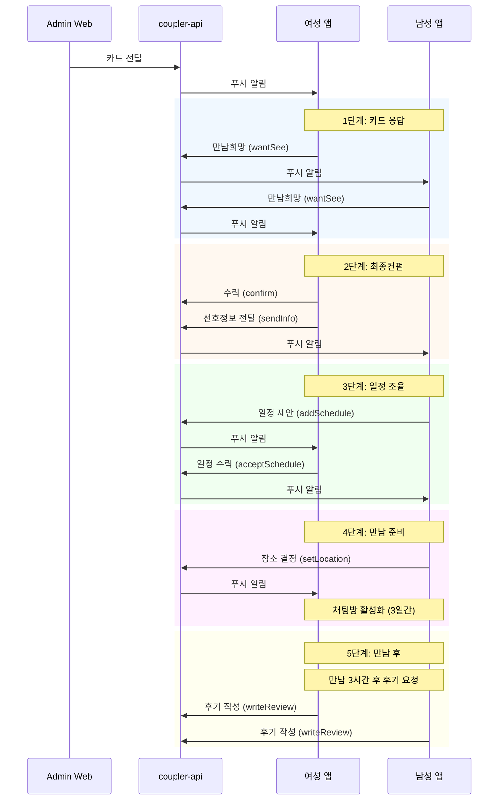
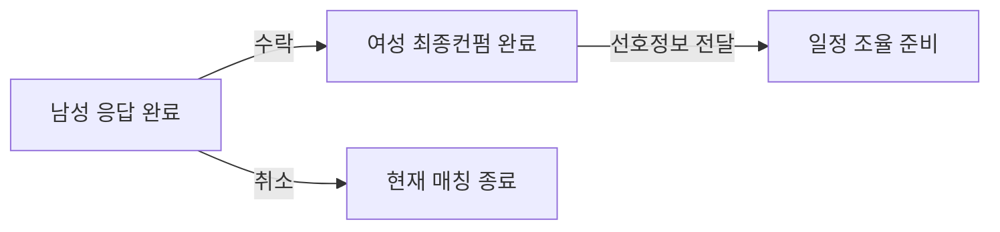

# 매칭 플로우

## 문서 역할

- 역할: `시나리오`
- 문서 종류: `flow`
- 충돌 시 우선 문서: [매칭 운영 정책](../../policy/matching-ops-policy.md)
- 기준 성격: `as-is`

사용자가 매칭 카드를 받고 만남까지 진행하는 전체 플로우를 정리한 문서이다.
상태값, 키 차감/환불, 일정 검증의 원문 SoT는 [매칭 운영 정책](../../policy/matching-ops-policy.md)을 따른다.
단계별 입력은 흐름 이해에 필요한 의미만 설명한다. 실제 wire field는
`coupler-api/swagger/app/v1/match.yaml`과 `coupler-api/controller/app/v1/match.ts`를 기준으로 본다.

## 참여 시스템

- **coupler-mobile-app**: 사용자 인터페이스
- **coupler-api**: 비즈니스 로직, 상태 관리
- **coupler-admin-web**: 카드 전달, 큐레이터 제안

## 전체 플로우 다이어그램


```mermaid
sequenceDiagram
    participant Admin as Admin Web
    participant API as coupler-api
    participant F as 여성 앱
    participant M as 남성 앱

    Admin->>API: 카드 전달
    API->>F: 푸시 알림

    rect rgb(240, 248, 255)
        Note over F,M: 1단계: 카드 응답
        F->>API: 만남희망 (wantSee)
        API->>M: 푸시 알림
        M->>API: 만남희망 (wantSee)
        API->>F: 푸시 알림
    end

    rect rgb(255, 248, 240)
        Note over F,M: 2단계: 최종컨펌
        F->>API: 수락 (confirm)
        F->>API: 선호정보 전달 (sendInfo)
        API->>M: 푸시 알림
    end

    rect rgb(240, 255, 240)
        Note over F,M: 3단계: 일정 조율
        M->>API: 일정 제안 (addSchedule)
        API->>F: 푸시 알림
        F->>API: 일정 수락 (acceptSchedule)
        API->>M: 푸시 알림
    end

    rect rgb(255, 240, 255)
        Note over F,M: 4단계: 만남 준비
        M->>API: 장소 결정 (setLocation)
        API->>F: 푸시 알림
        Note over F,M: 채팅방 활성화 (3일간)
    end

    rect rgb(255, 255, 240)
        Note over F,M: 5단계: 만남 후
        Note over F,M: 만남 3시간 후 후기 요청
        F->>API: 후기 작성 (writeReview)
        M->>API: 후기 작성 (writeReview)
    end
```

## 단계별 상세

### 1단계: 카드 응답

#### 여성 액션

| 액션 | API | 흐름 결과 | 비고 |
|------|-----|----------|------|
| 만남희망 | `POST /match/wantSee` | 남성 응답 단계로 진행 | 키 차감 기준은 정책 문서 참조 |
| 패스 | `POST /match/pass` | 현재 매칭 종료 | 키 차감/환불 기준은 정책 문서 참조 |
| 천천히 결정 | `POST /match/postpone` | 카드 응답 단계 유지 | 키 차감 기준은 정책 문서 참조 |

#### 남성 액션

| 액션 | API | 흐름 결과 | 비고 |
|------|-----|----------|------|
| 만남희망 | `POST /match/wantSee` | 여성 최종컨펌 단계로 진행 | 등급별 키 차감 기준은 정책 문서 참조 |
| 패스 | `POST /match/pass` | 현재 매칭 종료 | 환불 기준은 정책 문서 참조 |
| 3일 채팅 | `POST /match/chat` | 채팅 단계로 바로 진행 | 키 차감 기준은 정책 문서 참조 |

### 2단계: 최종컨펌

#### 여성 최종컨펌


```mermaid
flowchart LR
    A[남성 응답 완료] -->|수락| B[여성 최종컨펌 완료]
    A -->|취소| C[현재 매칭 종료]
    B -->|선호정보 전달| D[일정 조율 준비]
```

- API: `POST /match/confirm`
- 취소 시 환불 기준은 [매칭 운영 정책](../../policy/matching-ops-policy.md)을 따른다.

#### 선호정보 전달

- 입력 의미: 대상 매칭, 선호 지역, 선호 음식
- API: `POST /match/sendInfo`

### 3단계: 일정 조율

#### 일정 제안

- 입력 의미: 대상 매칭과 제안 일정 후보
- API: `POST /match/addSchedule`
- 허용 개수/중복/범위/응답 만료 기준: [매칭 운영 정책](../../policy/matching-ops-policy.md)
- 시퀀스 상세: [matching-schedule-algorithm.md](../../architecture/matching-schedule-algorithm.md)

#### 일정 수락

- 입력 의미: 선택한 일정
- API: `POST /match/acceptSchedule`

### 4단계: 만남 준비

#### 장소 결정

- 입력 의미: 대상 매칭과 만남 장소
- API: `POST /match/setLocation`
- 카카오맵 API 활용: `GET /match/searchLocation`

#### 채팅

| API | 설명 |
|-----|------|
| `GET /match/chat/detail` | 채팅방 정보 |
| `GET /match/chat/messages` | 읽기 전용 cursor 메시지 목록 |
| `POST /match/chat/read` | 상대방 발신 메시지의 명시적 읽음 경계 갱신 |
| `POST /match/chat/send` | 메시지 전송 |
| `POST /match/chat/leave` | 채팅방 나가기 |
| `POST /match/chat/changeSchedule` | 일정 변경 |

### 5단계: 만남 후

#### 후기 작성

- 입력 의미: 대상 매칭, 만남 여부와 후기
- API: `POST /match/writeReview`
- 보상 기준은 [매칭 운영 정책](../../policy/matching-ops-policy.md)을 따른다.

#### 후기 작성 후 옵션

| 액션 | API | 비고 |
|------|-----|------|
| 연락처 공개 | `POST /match/sendContract` | 추가 조건/보상은 정책 문서 참조 |
| 직진만남 | `POST /match/sendDirect` | 키 차감 기준은 정책 문서 참조 |

## 모바일 앱 화면 구조

```
MatchingScreen
├── MatchingFragmentYou (맞춤 카드)
│   └── 카드 목록, 패스/만남희망
├── MatchingFragmentGoing (진행중)
│   └── 진행중인 매칭 목록
└── FinalMatchingScreen (최종 단계)
    ├── Fragment1: 선호정보 입력
    ├── Fragment2: 일정 제안/수락
    ├── Fragment3: 장소 결정
    └── Fragment4: 채팅
```

## 통화 기능

| API | 설명 |
|-----|------|
| `POST /match/call/request` | 통화 요청 |
| `POST /match/call/accept` | 통화 수락 |
| `POST /match/call/reject` | 통화 거절 |
| `POST /match/call/cancel` | 요청 취소 |
| `POST /match/call/end` | 통화 종료 |
| `GET /match/generateAgoraToken` | Agora 토큰 |

## 관련 문서

- [matching-fsm.md](../../architecture/matching-fsm.md) - 상태 머신
- [matching-key-system.md](../../architecture/matching-key-system.md) - 키 시스템
- [matching-schedule-algorithm.md](../../architecture/matching-schedule-algorithm.md) - 일정 알고리즘
- [api-error-contract-policy.md](../../policy/api-error-contract-policy.md) - 공통 실패 ErrorData 계약
