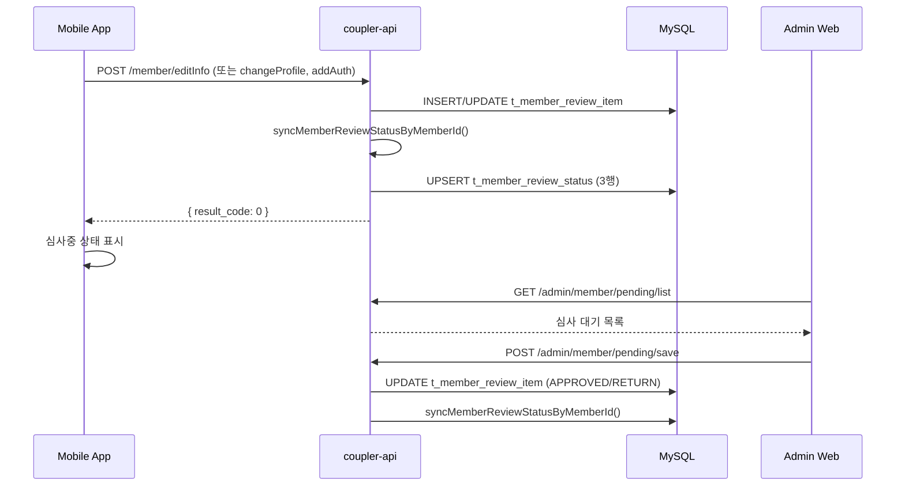

# 프로필 관리 플로우

회원가입 이후 프로필 정보를 수정하고, 변경된 항목이 재심사 주기를 거치는 전체 플로우를 정리한 문서이다.

## 참여 시스템

- **coupler-mobile-app**: 프로필 수정 화면
- **coupler-api**: 심사항목 생성 및 상태 동기화
- **coupler-admin-web**: 변경된 항목 심사

## 화면 구조 (Mobile App)

```
SettingScreen
├── 매칭 프로필
│   ├── ModifyMainTypeScreen → ModifyMainInfoScreen
│   │   ├── type=1: 기본정보 (직업, 지역, 학력, 키, 체형 등)
│   │   ├── type=2: SNS (instagram, youtube, sns_id)
│   │   └── type=3: 소개글 (about_me, intro)
│   ├── ProfileImageScreen (실물사진/동영상)
│   └── ModifyTasteInfoScreen (I Want / I Am / Q&A)
├── 인증관리
│   ├── RecommendationScreen (지인추천)
│   └── ModifyAuthScreen (인증서류)
└── 계정설정
    ├── ChangePasswordScreen
    ├── SleepScreen
    └── SignOutScreen
```

## 프로필 수정 → 재심사 플로우



## API 엔드포인트

| 메서드 | 엔드포인트 | 설명 | 심사 발생 |
| ------ | ---------------------- | ---------------------- | --------- |
| POST   | `/member/editInfo`     | 기본정보/SNS/소개글 수정 | O         |
| POST   | `/member/changeProfile`| 프로필 사진/동영상 수정   | O         |
| POST   | `/member/addAuth`      | 인증서류 추가/변경        | O         |
| POST   | `/member/editFavorInfo`| 취향/선호 정보 수정       | X (직접 반영) |
| GET    | `/member/getProfileInfo`| 현재/심사중 프로필 조회  | -         |
| POST   | `/member/changePwd`    | 비밀번호 변경            | X         |
| POST   | `/member/sleep`        | 휴면 설정/해제           | X         |
| POST   | `/member/leave`        | 탈퇴                    | X         |

## 심사 트리거 메커니즘

### editInfo

1. 요청 본문에서 변경 필드를 추출 (`job`, `location`, `school` 등 16개 필드)
2. 기존 `t_member_review_item` 조회
3. 필드별 비교:
   - 변경값 ≠ 현재값 → INSERT (신규) 또는 UPDATE (기존 RETURN → REAPPLY 자동전환)
   - 변경값 = 현재값 → 기존 심사항목 DELETE
4. `appeal_extra`는 심사 없이 `t_member`에 직접 반영
5. `submit_target='intro'`일 때는 `about_me`, `intro`만 제출 (이미 심사중이면 차단)
6. `syncMemberReviewStatusByMemberId()` 호출

### changeProfile

1. `profile_image_paths` 배열과 현재 이미지 비교
2. 변경 감지 시 `t_member_profile_version` UPSERT (status=PENDING 또는 REAPPLY)
3. 이미지별 개별 status 관리 (`buildImageStatusList`)
4. 여성회원: 비디오 별도 `video_url`/`video_status` 관리
5. 이미 PENDING/REAPPLY인 프로필이 있으면 수정 차단 (RETURN만 재제출 가능)
6. `syncMemberReviewStatusByMemberId()` 호출

### addAuth

1. `auth` 배열 (type + images)을 파싱
2. 매니저 필수 인증 조건 확인 (`buildManagerRequiredAuth`)
3. 기존 `t_member_auth` 조회 후 type별 비교
4. 트랜잭션 내에서 INSERT/UPDATE/DELETE 처리
5. RETURN → REAPPLY 자동 전환
6. `syncMemberReviewStatusByMemberId()` 호출

## 상태 흐름

```
프로필 수정 제출
    ↓
[PENDING/REAPPLY] t_member_review_item / t_member_profile_version / t_member_auth
    ↓ syncMemberReviewStatusByMemberId()
[t_member_review_status 갱신] BASIC_INFO / REQUIRED_AUTH / INTRO
    ↓ (관리자 심사)
[APPROVED] → v_member_review_status에 반영
[RETURN] → 앱에서 반려 항목 표시, 재수정 유도 (REAPPLY로 재제출)
```

상세 심사 상태 전이는 [회원 심사 FSM](../../architecture/member-review-fsm.md) 참조

## 계정 생명주기

| 기능 | API | 설명 |
| ---- | --- | ---- |
| 비밀번호 변경 | `POST /member/changePwd` | bcrypt 비교 후 갱신 |
| 휴면 | `POST /member/sleep` | 토글 방식 |
| 탈퇴 | `POST /member/leave` | status=LEAVE(-3), 14일 후 재가입 가능 |

상세 상태 전이는 [회원 생명주기](../../architecture/member-lifecycle.md) 참조

## 관련 문서

- [회원 심사 FSM](../../architecture/member-review-fsm.md)
- [회원 생명주기](../../architecture/member-lifecycle.md)
- [사용자 등록 플로우](user-registration-flow.md)

## 근거 (코드 기준)

- 설정 화면: `coupler-mobile-app/src/screens/setting/SettingScreen.js`
- 기본정보 수정: `coupler-mobile-app/src/screens/setting/ModifyMainInfoScreen.js`
- 프로필 사진: `coupler-mobile-app/src/screens/setting/ProfileImageScreen.tsx`
- 인증 서류: `coupler-mobile-app/src/screens/setting/ModifyAuthScreen.js`
- API 라우터: `coupler-api/routes/app/v1/member.ts`
- 회원 컨트롤러: `coupler-api/controller/app/v1/member.ts`
- 심사 상태 동기화: `coupler-api/lib/member-review-status.ts`
