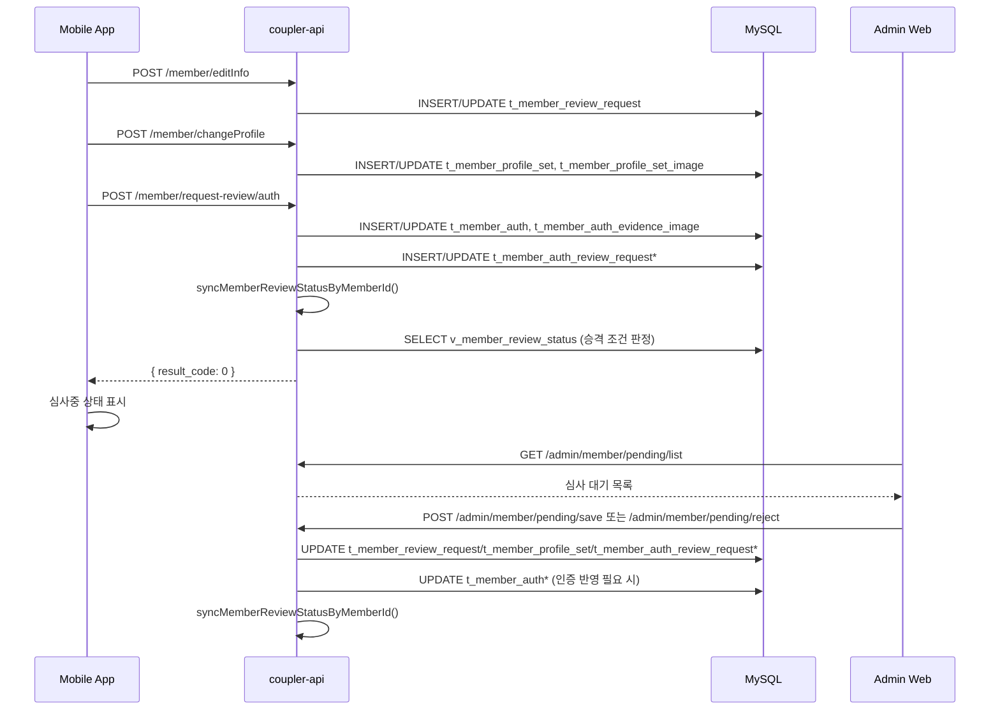

# 프로필 관리 플로우

회원가입 이후 프로필 정보를 수정하고, 변경된 항목이 재심사 주기를 거치는 전체 플로우를 정리한 문서이다.

## 참여 시스템

- **coupler-mobile-app**: 프로필 수정 화면
- **coupler-api**: 심사항목 생성 및 상태 동기화
- **coupler-admin-web**: 변경된 항목 심사

## 화면 구조 (Mobile App)

```
SettingScreen
├── 매칭 프로필
│   ├── ModifyMainTypeScreen → ModifyMainInfoScreen
│   │   ├── type=1: 기본정보 (직업, 지역, 학력, 키, 체형 등)
│   │   ├── type=2: SNS (instagram, youtube, sns_id)
│   │   └── type=3: 소개글 (about_me, intro)
│   ├── ProfileImageScreen (실물사진/동영상)
│   └── ModifyTasteInfoScreen (I Want / I Am / Q&A)
├── 인증관리
│   ├── RecommendationScreen (지인추천)
│   └── ModifyAuthScreen (인증서류)
└── 계정설정
    ├── ChangePasswordScreen
    ├── SleepScreen
    └── SignOutScreen
```

## 프로필 수정 → 재심사 플로우


```mermaid
sequenceDiagram
    participant App as Mobile App
    participant API as coupler-api
    participant DB as MySQL
    participant Admin as Admin Web

    App->>API: POST /member/editInfo
    API->>DB: INSERT/UPDATE t_member_review_request
    App->>API: POST /member/changeProfile
    API->>DB: INSERT/UPDATE t_member_profile_set, t_member_profile_set_image
    App->>API: POST /member/request-review/auth
    API->>DB: INSERT/UPDATE t_member_auth, t_member_auth_evidence_image
    API->>DB: INSERT/UPDATE t_member_auth_review_request*
    API->>API: syncMemberReviewStatusByMemberId()
    API->>DB: SELECT v_member_review_status (승격 조건 판정)
    API-->>App: { result_code: 0 }
    App->>App: 심사중 상태 표시

    Admin->>API: GET /admin/member/pending/list
    API-->>Admin: 심사 대기 목록
    Admin->>API: POST /admin/member/pending/save 또는 /admin/member/pending/reject
    API->>DB: UPDATE t_member_review_request/t_member_profile_set/t_member_auth_review_request*
    API->>DB: UPDATE t_member_auth* (인증 반영 필요 시)
    API->>API: syncMemberReviewStatusByMemberId()
```

> 위 다이어그램은 수정 유형별 경로를 한 번에 합쳐 표현한 것이다.
> 실제 요청은 `editInfo`/`changeProfile`/`request-review/auth` 중 해당 화면의 1개 엔드포인트만 호출된다.

## 관리자 심사 API (계약 요약)

- `GET /admin/member/pending/list`: 심사 대기 목록 조회
- `POST /admin/member/pending/save`: 승인/적용 처리
- `POST /admin/member/pending/reject`: 반려 처리
- 요청 본문의 `pending`는 배열만 허용한다 (`null`/객체 불가).
- 요청 본문에 `auth` 키가 있으면 배열만 허용한다.
- 계약 위반 시 `result_msg=review_status_inconsistent`와 `result_data.error_code`로 실패를 명시한다.

## API 엔드포인트

| 메서드 | 엔드포인트 | 설명 | 심사 발생 |
| ------ | ---------------------- | ---------------------- | --------- |
| POST   | `/member/editInfo`     | 기본정보/SNS/소개글 수정 | O         |
| POST   | `/member/changeProfile`| 프로필 사진/동영상 수정   | O         |
| POST   | `/member/request-review/auth` | 인증서류 제출 | O |
| POST   | `/member/editFavorInfo`| 취향/선호 정보 수정       | X (직접 반영) |
| GET    | `/member/getProfileInfo`| 현재/심사중 프로필 조회  | -         |
| POST   | `/member/changePwd`    | 비밀번호 변경            | X         |
| POST   | `/member/sleep`        | 휴면 설정/해제           | X         |
| POST   | `/member/leave`        | 탈퇴                    | X         |

## 엔드포인트별 DB 반영 (현행 코드 기준)

| 엔드포인트 | 주 반영 테이블 | 비고 |
| --- | --- | --- |
| `POST /member/editInfo` | `t_member_review_request`, `t_member` | `appeal_extra`는 `t_member` 즉시 반영 |
| `POST /member/changeProfile` | `t_member_profile_set`, `t_member_profile_set_image` | 변경 감지 시 `PENDING/REAPPLY` 반영 |
| `POST /member/request-review/auth` | `t_member_auth`, `t_member_auth_evidence_image`, `t_member_auth_review_request*` | 현재값 + 요청 원장을 함께 갱신 |

## 심사 트리거 메커니즘

### editInfo

1. 요청 본문에서 변경 필드를 추출 (`job`, `location`, `school` 등 16개 필드)
2. 기존 `t_member_review_request` 조회
3. 필드별 비교:
   - 변경값 ≠ 현재값 → INSERT (신규) 또는 UPDATE (기존 RETURN → REAPPLY 자동전환)
   - 변경값 = 현재값 → 기존 심사항목 DELETE
4. `appeal_extra`는 심사 없이 `t_member`에 직접 반영
5. `submit_target='intro'`일 때는 `about_me`, `intro`만 제출 (이미 심사중이면 차단)
6. `syncMemberReviewStatusByMemberId()` 호출

### changeProfile

1. `profile_image_paths` 배열과 현재 이미지 비교
2. 변경 감지 시 `t_member_profile_set` UPSERT (`review_status=PENDING` 또는 `REAPPLY`)
3. 이미지별 개별 status 관리 (`buildImageStatusList`)
4. 여성회원: 비디오 별도 `video_url`/`video_status` 관리
5. 이미 PENDING/REAPPLY인 프로필이 있으면 수정 차단 (RETURN만 재제출 가능)
6. `syncMemberReviewStatusByMemberId()` 호출

### request-review/auth

1. `auth` 배열 (type + images)을 파싱
2. 매니저 필수 인증 조건 확인 (`buildManagerRequiredAuth`)
3. 기존 `t_member_auth`/`t_member_auth_evidence_image` 조회 후 type별 비교
4. 트랜잭션 내에서 `t_member_auth` 및 증빙 이미지 INSERT/UPDATE/DELETE 처리
5. 변경분을 기준으로 `t_member_auth_review_request*` 원장을 UPSERT(또는 활성 요청 CANCELLED)
6. `RETURN` 재제출 시 요청 원장(`request_status`)을 `REAPPLY` 전이로 기록
7. 서버가 `member.status`에서 `request_origin`을 계산하고 `syncMemberReviewStatusByMemberId()` 호출

## 상태 흐름

```
프로필 수정 제출
    ↓
[PENDING/REAPPLY] t_member_review_request / t_member_profile_set / t_member_auth_review_request*
    ↓
[현재값 반영] t_member_auth* (인증 제출/심사 처리 시 동기 반영)
    ↓ syncMemberReviewStatusByMemberId()
[v_member_review_status 기준 상태 산출]
    ↓ (관리자 심사)
[APPROVED] → 인증 현재값(`t_member_auth*`) 반영 + v_member_review_status 반영
[RETURN] → 앱에서 반려 항목 표시, 재수정 유도 (REAPPLY로 재제출)
```

상세 심사 상태 전이는 [회원 심사 FSM](../../architecture/member-review-fsm.md) 참조

## 계정 생명주기

| 기능 | API | 설명 |
| ---- | --- | ---- |
| 비밀번호 변경 | `POST /member/changePwd` | bcrypt 비교 후 갱신 |
| 휴면 | `POST /member/sleep` | 토글 방식 |
| 탈퇴 | `POST /member/leave` | status=LEAVE(-3), 14일 후 재가입 가능 |

상세 상태 전이는 [회원 생명주기](../../architecture/member-lifecycle.md) 참조

## 관련 문서

- [회원 심사 FSM](../../architecture/member-review-fsm.md)
- [회원 심사 3축 분리 정책](../../architecture/member-review-axis-policy.md)
- [회원 생명주기](../../architecture/member-lifecycle.md)
- [사용자 등록 플로우](user-registration-flow.md)

## 근거 (코드 기준)

- 설정 화면: `coupler-mobile-app/src/screens/setting/SettingScreen.tsx`
- 기본정보 수정: `coupler-mobile-app/src/screens/setting/ModifyMainInfoScreen.tsx`
- 프로필 사진: `coupler-mobile-app/src/screens/setting/ProfileImageScreen.tsx`
- 인증 서류: `coupler-mobile-app/src/screens/setting/ModifyAuthScreen.tsx`
- API 라우터: `coupler-api/routes/app/v1/member.ts`
- 회원 컨트롤러: `coupler-api/controller/app/v1/member.ts`
- 심사 상태 동기화: `coupler-api/lib/member-review-status.ts`
