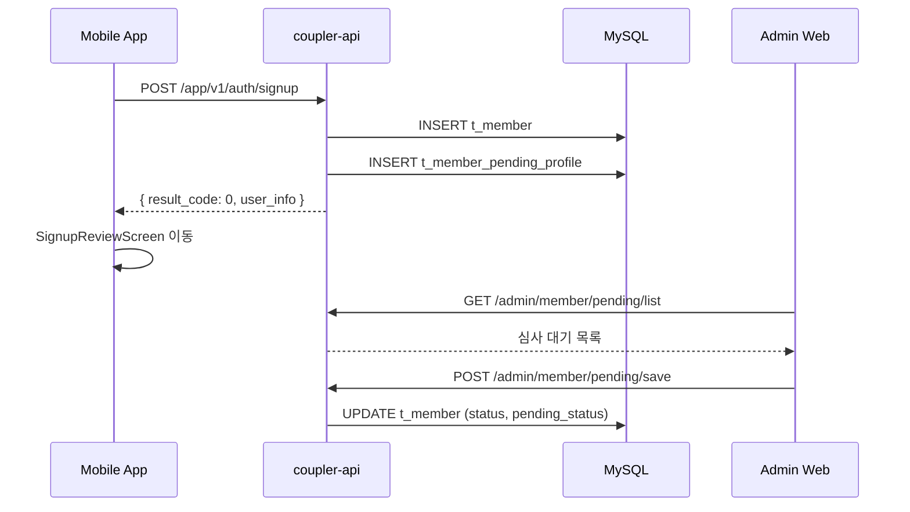

# 사용자 등록 플로우 (회원가입)

## 개요

사용자가 모바일 앱에서 회원가입하고, API에서 처리하며, 관리자 웹에서 심사하는 전체 통합 플로우

## 참여 시스템

- **coupler-mobile-app**: 사용자 인터페이스 및 입력
- **coupler-api**: 비즈니스 로직 및 데이터 처리
- **coupler-admin-web**: 회원 심사 및 관리

## 플로우 다이어그램



## 단계별 설명

### Step 1: 회원가입 화면 (Mobile App)

#### 관련 파일

- `screens/signup/SignupGeneralMemberScreen.js`
- `screens/signup/SignupGeneralMemberStep1.js` (기본정보)
- `screens/signup/SignupGeneralMemberStep2.js` (프로필)
- `screens/signup/SignupGeneralMemberStep3.js` (사진)

#### 입력 정보

```javascript
// GlobalState.me.profile 구조
{
  email: string,
  password: string,
  name: string,
  phone: string,
  gender: number,        // 1: 남성, 2: 여성
  birth: string,         // YYYY-MM-DD
  nickname: string,
  job: string,
  location: string,
  // ... 기타 프로필 정보
}
```

### Step 2: API 요청 (Mobile App → API)

#### 요청

```
POST /app/v1/auth/signup
Content-Type: application/json

{
  "email": "user@example.com",
  "pwd": "hashedPassword",
  "name": "홍길동",
  "phone": "01012345678",
  "gender": 1,
  "birth": "1990-01-01",
  "nickname": "닉네임",
  "job": "개발자",
  "location": "서울",
  "manager_id": 123,
  "profile_image_paths": "path1#path2#path3",
  "user_auth": "[]",
  "auth": "[]",
  // ... 기타 필드
}
```

#### 관련 파일

- `coupler-api/controller/app/v1/auth.js` → `signup()`

### Step 3: 데이터 저장 (API → DB)

#### 처리 순서

1. 이메일 중복 체크 (`t_member`)
2. 비밀번호 해싱 (bcrypt)
3. 회원 정보 저장 (`t_member`)
4. 프로필 이미지 저장 (`t_member_profile_version`, `t_member_profile_image`)
5. pending_profile 생성 (`t_member_pending_profile`)

#### 테이블

```sql
-- 회원 기본정보
INSERT INTO t_member (
  email, pwd, name, phone, gender, birth,
  nickname, job, location, status, pending_status, pending_stage
) VALUES (?, ?, ?, ?, ?, ?, ?, ?, ?, 0, 1, 'basic_info');

-- 프로필 이미지 버전
INSERT INTO t_member_profile_version (user_id, status) VALUES (?, 0);

-- 프로필 이미지
INSERT INTO t_member_profile_image (version_id, image_url, sort_order) VALUES (?, ?, ?);
```

#### 응답

```json
{
  "result_code": 0,
  "result_msg": "SUCCESS",
  "result_data": {
    "id": 12345,
    "email": "user@example.com",
    "pending_status": 1,
    "pending_stage": "basic_info"
  }
}
```

### Step 4: 심사 대기 (Mobile App)

회원가입 완료 후 `SignupReviewScreen`으로 이동하여 심사 대기 상태 표시

#### 상태값

- `user.status = 0` (PENDING)
- `pending_status = 1` (BASIC_INFO_REVIEW)
- `pending_stage = 'basic_info'`

### Step 5: 관리자 심사 (Admin Web)

#### 관련 파일

- `coupler-admin-web/src/pages/member/pending.js` (목록)
- `coupler-admin-web/src/pages/member/detail.js` (상세/심사)

#### 심사 API

```
POST /admin/member/pending/save
{
  "user": { ... },
  "pending": { ... },
  "auth": [ ... ],
  "manager": [ ... ],
  "pendingType": "semi-apply"
}
```

## 상태 흐름

상세한 상태 전이는 [회원 심사 FSM](../../architecture/member-review-fsm.md) 참조

```
회원가입 완료
    ↓
[회원 전] status=PENDING, pending_stage=BASIC_INFO
    ↓ (기본정보 승인)
[일반회원] status=PENDING, pending_stage=REQUIRED_AUTH
    ↓ (서류 승인)
[준회원] status=NORMAL, pending_stage=INTRO
    ↓ (소개글 승인)
[정회원] status=NORMAL, pending_stage=COMPLETE
```

## 데이터 흐름

### Mobile → API

- **프로토콜**: HTTPS
- **인증**: 없음 (회원가입 시)
- **상태 관리**: MobX `GlobalState`

### API → Database

- **DB**: MySQL
- **ORM**: 직접 쿼리 (mysql2)
- **트랜잭션**: 필요 시 사용

### API → Admin Web

- **관리 API**: REST API with JWT
- **세션**: express-session

## 에러 처리

| result_code | 의미             | 처리                 |
| ----------- | ---------------- | -------------------- |
| 0           | 성공             | 심사대기 화면 이동   |
| 1           | 이미 가입된 회원 | 로그인 화면 이동     |
| -2          | 차단된 회원      | LoginFailScreen 이동 |
| 기타        | 서버 오류        | Toast 메시지 표시    |

## 관련 문서

- [회원 심사 FSM](../../architecture/member-review-fsm.md)
- [사용자 인증 플로우](../coupler-mobile-app/user-authentication-flow.md)
