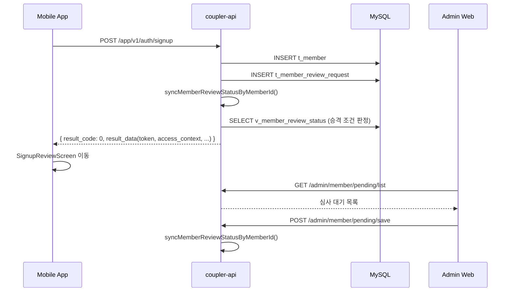

# 사용자 등록 플로우 (회원가입)

## 개요

사용자가 모바일 앱에서 회원가입하고, API에서 처리하며, 관리자 웹에서 심사하는 전체 통합 플로우

## 참여 시스템

- **coupler-mobile-app**: 사용자 인터페이스 및 입력
- **coupler-api**: 비즈니스 로직 및 데이터 처리
- **coupler-admin-web**: 회원 심사 및 관리

## 플로우 다이어그램


```mermaid
sequenceDiagram
    participant App as Mobile App
    participant API as coupler-api
    participant DB as MySQL
    participant Admin as Admin Web

    App->>API: POST /app/v1/auth/signup
    API->>DB: INSERT t_member
    API->>DB: INSERT t_member_review_request
    API->>API: syncMemberReviewStatusByMemberId()
    API->>DB: SELECT v_member_review_status (승격 조건 판정)
    API-->>App: { result_code: 0, result_data(token, access_context, ...) }
    App->>App: SignupReviewScreen 이동
    Admin->>API: GET /admin/member/pending/list
    API-->>Admin: 심사 대기 목록
    Admin->>API: POST /admin/member/pending/save
    API->>API: syncMemberReviewStatusByMemberId()
```

## 단계별 설명

### Step 1: 회원가입 화면 (Mobile App)

#### 관련 파일

- `coupler-mobile-app/src/screens/signup/SignupGeneralMemberScreen.tsx`
- `coupler-mobile-app/src/screens/signup/SignupGeneralMemberStep1.tsx` (기본정보)
- `coupler-mobile-app/src/screens/signup/SignupGeneralMemberStep2.tsx` (프로필)
- `coupler-mobile-app/src/screens/signup/SignupGeneralMemberStep3.tsx` (사진)

#### 입력 정보

```javascript
// GlobalState.me.basic_info (일부)
{
  email: string,
  password: string,
  name: string,
  phone: string,
  gender: string,        // 'M' | 'F'
  birth: string,         // YYYY-MM-DD
  nickname: string,
  job: string,
  location: string,
  // ... 기타 프로필 정보
}
```

### Step 2: API 요청 (Mobile App → API)

#### 요청

```http
POST /app/v1/auth/signup
Content-Type: application/json

{
  "email": "user@example.com",
  "pwd": "plainPassword",
  "name": "홍길동",
  "phone": "01012345678",
  "gender": "M",
  "birth": "1990-01-01",
  "nickname": "닉네임",
  "job": "개발자",
  "location": "서울",
  "manager_id": 123,
  "profile_image_paths": ["path1", "path2", "path3"],
  "user_auth": [],
  "auth": []
}
```

#### 관련 파일

- `coupler-api/controller/app/v1/auth.ts` → `signup()`

> 위 요청 예시는 이해를 위한 축약본이며, 실제로는 더 많은 필드가 함께 전송된다.
> 앱 내부 상태(`basic_info.password`)는 전송 시 서버 계약 키 `pwd`로 매핑된다.

### Step 3: 데이터 저장 (API → DB)

#### 처리 순서

1. 이메일 중복 체크 (`t_member`)
2. 비밀번호 해싱 (bcrypt)
3. 회원 정보 저장 (`t_member`)
4. 프로필 이미지 저장 (`t_member_profile_set`, `t_member_profile_set_image`)
5. 심사 항목 생성 (`t_member_review_request`)
6. 심사 상태 판정은 `v_member_review_status` 단일 기준으로 수행

#### 테이블

```sql
-- 회원 기본정보
-- (예시) 실제 테이블은 필수 컬럼이 더 많으며, 서버가 기본값을 보정한 뒤 저장한다.
INSERT INTO t_member (
  email, pwd, name, phone, gender, birth,
  nickname, job, location, status
) VALUES (?, ?, ?, ?, ?, ?, ?, ?, ?, 0);

-- 프로필 세트 버전
INSERT INTO t_member_profile_set (member_id, profile_set_version, created_at, review_status)
VALUES (?, 1, NOW(), 0);

-- 프로필 이미지
INSERT INTO t_member_profile_set_image (profile_set_id, image_position, image_url, review_status, created_at)
VALUES (?, ?, ?, 0, NOW());
```

#### 응답

```json
{
  "result_code": 0,
  "result_msg": "SUCCESS",
  "result_data": {
    "token": "<jwt>",
    "basic_info": {
      "id": 12345,
      "email": "user@example.com",
      "status": 0
    },
    "pending_profile": [],
    "profile_set_current": null,
    "profile_set_pending": null,
    "access_context": {
      "user_status": 0,
      "member_level": "PRE_MEMBER",
      "review_status": {
        "basic_info_status": "PENDING",
        "required_auth_status": "UNSUBMITTED",
        "intro_status": "UNSUBMITTED",
        "member_level": "PRE_MEMBER"
      },
      "review_flow": {
        "phase": "BASIC_INFO_REVIEW"
      },
      "matching_tab_access": {
        "on_going": { "allowed": false, "reason_code": "review_pending" },
        "you": { "allowed": false, "reason_code": "review_pending" },
        "members": { "allowed": false, "reason_code": "review_pending" }
      },
      "permissions": {
        "setting_edit_allowed": false,
        "profile_edit_allowed": false,
        "lounge_write_allowed": false,
        "lounge_comment_allowed": false
      }
    }
  }
}
```

> 심사 상태 필드는 `result_data.access_context.review_status` 단일 객체만 사용한다.
> `result_data.review_stage` 또는 문자열 `result_data.review_status`는 사용하지 않는다.

### Step 4: 심사 대기 (Mobile App)

회원가입 완료 후 `SignupReviewScreen`으로 이동하여 심사 대기 상태 표시

#### 상태값

- `user.status = 0` (PENDING)
- API 응답의 심사 상태는 `v_member_review_status` 뷰 기준으로 내려준다
- `t_member_review_stage_snapshot`은 동기화/호환 스냅샷으로만 유지된다

#### 모바일 분기 함수(단일 기준)

- 엔트리 라우팅(앱 진입)은 `decidePostLoginEntryRoute` 단일 함수로 결정한다.
  - 위치: `coupler-mobile-app/src/utils/postLoginEntryRoute.ts`
  - 적용 화면: `SplashScreen`, `HomeScreen`, `SignupReviewScreen`(Splash 경유), `SignupCongratuScreen`(Splash 경유)
- 매칭 화면 표시 상태는 `decideMatchingViewState`로 결정한다.
  - 위치: `coupler-mobile-app/src/screens/matching/shared/utils/matchingAuthUtils.ts`
  - 목적: `AUTH_REQUEST` / `LOCK_PANEL` / `DEFAULT` 분기
- 락 패널 문구는 `buildMatchingLockPanelContent`로 생성한다.
  - 위치: `coupler-mobile-app/src/screens/matching/shared/utils/matchingAuthUtils.ts`
  - 목적: `access_context.review_status.required_auth_status` + `access_context.review_status.intro_status` 조합에 대한 title/buttonLabel 생성

### Step 5: 관리자 심사 (Admin Web)

#### 관련 파일

- `coupler-admin-web/src/pages/member/pending.js` (목록)
- `coupler-admin-web/src/pages/member/detail.js` (상세/심사)

#### 심사 API

```
POST /admin/member/pending/save
{
  "user": { ... },
  "pending": { ... },
  "auth": [ ... ],
  "manager": [ ... ],
  "pendingType": "semi-apply"
}
```

## 상태 흐름

상세한 상태 전이는 [회원 심사 FSM](../../architecture/member-review-fsm.md) 참조

```
회원가입 완료
    ↓
[PRE_MEMBER] status=PENDING, basic_info_status='PENDING'
    ↓ (기본정보 승인)
[GENERAL_MEMBER] status=PENDING, basic_info_status='APPROVED'
    ↓ (서류 승인)
[SEMI_MEMBER] status=PENDING, required_auth_status='APPROVED'
    ↓ (소개글 승인)
[FULL_MEMBER] status=NORMAL, intro_status='APPROVED'
```

## 데이터 흐름

### Mobile → API

- **프로토콜**: HTTPS
- **인증**: 없음 (회원가입 시)
- **상태 관리**: MobX `GlobalState`

### API → Database

- **DB**: MySQL
- **ORM**: 직접 쿼리 (mysql2)
- **트랜잭션**: 필요 시 사용

### API → Admin Web

- **관리 API**: REST API with JWT
- **세션**: express-session

## 에러 처리

| result_code | 의미                           | 처리                       |
| ----------- | ------------------------------ | -------------------------- |
| 0           | 성공                           | 심사대기 화면 이동         |
| 음수 코드   | 실패(계약/검증/서버 오류 포함) | 에러 메시지/실패 화면 처리 |

## 관련 문서

- [회원 심사 FSM](../../architecture/member-review-fsm.md)
- [사용자 인증 플로우](../coupler-mobile-app/user-authentication-flow.md)
