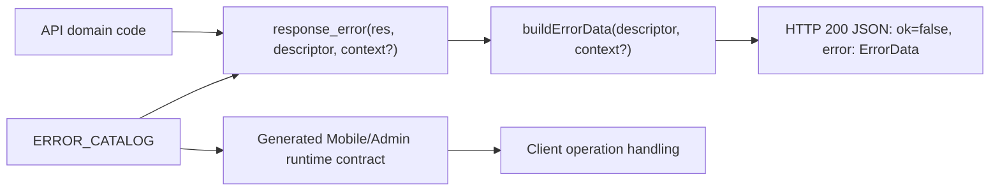

# API 에러 계약 정책

## 문서 역할

- 역할: `규범`
- 문서 종류: `policy`
- 충돌 시 우선 문서: 실패 `ErrorData`/taxonomy는 이 문서, 공통 JSON API 응답 envelope은 `api-response-contract-policy.md`
- 기준 성격: `as-is`

## 적용 범위

- coupler-api
- coupler-admin-web
- coupler-mobile-app

## 목적

이 문서는 API 실패 응답의 `ErrorData`와 error taxonomy 최종 계약을 정의한다. 공통 JSON API 응답 envelope은 [API 공통 응답 계약 정책](api-response-contract-policy.md)을 단일 기준으로 따른다.

- 서버는 하나의 canonical `ERROR_CATALOG`를 실패 원인 SoT로 둔다.
- 서버 production callsite는 `ErrorDescriptor`를 전달한다.
- `error_code`는 descriptor 안의 wire field이며, 서버 callsite API가 아니다.
- Mobile/Admin은 서버 catalog에서 생성된 runtime contract만 사용한다.
- 계약된 JSON API 실패는 공통 응답 envelope의 `{ ok: false, error: ErrorData }`로 반환한다.
- HTTP non-2xx는 API error taxonomy 밖의 transport/protocol/proxy 실패로만 사용한다.
- transition 계층, 중간 산출물, raw `error_code` helper는 최종 구조에 둘 수 없다.

잔여 부채와 배포 순서는 기술부채 문서에서 관리한다. 이 문서는 최종 상태만 판정한다.

## 용어

- `ErrorDescriptor`: 하나의 실패 원인을 나타내는 catalog entry. 최종 authoring field는 `code`, `source`, `surfaces`, `action`, `messageKey`, `messageArgContextKeys`뿐이다.
- `ERROR_CATALOG`: 서버의 canonical descriptor map. API 에러 계약의 단일 SoT다.
- `ErrorData`: 실패 envelope의 `error` 객체. `error_code`, `error_source`, `error_action`, `error_context`, `request_id`를 포함한다.
- `error_code`: `ErrorData.error_code`로 노출되는 wire failure cause. descriptor의 `code` 값이다.
- `error_source`: `ErrorData.error_source`로 노출되는 실패 원인의 상위 서버 도메인 또는 안정적인 모듈. 세부 기능, operation, 화면, flow, 판정 상태가 아니다.
- `error_surfaces`: 해당 실패가 영향을 주는 클라이언트 surface 목록. 응답 JSON 필드가 아니라 계약 metadata다.
- `error_action`: 클라이언트가 취해야 할 기본 처리 방식.
- `error_context`: client 표시 메시지 인자에 필요한 공개 보조 정보. descriptor의 `messageArgContextKeys` allowlist에 포함된 값만 wire 응답에 남기고, 내부 진단값은 서버 로그로만 남긴다.
- `request_id`: 요청 추적용 식별자.

## 최종 아키텍처



- API 서버는 실패 응답 경계에 `ErrorDescriptor`와 필요한 `ErrorContext`만 전달한다.
- 실패 응답 생성은 `response_error`/`buildErrorData` 경계로 수렴한다.
- Mobile/Admin은 생성된 runtime contract로 `error_code`를 검증하고, operation 소비 근거가 있는 경우에만 분기한다.
- Swagger/OpenAPI 문서는 같은 catalog 기준으로 작성/검증된 실패 계약을 노출한다.

## 서버 코드 배치

### Canonical catalog

`coupler-api/lib/error/catalog/registry.ts`에서 조립되는 `ERROR_CATALOG`는 API 에러 계약의 canonical SoT다. Descriptor entry는 `coupler-api/lib/error/catalog/entries/*`에 둘 수 있지만, 최종 계약은 조립된 `ERROR_CATALOG` 하나로 판정한다.

```ts
export const ERROR_CATALOG = {
  MEMBER_AUTH_REVIEW_LIMIT_EXCEEDED: {
    code: "MEMBER_AUTH_REVIEW_LIMIT_EXCEEDED",
    source: "MEMBER",
    surfaces: ["MOBILE_APP"],
    action: "CONTACT_SUPPORT",
    messageKey: "api.error.member.auth_review_limit_exceeded",
    messageArgContextKeys: ["limit"],
  },
} as const satisfies Record<string, ErrorDescriptor>;
```

허용 field:

- `code`: stable wire `error_code`
- `source`: 상위 서버 도메인 또는 안정적인 모듈
- `surfaces`: 영향 받는 클라이언트 surface 목록
- `action`: 클라이언트 기본 처리 방식
- `messageKey`: 문서와 번역 연결용 key
- `messageArgContextKeys`: 메시지 인자에 사용할 수 있는 context key allowlist

`messageKey`는 빈 문자열을 허용하지 않는다. 사용자에게 표시할 메시지가 없는 것처럼 보이는 legacy 실패도 안정적인 locale key를 지정해야 한다.
`messageArgContextKeys`에 선언한 key는 해당 실패 응답의 `error_context`에 문자열 또는 숫자로 반드시 있어야 한다.
`messageArgContextKeys`에 없는 key는 public `error_context`에 남기지 않는다. 공개 메시지 인자가 없는 descriptor의 `error_context`는 빈 객체다.

금지 field:

- `path`
- `group`
- `name`
- `codePrefix`
- singular `error_surface`
- display message 문자열
- legacy numeric result code
- client-only routing state

### Response boundary

최종 서버 경계는 descriptor-first다.

```ts
return response_error(res, ERROR_CATALOG.MEMBER_AUTH_REVIEW_LIMIT_EXCEEDED, {
  limit,
});
```

금지한다:

- `response_error`의 두 번째 인자로 raw string을 전달하는 방식
- `response_error`의 두 번째 인자로 public `ERROR_CODE` alias를 전달하는 방식
- callsite에서 `error_code` 문자열을 직접 조합하거나 전달하는 방식
- callsite에서 `{ error: { error_code, error_action, error_context } }` payload를 직접 구성하는 방식

`ERROR_CODE`라는 public server alias는 최종 구조에 두지 않는다. `error_code` 문자열 목록이 필요하면 generator/test 내부 파생값으로만 둔다.

## 실패 ErrorData

API 실패 응답은 [API 공통 응답 계약 정책](api-response-contract-policy.md)의 JSON envelope을 따른다. 이 문서는 실패 envelope 안의 `ErrorData` 필드와 taxonomy를 정의한다.

```json
{
  "ok": false,
  "error": {
    "error_code": "MEMBER_AUTH_REVIEW_LIMIT_EXCEEDED",
    "error_source": "MEMBER",
    "error_action": "CONTACT_SUPPORT",
    "error_context": {
      "limit": 3
    },
    "request_id": "req_123e4567-e89b-42d3-a456-426614174000"
  }
}
```

기본 규칙:

- 실패 응답은 `ok: false`와 `error: ErrorData`를 포함한다.
- 공통 응답 envelope, HTTP 200 실패 envelope, transport/protocol 예외는 [API 공통 응답 계약 정책](api-response-contract-policy.md)을 따른다.
- HTTP 4xx/5xx를 `error_action`/`error_code`로 변환하지 않는다.
- `error.error_code`는 descriptor의 stable `code`에서 온다.
- `error.error_source`는 descriptor의 `source`에서 온다.
- `error.error_action`은 descriptor의 `action`에서 온다.
- `error.error_context`는 descriptor의 `messageArgContextKeys`가 요구하는 공개 메시지 인자만 포함한다.
- `error.error_context`는 descriptor의 `messageArgContextKeys`가 요구하는 문자열/숫자 값을 빠짐없이 포함해야 한다.
- `error.request_id`는 `req_` + UUID v4 형식이며, 서버 로그와 클라이언트 문의를 연결할 수 있어야 한다.
- `ErrorData`에는 `messageKey`를 넣지 않는다. 클라이언트 표시는 generated runtime contract에서 `error_code`로 descriptor의 `messageKey`를 조회한 뒤 번역 리소스로 처리한다.

범위 예외:

- 기존 Admin jQuery DataTables success body, 파일 스트리밍, proxy pass-through, 네트워크/protocol 실패는 [API 공통 응답 계약 정책](api-response-contract-policy.md)의 예외 기준을 따른다.
- DataTables endpoint의 실패 응답은 예외 없이 `ok: false`와 `error: ErrorData`를 반환한다.
- JSON API 계약 밖의 응답 경로는 `ErrorData`, `error_code`, `error_action`을 만들거나 client product flow 분기 기준으로 쓰지 않는다.

응답에 넣지 않는다:

- 권한/개인정보를 노출하는 내부 식별자, 내부 파일 경로, stack trace
- 개인정보 또는 인증 토큰
- 서버 내부 enum 이름
- 사용자가 바로 볼 문장형 메시지
- free-form parameter hint, field hint, operation source 같은 내부 진단 문자열
- migration/transition 판정값

## Taxonomy

### `error_source`

`error_source`는 실패 원인의 상위 서버 도메인 또는 안정적인 모듈이다. 세부 기능, operation, 화면, flow, 판정 상태를 source로 승격하지 않는다.

허용 기준:

- 도메인 경계를 나타낸다.
- UI surface나 operation 이름을 source로 쓰지 않는다.
- login, signup, token, review, profile edit처럼 operation 또는 flow를 나타내는 세부 명칭을 source로 쓰지 않는다.
- 너무 세분화된 임시 상태나 판정 단계를 source로 승격하지 않는다.
- 같은 서버 모듈에서 처리와 소유가 함께 이루어지는 단위로 둔다.
- 세부 기능명은 `error_code` segment로 표현한다.

예시:

- `REQUEST_PARAM`
- `AUTH`
- `ACCESS_CONTROL`
- `MEMBER`
- `MANAGER`
- `MATCH`
- `MATCHING`
- `MEETING`
- `REVIEW`

현재 source ownership:

| Source | Ownership |
| --- | --- |
| `ACCESS_CONTROL` | 공통 user/admin 접근 guard |
| `AUTH` | 인증, 로그인, 토큰, 회원가입, 계정 인증 flow의 서버 실패 |
| `CRON` | 배치/cron 작업의 서버 실패 |
| `LOUNGE` | 라운지 도메인과 라운지 content/member moderation 실패 |
| `MANAGER` | 관리자 계정, 권한, 관리자 상세 프로필 처리 실패 |
| `MATCH` | 매치 entity, 매치 사용자 상태, 매치 리뷰/신고/직접 요청 실패 |
| `MATCHING` | 매칭 가능 여부, 매칭 일정 제안/변경/횟수/날짜 제한 실패 |
| `MEETING` | 미팅 entity, 참가/허용, 일정 충돌, 정원, 채팅방 준비 실패 |
| `MEMBER` | 회원 프로필, 인증 심사, 프로필 심사, 추천, 휴면/수면, 매니저 선택 실패 |
| `PAYMENT` | 결제/IAP 서버 실패 |
| `REQUEST_PARAM` | 공통 request parameter 검증 실패 |
| `REVIEW` | 여러 도메인에 걸친 심사 상태 contract/sync invariant 실패 |
| `SETTING` | 운영 설정, 공지, 별칭, 가입 메시지, 고객지원 설정 실패 |
| `UPLOAD` | 업로드 입력, 이미지/동영상/오디오 변환 실패 |
| `USER` | 로그인 이후 사용자 계정 상태와 접근 제한 실패 |

경계 규칙:

- `MATCH`는 이미 존재하는 match entity와 그 상호작용을 소유한다. 매칭 일정/자격/제안 제한은 `MATCHING`이 소유한다.
- `REVIEW`는 cross-domain review status contract나 sync invariant에만 쓴다. 특정 회원 심사 기능은 `MEMBER_REVIEW` source가 아니라 `MEMBER` source의 `MEMBER_REVIEW_*` code segment로 표현한다.
- `AUTH_TOKEN`, `AUTH_LOGIN`, `AUTH_SIGNUP`, `MEMBER_AUTH_REVIEW`, `MEMBER_PROFILE_EDIT`, `MATCH_REVIEW`, `LOUNGE_CONTENT` 같은 operation namespace는 source가 아니라 code segment다.

금지 예시:

- `AUTH_ACCOUNT`
- `AUTH_LOGIN`
- `AUTH_SIGNUP`
- `AUTH_TOKEN`
- `LOUNGE_CONTENT`
- `MATCH_REVIEW`
- `MEMBER_AUTH_REVIEW`
- `MEMBER_PROFILE_EDIT`
- `MEMBER_MANAGER_SELECTION`
- `MEMBER_REVIEW`
- `REVIEW_STATUS`

### `error_code`

`error_code`는 실패 원인을 나타내는 stable wire value다.

규칙:

- 대문자 snake case를 사용한다.
- `${source}_`로 시작한다.
- `source` 뒤에 원인과 판정 기준을 드러내는 segment를 붙인다.
- 세부 기능명은 source가 아니라 code segment에 둔다. 예: `source: "MEMBER"`, `code: "MEMBER_AUTH_REVIEW_LIMIT_EXCEEDED"`.
- product prefix, client prefix, 화면 prefix를 붙이지 않는다.
- 같은 의미의 실패 원인을 여러 code로 쪼개지 않는다.
- 서로 다른 복구 행동이나 표시 정책이 필요하면 별도 code로 분리한다.

### `error_surfaces`

`error_surfaces`는 영향 범위 metadata다.

현재 허용 surface:

- `ADMIN_WEB`
- `MOBILE_APP`
- `SHARED_API`

규칙:

- 응답 JSON에 노출하지 않는다.
- Mobile/Admin runtime contract와 Swagger 문서 생성에 사용한다.
- operation 소비 근거 없이 surface를 추가하지 않는다.
- 하나의 실패가 여러 surface에 영향을 주면 `surfaces` 배열에 모두 명시한다.

### `error_action`

`error_action`은 클라이언트 기본 처리 방식이다.

현재 허용 action:

- `RETRY`
- `FIX_REQUEST`
- `LOGIN_REQUIRED`
- `CONTACT_SUPPORT`

규칙:

- operation별 UI copy를 action에 넣지 않는다.
- 같은 code의 기본 action은 하나다.
- operation별 예외 처리는 operation handler에서 명시한다.

## Client Runtime Contract

Mobile/Admin은 서버 catalog에서 생성된 runtime contract를 `@coupler-developer/coupler-api-contracts` package로만 소비한다. package public response/envelope 타입도 이 runtime contract의 strict `ErrorData`를 실패 기본 타입으로 사용한다. package 발행/소비 절차는 [API 클라이언트 계약 패키지 정책](api-client-contract-package-policy.md)을 따른다.

권장 산출물:

- `errorContract.ts`: `API_ERROR_CODE`, `API_ERROR_DEFINITION`, context pattern 상수
- `errorMessages.ts`: locale-backed client message map
- `errorRuntime.ts`: `ErrorData` 타입, 외부 JSON guard, message argument helper

이 산출물은 `coupler-api/packages/contracts/src/generated/`에서 생성한다. Package artifact는 build/publish로 배포한다. client boundary/runtime validation용이며 서버 production callsite API가 아니다.

금지한다:

- Mobile/Admin feature code에 raw string 비교를 흩뿌리는 방식
- `getErrorCode`, `getApiErrorCode`, `hasApiErrorCode` 같은 generic raw helper
- legacy numeric result code 기반 신규 분기
- token fallback, dual parser, shim, 임시 wrapper 추가
- display message 문자열 기반 분기

허용한다:

- `api/apiError.ts` 같은 API boundary facade가 generated runtime의 상수, 타입, guard를 재노출하는 방식
- semantic failure helper module 내부의 non-exported `hasFailureErrorCode` 같은 작은 구현 helper. 단, feature code에는 `isAuthTokenExpiredFailure`, `isMatchingScheduleAlreadySentFailure`처럼 의미가 드러나는 함수만 노출한다.
- generator/test 내부에서 generated `API_ERROR_CODE`와 raw wire value를 검증하는 방식

클라이언트 표시 메시지는 generated `messageKey`와 `messageArgContextKeys`로 만든다. `messageArgContextKeys`가 요구하는 context 값이 없으면 `%s` 같은 placeholder를 그대로 노출하지 않고 surface별 fallback 처리를 해야 한다.

`error_action` 처리 기준:

- `error_action`은 실패의 기본 처리 방향이다. operation handler는 먼저 `error_action`으로 전역/공통 UX 여부를 판단하고, 필요한 경우에만 `error_code` semantic helper로 세부 복구 경로를 고른다.
- 공통 request wrapper는 본인이 완료할 수 있는 전역 UX만 client-local handled result로 바꾼다. navigation 컨텍스트가 screen-local인 Mobile 흐름처럼 공통 wrapper가 로그인/재인증 UX를 결정적으로 완료할 수 없으면 operation/screen handler가 `LOGIN_REQUIRED`를 처리할 수 있다.
- `LOGIN_REQUIRED` 실패를 generic message 표시만으로 끝내면 안 된다. 단, 로그인/재인증 이동 방식은 공통 boundary 또는 operation/screen handler 중 클라이언트 책임 경계가 더 명확한 곳에 둔다.

Mobile/Admin request wrapper가 전역 UX를 이미 완료한 경우에는 API `ErrorData` 성공/실패와 섞지 않고 client-local handled result로 분리한다.

- handled result는 `type: "handled"` 같은 명시 discriminator를 가져야 한다.
- handled result는 `undefined`, `null`, raw `error_code`, legacy numeric result code로 표현하지 않는다.
- handled result는 서버 실패 원인을 대체하지 않는다. 서버가 envelope를 반환한 실패는 먼저 generated runtime contract로 검증한다.
- operation handler는 handled result를 success/failure 처리 전에 종료해야 한다.

필요한 helper는 operation 의미를 드러내야 한다.

```ts
isMemberAuthReviewLimitExceeded(error)
```

위와 같은 helper는 다음 조건을 만족할 때만 허용한다.

- 특정 operation 소비 근거가 있다.
- 내부에서 runtime contract validation을 사용한다.
- raw `error_code` 접근을 외부로 노출하지 않는다.
- helper 이름이 클라이언트 복구 행동 또는 도메인 의미를 드러낸다.

## Swagger/OpenAPI

Swagger/OpenAPI는 `ERROR_CATALOG` 기준으로 실패 응답 계약을 작성하고 검증한다. 자동 생성 산출물이 아닌 수동 YAML은 Swagger ErrorData contract test가 catalog와 대조해 drift를 차단해야 한다.

각 operation 문서에는 다음을 포함한다.

- 가능한 `error_code`
- `error_action`
- `error_context` schema. 단, wire 응답 schema는 descriptor `messageArgContextKeys`에 공개하기로 한 메시지 인자만 포함한다.
- operation별 표시/복구 책임
- `request_id` 추적 규칙

문서에 넣지 않는다:

- 서버 내부 stack trace
- DB schema 세부사항
- transition 상태
- client-only 임시 helper

`coupler-api/packages/contracts/src/generated/apiContract.ts`는 Swagger success schema를 그대로 투영한 generated artifact다. Swagger에 success schema가 없거나 느슨하면 generated success data type은 `unknown` 또는 loose object가 될 수 있으므로, 이 산출물을 전체 success DTO 완성 증거로 해석하지 않는다. release/cutover 판단에서 이 artifact와 publish된 contracts package version은 [API 공통 응답 계약 정책](api-response-contract-policy.md)의 envelope/error boundary와 documented success schema freshness 근거로 사용한다.

## Transition 계층 금지

최종 구조와 cutover PR의 완료 조건은 transition 계층 0건이다.

transition 계층으로 본다:

- bridge/adapter/shim
- dual parser
- legacy alias
- temporary wrapper
- intermediate manifest
- generic raw error-code helper
- 서버 public `ERROR_CODE` alias
- `path`/`group`/`name`/`codePrefix` 기반 taxonomy DSL

구버전 클라이언트 호환이 필요하면 최종 구조 PR에 섞지 않고 별도 호환 배포 작업으로 분리한다.

## 변경 절차

API 에러 계약을 변경할 때는 다음 순서를 지킨다.

1. `ERROR_CATALOG`에 descriptor를 추가하거나 수정한다.
2. `source`, `surfaces`, `action`, `messageKey`, `messageArgContextKeys`가 위 taxonomy와 맞는지 검증한다. 특히 operation/flow/화면/판정 상태가 `source`로 들어가지 않았는지 확인한다.
3. 실패 응답 callsite가 descriptor를 직접 전달하는지 확인한다.
4. generated Mobile/Admin runtime contract를 갱신한다.
5. Swagger/OpenAPI 문서를 갱신하고 catalog 정합성 검증을 통과시킨다.
6. operation별 client handler가 raw helper 없이 의미 기반으로 처리하는지 확인한다.
7. lint, typecheck, docs validation을 통과시킨다.

## 리뷰 체크리스트

- [ ] 서버 실패 응답 callsite가 `ErrorDescriptor`를 전달하는가?
- [ ] 서버 production code에 public `ERROR_CODE` alias 또는 raw `error_code` 문자열 전달이 없는가?
- [ ] `ERROR_CATALOG`가 유일한 API 에러 계약 SoT인가?
- [ ] descriptor field가 `code`, `source`, `surfaces`, `action`, `messageKey`, `messageArgContextKeys`로 제한되는가?
- [ ] `path`, `group`, `name`, `codePrefix`, singular `error_surface`가 없는가?
- [ ] `error_code`가 stable wire value이고 product/client/surface prefix를 포함하지 않는가?
- [ ] `error_source`가 UI surface, operation, flow, 화면, 판정 상태가 아니라 상위 서버 도메인 또는 안정적인 모듈인가?
- [ ] `AUTH_ACCOUNT`, `AUTH_LOGIN`, `AUTH_SIGNUP`, `AUTH_TOKEN`, `LOUNGE_CONTENT`, `MATCH_REVIEW`, `MEMBER_AUTH_REVIEW`, `MEMBER_PROFILE_EDIT`, `MEMBER_MANAGER_SELECTION`, `MEMBER_REVIEW`, `REVIEW_STATUS` 같은 세부 namespace가 `source`로 승격되지 않았는가?
- [ ] `error_surfaces`가 응답 JSON이 아니라 영향 범위 metadata로만 쓰이는가?
- [ ] `error_action`이 UI copy나 operation 이름을 담지 않는가?
- [ ] `error_context`에 민감정보, display message, 내부 구현값이 없는가?
- [ ] 계약된 JSON API 실패가 공통 응답 envelope로 반환되고, HTTP non-2xx가 `ErrorData` taxonomy와 섞이지 않는가?
- [ ] `messageKey`가 비어 있지 않고, `messageArgContextKeys`가 요구하는 값이 `error_context`에서 문자열/숫자로 보장되는가?
- [ ] Mobile/Admin이 generated runtime contract로 JSON boundary를 검증하는가?
- [ ] Mobile/Admin feature code에 generic raw error-code helper가 없는가?
- [ ] non-envelope success body가 있다면 기존 Admin DataTables allowlist에 한정되는가?
- [ ] DataTables endpoint의 실패 응답은 `ErrorData`를 쓰고, file/proxy transport 실패는 `ErrorData` 밖에서 처리되는가?
- [ ] Swagger/OpenAPI가 같은 catalog 기준으로 검증되는가?
- [ ] final structure/cutover 범위에 transition 계층이 0건인가?

## 관련 문서

- `content/policy/engineering-guardrails.md`
- `content/policy/code-review-policy.md`
- `content/policy/testing-strategy.md`
- `content/flows/cross-project/api-contract-mobile-release-flow.md`
- `content/technical-debt/technical-debt.md`
